# 🚨 INCIDENT HANDLING PROCESS
## SOC Analyst Cheatsheet - Module 1/15

---

## 0. Overview

This module covers the **foundational concepts of incident handling** - the structured approach SOC analysts use to respond to security events and incidents. You'll learn how to distinguish between events and incidents, understand various attack frameworks, and master the NIST incident response lifecycle.

```mermaid
%%{init: {'theme': 'base', 'themeVariables': { 'lineColor': '#999', 'nodeBorder': '#999'}}}%%
flowchart TB
    subgraph "🎯 What You'll Learn"
        A["📡 Events vs Incidents<br/>What's the difference?"] --> B["🔗 Cyber Kill Chain<br/>Attack progression stages"]
        B --> C["🎯 MITRE ATT&CK<br/>Tactics & techniques"]
        C --> D["📊 Pyramid of Pain<br/>IOC hierarchy"]
        D --> E["🔄 NIST IR Lifecycle<br/>Preparation → Recovery"]
    end
    
    subgraph "💼 Real-World Skills"
        F["✅ Triage & assess incidents"] --> G["📝 Document incidents"]
        G --> H["🔍 Apply detection frameworks"]
        H --> I["📋 Follow IR playbooks"]
    end
    
    classDef learn fill:#e8f5e9,stroke:#999,stroke-width:2px,color:#333;
    classDef skill fill:#e3f2fd,stroke:#999,stroke-width:2px,color:#333;
    class A,B,C,D,E learn;
    class F,G,H,I skill;
```

### Key Takeaways

| Concept | Description |
|---------|-------------|
| **Event** | Any observable occurrence in a system/network |
| **Incident** | Event with negative consequence requiring response |
| **IR Lifecycle** | Preparation → Detection → Containment → Eradication → Recovery → Lessons Learned |
| **Frameworks** | Cyber Kill Chain, MITRE ATT&CK, Diamond Model |

### Prerequisites

- Basic understanding of networking (TCP/IP, ports, protocols)
- Familiarity with operating systems (Windows, Linux)
- Understanding of common attack vectors

### Module Duration

- **Theory**: 2-3 hours
- **Hands-on Practice**: 3-4 hours
- **Total**: ~6-7 hours

---

## Table of Contents
0. [Overview](#0-overview)
1. [Fundamentals](#1-fundamentals)
2. [Real-World Incident Types](#2-real-world-incident-types)
3. [Cyber Kill Chain](#3-cyber-kill-chain)
4. [MITRE ATT&CK Framework](#4-mitre-attck-framework)
5. [Pyramid of Pain](#5-pyramid-of-pain)
6. [NIST Incident Response Lifecycle](#6-nist-incident-response-lifecycle)
7. [Preparation Stage](#7-preparation-stage)
8. [Detection & Analysis Stage](#8-detection--analysis-stage)
9. [Containment, Eradication & Recovery](#9-containment-eradication--recovery)
10. [Post-Incident Activity](#10-post-incident-activity)
11. [Case Study: Insight Nexus Breach](#11-case-study-insight-nexus-breach)
12. [Key Detection Rules & IOCs](#12-key-detection-rules--iocs)
13. [Home Lab Practice](#13-home-lab-practice)
14. [Interview Questions](#14-interview-questions)
15. [Additional Resources](#15-additional-resources)

---

## 1. Fundamentals

### Event vs Incident

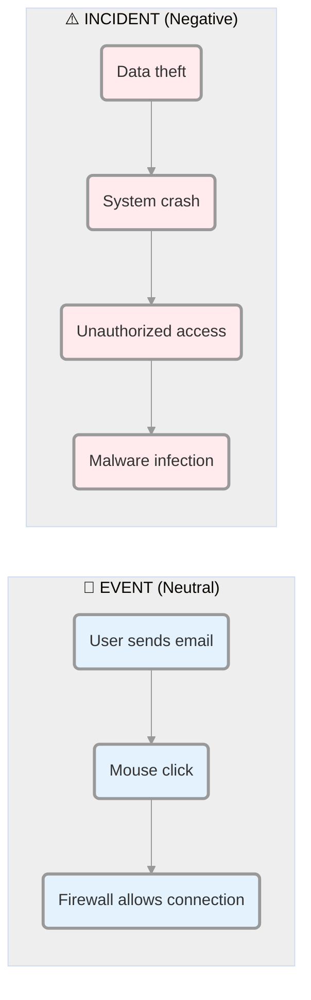

| Term | Definition | Example |
|------|------------|---------|
| **Event** | Any action occurring in a system or network | User sending email, mouse click, firewall allowing connection |
| **Incident** | An event with **negative consequence** requiring investigation | System crash, unauthorized access, data theft, malware infection |

### IT Security Incident

An event with **clear intent to cause harm** performed against a computer system:
- Data theft 💰
- Funds theft 💸
- Unauthorized access to data 🔓
- Installation and use of malware and remote access tools 🦠
- Ransomware attacks 🔒

### Key Concepts

> ⚠️ **Important**: It may NOT be immediately clear that an event is an incident until initial investigation is performed. Some suspicious events should be treated as incidents **UNLESS proven otherwise**.

### Incident Handling Definition

> Incident handling is a clearly defined set of procedures for managing and responding to security incidents in a computer or network environment.

**Not limited to**:
- Intrusion incidents only
- Also covers:
  - Malicious insider threats
  - Availability issues (DDoS, system crashes)
  - Loss of intellectual property
  - Natural disasters, power failures

### Incident Manager Role

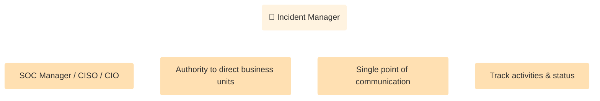

---

## 2. Real-World Incident Types

### 2.1 Leaked Credentials

| Incident | Description | Impact | Root Cause |
|----------|-------------|--------|------------|
| **Colonial Pipeline (2021)** | Ransomware via compromised VPN | Major US fuel pipeline shutdown | Weak password, no MFA |
| **Okta (2022)** | Lapsus$ breach via contractor | 366 organizations affected | Contractor compromised |

### 2.2 Default/Weak Credentials

| Incident | Description | Impact |
|----------|-------------|--------|
| **Mirai Botnet (2016)** | Scanned IoT for default creds (admin/admin) | 100K+ devices, DDoS on Dyn/OVH |
| **LogicMonitor (2023)** | Vendor weak default passwords | Customer ransomware incidents |

### 2.3 Unpatched Systems

| Incident | Description | Impact |
|----------|-------------|--------|
| **Equifax (2017)** | Apache Struts CVE-2017-5638 | 143-147M people affected |
| **WandaCry (2017)** | SMB EternalBlue (MS17-010) | 200K+ systems, 150+ countries |
| **Log4Shell (2021)** | CVE-2021-44228 | Massive vulnerability |

### 2.4 Insider Threats

| Incident | Description | Impact |
|----------|-------------|--------|
| **Cash App/Block (2021)** | Former employee accessed data | 8.2M customers affected |
| **Tesla (2020)** | Malicious insider plant | Production disruption |

### 2.5 Phishing/Social Engineering

| Incident | Description | Impact |
|----------|-------------|--------|
| **Twitter 2020** | Admin tools compromised via social engineering | Celebrity account bitcoin scam |
| **U.S. Interior Dept** | Evil twin Wi-Fi attack | Credentials stolen |

### 2.6 Supply Chain Attacks

| Incident | Description | Impact |
|----------|-------------|--------|
| **SolarWinds Orion (2020)** | Compromised build environment | 18K+ organizations (Sunburst backdoor) |
| **Codecov (2021)** | Supply chain compromise | Hundreds affected |

---

## 3. Cyber Kill Chain

### 7 Stages Overview

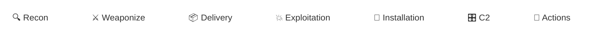

### Stage Details

#### 1️⃣ Reconnaissance

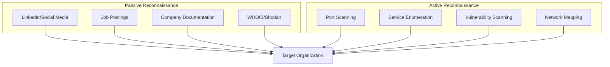

**SOC Detection Focus:**
- Monitor firewall logs for unusual port scans
- Review IDS alerts for reconnaissance signatures
- Watch for increased probing on perimeter

#### 2️⃣ Weaponize

- Create malware/exploits
- Test against AV/EDR detection
- Embed in deliverable payload

**SOC Focus:** This happens BEFORE reaching your network - focus on later stages

#### 3️⃣ Delivery

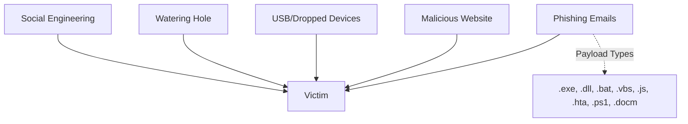

**SOC Detection Focus:**
- Email gateway alerts
- Web proxy blocks
- Endpoint detection
- User reports

#### 4️⃣ Exploitation

- Trigger malicious payload
- Execute code on target system

**SOC Detection Focus:**
- Process creation events
- PowerShell execution
- Parent-child process relationships

#### 5️⃣ Installation

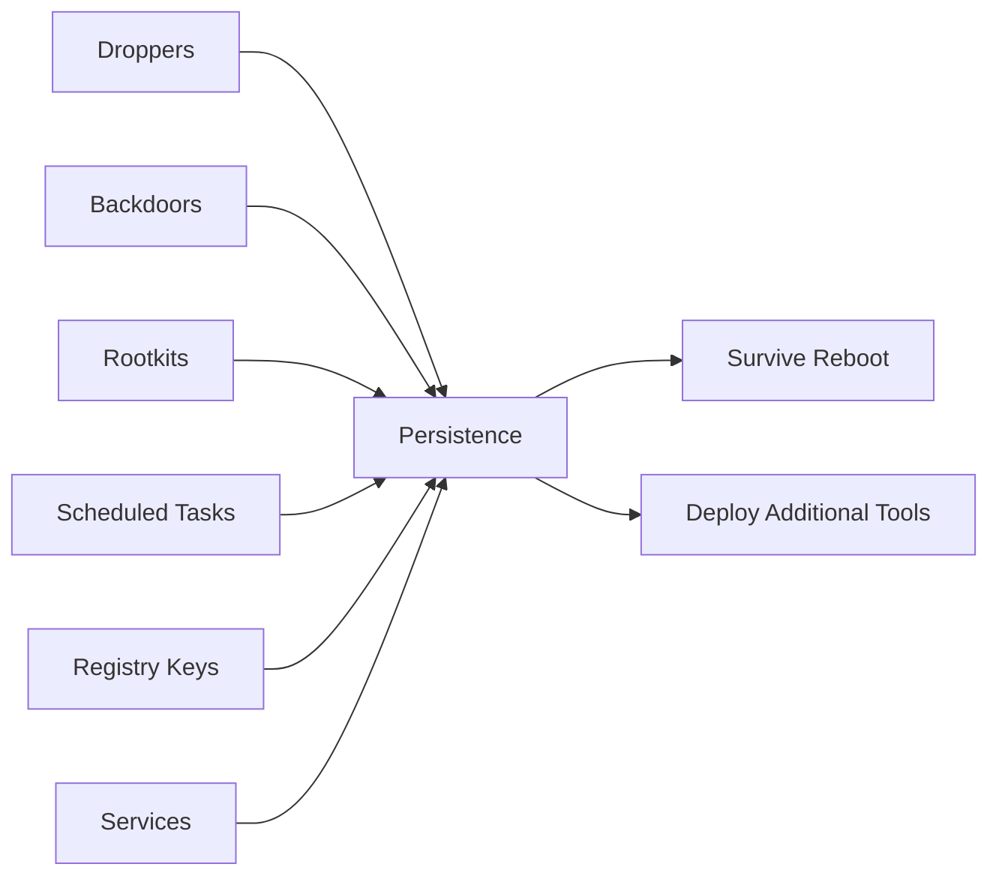

**SOC Detection Focus:**
- New scheduled tasks
- New services installed
- Registry changes
- New startup entries

#### 6️⃣ Command & Control (C2)

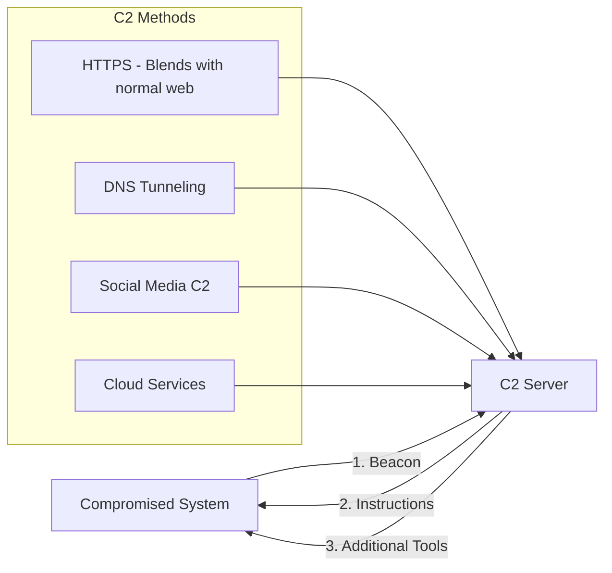

**SOC Detection Focus:**
- Unusual outbound connections
- DNS queries to suspicious domains
- Large data transfers
- Beaconing patterns (regular intervals)

#### 7️⃣ Actions on Objectives

- Data exfiltration 📤
- Ransomware encryption 🔒
- Credential theft 🔑
- Service disruption 💥

**SOC Detection Focus:**
- Large outbound transfers
- File creation/encryption
- New user accounts
- Backup modification

### Important Note ⚠️

> **Attackers don't operate linearly!** They often repeat stages. After installation, may return to reconnaissance for lateral movement. Goal: Stop them as early as possible!

---

## 4. MITRE ATT&CK Framework

### Concept Overview

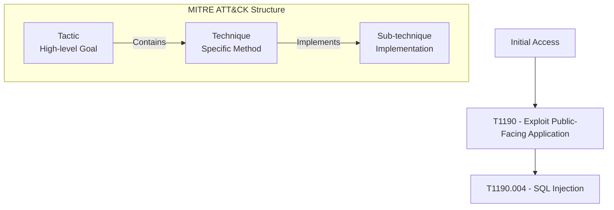

### Enterprise Tactics (14 Tactics)

| # | Tactic | Description | Example Techniques |
|---|--------|-------------|-------------------|
| 1 | Reconnaissance | Gathering information | Social engineering, scanning |
| 2 | Resource Development | Establishing resources | Infrastructure, capabilities |
| 3 | Initial Access | Getting into network | Phishing, exploits |
| 4 | Execution | Running code | PowerShell, malware |
| 5 | Persistence | Maintaining access | Scheduled tasks, registry |
| 6 | Privilege Escalation | Gaining higher privileges | Exploits, token theft |
| 7 | Defense Evasion | Avoiding detection | Disabling security, encryption |
| 8 | Credential Access | Stealing credentials | Keylogging, LSASS dump |
| 9 | Discovery | Exploring environment | Port scanning, account enum |
| 10 | Lateral Movement | Moving through network | RDP, SMB, WMI |
| 11 | Collection | Gathering data | Clipboard, screenshots |
| 12 | Command and Control | C2 communication | HTTPS, DNS |
| 13 | Exfiltration | Stealing data | Transfer to C2, cloud |
| 14 | Impact | Disrupting availability | Ransomware, destruction |

### Common Techniques for SOC Analysts

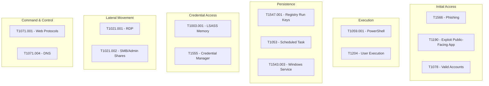

| Tactic | Technique | ID | Detection Focus |
|--------|-----------|-----|-----------------|
| Initial Access | Exploit Public-Facing Application | T1190 | Web app vulns, phishing |
| Execution | PowerShell | T1059.001 | Encoded commands, scripts |
| Execution | User Execution | T1204 | Malicious links, attachments |
| Persistence | Registry Run Keys | T1547.001 | Autorun entries |
| Persistence | Scheduled Task | T1053 | Task creation |
| Persistence | Windows Service | T1543.003 | Service installation |
| Privilege Escalation | Valid Accounts | T1078 | Admin account creation |
| Credential Access | LSASS Memory | T1003.001 | Credential dumping |
| Lateral Movement | RDP | T1021.001 | RDP from external IP |
| Lateral Movement | SMB/Admin Shares | T1021.002 | Share access |
| Command & Control | Web Protocols (HTTPS) | T1071.001 | C2 beaconing |
| Exfiltration | Exfiltration Over C2 | T1041 | Data transfer to C2 |
| Impact | Data Encrypted for Impact | T1486 | Ransomware encryption |

---

## 5. Pyramid of Pain

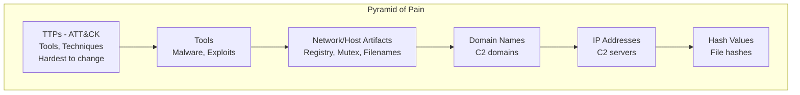

### Understanding Each Level

| Level | Indicator Type | Examples | Change Difficulty | Detection Value |
|-------|----------------|----------|-------------------|-----------------|
| **Bottom** 🔴 | Hash Values | MD5, SHA256 of malware | Trivial - recompile | Low |
| **2** 🟠 | IP Addresses | C2 server IPs | Easy - new server | Low-Medium |
| **3** 🟡 | Domain Names | C2 domains | Simple - register new | Medium |
| **4** 🟢 | Network/Host Artifacts | Registry keys, mutex, filenames | Annoying - change behavior | Medium-High |
| **5** 🔵 | Tools | Malware, exploit kits | Challenging - develop new | High |
| **Top** 🟣 | TTPs | MITRE ATT&CK techniques | Tough - fundamental change | **Highest** |

### Key Insight 💡

> **Blocking a malicious IP only slightly slows down the adversary. Detecting TTPs (behavior-based) forces the adversary to fundamentally change how they operate.**

**Example:**
- **Low Pyramid:** Blocking IP 1.2.3.4 → Attacker just uses 5.6.7.8
- **High Pyramid:** Detecting PowerShell encoded commands → Attacker must find new execution method

---

## 6. NIST Incident Response Lifecycle

### The 4 Stages

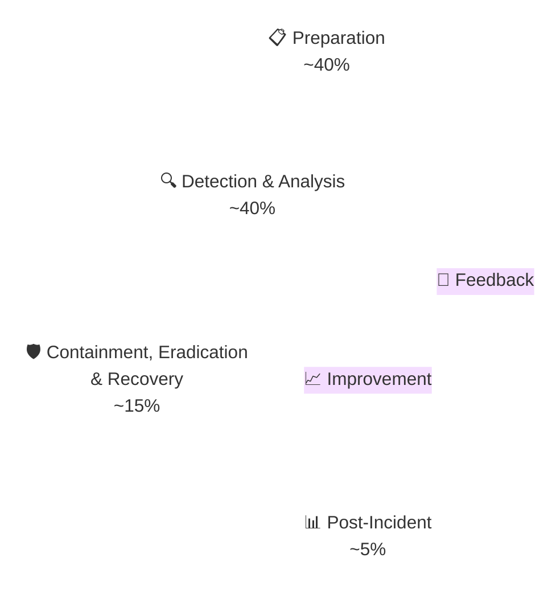

### Key Concept

> **Process is NOT linear but cyclic** - As new evidence is discovered, next steps may change. Don't skip steps!

### RACI Matrix Example

| Activity | SOC Tier 1 | SOC Tier 2 | SOC Tier 3 | IR Lead | Manager |
|-----------|------------|------------|------------|---------|---------|
| Initial Triage | R | I | I | C | A |
| Investigation | I | R | R | C | A |
| Containment | I | C | R | R | A |
| Communication | I | I | I | R | A |

**R = Responsible, A = Accountable, C = Consulted, I = Informed**

---

## 7. Preparation Stage

### Objectives

1. **Establish** incident handling capability
2. **Implement** protective measures to prevent incidents

### Prerequisites Checklist

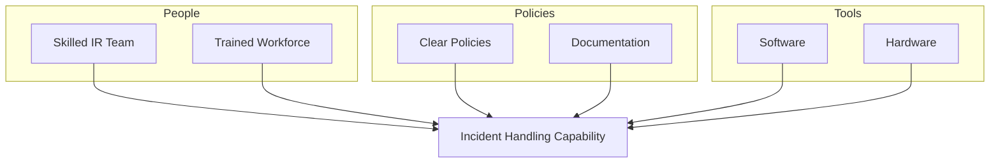

| Category | Requirements |
|----------|--------------|
| **People** | Skilled IR team members (can be partially outsourced) |
| **Workforce** | Trained through security awareness |
| **Policies** | Clear documentation and procedures |
| **Tools** | Software and hardware for forensics |

### Documentation Requirements

- [ ] Contact info for IR team members
- [ ] Contact info for legal, compliance, management, law enforcement
- [ ] Incident response policy, plan, and procedures
- [ ] Network diagrams and asset database
- [ ] Escalation contact list
- [ ] Forensic/IR cheat sheets
- [ ] **Independent** communication channels (assume infrastructure compromised!)

### Jump Bag Essentials

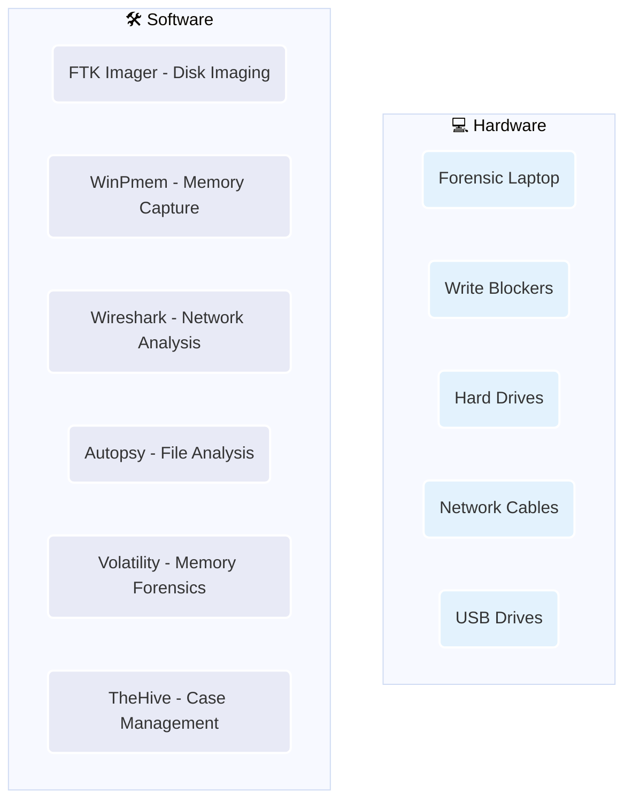

### Protective Measures

| Measure | Purpose | Implementation |
|---------|---------|-----------------|
| **DMARC** | Email protection against phishing | Reject spoofed emails |
| **Disable LLMNR/NetBIOS** | Prevent NTLM relay | Registry setting |
| **Implement LAPS** | Random local admin passwords | Microsoft tool |
| **ASR Rules** | Block exploit behaviors | Windows Defender |
| **Block user folder execution** | Prevent malware execution | No .exe in Downloads |
| **MFA everywhere** | Protect privileged accounts | At least for admins |
| **Vulnerability Scanning** | Continuous assessment | Prioritize High/Critical |
| **User Awareness Training** | Phishing recognition | Monthly simulations |
| **Purple Team Exercises** | Test detection capabilities | Red + Blue team |

---

## 8. Detection & Analysis Stage

### Detection Sources

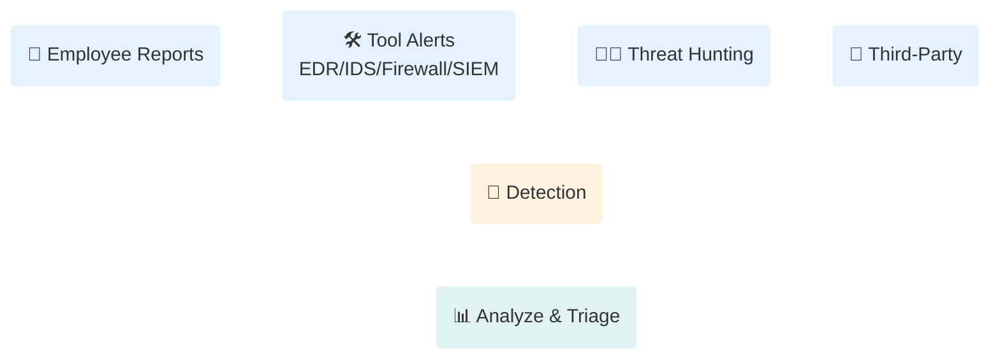

### Detection Layers (Defense in Depth)

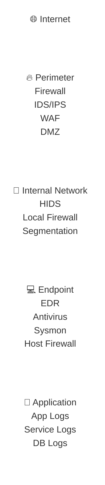

### Initial Investigation Questions

| Question | Purpose |
|----------|---------|
| **When** did the incident occur? | Establish timeline |
| **Who** detected/reported it? | Source verification |
| **What** type of incident? | Phishing, malware, etc. |
| **Which** systems are affected? | Scope assessment |
| **Is** it ongoing or stopped? | Determine urgency |
| **System** details (OS, IP, hostname)? | Identification |

### Building Incident Timeline

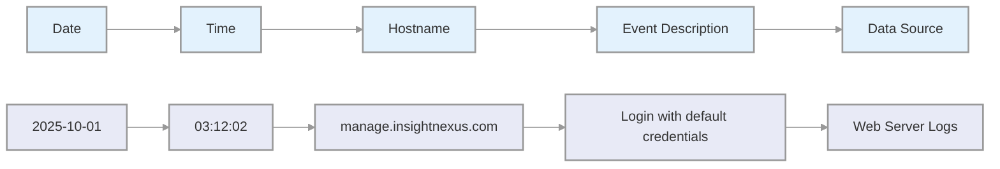

| Date | Time (UTC) | Hostname | Event Description | Data Source |
|------|------------|----------|-------------------|-------------|
| 2025-10-01 | 03:12:02 | manage.insightnexus.com | Login with default credentials | Web logs |
| 2025-10-01 | 03:18:32 | manage.insightnexus.com | C2 to 103.112.60.117:443 | Sysmon Event 3 |
| 2025-10-02 | 04:02:11 | DC01.insight.local | Domain admin created | Windows Security |
| 2025-10-04 | 02:03:12 | DEV-021 | RDP logon from external IP | Windows Security 4624 |

### Severity Assessment Questions

- What is the exploitation impact?
- Are business-critical systems affected?
- How many systems impacted?
- Is the exploit being used in the wild?
- Does it have worm-like capabilities?

### IOC Creation & Usage

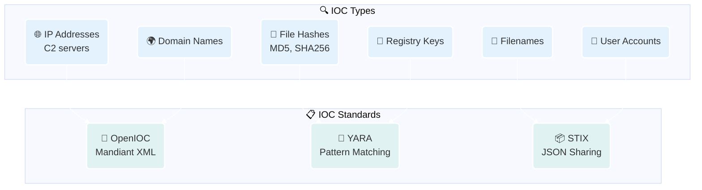

### Investigation Cycle

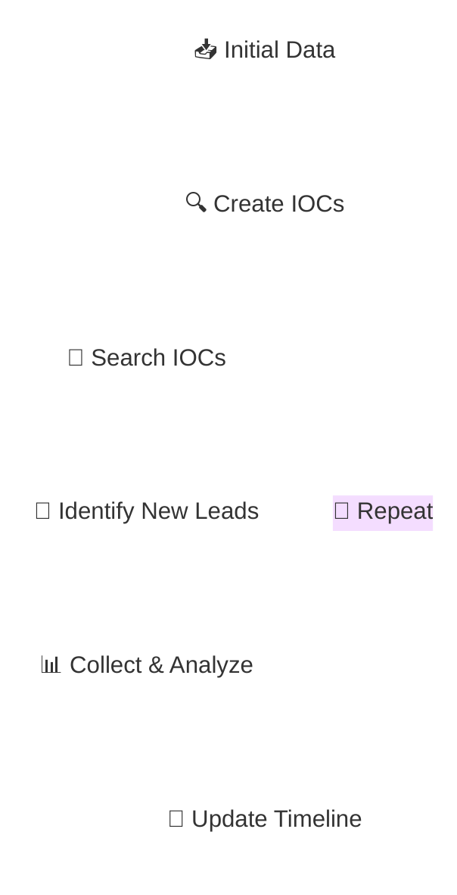

### AI in Threat Detection

| Use Case | Description |
|----------|-------------|
| **Automated Triage** | Analyze and prioritize alerts based on severity |
| **Incident Correlation** | Group related alerts into attack stories |
| **Timeline Reconstruction** | Automatically build incident timeline |
| **Automated Playbooks** | Trigger containment actions |
| **Post-Incident Analysis** | Generate incident summaries |

---

## 9. Containment, Eradication & Recovery

### Containment Strategy

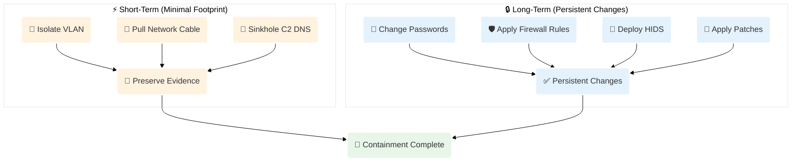

### ⚠️ CRITICAL RULE

> **Execute containment actions SIMULTANEOUSLY across all affected systems! If you alert attackers, they may change tactics and become harder to detect.**

### Containment Checklist

- [ ] Block C2 IP at perimeter firewall
- [ ] Block C2 IP on host-based firewalls
- [ ] Disable compromised accounts
- [ ] Rotate exposed credentials
- [ ] Isolate affected systems
- [ ] Suspend malicious scheduled tasks
- [ ] Disable malicious GPOs

### Eradication Activities

- Remove detected malware
- Rebuild systems from clean images
- Restore from verified clean backup
- Apply additional patches
- System hardening across network

### Recovery Stage

```mermaid
graph LR
    R1[Restore Systems] --> R2[Verify Functionality]
    R2 --> R3[Gradual Reintroduction]
    R3 --> R4[Heavy Monitoring]
    
    subgraph "Post-Recovery Monitoring"
        M1[Unusual Logons]
        M2[Unusual Processes]
        M3[Registry Changes]
        M4[C2 Attempts]
    end
    
    R4 --> M1
    R4 --> M2
    R4 --> M3
    R4 --> M4
```

---

## 10. Post-Incident Activity

### Final Report Must Answer

1. **What** happened and when?
2. **How** did the team perform against procedures?
3. Did **business** provide necessary information?
4. **What** contained/eradicated the incident?
5. What **prevents** similar incidents?
6. What **tools/resources** needed for future?

### Metrics to Track

| Metric | Description |
|--------|-------------|
| MTTD | Mean Time To Detect |
| MTTR | Mean Time To Respond |
| MTTC | Mean Time To Contain |
| Incident Count | Total incidents handled |
| Time per Incident | Average investigation time |

### Lessons Learned Meeting

- Conduct within days after incident
- Include all stakeholders
- Document root cause analysis
- Update policies and playbooks
- Enhance detection rules

---

## 11. Case Study: Insight Nexus Breach

### Overview

- **Victim**: Insight Nexus (market research firm, Singapore)
- **Discovery**: checkme.txt file with "SilentJackal was here"
- **Complexity**: **Two threat actors** active simultaneously!

### The Two Threat Actors

| Actor | Type | Motivation | Activity |
|-------|------|------------|-----------|
| **Crimson Fox** | State-backed APT | Data theft, long-term access | Credential theft, persistence, data exfiltration |
| **Silent Jackal** | Opportunistic criminal | Disruption, proof-of-concept | Web defacement, marker file only |

### Environment

**Internet-Facing:**
- ManageEngine ADManager Plus (default credentials: admin/admin)
- PHP Client Reports Portal (file upload vulnerability)

**Internal:**
- Domain Controller: DC01.insight.local
- File Server: FS01.insight.local
- Database Server: DB01.insight.local
- Workstations: DEV-001 to DEV-120 (**DEV-021 had exposed RDP!**)

### Attack Chain

```mermaid
%%{init: {'theme': 'base', 'themeVariables': { 'lineColor': '#fff', 'nodeBorder': '#fff'}}}%%
graph TD
    A(🔓 Default Credentials<br/>admin/admin) --> B(🚪 ManageEngine Access)
    B --> C(🎛️ C2 to 103.112.60.117<br/>HTTPS)
    C --> D(👑 Domain Admin Created)
    D --> E(🖥️ RDP to DEV-021<br/>Exposed RDP)
    E --> F(📦 GPO Deploys MSI<br/>java-update.msi)
    F --> G(📤 Data Exfiltration<br/>diagnostics_data.zip)
    
    classDef attack fill:#fff,stroke:#fff,stroke-width:2px,rx:8,ry:8,color:#333;
    class A,B,C,D,E,F,G attack;
```

### Timeline

| Date/Time | Activity | MITRE ATT&CK |
|-----------|----------|---------------|
| 2025-10-01 03:12 | Initial access via default credentials | T1078.004 |
| 2025-10-01 03:18 | C2 established to 103.112.60.117 | T1071.001 |
| 2025-10-02 04:02 | Domain enumeration, Domain Admin created | T1087.002 |
| 2025-10-04 02:03 | RDP from external IP to DEV-021 | T1021.001 |
| 2025-10-04 02:10 | GPO pushes java-update.msi | T1543.003 |
| Ongoing | Data exfiltration (diagnostics_data.zip) | T1041 |

### Key Event Logs

**Sysmon Event 3 - C2 Connection:**
```
Image: C:\ManageEngine\jre\bin\java.exe
DestinationIp: 103.112.60.117
DestinationPort: 443
```

**Windows Security Event 4624 - RDP Logon:**
```
Logon Type: 10 (RemoteInteractive)
SubjectUserName: insight\svc_deployer
SourceNetworkAddress: 103.112.60.117
```

**Sysmon Event 1 - MSI Execution:**
```
Image: C:\Windows\System32\msiexec.exe
CommandLine: "msiexec /i C:\Windows\Temp\java-update.msi /quiet"
```

### Organizational Oversights 😱

| Issue | Impact |
|-------|--------|
| Default credentials (admin/admin) | Initial access |
| No MFA on admin accounts | Credential compromise |
| No WAF on web apps | Exploitation possible |
| ManageEngine logs not in SIEM | No visibility |
| RDP port publicly exposed (DEV-021) | Lateral movement |
| No vulnerability scans on portals | Unknown vulnerabilities |

### Incident Response Actions

1. **Case creation** in TheHive with linked alerts
2. **Network containment**: Blocked 103.112.60.117 at firewall
3. **Credential containment**: Disabled admin, rotated credentials
4. **Host isolation**: Isolate manage.insightnexus.com, DEV-021
5. **Forensic collection**: Memory, registry, disk images

### Lessons Learned 📚

1. **Default credentials** on Internet-facing apps = simplest but most damaging oversight
2. **Multiple threat actors** can exist simultaneously with different motivations
3. **Alert correlation failure** delays containment - gives attackers more time
4. **Post-incident monitoring** must include persistence mechanism scanning

---

## 12. Key Detection Rules & IOCs

### Windows Security Event IDs

| Event ID | Description | Detection Use |
|----------|-------------|------------------|
| **4624** | Successful logon | Legitimate access, lateral movement |
| **4625** | Failed logon | Brute force attempts |
| **4634** | Logoff | Session termination |
| **4648** | Explicit credential logon | RunAs, lateral movement |
| **4672** | Special privileges assigned | Admin logon |
| **4688** | Process creation | New processes, malware |
| **4689** | Process terminated | Process exit |
| **4720** | User account created | New account (bad!) |
| **4726** | User account deleted | Account deletion |
| **4728** | Member added to security group | Privilege escalation |
| **4732** | Member added to local group | Local admin added |
| **4740** | Account lockout | Brute force |
| **4768** | Kerberos TGT requested | Kerberos activity |
| **4769** | Kerberos service ticket requested | Kerberoasting |
| **7045** | New service installed | Persistence |
| **1102** | Security log cleared | Defense evasion |

### Sigma Rule: External RDP Logon

```yaml
title: External Remote RDP Logon from Public IP
id: 259a9cdf-c4dd-4fa2-b243-2269e5ab18a2
status: test
description: Detects successful logon from public IP via RDP
logsource:
  product: windows
  service: security
detection:
  selection:
    EventID: 4624
    LogonType: 10
  filter_main_local_ranges:
    IpAddress|cidr:
      - '10.0.0.0/8'
      - '172.16.0.0/12'
      - '192.168.0.0/16'
  condition: selection and not 1 of filter_main_*
level: medium
```

### Key IOCs from Insight Nexus

| Type | Value | Context |
|------|-------|---------|
| IP | 103.112.60.117 | C2 server |
| Domain | manage.insightnexus.com | Initial access |
| File | java-update.msi | GPO-deployed malware |
| File | diagnostics_data.zip | Exfiltrated data |
| File | checkme.txt | Marker file |

---

## 13. Home Lab Practice

### Recommended Setup

| Tool | Purpose | Where to Get |
|------|---------|--------------|
| **TheHive** | Case management | thehive-project.org |
| **Velociraptor** | Endpoint forensics | velociraptor.io |
| **Splunk** | SIEM (free) | splunk.com |
| **Wazuh** | SIEM (open source) | wazuh.com |
| **The DFIR Report** | Practice cases | thefirreport.com |
| **Malware Traffic Analysis** | PCAP practice | malware-traffic-analysis.net |

### Practice Exercises

1. Set up TheHive with Cortex
2. Create sample alerts and map to MITRE ATT&CK
3. Build investigation playbooks
4. Practice timeline building
5. Test Sigma rule detection

---

## 14. Interview Questions

### Q1: What is the difference between an event and an incident?

**Answer:** An event is any action occurring in a system or network (neutral), while an incident is an event with a negative consequence that requires investigation.

---

### Q2: Explain the 4 stages of NIST incident response lifecycle.

**Answer:**
1. **Preparation** - Build capabilities, tools, processes
2. **Detection & Analysis** - Find and investigate incidents
3. **Containment, Eradication & Recovery** - Stop threat, restore systems
4. **Post-Incident Activity** - Document, learn, improve

---

### Q3: What are the 7 stages of Cyber Kill Chain?

**Answer:** Reconnaissance → Weaponization → Delivery → Exploitation → Installation → Command & Control → Actions on Objectives

---

### Q4: Explain the difference between MITRE ATT&CK tactics and techniques.

**Answer:** Tactics are high-level goals (e.g., Initial Access, Persistence), while techniques are specific methods to achieve those goals (e.g., T1190 - Exploit Public-Facing Application).

---

### Q5: What is the Pyramid of Pain and why does it matter?

**Answer:** It shows how hard it is for attackers to change different indicators. Hash values are easily changed (bottom), while TTPs (top) require fundamental behavior change. Detecting TTPs is more valuable than detecting IOCs.

---

### Q6: What should be included in the Preparation stage?

**Answer:** Skilled team, clear policies, forensic tools (jump bag), protective measures (MFA, patching, segmentation), independent communication channels.

---

### Q7: Describe the initial investigation process when an alert is triggered.

**Answer:** Gather information (what, when, who, which systems), establish timeline, create IOCs, search for IOCs across environment, identify new leads, collect and analyze evidence, update timeline.

---

### Q8: What's the difference between short-term and long-term containment?

**Answer:** Short-term preserves evidence (isolate VLAN, pull cable), long-term makes persistent changes (password reset, firewall rules, patches).

---

### Q9: What IOCs would you look for in a ransomware incident?

**Answer:** File encryption events (many file modifications), new executables, scheduled tasks for decryption, communication with C2 servers, ransom notes.

---

### Q10: How do you handle multi-stage attacks?

**Answer:** Don't jump to containment! Complete detection and analysis first. Map to MITRE ATT&CK to understand attack progression. Contain systematically across ALL affected systems simultaneously.

---

### Q11: What is the Diamond Model of intrusion analysis?

**Answer:** A model with 4 components: Adversary, Capability, Victim, Infrastructure. Used to understand and analyze intrusions systematically.

---

### Q12: How do you prioritize incidents?

**Answer:** Consider: business impact, systems affected, threat actor sophistication, data exposure, regulatory implications. Use severity levels (P1-P4) to assign resources.

## 15. Additional Resources

### Books
- "The Practice of Network Security Monitoring" - Richard Bejtlich
- "Digital Forensics" - Jason Geffner
- "Incident Response & Computer Forensics" - Jason Lutt
- "Blue Team Field Manual" - Alan White & Chris Gates
- "The Shellcode Loader" - Tyler Applebaum

### Websites
- [MITRE ATT&CK](https://attack.mitre.org)
- [The DFIR Report](https://thedfirreport.com/)
- [SANS IR](https://www.sans.org/security-resources/incident-management/)
- [NIST SP 800-61](https://csrc.nist.gov/publications/detail/sp/800-61/rev-2/final)
- [CISA Resources](https://www.cisa.gov/resources-tools/resources)
- [Red Canary Blog](https://redcanary.com/blog/)
- [Unit 42 Blog](https://unit42.paloaltonetworks.com/)

### Communities
- r/dfir (Reddit)
- r/sysadmin (Reddit)
- Twitter/X security researchers
- SANS Digital Forensics
- FIRST (Forum of Incident Response)
- SANS ISAC (Information Sharing and Analysis Center)

### CTI Sources
- CISA Alerts (cisa.gov/alerts)
- MITRE ATT&CK Navigator
- ThreatFox (abuse.ch)
- AlienVault OTX (otx.alienvault.com)
- VirusTotal
- Hybrid Analysis
- ANY.RUN

---

## 16. Additional Topics

### 16.1 Incident Classification & Severity Levels

```mermaid
%%{init: {'theme': 'base', 'themeVariables': { 'lineColor': '#999', 'nodeBorder': '#999'}}}%%
graph TD
    P1(🚨 P1 - Critical<br/>Active APT/Ransomware<br/>Data Exfiltration) --> Immediate(⚡ Immediate Response)
    P2(🔴 P2 - High<br/>Malware/Unauthorized Access) --> OneHour(⏰ < 1 Hour Response)
    P3(🟡 P3 - Medium<br/>Policy Violation/Suspicious) --> FourHours(⏱️ < 4 Hours Response)
    P4(🟢 P4 - Low<br/>Failed Logins/Minor Anomalies) --> TwentyFour(📅 < 24 Hours Response)
    
    classDef critical fill:#ffebee,stroke:#999,stroke-width:3px,rx:8,color:#333;
    classDef high fill:#fff3e0,stroke:#999,stroke-width:2px,rx:5,color:#333;
    classDef medium fill:#fffde7,stroke:#999,stroke-width:2px,rx:5,color:#333;
    classDef low fill:#e8f5e9,stroke:#999,stroke-width:2px,rx:5,color:#333;
    class P1,P2,P3,P4 critical,high,medium,low;
```

| Severity | Response Time | Examples | Resources |
|----------|---------------|----------|-----------|
| **P1 Critical** | Immediate | Active ransomware, APT, data exfiltration | Full IR team |
| **P2 High** | < 1 hour | Malware detection, unauthorized access | Tier 2+ |
| **P3 Medium** | < 4 hours | Policy violation, suspicious activity | Tier 1-2 |
| **P4 Low** | < 24 hours | Failed login attempts, minor anomalies | Tier 1 |

### 16.2 Chain of Custody

```mermaid
graph LR
    Evidence[Evidence Collection] --> Doc[Document Everything]
    Doc --> Hash[Hash Verification]
    Hash --> Store[Secure Storage]
    Store --> Transfer[Chain of Custody Form]
    Transfer --> Analysis[Forensic Analysis]
    Analysis --> Court[Court-Admissible]
```

**Required Documentation:**
- Evidence ID and description
- Date and time of collection
- Location where found
- Name of collector
- Purpose of collection
- Hash values (MD5, SHA256)
- Storage location
- Every transfer of custody

### 16.3 Evidence Collection Best Practices

| Evidence Type | Collection Method | Tools |
|---------------|-------------------|-------|
| **Memory** | Live capture | WinPmem, Magnet RAM Capture, FTK Imager |
| **Disk** | Forensic imaging (quiescent) | FTK Imager, dd, dc3dd |
| **Network** | Packet capture | Wireshark, tcpdump, NetworkMiner |
| **Logs** | Export from source | SIEM, Windows Event Viewer |
| **Registry** | Offline extraction | Registry Viewer, Autopsy |
| **Browser** | Artifact collection | BrowsersHistoryView, Magnet AXIOM |

> ⚠️ **Golden Rule**: Collect volatile evidence first (Memory → Network → Disk)

### 16.4 Regulatory Frameworks

```mermaid
graph TD
    GDPR[GDPR<br/>EU Data Protection] --> Fine1[4% Global Revenue]
    HIPAA[HIPAA<br/>US Healthcare] --> Fine2[$1.5M/Violation]
    PCI_DSS[PCI-DSS<br/>Payment Cards] --> Fine3[$100K/Month]
    SOX[SOX<br/>US Financial] --> Fine4[Criminal Penalties]
```

| Framework | Industry | Key Requirements |
|-----------|----------|-------------------|
| **GDPR** | EU Companies | 72-hour breach notification, data privacy |
| **HIPAA** | Healthcare | 60-day notification, PHI protection |
| **PCI-DSS** | Payment Cards | Immediate notification, card data security |
| **SOX** | Public Companies | Financial data integrity, audit trails |

### 16.5 Key Performance Indicators (KPIs)

| KPI | Formula | Target |
|-----|---------|--------|
| **MTTD** | Avg time from start to detection | < 24 hours |
| **MTTR** | Avg time from detection to resolution | < 4 hours (P1) |
| **MTTC** | Avg time to contain | < 1 hour (P1) |
| **False Positive Rate** | FP / Total Alerts | < 40% |
| **Escalation Rate** | Escalated / Total | < 20% |
| **Coverage** | Monitored Assets / Total Assets | > 95% |

### 16.6 SOC Tiers & Responsibilities

```mermaid
graph TD
    subgraph "SOC Tier Model"
        T1[Tier 1: L1 Analyst<br/>Triage & Categorization] --> T2[Tier 2: L2 Analyst<br/>Investigation & Analysis]
        T2 --> T3[Tier 3: L3 Analyst<br/>Threat Hunting & Advanced IR]
        T3 --> Manager[SOC Manager<br/>Strategic & Leadership]
    end
    
    subgraph "Tier 1 Responsibilities"
        R1[Alert Triage]
        R2[Initial Categorization]
        R3[Basic Investigation]
        R4[Escalation]
    end
    
    subgraph "Tier 2 Responsibilities"
        R5[Deep Dive Analysis]
        R6[Malware Analysis]
        R7[Forensics]
        R8[Incident Response]
    end
    
    subgraph "Tier 3 Responsibilities"
        R9[Threat Hunting]
        R10[APT Detection]
        R11[Tool Tuning]
        R12[Playbook Development]
    end
    
    T1 --> R1
    T1 --> R2
    T2 --> R5
    T2 --> R6
    T3 --> R9
    T3 --> R10
```

### 16.7 Threat Intelligence Integration

```mermaid
graph TD
    TI[Threat Intelligence] --> Sources[External Feeds]
    TI --> Internal[Internal Sources]
    
    subgraph "External Feeds"
        E1[CISA ALERTS]
        E2[Vendor Feeds]
        E3[OSINT/Threat Blogs]
        E4[ISACs/ISSPs]
    end
    
    subgraph "Internal Sources"
        I1[Incident Data]
        I2[Log Analysis]
        I3[Hunting Results]
        I4[Malware Analysis]
    end
    
    Sources --> Integration[TI Platform]
    Internal --> Integration
    
    Integration --> Use[Use Cases]
    
    subgraph "TI Use Cases"
        U1[IOC Blocking]
        U2[Alert Enrichment]
        U3[Threat Hunting]
        U4[Detection Rules]
    end
    
    Use --> Block[Block at Perimeter]
    Use --> Alert[Enrich Alerts]
    Use --> Hunt[Hunt for TTPs]
    Use --> Detect[Update Rules]
```

### 16.8 Common Attack Vectors & Detection

| Attack Vector | Detection Method | Log Sources |
|---------------|------------------|--------------|
| **Phishing** | Email gateway, user report | Email logs, proxy |
| **Credential Stuffing** | Failed login spike, MFA failures | Auth logs, SIEM |
| **RDP Brute Force** | Multiple 4625 events | Windows Security |
| **SQL Injection** | WAF alerts, abnormal DB queries | WAF, DB logs |
| **Exploit Kits** | Unknown file downloads | Proxy, endpoint |
| **Watering Hole** | Unexpected browser behavior | Proxy, endpoint |
| **Supply Chain** | Unexpected software updates | App logs, EDR |

### 16.9 Playbook Examples

#### Playbook: Phishing Response

```mermaid
graph TD
    Start[Phishing Alert] --> Triage[Triage Alert]
    Triage --> Analyze[Analyze Email]
    Analyze --> Extract[Extract IOCs]
    Extract --> Block[Block IOCs]
    Block --> Notify[Notify User]
    Notify --> Report[Report/Close]
    
    subgraph "Extract IOCs"
        E1[Sender Email]
        E2[URLs]
        E3[Attachments]
        E4[Headers]
    end
    
    subgraph "Block IOCs"
        B1[Block sender domain]
        B2[Block URLs in proxy]
        B3[Quarantine attachment]
        B4[Add to TI platform]
    end
    
    Extract --> E1
    Extract --> E2
    Extract --> E3
    Extract --> E4
    Block --> B1
    Block --> B2
    Block --> B3
    Block --> B4
```

#### Playbook: Malware Detection

```mermaid
graph TD
    Alert[Malware Detected] --> Isolate[Isolate Endpoint]
    Isolate --> Collect[Collect Forensics]
    Collect --> Analyze[Analyze Malware]
    Analyze --> Identify[Identify Scope]
    Identify --> Contain[Contain Spread]
    Contain --> Eradicate[Eradicate]
    Eradicate --> Recover[Recover]
    Recover --> Close[Close Case]
```

### 16.10 Common Tools Reference

| Category | Tools | Purpose |
|----------|-------|---------|
| **SIEM** | Splunk, Elastic, Wazuh, Microsoft Sentinel | Log aggregation & analysis |
| **EDR** | CrowdStrike, SentinelOne, Carbon Black, Microsoft Defender | Endpoint detection & response |
| **Forensics** | FTK Imager, Autopsy, Volatility | Disk & memory analysis |
| **Network** | Wireshark, tcpdump, NetworkMiner | Packet capture & analysis |
| **Case Management** | TheHive, ServiceNow, Jira | Incident tracking |
| **Threat Intel** | MISP, ThreatFox, OTX | IOC sharing & analysis |
| **Malware Analysis** | Any.Run, Hybrid Analysis, Joe Sandbox | Malware sandbox |
| **Vulnerability** | Nessus, Qualys, OpenVAS | Vulnerability scanning |

---

## 17. Quick Reference Card

### Emergency Contacts
| Role | Contact | Phone/Email |
|------|---------|-------------|
| SOC Lead | [Insert] | [Insert] |
| IR Team | [Insert] | [Insert] |
| Legal | [Insert] | [Insert] |
| Management | [Insert] | [Insert] |
| Law Enforcement | [Insert] | [Insert] |

### Key Commands
```bash
# Memory capture (Windows)
winpmem_mini_x64.exe memory.raw

# Disk imaging
dd if=/dev/sdX of=evidence.raw bs=4M

# Network capture
tcpdump -i eth0 -w capture.pcap

# Event log export
wevtutil qe Security /c:100 /f:Text
```

### Critical Event IDs Quick Ref
```
4624 - Successful logon
4625 - Failed logon
4648 - Explicit credentials
4688 - Process creation
4720 - Account created
4732 - Admin group added
7045 - New service
1102 - Log cleared
```

---

*Module 1/15 - SOC Analyst Cheatsheet*
*Built with research + HTB Academy materials*
*For learning and interview preparation*