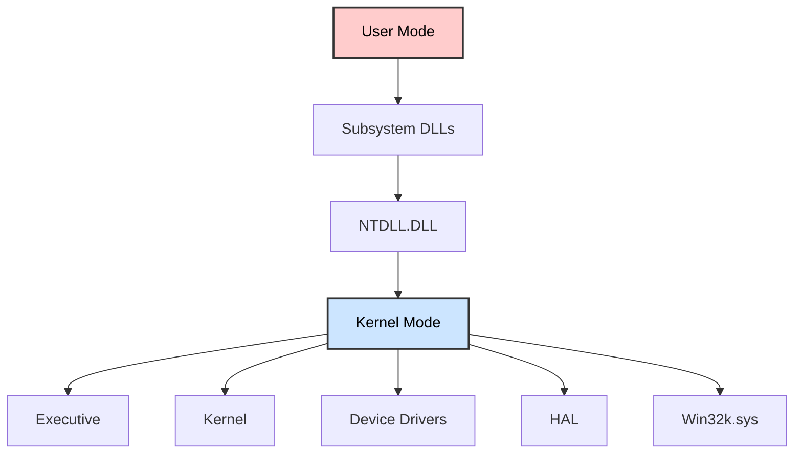
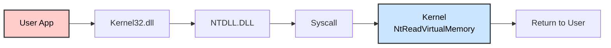
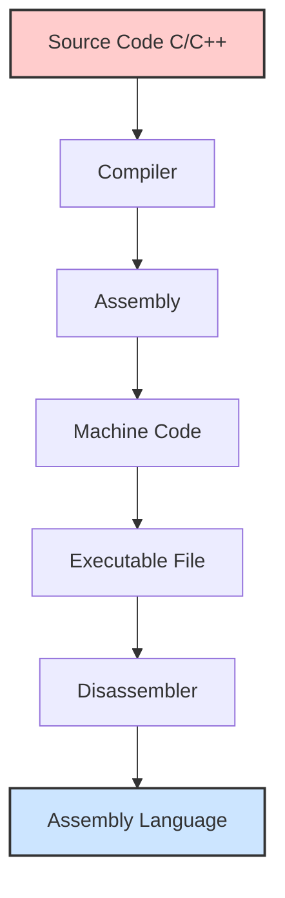
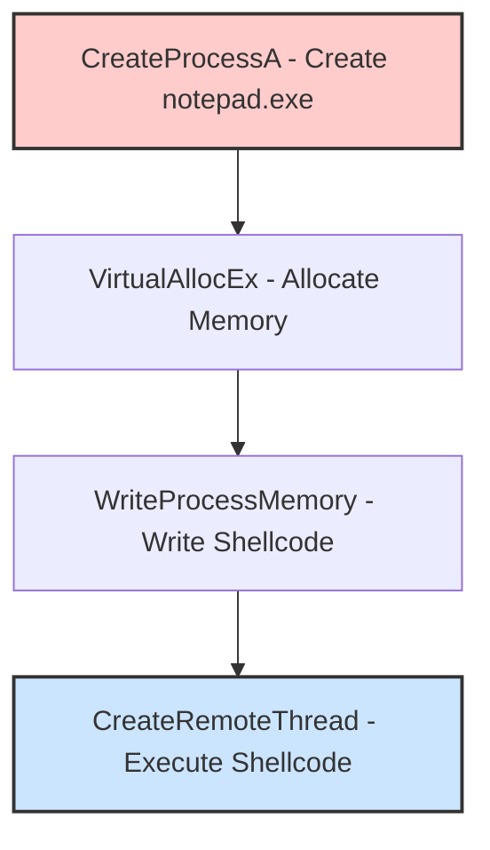

# 🦠 INTRODUCTION TO MALWARE ANALYSIS

## SOC Analyst Cheatsheet - Module 10/15

---

## 0. Overview

### Module Description

This module offers hands-on exploration of malware analysis with focus on Windows-based threats. It covers Static Analysis, Malware Unpacking, Dynamic Analysis, Reverse Engineering, and Debugging using x64dbg.

> 🔴 **Difficulty:** Hard | **Tier:** 2 | **Estimated Time:** 3 days | **Cubes:** 20

### Prerequisites

- Incident Handling Process
- Intro to Assembly Language
- Windows Event Logs & Finding Evil

### What We'll Cover

| Topic | Description |
|-------|-------------|
| **Static Analysis** | Linux & Windows tools for analyzing malware without execution |
| **Malware Unpacking** | Unraveling packed malware to reveal true content |
| **Dynamic Analysis** | Execute malware in controlled environment to observe behavior |
| **Code Analysis** | Reverse engineering to understand malware functionality |
| **Debugging** | Using x64dbg to trace execution and set breakpoints |

### Real-World Malware Examples

- WannaCry
- DoomJuice
- Brbbot
- Dharma
- Meterpreter

---

## Table of Contents

1. [Introduction To Malware & Malware Analysis](#1-introduction-to-malware--malware-analysis)
2. [Prerequisites - Windows Internals](#2-prerequisites---windows-internals)
3. [Static Analysis On Linux](#3-static-analysis-on-linux)
4. [Static Analysis On Windows](#4-static-analysis-on-windows)
5. [Dynamic Analysis](#5-dynamic-analysis)
6. [Code Analysis](#6-code-analysis)
7. [Creating Detection Rules](#7-creating-detection-rules)
8. [Skills Assessment](#8-skills-assessment)
9. [Interview Questions](#interview-questions)
10. [Additional Resources](#additional-resources)

---

## 1. Introduction To Malware & Malware Analysis

### What is Malware?

> 📌 **Malware** - Short for malicious software, encompasses various types of software designed to infiltrate, exploit, or damage computer systems, networks, and data.

**Common Malware Objectives:**
- Disrupting host system operations
- Stealing critical information (personal and financial data)
- Gaining unauthorized access to systems
- Conducting espionage activities
- Sending spam messages
- Implementing DDoS attacks
- Ransomware attacks

---

### Malware Types

| Type | Description |
|------|-------------|
| **Virus** | Infiltrates and multiplies within host files, activates when infected files are triggered |
| **Worm** | Autonomous malware that multiplies across networks without human intervention |
| **Trojan** | Disguised as legitimate software, creates backdoors for remote control |
| **Ransomware** | Encrypts files and demands ransom for decryption key |
| **Spyware** | Stealthily gathers sensitive data and user activities |
| **Adware** | Displays unwanted advertisements, may track user behavior |
| **Botnet** | Network of compromised devices controlled by C2 server |
| **Rootkit** | Gains unauthorized access to OS root, alters system functions to hide |
| **Backdoor/RAT** | Offers remote access and control over compromised systems |
| **Dropper** | Transports and installs additional malicious payloads |
| **Info Stealer** | Extracts sensitive data like credentials, personal info |

> 🔴 **Note:** Cybercriminals continuously refine their techniques to avoid detection.

---

### Malware Sample Resources

| Resource | Description |
|----------|-------------|
| **VirusShare** | 30+ million malware samples (free) |
| **Hybrid Analysis** | File analysis with public feed |
| **TheZoo** | Live malware for analysis/education |
| **Malware-Traffic-Analysis.net** | PCAP files for malware traffic analysis |
| **VirusTotal** | 70+ antivirus scanners, URL/domain blocklisting |
| **ANY.RUN** | Interactive online sandbox |
| **Contagio Malware Dump** | Malware samples, threat reports |
| **VX Underground** | Largest malware source code collection |

---

### Evidence Acquisition Tools

#### Disk Imaging Solutions

| Tool | Description |
|------|-------------|
| **FTK Imager** | Creates forensic disk images, preserves evidence integrity |
| **OSFClone** | Open-source forensic disk cloning |
| **DD** | Command-line utility on Unix systems |
| **DCFLDD** | Enhanced DD with forensic features (hashing) |

#### Memory Acquisition Solutions

| Tool | Description |
|------|-------------|
| **DumpIt** | Generates physical memory dump (Windows/Linux) |
| **MemDump** | Command-line RAM capture utility |
| **Belkasoft RAM Capturer** | Captures RAM even with anti-debugging protection |
| **Magnet RAM Capture** | Simple memory capture tool |
| **LiME** | Linux Kernel Module for memory acquisition |

#### Other Tools

| Tool | Description |
|------|-------------|
| **KAPE** | Triage program for quick artifact collection |
| **Velociraptor** | Host-based IR and digital forensics tool |

---

### Malware Analysis Definition

> 📌 **Malware Analysis** - The process of comprehending the behavior and inner workings of malware to understand the threat and devise effective countermeasures.

**Key Questions Answered:**
- What type of malware is it?
- What is its intended behavior on endpoints?
- What artifacts does it generate?
- Does it connect to C2 servers?
- What damage can it inflict?
- Can we attribute it to threat groups?
- How do we detect it across the network?

---

### Malware Analysis Purposes

| Purpose | Description |
|---------|-------------|
| **Detection & Classification** | Identify and categorize threats based on characteristics |
| **Reverse Engineering** | Discern underlying operations and techniques |
| **Behavioral Analysis** | Study file system changes, network traffic, registry modifications |
| **Threat Intelligence** | Amass intelligence about attackers, TTPs, and origins |

---

### Analysis Techniques

| Technique | Description |
|-----------|-------------|
| **Static Analysis** | Examine code without execution, study file structure, strings, metadata |
| **Dynamic Analysis** | Execute in controlled sandbox, observe runtime behavior |
| **Code Analysis** | Disassemble/decompile to understand logic, functions, algorithms |
| **Memory Analysis** | Identify injected code, hooks, runtime manipulations |
| **Malware Unpacking** | Extract hidden code from packed malware |

> 📌 **Holistic Approach:** Use multiple techniques for comprehensive understanding of malware.

---

## 2. Prerequisites - Windows Internals

> 📌 **Windows Internals** - Understanding Windows OS architecture is essential for effective malware analysis.

### User Mode vs Kernel Mode

Windows OS operates in two main modes:

| Mode | Description |
|------|-------------|
| **User Mode** | Most applications run here with limited access to system resources. Must use APIs to interact with OS. Malware can still manipulate files, registry, network connections. |
| **Kernel Mode** | Highly privileged mode where Windows kernel runs. Has unrestricted access to hardware and critical functions. Device drivers run here. Malware in kernel mode can hide presence and intercept system calls. |

---

### Windows Architecture


*Diagram of Windows architecture showing the flow from user mode to kernel mode. User mode includes system support processes, service processes, user applications, and environment subsystems, all connecting to subsystem DLLs and NTDLL.DLL. Kernel mode includes the executive, kernel, device drivers, hardware abstraction layer (HAL), and windowing and graphics.*



#### User-Mode Components

| Component | Description |
|-----------|-------------|
| **System Support Processes** | Logon processes (winlogon.exe), Session Manager (smss.exe), Service Control Manager (services.exe) |
| **Service Processes** | Windows services like Windows Update, Task Scheduler, Print Spooler |
| **User Applications** | 32-bit and 64-bit applications interacting via Windows APIs |
| **Environment Subsystems** | Win32 Subsystem, POSIX, OS/2 |
| **Subsystem DLLs** | kernel32.dll, user32.dll, wininet.dll, advapi32.dll |

#### Kernel-Mode Components

| Component | Description |
|-----------|-------------|
| **Executive** | I/O Manager, Object Manager, Security Reference Monitor, Process Manager |
| **Kernel** | Thread scheduling, interrupt dispatching, multiprocessor synchronization |
| **Device Drivers** | Software components for hardware interaction |
| **HAL** | Abstraction layer between hardware and OS |
| **Win32k.sys** | GUI management and rendering |

---

### Windows API Call Flow

> 📌 **API Call Flow** - When user application calls Windows API, it goes through multiple layers:


*Diagram showing the flow from user mode to kernel mode. A user application calls ReadProcessMemory via Kernel32, which then calls NtReadVirtualMemory in NTDLL. This transitions to a system call through the syscall table, executing Nt!NtReadVirtualMemory in kernel mode, and returns to user mode.*



#### Example: ReadProcessMemory

```c
BOOL ReadProcessMemory(
  [in]  HANDLE  hProcess,
  [in]  LPCVOID lpBaseAddress,
  [out] LPVOID  lpBuffer,
  [in]  SIZE_T  nSize,
  [out] SIZE_T  *lpNumberOfBytesRead
);
```


*C++ code snippet showing the ReadProcessMemory function with parameters.*

ReadProcessMemory is a Windows API function that belongs to the kernel32.dll library.**
1. Application calls `ReadProcessMemory` via kernel32.dll
2. kernel32.dll calls `NtReadVirtualMemory` in NTDLL.DLL
3. NTDLL.DLL triggers syscall instruction
4. Kernel executes `Nt!NtReadVirtualMemory`
5. Results returned to user mode

> 🔴 **Key Point:** The NTDLL.DLL module utilizes system calls (syscalls). The syscall instruction triggers the system call using parameters set in previous instructions.


*The image shows assembly code for ReadProcessMemory calling NtReadVirtualMemory. It includes instructions for stack manipulation and a system call.*


*Assembly code snippet for NtReadVirtualMemory showing register manipulation, syscall number 3F, a conditional jump, and a syscall instruction.*

> 🔴 **Key Point:** Syscall table (SSDT) contains pointers to kernel functions. Each syscall has a specific number.

---

### RDP Connection Command

> 📌 To access the target system for hands-on practice:

```bash
xfreerdp /u:htb-student /p:'HTB_@cademy_stdnt!' /v:[Target IP] /dynamic-resolution
```

---

### Portable Executable (PE)

> 📌 **PE Format** - Windows uses PE format for executables, DLLs, kernel modules. Understanding PE is crucial for malware analysis.

#### PE Sections

| Section | Description |
|---------|-------------|
| **.text** | Executable code |
| **.data** | Initialized global/static variables |
| **.rdata** | Read-only data (constants, strings) |
| **.pdata** | Exception handling |
| **.bss** | Uninitialized global/static variables |
| **.rsrc** | Resources (images, icons, strings) |
| **.idata** | Imported functions |
| **.edata** | Exported functions |
| **.reloc** | Relocation information |

> 📌 **.text section** is often under scrutiny for injection attacks.


*The image shows a table of file sections and properties, including .text, .data, .rdata, and .pdata. Each section lists properties like MD5, entropy, raw and virtual addresses, sizes, and attributes such as writable and executable.*

---

### Processes

> 📌 **Process** - An instance of an executing program with memory, file handles, threads, and security context.


*Diagram showing a private address space, private handle table, access token, and threads.*

> 📌 **Process** - An instance of an executing program with memory, file handles, threads, and security context.

**Process Components:**
| Component | Description |
|-----------|-------------|
| **PID** | Unique Process Identifier |
| **Virtual Address Space** | Isolated memory for each process |
| **Executable Code** | Binary stored on disk |
| **Handle Table** | References to system objects |
| **Security Context** | Access Token with user privileges |
| **Threads** | Unit of execution within process |

---

### DLL - Import & Export Functions

#### Import Functions

> 📌 **Imports** - Functions that a binary dynamically links from external DLLs at runtime.

**Why Imports Matter in Malware Analysis:**
- Identify external libraries malware depends on
- Determine APIs malware interacts with (file system, processes, registry)
- Import function names can serve as IOCs

**Process Injection Example:**


*Flowchart of malware process injection using Kernel32.dll functions: OpenProcess, VirtualAllocEx, WriteProcessMemory, and CreateRemoteThread, targeting notepad.exe with PID 7204.*

In this diagram, the malware process (shell.exe) performs process injection to inject code into a target process (notepad.exe) using the following functions imported from the DLL kernel32.dll:

**Common Process Injection Imports:**
| Function | Purpose |
|----------|----------|
| **OpenProcess** | Open handle to target process |
| **VirtualAllocEx** | Allocate memory in target process |
| **WriteProcessMemory** | Write code to target process |
| **CreateRemoteThread** | Create thread in target process |

#### Export Functions

> 📌 **Exports** - Functions that a binary exposes for other modules or applications.

**Example - CFF Explorer:**


*Screenshot of CFF Explorer showing shell.exe's import directory with Kernel32.dll functions: OpenProcess, VirtualAllocEx, WriteProcessMemory, and CreateRemoteThread.*


*Screenshot of CFF Explorer showing Ultiman.exe's import directory with ADVAPI32.dll functions: GetTokenInformation, RegOpenKeyExW, RegCloseKey, RegSetValueExW, and RegQueryValueExW.*

**Analysis Value:**
- Understand what functions the malware provides to other modules
- Identify interaction patterns with external entities
- Detect capabilities and behavior

> 📌 **Key Insight:** By analyzing import/export functions, we can determine malware capabilities and create IOCs.

---

## 3. Static Analysis On Linux

> 📌 **Static Analysis** - Method to scrutinize malware without executing it. Involves investigating code, data, and structural components.

### What We Extract

| Information | Description |
|-------------|-------------|
| **File type** | Actual file format (not just extension) |
| **File hash** | MD5, SHA1, SHA256 for identification |
| **Strings** | Embedded text for clues |
| **Embedded elements** | Resources, payloads |
| **Packer information** | If malware is packed |
| **Imports** | DLL functions malware uses |
| **Exports** | Functions malware provides |
| **Assembly code** | Disassembled code |


*Flowchart of malware analysis steps: Input malware sample, File type, Fingerprinting, Packer Detection, String Extraction, PE Header Information, Classification, Detection Rule.*

---

### Connecting to Target

```bash
ssh htb-student@[Target IP]
```

---

### 1. Identifying The File Type

> 📌 File extensions can be manipulated. Need to identify actual file type.

**Using file command:**

```bash
file /home/htb-student/Samples/MalwareAnalysis/Ransomware.wannacry.exe
```

**Output:**
```
Ransomware.wannacry.exe: PE32 executable (GUI) Intel 80386, for MS Windows
```

**Using hexdump (manual check):**

```bash
hexdump -C /home/htb-student/Samples/MalwareAnalysis/Ransomware.wannacry.exe | more
```

> 🔴 **Magic Number:** ASCII string "MZ" (hex: 4D 5A) at start of file = executable. MZ = Mark Zbikowski, key MS-DOS architect.

---

### 2. Malware Fingerprinting

> 📌 Create unique identifier using cryptographic hashes.

**MD5 Hash:**

```bash
md5sum /home/htb-student/Samples/MalwareAnalysis/Ransomware.wannacry.exe
```

**Output:**
```
db349b97c37d22f5ea1d1841e3c89eb4
```

**SHA256 Hash:**

```bash
sha256sum /home/htb-student/Samples/MalwareAnalysis/Ransomware.wannacry.exe
```

**Output:**
```
24d004a104d4d54034dbcffc2a4b19a11f39008a575aa614ea04703480b1022c
```

---

### 3. File Hash Lookup

> 📌 Check hash against online malware scanners (VirusTotal).


*VirusTotal analysis showing 68 out of 71 security vendors flagging as malicious, with threat categories including trojan, ransomware, and worm.*

---

### 4. Import Hashing (IMPHASH)

> 📌 **IMPHASH** - Hash calculated from import functions. Two PE files with identical imports share IMPHASH.

**Python code:**

```python
import sys
import pefile

pe_file = sys.argv[1]
pe = pefile.PE(pe_file)
imphash = pe.get_imphash()

print(imphash)
```

**Calculate IMPHASH:**

```bash
python3 imphash_calc.py /home/htb-student/Samples/MalwareAnalysis/Ransomware.wannacry.exe
```

**Output:**
```
9ecee117164e0b870a53dd187cdd7174
```


*VirusTotal showing Imphash: 9ecee117164e0b870a53dd187cdd7174*

---

### 5. Fuzzy Hashing (SSDEEP)

> 📌 **SSDEEP** - Context-triggered piecewise hashing. Identifies similar files even with minor modifications.

**Calculate SSDEEP:**

```bash
ssdeep /home/htb-student/Samples/MalwareAnalysis/Ransomware.wannacry.exe
```

**Output:**
```
98304:wDqPoBhz1aRxcSUDk36SAEdhvxWa9P593R8yAVp2g3R:wDqPe1Cxcxk3ZAEUadzR8yc4gB
```


*VirusTotal showing SSDEEP hash*

**Compare similarity:**

```bash
ssdeep -pb *
```

**Output:**
```
potato.exe matches svchost.exe (99)
svchost.exe matches potato.exe (99)
```

> 🔴 -p = Pretty matching mode, -b = filenames only. 99% similarity = same malware family.

---

### 6. Section Hashing

> 📌 Hash individual PE sections to identify modifications in specific sections.

**Python code:**

```python
import sys
import pefile

pe_file = sys.argv[1]
pe = pefile.PE(pe_file)
for section in pe.sections:
    print(section.Name, "MD5 hash:", section.get_hash_md5())
    print(section.Name, "SHA256 hash:", section.get_hash_sha256())
```

**Calculate section hashes:**

```bash
python3 section_hashing.py /home/htb-student/Samples/MalwareAnalysis/Ransomware.wannacry.exe
```

**Output:**
```
b'.text\x00\x00\x00' MD5 hash: c7613102e2ecec5dcefc144f83189153
b'.text\x00\x00\x00' SHA256 hash: 7609ecc798a357dd1a2f0134f9a6ea06511a8885ec322c7acd0d84c569398678
b'.rdata\x00\x00' MD5 hash: d8037d744b539326c06e897625751cc9
b'.rdata\x00\x00' SHA256 hash: 532e9419f23eaf5eb0e8828b211a7164cbf80ad54461bc748c1ec2349552e6a2
b'.data\x00\x00\x00' MD5 hash: 22a8598dc29cad7078c291e94612ce26
b'.data\x00\x00\x00' SHA256 hash: 6f93fb1b241a990ecc281f9c782f0da471628f6068925aaf580c1b1de86bce8a
b'.rsrc\x00\x00\x00' MD5 hash: 12e1bd7375d82cca3a51ca48fe22d1a9
b'.rsrc\x00\x00\x00' SHA256 hash: 1efe677209c1284357ef0c7996a1318b7de3836dfb11f97d85335d6d3b8a8e42
```

---

### 7. String Analysis

> 📌 Extract ASCII & Unicode strings to find embedded clues.

**Basic strings:**

```bash
strings -n 15 /home/htb-student/Samples/MalwareAnalysis/dharma_sample.exe
```

**Output:**
```
!This program cannot be run in DOS mode.
WaitForSingleObject
InitializeCriticalSectionAndSpinCount
LeaveCriticalSection
EnterCriticalSection
C:\crysis\Release\PDB\payload.pdb
0123456789ABCDEF
```

> 🔴 -n 15 = print strings of at least 15 characters. PDB path reveals threat actor!


*String showing file path: C:\crysis\Release\PDB\payload.pdb - links to Dharma/Crysis ransomware family*

---

### 8. FLOSS - Obfuscated String Solver

> 📌 **FLOSS** - FireEye tool to extract obfuscated strings that standard strings command misses.

```bash
floss /home/htb-student/Samples/MalwareAnalysis/dharma_sample.exe
```

**Output (truncated):**
```
INFO: floss: extracting static strings...
INFO: floss.stackstrings: extracting stackstrings from 223 functions
FLARE FLOSS RESULTS (version v2.0.0-0-gdd9bea8)
+------------------------+------------------------------------------------------------------------------------+
| file path              | /home/htb-student/Samples/MalwareAnalysis/dharma_sample.exe                        |
| extracted strings      |                                                                                    |
|  static strings        | 720                                                                                |
|  stack strings         | 1                                                                                  |
|  tight strings         | 0                                                                                  |
|  decoded strings       | 7                                                                                  |
+------------------------+------------------------------------------------------------------------------------+
```

---

### 9. Unpacking UPX-packed Malware

> 📌 **Packing** - Compresses/obfuscates code to evade detection. UPX is common packer.

**Check if packed:**

```bash
strings /home/htb-student/Samples/MalwareAnalysis/packed/credential_stealer.exe
```

**Look for UPX strings:**
```
UPX0
UPX1
UPX2
UPX!
```

> 🔴 If you see UPX strings, the malware is packed.

**Unpack with UPX:**

```bash
upx -d -o unpacked_credential_stealer.exe credential_stealer.exe
```

**Output:**
```
File size         Ratio      Format      Name
--------------------   ------   -----------   -----------
  16896 <-      8704   51.52%    win64/pe     unpacked_credential_stealer.exe

Unpacked 1 file.
```

**Analyze unpacked:**

```bash
strings unpacked_credential_stealer.exe
```

Now you can see actual strings:
```
SeDebugPrivilege
lsass.exe
Searching lsass PID
Lsass PID is: %lu
lsassmem.dmp
LSASS Memory is dumped successfully
AdjustTokenPrivileges
OpenProcessToken
MiniDumpWriteDump
```

> 🔴 This reveals the malware dumps LSASS memory to steal credentials!

---

## 4. Static Analysis On Windows

> 📌 **Static Analysis on Windows** - Performing static analysis tasks using Windows tools.

---

### Connecting to Target

```bash
xfreerdp /u:htb-student /p:'HTB_@cademy_stdnt!' /v:[Target IP] /dynamic-resolution
```

---

### 1. Identifying The File Type

Using CFF Explorer (available at C:\Tools\Explorer Suite):


*Screenshot of CFF Explorer showing Ransomware.wannacry.exe as a Portable Executable 32 file, with hex editor displaying 'MZ' header.*

> 🔴 **Magic Number:** ASCII string "MZ" (hex: 4D 5A) at start of file = executable. MZ = Mark Zbikowski, key MS-DOS architect.

---

### 2. Malware Fingerprinting

**PowerShell Get-FileHash:**

```powershell
Get-FileHash -Algorithm MD5 C:\Samples\MalwareAnalysis\Ransomware.wannacry.exe
```

**Output:**
```
Algorithm       Hash                                                                   Path
---------       ----                                                                   ----
MD5             DB349B97C37D22F5EA1D1841E3C89EB4                                       C:\Samples\MalwareAnalysis\Ra...
```

**SHA256:**

```powershell
Get-FileHash -Algorithm SHA256 C:\Samples\MalwareAnalysis\Ransomware.wannacry.exe
```

**Output:**
```
Algorithm       Hash                                                                   Path
---------       ----                                                                   ----
SHA256          24D004A104D4D54034DBCFFC2A4B19A11F39008A575AA614EA04703480B1022C       C:\Samples\MalwareAnalysis\Ra...
```

---

### 3. File Hash Lookup


*VirusTotal report showing 68/71 vendors flagging as malicious*

---

### 4. Import Hashing (IMPHASH)

**Python code:**

```python
import sys
import pefile

pe_file = sys.argv[1]
pe = pefile.PE(pe_file)
imphash = pe.get_imphash()

print(imphash)
```

**Calculate IMPHASH:**

```cmd
python imphash_calc.py C:\Samples\MalwareAnalysis\Ransomware.wannacry.exe
```

**Output:**
```
9ecee117164e0b870a53dd187cdd7174
```


*VirusTotal showing Imphash: 9ecee117164e0b870a53dd187cdd7174*

---

### 5. Fuzzy Hashing (SSDEEP)

**Calculate SSDEEP:**

```cmd
ssdeep.exe C:\Samples\MalwareAnalysis\Ransomware.wannacry.exe
```

**Output:**
```
ssdeep,1.1--blocksize:hash:hash,filename
98304:wDqPoBhz1aRxcSUDk36SAEdhvxWa9P593R8yAVp2g3R:wDqPe1Cxcxk3ZAEUadzR8yc4gB,"C:\Samples\MalwareAnalysis\Ransomware.wannacry.exe"
```


*VirusTotal showing SSDEEP hash*

---

### 6. Section Hashing

Using peStudio (available at C:\Tools\pestudio\pestudio):


*PeStudio analysis showing MD5 hashes for sections*

---

### 7. String Analysis

Using Sysinternals strings:

```cmd
strings C:\Samples\MalwareAnalysis\dharma_sample.exe
```

**Output:**
```
!This program cannot be run in DOS mode.
GetProcAddress
LoadLibraryA
WaitForSingleObject
InitializeCriticalSectionAndSpinCount
C:\crysis\Release\PDB\payload.pdb
...
```


*String showing PDB path linking to Dharma/Crysis ransomware*

---

### 8. FLOSS

```cmd
floss shell.exe
```

**Output:**
```
FLARE FLOSS RESULTS (version v2.3.0-0-g037fc4b)
+------------------------+------------------------------------------------------------------------------------+
| file path              | shell.exe                                                                          |
| extracted strings      |                                                                                    |
|  static strings        | 254                                                                                |
|  stack strings         | 6                                                                                  |
+------------------------+------------------------------------------------------------------------------------+
```

**Key strings found:**
```
C:\Windows\System32\notepad.exe
Connection sent to C2
http://ms-windows-update.com/svchost.exe
45.33.32.156
iqxerfsodp9ifjaposdfjhgosurijfaewrwergwea.com
```

> 🔴 **IOCs discovered:** C2 domains and IP addresses!

---

### 9. Unpacking UPX-packed Malware

**Check if packed:**

```cmd
strings C:\Samples\MalwareAnalysis\packed\credential_stealer.exe
```

**Look for UPX strings:**
```
UPX0
UPX1
UPX2
UPX!
```

**Unpack:**

```cmd
upx -d -o unpacked_credential_stealer.exe C:\Samples\MalwareAnalysis\packed\credential_stealer.exe
```

**Output:**
```
File size         Ratio      Format      Name
--------------------   ------   -----------   -----------
  16896 <-      8704   51.52%    win64/pe     unpacked_credential_stealer.exe

Unpacked 1 file.
```

**Analyze unpacked:**

```cmd
strings unpacked_credential_stealer.exe
```

Now reveals:
```
SeDebugPrivilege
lsass.exe
Searching lsass PID
Lsass PID is: %lu
lsassmem.dmp
LSASS Memory is dumped successfully
```

> 🔴 This malware dumps LSASS memory to steal credentials!

---

## 5. Dynamic Analysis

> 📌 **Dynamic Analysis** - Observing and interpreting malware behavior while it runs in a controlled environment.

### Overview

Dynamic analysis is critical because it reveals the **actual impact** of malware on the host system. The malware runs in an isolated VM believing it's on a real system while we monitor all activities.

---

### Analysis Steps

| Step | Description |
|------|-------------|
| **Environment Setup** | Create isolated VM to prevent malware spread |
| **Baseline Capture** | Snapshot clean system state (files, registry, processes) |
| **Tool Deployment** | Deploy monitoring tools (Procmon, Wireshark, Regshot) |
| **Malware Execution** | Run malware in isolated environment |
| **Observation** | Monitor and log all activities |
| **Data Analysis** | Compare post-execution state with baseline |

---

### Dynamic Analysis Tools

| Tool | Purpose |
|------|----------|
| **Process Monitor (Procmon)** | Monitor file system, registry, process activity |
| **Wireshark/tcpdump** | Capture network traffic |
| **Regshot** | Compare registry before/after |
| **INetSim/FakeDNS** | Simulate internet services |
| **Noriben** | Python wrapper for ProcMon with malware-specific filtering |

---

### Connecting to Target

```bash
xfreerdp /u:htb-student /p:'HTB_@cademy_stdnt!' /v:[Target IP] /dynamic-resolution
```

---

### Dynamic Analysis With Noriben

> 📌 **Noriben** - Python wrapper for Sysinternals ProcMon that filters and analyzes malware behavior.

**Why Noriben?**
- ProcMon collects overwhelming data
- Noriben filters normal system activity
- Creates clear, readable reports
- Integrates with YARA rules

---

### Using Noriben

**Launch Noriben:**

```cmd
python .\Noriben.py
```

**Output:**
```
[*] Using filter file: ProcmonConfiguration.PMC
[*] Using procmon EXE: C:\ProgramData\chocolatey\bin\procmon.exe
[*] Procmon session saved to: Noriben_27_Jul_23__23_40_319983.pml
[*] Launching Procmon ...
[*] Procmon is running. Run your executable now.
[*] When runtime is complete, press CTRL+C to stop logging.
```

**Stop Noriben (Ctrl+C):**

```
[*] Termination of Procmon commencing...
[*] Saving report to: Noriben_27_Jul_23__23_42_335666.txt
[*] Saving timeline to: Noriben_27_Jul_23__23_42_335666_timeline.csv
[*] Exiting with error code: 0: Normal exit
```

---

### Noriben Report Analysis


*Sandbox analysis report showing processes created by shell.exe, including cmd.exe executing 'ping -n 5'*

---

### Manual ProcMon Analysis

When Noriben filters too much data, use ProcMon directly:

**Configure Filter:**


*Process Monitor filter window showing conditions to include shell.exe with RegQueryValue operation and SUCCESS result.*

**Detect Sandbox/VM:**

Malware detects virtual environment by querying registry:
- `HKLM\SOFTWARE\VMware, Inc.\VMware Tools\InstallPath`
- `HKLM\SOFTWARE\Microsoft\Windows NT\CurrentVersion\LanguagePack\DataFilePath`

> 🔴 If malware finds these keys, it knows it's in a VM and may change behavior!

---

### Sandbox Detection Techniques

| Technique | Registry Key |
|-----------|---------------|
| **VMware Detection** | `HKLM\SOFTWARE\VMware, Inc.\VMware Tools` |
| **VirtualBox** | `HKLM\HARDWARE\ACPI\DSDT\VBOX__` |
| **QEMU/KVM** | `HKLM\HARDWARE\Description\System` |

---

### Why Dynamic Analysis?

| Advantage | Description |
|-----------|-------------|
| **Real behavior** | See actual malware actions |
| **Obfuscated code** | Works even when code is packed/obfuscated |
| **Network activity** | Identify C2 communications |
| **Memory analysis** | Detect in-memory payloads |

> 🔴 **Limitation:** Some malware detects sandboxes and changes behavior!

---

## 6. Code Analysis

> 📌 **Code Analysis** - The process of scrutinizing and deciphering the behavior and functionality of a compiled program or binary by analyzing assembly instructions.

---

### Overview

Reverse engineering takes us beneath the surface of executable files or compiled machine code, enabling us to decode their functionality, behavioral traits, and structure. With the absence of source code, we turn to the analysis of disassembled code instructions, also known as assembly code analysis.

---

### Tools of the Trade

| Tool | Type | Description |
|------|------|-------------|
| **IDA** | Disassembler/Debugger | Widely used, supports multiple formats and architectures |
| **Ghidra** | Disassembler/Debugger | NSA-developed, free and open-source |
| **Cutter** | Disassembler | Radare2-based GUI |
| **x64dbg/x32dbg** | Debugger | Windows debuggers |
| **OllyDbg** | Debugger | Legacy Windows debugger |

> 📌 **Disassembler** - Static analysis of code without execution
> 📌 **Debugger** - Execute code in controlled manner, instruction by instruction

---

### Disassembly Process


*Flowchart showing the process from source code in C/C++ to executable machine code*



---

### Connecting to Target

```bash
xfreerdp /u:htb-student /p:'HTB_@cademy_stdnt!' /v:[Target IP] /dynamic-resolution
```

---

### IDA Interface


*IDA interface showing toolbar, function list, disassembly view, graph overview, and output window.*

---

### Graph View vs Text View

> 📌 Toggle between views: press **Spacebar**

#### Graph View


- Visual representation of control flow
- Basic blocks shown as nodes
- Connections between blocks as edges
- Better for understanding loops, conditionals, jumps

#### Text View


- Shows memory addresses
- Format: `section_name:virtual_address`
- Example: `.text:00000000004014F0`

#### Arrow Types

| Arrow | Type | Description |
|-------|------|-------------|
| **Solid (→)** | Unconditional | Direct jump/branch |
| **Dashed (---→)** | Conditional | Based on condition outcome |


*IDA disassembly view showing dashed arrows for conditional jumps and solid arrows for unconditional jumps.*

---

### Analyzing shell.exe in IDA

#### Step 1: Load the Sample


*IDA Quick Start dialog with options: New, Go, Previous*


*IDA Load a new file dialog for shell.exe*

#### Step 2: Navigate Functions

To enter a function in IDA:
1. Place cursor on the instruction
2. Right-click → Jump to Operand
3. Or press Enter


---

### Identifying the Main Function

The start function shown by IDA is the entry point, but not necessarily the main function. It typically:
- Sets up runtime environment
- Calls initialization functions
- Contains exception handling


*IDA disassembly view showing function start with call instructions to sub_401650 and sub_401180*

> 🔴 Navigate through function calls to find where the actual program logic resides.

---

### Navigating Through Functions


*Assembly code snippet showing call instructions to sub_401650 and sub_401180*

To enter a function in IDA:
1. Place cursor on the instruction
2. Right-click → Jump to Operand
3. Or press Enter


To navigate back:
- Press Esc key
- Or click Jump Back button in toolbar


*IDA toolbar with navigation arrows highlighted*

#### sub_401650 - Initialization


Contains calls to:
- GetSystemTimeAsFileTime
- GetCurrentProcessId
- GetCurrentThreadId
- GetTickCount
- QueryPerformanceCounter

> 📌 This is initialization code, not the main function.

#### sub_401610 - initCheck


*IDA view showing sub_401610 with a jump to sub_4015A0*

This subroutine examines the value of a variable (cs:dword_408030). If its value is zero, it is redefined as one. It subsequently redirects to sub_4015A0.


*Assembly code for assumed_Main with calls to sub_401610 and sub_403110*

---

#### sub_401180 - StartupInfo


*IDA view showing function sub_401180 with assembly instructions and function list*

This function initializes the StartupInfo structure and performs certain checks.

#### Function Call Flow


*Graph view of assembly code with subroutine calls to sub_401610 and sub_403250*

---

### Finding the Main Function - Registry Check


*IDA view showing function sub_403250 with calls to custom subroutines, registry key operations*

This function queries registry key:
```
SOFTWARE\VMware, Inc.\VMware Tools
```

> 🔴 This is the sandbox detection check!

To rename a function in IDA:
1. Position cursor on the function name
2. Press N key or right-click → Rename
3. Input new name and press Enter

> 📌 Note: Renaming in IDA doesn't modify the actual binary file.


*IDA view renaming function sub_403250 to assumed_Main*

---

### Understanding WINAPI Calls

#### RegOpenKeyExA Syntax

```c
LSTATUS RegOpenKeyExA(
  [in]           HKEY   hKey,
  [in, optional] LPCSTR lpSubKey,
  [in]           DWORD  ulOptions,
  [in]           REGSAM samDesired,
  [out]          PHKEY  phkResult
);
```


*Function declaration for RegOpenKeyExA*


*IDA view showing function declarations for RegOpenKeyExA in .idata section*

> 📌 **IAT (Import Address Table)** - Contains addresses resolved at runtime

#### Argument Passing in x64

| Register | Purpose |
|----------|---------|
| **rcx** | 1st argument |
| **rdx** | 2nd argument |
| **r8** | 3rd argument |
| **r9** | 4th argument |
| **Stack** | 5th+ arguments |

---

### Malware Behavior Analysis

#### Sandbox Detection Flow


*Assembly code with conditional jumps and sandbox detection logic*

#### Domain Check (sub_402EA0)


- Calls WSAStartup (Winsock initialization)
- Calls getaddrinfo for domain resolution
- If domain resolves → "Sandbox Detected" message

> 📌 **Possible IOC:** `iuqerfsodp9ifjaposdfjhgosurijfaewrwergwea[.]com`

#### Internet Connection Check (sub_402C20)


- Connects to IP: `45.33.32.156`
- Port: `31337`
- If connection fails → displays "Sandbox detected"

> 📌 **Possible IOC:** `45.33.32.156:31337`

#### Internet Check Result - MessageBoxA


*Assembly code for sub_402C20 with calls to connect and MessageBoxA for sandbox detection*

#### sub_402D00 - Check Result


*Assembly code for sub_402D00 with conditional jump to sub_402D20*

This function reserves space on the stack for local variables before calling sub_402C20. Depending on the result, it either returns or jumps to sub_402D20 (process injection).

#### sub_402F40 - User-Agent Formatting


*Assembly code for sub_402F40 with getenv and GetComputerNameA calls*

- Calls getenv to retrieve TEMP environment variable
- Calls GetComputerNameA to get computer name
- Formats user-agent: `Windows-Update/7.6.7600.256 HOSTNAME`

**Verify TEMP environment variable:**

```powershell
PS C:\> Get-ChildItem env:TEMP

Name                           Value
----                           -----
TEMP                           C:\Users\htb-student\AppData\Local\Temp
```

#### sub_403220 - InternetOpenA


*Assembly code for sub_403220 formatting a user-agent string*

#### Additional Check - Winsock Errors


*Article on handling Winsock errors, explaining SOCKET_ERROR*

---

### Dropping Secondary Payload

#### Download URL


- URL: `http://ms-windows-update.com/svchost.exe`
- Downloads to TEMP directory as `svchost.exe`
- Uses InternetOpenA and InternetOpenUrlA

> 📌 **Possible IOC:** `http[:]//ms-windows-update[.]com/svchost[.]exe`

#### File Operations


- Creates file in TEMP folder
- Uses CreateFileA, InternetReadFile, WriteFile


*Assembly code with CreateFileA and InternetReadFile calls*

---

### Registry Persistence


*Assembly code showing registry key path 'SOFTWARE\Microsoft\Windows\CurrentVersion\Run'*

Registry key path:
```
SOFTWARE\Microsoft\Windows\CurrentVersion\Run
```

Value name: `WindowsUpdater`

> 📌 **IOC:** Malware adds entry for svchost.exe to persist across reboots

---

### Process Injection

#### CreateProcessA


Creates new process: `notepad.exe`


*Return value: success is nonzero, failure is zero*

#### Process Injection Flow


*Diagram of typical process injection*

#### Shellcode Buffer


*Assembly code with buffer pointer and reference to unk_405057 data block*

#### Injection Steps



Functions used:
1. CreateProcessA - Create target process
2. VirtualAllocEx - Allocate memory in target
3. WriteProcessMemory - Write shellcode
4. CreateRemoteThread - Execute shellcode

---

### C2 Communication


Displays: "Connection sent to C2"

---

### Function Call Graph

Generate function call graph in IDA:
1. Go to View → Graphs → Function calls
2. Or right-click function → Xrefs graph to/from


*Menu showing 'View' with 'Graphs' and 'Function calls' options*


*Flowchart showing function calls including CreateRemoteThread, OpenProcess, and VirtualAllocEx*

---

### Summary of IOCs

| IOC Type | Value |
|----------|-------|
| **Domain** | `iuqerfsodp9ifjaposdfjhgosurijfaewrwergwea[.]com` |
| **IP** | `45.33.32.156` |
| **Port** | `31337` |
| **Download URL** | `http[:]//ms-windows-update[.]com/svchost[.]exe` |
| **Persisted Binary** | `%TEMP%\svchost.exe` |
| **Registry Key** | `SOFTWARE\Microsoft\Windows\CurrentVersion\Run\WindowsUpdater` |
| **User-Agent** | `Windows-Update/7.6.7600.256 HOSTNAME` |

---

---

## 7. Skills Assessment

*Coming soon...*

---

## Interview Questions

*Coming soon...*

---

## Additional Resources

*Coming soon...*

---

*Module 10/15 - Introduction to Malware Analysis*
*For learning and SOC career preparation*
