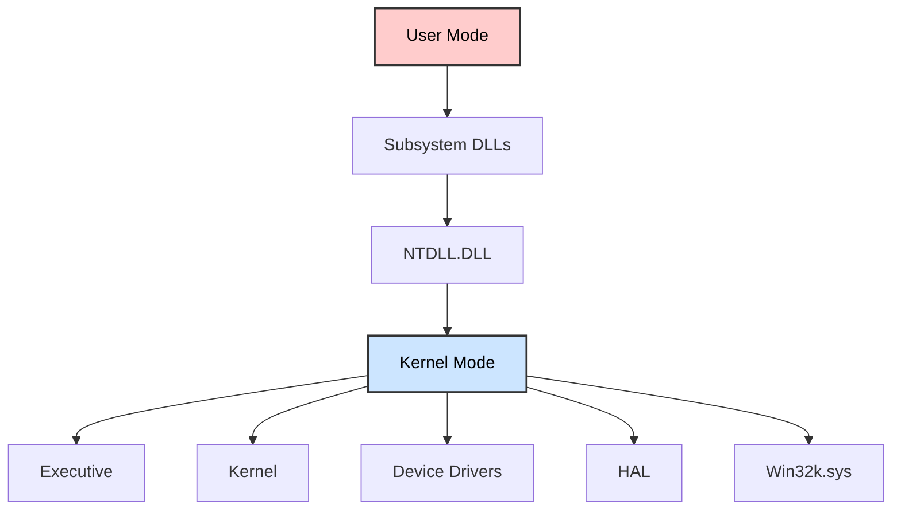
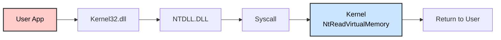

# 🦠 INTRODUCTION TO MALWARE ANALYSIS

## SOC Analyst Cheatsheet - Module 10/15

---

## 0. Overview

### Module Description

This module offers hands-on exploration of malware analysis with focus on Windows-based threats. It covers Static Analysis, Malware Unpacking, Dynamic Analysis, Reverse Engineering, and Debugging using x64dbg.

> 🔴 **Difficulty:** Hard | **Tier:** 2 | **Estimated Time:** 3 days | **Cubes:** 20

### Prerequisites

- Incident Handling Process
- Intro to Assembly Language
- Windows Event Logs & Finding Evil

### What We'll Cover

| Topic | Description |
|-------|-------------|
| **Static Analysis** | Linux & Windows tools for analyzing malware without execution |
| **Malware Unpacking** | Unraveling packed malware to reveal true content |
| **Dynamic Analysis** | Execute malware in controlled environment to observe behavior |
| **Code Analysis** | Reverse engineering to understand malware functionality |
| **Debugging** | Using x64dbg to trace execution and set breakpoints |

### Real-World Malware Examples

- WannaCry
- DoomJuice
- Brbbot
- Dharma
- Meterpreter

---

## Table of Contents

1. [Introduction To Malware & Malware Analysis](#1-introduction-to-malware--malware-analysis)
2. [Prerequisites - Windows Internals](#2-prerequisites---windows-internals)
3. [Static Analysis](#3-static-analysis)
4. [Dynamic Analysis](#4-dynamic-analysis)
5. [Code Analysis](#5-code-analysis)
6. [Creating Detection Rules](#6-creating-detection-rules)
7. [Skills Assessment](#7-skills-assessment)
8. [Interview Questions](#interview-questions)
9. [Additional Resources](#additional-resources)

---

## 1. Introduction To Malware & Malware Analysis

### What is Malware?

> 📌 **Malware** - Short for malicious software, encompasses various types of software designed to infiltrate, exploit, or damage computer systems, networks, and data.

**Common Malware Objectives:**
- Disrupting host system operations
- Stealing critical information (personal and financial data)
- Gaining unauthorized access to systems
- Conducting espionage activities
- Sending spam messages
- Implementing DDoS attacks
- Ransomware attacks

---

### Malware Types

| Type | Description |
|------|-------------|
| **Virus** | Infiltrates and multiplies within host files, activates when infected files are triggered |
| **Worm** | Autonomous malware that multiplies across networks without human intervention |
| **Trojan** | Disguised as legitimate software, creates backdoors for remote control |
| **Ransomware** | Encrypts files and demands ransom for decryption key |
| **Spyware** | Stealthily gathers sensitive data and user activities |
| **Adware** | Displays unwanted advertisements, may track user behavior |
| **Botnet** | Network of compromised devices controlled by C2 server |
| **Rootkit** | Gains unauthorized access to OS root, alters system functions to hide |
| **Backdoor/RAT** | Offers remote access and control over compromised systems |
| **Dropper** | Transports and installs additional malicious payloads |
| **Info Stealer** | Extracts sensitive data like credentials, personal info |

> 🔴 **Note:** Cybercriminals continuously refine their techniques to avoid detection.

---

### Malware Sample Resources

| Resource | Description |
|----------|-------------|
| **VirusShare** | 30+ million malware samples (free) |
| **Hybrid Analysis** | File analysis with public feed |
| **TheZoo** | Live malware for analysis/education |
| **Malware-Traffic-Analysis.net** | PCAP files for malware traffic analysis |
| **VirusTotal** | 70+ antivirus scanners, URL/domain blocklisting |
| **ANY.RUN** | Interactive online sandbox |
| **Contagio Malware Dump** | Malware samples, threat reports |
| **VX Underground** | Largest malware source code collection |

---

### Evidence Acquisition Tools

#### Disk Imaging Solutions

| Tool | Description |
|------|-------------|
| **FTK Imager** | Creates forensic disk images, preserves evidence integrity |
| **OSFClone** | Open-source forensic disk cloning |
| **DD** | Command-line utility on Unix systems |
| **DCFLDD** | Enhanced DD with forensic features (hashing) |

#### Memory Acquisition Solutions

| Tool | Description |
|------|-------------|
| **DumpIt** | Generates physical memory dump (Windows/Linux) |
| **MemDump** | Command-line RAM capture utility |
| **Belkasoft RAM Capturer** | Captures RAM even with anti-debugging protection |
| **Magnet RAM Capture** | Simple memory capture tool |
| **LiME** | Linux Kernel Module for memory acquisition |

#### Other Tools

| Tool | Description |
|------|-------------|
| **KAPE** | Triage program for quick artifact collection |
| **Velociraptor** | Host-based IR and digital forensics tool |

---

### Malware Analysis Definition

> 📌 **Malware Analysis** - The process of comprehending the behavior and inner workings of malware to understand the threat and devise effective countermeasures.

**Key Questions Answered:**
- What type of malware is it?
- What is its intended behavior on endpoints?
- What artifacts does it generate?
- Does it connect to C2 servers?
- What damage can it inflict?
- Can we attribute it to threat groups?
- How do we detect it across the network?

---

### Malware Analysis Purposes

| Purpose | Description |
|---------|-------------|
| **Detection & Classification** | Identify and categorize threats based on characteristics |
| **Reverse Engineering** | Discern underlying operations and techniques |
| **Behavioral Analysis** | Study file system changes, network traffic, registry modifications |
| **Threat Intelligence** | Amass intelligence about attackers, TTPs, and origins |

---

### Analysis Techniques

| Technique | Description |
|-----------|-------------|
| **Static Analysis** | Examine code without execution, study file structure, strings, metadata |
| **Dynamic Analysis** | Execute in controlled sandbox, observe runtime behavior |
| **Code Analysis** | Disassemble/decompile to understand logic, functions, algorithms |
| **Memory Analysis** | Identify injected code, hooks, runtime manipulations |
| **Malware Unpacking** | Extract hidden code from packed malware |

> 📌 **Holistic Approach:** Use multiple techniques for comprehensive understanding of malware.

---

## 2. Prerequisites - Windows Internals

> 📌 **Windows Internals** - Understanding Windows OS architecture is essential for effective malware analysis.

### User Mode vs Kernel Mode

Windows OS operates in two main modes:

| Mode | Description |
|------|-------------|
| **User Mode** | Most applications run here with limited access to system resources. Must use APIs to interact with OS. Malware can still manipulate files, registry, network connections. |
| **Kernel Mode** | Highly privileged mode where Windows kernel runs. Has unrestricted access to hardware and critical functions. Device drivers run here. Malware in kernel mode can hide presence and intercept system calls. |

---

### Windows Architecture


*Diagram of Windows architecture showing the flow from user mode to kernel mode. User mode includes system support processes, service processes, user applications, and environment subsystems, all connecting to subsystem DLLs and NTDLL.DLL. Kernel mode includes the executive, kernel, device drivers, hardware abstraction layer (HAL), and windowing and graphics.*



#### User-Mode Components

| Component | Description |
|-----------|-------------|
| **System Support Processes** | Logon processes (winlogon.exe), Session Manager (smss.exe), Service Control Manager (services.exe) |
| **Service Processes** | Windows services like Windows Update, Task Scheduler, Print Spooler |
| **User Applications** | 32-bit and 64-bit applications interacting via Windows APIs |
| **Environment Subsystems** | Win32 Subsystem, POSIX, OS/2 |
| **Subsystem DLLs** | kernel32.dll, user32.dll, wininet.dll, advapi32.dll |

#### Kernel-Mode Components

| Component | Description |
|-----------|-------------|
| **Executive** | I/O Manager, Object Manager, Security Reference Monitor, Process Manager |
| **Kernel** | Thread scheduling, interrupt dispatching, multiprocessor synchronization |
| **Device Drivers** | Software components for hardware interaction |
| **HAL** | Abstraction layer between hardware and OS |
| **Win32k.sys** | GUI management and rendering |

---

### Windows API Call Flow

> 📌 **API Call Flow** - When user application calls Windows API, it goes through multiple layers:


*Diagram showing the flow from user mode to kernel mode. A user application calls ReadProcessMemory via Kernel32, which then calls NtReadVirtualMemory in NTDLL. This transitions to a system call through the syscall table, executing Nt!NtReadVirtualMemory in kernel mode, and returns to user mode.*



#### Example: ReadProcessMemory

```c
BOOL ReadProcessMemory(
  [in]  HANDLE  hProcess,
  [in]  LPCVOID lpBaseAddress,
  [out] LPVOID  lpBuffer,
  [in]  SIZE_T  nSize,
  [out] SIZE_T  *lpNumberOfBytesRead
);
```


*C++ code snippet showing the ReadProcessMemory function with parameters.*

ReadProcessMemory is a Windows API function that belongs to the kernel32.dll library.**
1. Application calls `ReadProcessMemory` via kernel32.dll
2. kernel32.dll calls `NtReadVirtualMemory` in NTDLL.DLL
3. NTDLL.DLL triggers syscall instruction
4. Kernel executes `Nt!NtReadVirtualMemory`
5. Results returned to user mode

> 🔴 **Key Point:** The NTDLL.DLL module utilizes system calls (syscalls). The syscall instruction triggers the system call using parameters set in previous instructions.


*The image shows assembly code for ReadProcessMemory calling NtReadVirtualMemory. It includes instructions for stack manipulation and a system call.*


*Assembly code snippet for NtReadVirtualMemory showing register manipulation, syscall number 3F, a conditional jump, and a syscall instruction.*

> 🔴 **Key Point:** Syscall table (SSDT) contains pointers to kernel functions. Each syscall has a specific number.

---

### RDP Connection Command

> 📌 To access the target system for hands-on practice:

```bash
xfreerdp /u:htb-student /p:'HTB_@cademy_stdnt!' /v:[Target IP] /dynamic-resolution
```

---

### Portable Executable (PE)

> 📌 **PE Format** - Windows uses PE format for executables, DLLs, kernel modules. Understanding PE is crucial for malware analysis.

#### PE Sections

| Section | Description |
|---------|-------------|
| **.text** | Executable code |
| **.data** | Initialized global/static variables |
| **.rdata** | Read-only data (constants, strings) |
| **.pdata** | Exception handling |
| **.bss** | Uninitialized global/static variables |
| **.rsrc** | Resources (images, icons, strings) |
| **.idata** | Imported functions |
| **.edata** | Exported functions |
| **.reloc** | Relocation information |

> 📌 **.text section** is often under scrutiny for injection attacks.


*The image shows a table of file sections and properties, including .text, .data, .rdata, and .pdata. Each section lists properties like MD5, entropy, raw and virtual addresses, sizes, and attributes such as writable and executable.*

---

### Processes

> 📌 **Process** - An instance of an executing program with memory, file handles, threads, and security context.


*Diagram showing a private address space, private handle table, access token, and threads.*

> 📌 **Process** - An instance of an executing program with memory, file handles, threads, and security context.

**Process Components:**
| Component | Description |
|-----------|-------------|
| **PID** | Unique Process Identifier |
| **Virtual Address Space** | Isolated memory for each process |
| **Executable Code** | Binary stored on disk |
| **Handle Table** | References to system objects |
| **Security Context** | Access Token with user privileges |
| **Threads** | Unit of execution within process |

---

### DLL - Import & Export Functions

#### Import Functions

> 📌 **Imports** - Functions that a binary dynamically links from external DLLs at runtime.

**Why Imports Matter in Malware Analysis:**
- Identify external libraries malware depends on
- Determine APIs malware interacts with (file system, processes, registry)
- Import function names can serve as IOCs

**Process Injection Example:**


*Flowchart of malware process injection using Kernel32.dll functions: OpenProcess, VirtualAllocEx, WriteProcessMemory, and CreateRemoteThread, targeting notepad.exe with PID 7204.*

In this diagram, the malware process (shell.exe) performs process injection to inject code into a target process (notepad.exe) using the following functions imported from the DLL kernel32.dll:

**Common Process Injection Imports:**
| Function | Purpose |
|----------|----------|
| **OpenProcess** | Open handle to target process |
| **VirtualAllocEx** | Allocate memory in target process |
| **WriteProcessMemory** | Write code to target process |
| **CreateRemoteThread** | Create thread in target process |

#### Export Functions

> 📌 **Exports** - Functions that a binary exposes for other modules or applications.

**Example - CFF Explorer:**


*Screenshot of CFF Explorer showing shell.exe's import directory with Kernel32.dll functions: OpenProcess, VirtualAllocEx, WriteProcessMemory, and CreateRemoteThread.*


*Screenshot of CFF Explorer showing Ultiman.exe's import directory with ADVAPI32.dll functions: GetTokenInformation, RegOpenKeyExW, RegCloseKey, RegSetValueExW, and RegQueryValueExW.*

**Analysis Value:**
- Understand what functions the malware provides to other modules
- Identify interaction patterns with external entities
- Detect capabilities and behavior

> 📌 **Key Insight:** By analyzing import/export functions, we can determine malware capabilities and create IOCs.

---

## 3. Static Analysis On Linux

> 📌 **Static Analysis** - Method to scrutinize malware without executing it. Involves investigating code, data, and structural components.

### What We Extract

| Information | Description |
|-------------|-------------|
| **File type** | Actual file format (not just extension) |
| **File hash** | MD5, SHA1, SHA256 for identification |
| **Strings** | Embedded text for clues |
| **Embedded elements** | Resources, payloads |
| **Packer information** | If malware is packed |
| **Imports** | DLL functions malware uses |
| **Exports** | Functions malware provides |
| **Assembly code** | Disassembled code |


*Flowchart of malware analysis steps: Input malware sample, File type, Fingerprinting, Packer Detection, String Extraction, PE Header Information, Classification, Detection Rule.*

---

### Connecting to Target

```bash
ssh htb-student@[Target IP]
```

---

### 1. Identifying The File Type

> 📌 File extensions can be manipulated. Need to identify actual file type.

**Using file command:**

```bash
file /home/htb-student/Samples/MalwareAnalysis/Ransomware.wannacry.exe
```

**Output:**
```
Ransomware.wannacry.exe: PE32 executable (GUI) Intel 80386, for MS Windows
```

**Using hexdump (manual check):**

```bash
hexdump -C /home/htb-student/Samples/MalwareAnalysis/Ransomware.wannacry.exe | more
```

> 🔴 **Magic Number:** ASCII string "MZ" (hex: 4D 5A) at start of file = executable. MZ = Mark Zbikowski, key MS-DOS architect.

---

### 2. Malware Fingerprinting

> 📌 Create unique identifier using cryptographic hashes.

**MD5 Hash:**

```bash
md5sum /home/htb-student/Samples/MalwareAnalysis/Ransomware.wannacry.exe
```

**Output:**
```
db349b97c37d22f5ea1d1841e3c89eb4
```

**SHA256 Hash:**

```bash
sha256sum /home/htb-student/Samples/MalwareAnalysis/Ransomware.wannacry.exe
```

**Output:**
```
24d004a104d4d54034dbcffc2a4b19a11f39008a575aa614ea04703480b1022c
```

---

### 3. File Hash Lookup

> 📌 Check hash against online malware scanners (VirusTotal).


*VirusTotal analysis showing 68 out of 71 security vendors flagging as malicious, with threat categories including trojan, ransomware, and worm.*

---

### 4. Import Hashing (IMPHASH)

> 📌 **IMPHASH** - Hash calculated from import functions. Two PE files with identical imports share IMPHASH.

**Python code:**

```python
import sys
import pefile

pe_file = sys.argv[1]
pe = pefile.PE(pe_file)
imphash = pe.get_imphash()

print(imphash)
```

**Calculate IMPHASH:**

```bash
python3 imphash_calc.py /home/htb-student/Samples/MalwareAnalysis/Ransomware.wannacry.exe
```

**Output:**
```
9ecee117164e0b870a53dd187cdd7174
```


*VirusTotal showing Imphash: 9ecee117164e0b870a53dd187cdd7174*

---

### 5. Fuzzy Hashing (SSDEEP)

> 📌 **SSDEEP** - Context-triggered piecewise hashing. Identifies similar files even with minor modifications.

**Calculate SSDEEP:**

```bash
ssdeep /home/htb-student/Samples/MalwareAnalysis/Ransomware.wannacry.exe
```

**Output:**
```
98304:wDqPoBhz1aRxcSUDk36SAEdhvxWa9P593R8yAVp2g3R:wDqPe1Cxcxk3ZAEUadzR8yc4gB
```


*VirusTotal showing SSDEEP hash*

**Compare similarity:**

```bash
ssdeep -pb *
```

**Output:**
```
potato.exe matches svchost.exe (99)
svchost.exe matches potato.exe (99)
```

> 🔴 -p = Pretty matching mode, -b = filenames only. 99% similarity = same malware family.

---

### 6. Section Hashing

> 📌 Hash individual PE sections to identify modifications in specific sections.

**Python code:**

```python
import sys
import pefile

pe_file = sys.argv[1]
pe = pefile.PE(pe_file)
for section in pe.sections:
    print(section.Name, "MD5 hash:", section.get_hash_md5())
    print(section.Name, "SHA256 hash:", section.get_hash_sha256())
```

**Calculate section hashes:**

```bash
python3 section_hashing.py /home/htb-student/Samples/MalwareAnalysis/Ransomware.wannacry.exe
```

**Output:**
```
b'.text\x00\x00\x00' MD5 hash: c7613102e2ecec5dcefc144f83189153
b'.text\x00\x00\x00' SHA256 hash: 7609ecc798a357dd1a2f0134f9a6ea06511a8885ec322c7acd0d84c569398678
b'.rdata\x00\x00' MD5 hash: d8037d744b539326c06e897625751cc9
b'.rdata\x00\x00' SHA256 hash: 532e9419f23eaf5eb0e8828b211a7164cbf80ad54461bc748c1ec2349552e6a2
b'.data\x00\x00\x00' MD5 hash: 22a8598dc29cad7078c291e94612ce26
b'.data\x00\x00\x00' SHA256 hash: 6f93fb1b241a990ecc281f9c782f0da471628f6068925aaf580c1b1de86bce8a
b'.rsrc\x00\x00\x00' MD5 hash: 12e1bd7375d82cca3a51ca48fe22d1a9
b'.rsrc\x00\x00\x00' SHA256 hash: 1efe677209c1284357ef0c7996a1318b7de3836dfb11f97d85335d6d3b8a8e42
```

---

### 7. String Analysis

> 📌 Extract ASCII & Unicode strings to find embedded clues.

**Basic strings:**

```bash
strings -n 15 /home/htb-student/Samples/MalwareAnalysis/dharma_sample.exe
```

**Output:**
```
!This program cannot be run in DOS mode.
WaitForSingleObject
InitializeCriticalSectionAndSpinCount
LeaveCriticalSection
EnterCriticalSection
C:\crysis\Release\PDB\payload.pdb
0123456789ABCDEF
```

> 🔴 -n 15 = print strings of at least 15 characters. PDB path reveals threat actor!


*String showing file path: C:\crysis\Release\PDB\payload.pdb - links to Dharma/Crysis ransomware family*

---

### 8. FLOSS - Obfuscated String Solver

> 📌 **FLOSS** - FireEye tool to extract obfuscated strings that standard strings command misses.

```bash
floss /home/htb-student/Samples/MalwareAnalysis/dharma_sample.exe
```

**Output (truncated):**
```
INFO: floss: extracting static strings...
INFO: floss.stackstrings: extracting stackstrings from 223 functions
FLARE FLOSS RESULTS (version v2.0.0-0-gdd9bea8)
+------------------------+------------------------------------------------------------------------------------+
| file path              | /home/htb-student/Samples/MalwareAnalysis/dharma_sample.exe                        |
| extracted strings      |                                                                                    |
|  static strings        | 720                                                                                |
|  stack strings         | 1                                                                                  |
|  tight strings         | 0                                                                                  |
|  decoded strings       | 7                                                                                  |
+------------------------+------------------------------------------------------------------------------------+
```

---

### 9. Unpacking UPX-packed Malware

> 📌 **Packing** - Compresses/obfuscates code to evade detection. UPX is common packer.

**Check if packed:**

```bash
strings /home/htb-student/Samples/MalwareAnalysis/packed/credential_stealer.exe
```

**Look for UPX strings:**
```
UPX0
UPX1
UPX2
UPX!
```

> 🔴 If you see UPX strings, the malware is packed.

**Unpack with UPX:**

```bash
upx -d -o unpacked_credential_stealer.exe credential_stealer.exe
```

**Output:**
```
File size         Ratio      Format      Name
--------------------   ------   -----------   -----------
  16896 <-      8704   51.52%    win64/pe     unpacked_credential_stealer.exe

Unpacked 1 file.
```

**Analyze unpacked:**

```bash
strings unpacked_credential_stealer.exe
```

Now you can see actual strings:
```
SeDebugPrivilege
lsass.exe
Searching lsass PID
Lsass PID is: %lu
lsassmem.dmp
LSASS Memory is dumped successfully
AdjustTokenPrivileges
OpenProcessToken
MiniDumpWriteDump
```

> 🔴 This reveals the malware dumps LSASS memory to steal credentials!

---

## 4. Dynamic Analysis

*Coming soon...*

---

## 5. Code Analysis

*Coming soon...*

---

## 6. Creating Detection Rules

*Coming soon...*

---

## 7. Skills Assessment

*Coming soon...*

---

## Interview Questions

*Coming soon...*

---

## Additional Resources

*Coming soon...*

---

*Module 10/15 - Introduction to Malware Analysis*
*For learning and SOC career preparation*
