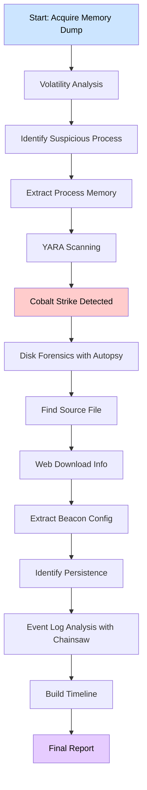

# 🔍 INTRODUCTION TO DIGITAL FORENSICS

## SOC Analyst Cheatsheet - Module 13/15

---

## 0. Overview

> 📌 **Digital Forensics** - Core forensic concepts and tools for investigating digital evidence in Windows environments.

### Module Description

Dive into Windows digital forensics with Hack The Box Academy's "Introduction to Digital Forensics" module. Gain mastery over core forensic concepts and tools such as FTK Imager, KAPE, Velociraptor, and Volatility.

### What We'll Cover

| Topic | Description |
|-------|-------------|
| **Foundational Forensics** | Core concepts, evidence acquisition processes |
| **Tool Mastery** | FTK Imager, KAPE, Velociraptor, Volatility, Autopsy |
| **Memory Forensics** | Volatile memory analysis, artifact extraction |
| **Disk Forensics** | Disk image analysis, file structure examination |
| **Rapid Triage** | Quick investigation techniques for time-sensitive incidents |
| **Timeline Analysis** | MFT, USN Journal, Windows event logs |
| **Key Artifacts** | MFT, USN Journal, Registry Hives, Prefetch, ShimCache, Amcache, BAM, SRUM |

### Prerequisites

- Incident Handling Process
- Windows Event Logs & Finding Evil
- Introduction to Malware Analysis
- YARA & Sigma for SOC Analysts

---

## Table of Contents

0. [Overview](#0-overview) - Module introduction and overview
1. [Introduction to Digital Forensics](#1-introduction-to-digital-forensics) - What is digital forensics, key concepts, forensic process
2. [Windows Forensics Overview](#2-windows-forensics-overview) - NTFS, Windows Event Logs, Execution Artifacts, Persistence
3. [Evidence Acquisition Techniques & Tools](#3-evidence-acquisition-techniques--tools) - FTK Imager, KAPE, Velociraptor, Memory Acquisition
4. [Memory Forensics](#4-memory-forensics) - Volatility, Memory analysis, Rootkit detection
5. [Disk Forensics](#5-disk-forensics) - Autopsy, Disk analysis, File recovery
6. [Rapid Triage Examination & Analysis Tools](#6-rapid-triage-examination--analysis-tools) - Eric Zimmerman tools, MFTECmd, EvtxECmd, RegRipper, PECmd
7. [Practical Digital Forensics Scenario](#-practical-digital-forensics-scenario)
   - [7.0 Scenario Overview](#70-scenario-overview) - Scenario description and evidence locations
   - [7.1 Memory Analysis with Volatility v3](#1-memory-analysis-with-volatility-v3) - Process analysis, injected code, DLLs, network artifacts
   - [7.2 Disk Image & Rapid Triage Analysis](#2-disk-image--rapid-triage-analysis) - Autopsy, Chrome cache, Cobalt Strike, Autoruns, MFT, SRUM, Event logs
   - [7.3 Timeline Construction](#3-timeline-construction) - Building execution timeline
   - [7.4 Summary](#4-summary) - Key findings and conclusions
8. [Interview Questions](#8-interview-questions) - Common digital forensics interview questions
9. [Additional Resources](#9-additional-resources) - Tools, references, further learning

---

## 1. Introduction to Digital Forensics

> 📌 **Digital Forensics** - The collection, preservation, analysis, and presentation of digital evidence to investigate cyber incidents.

### Overview

It is essential to clarify that this module does not claim to be an all-encompassing or exhaustive program on Digital Forensics. This module provides a robust foundation for SOC analysts, enabling them to confidently tackle key Digital Forensics tasks. The primary focus of the module will be the analysis of malicious activity within Windows-based environments.

---

### What is Digital Forensics?

**Digital forensics**, often referred to as computer forensics or cyber forensics, is a specialized branch of cybersecurity that involves the collection, preservation, analysis, and presentation of digital evidence to investigate cyber incidents, criminal activities, and security breaches.

It applies forensic techniques to digital artifacts, including computers, servers, mobile devices, networks, and storage media, to uncover the truth behind cyber-related events.

**Goals of Digital Forensics:**
- Reconstruct timelines
- Identify malicious activities
- Assess the impact of incidents
- Provide evidence for legal or regulatory proceedings

> 📌 Digital forensics is an integral part of the incident response process, contributing crucial insights and support at various stages.

---

### Key Concepts

#### Electronic Evidence

Digital forensics deals with electronic evidence, which can include:
- Files
- Emails
- Logs
- Databases
- Network traffic
- And more

This evidence is collected from computers, mobile devices, servers, cloud services, and other digital sources.

#### Preservation of Evidence

> 🔴 **Critical:** Ensuring the integrity and authenticity of digital evidence is crucial.

Proper procedures are followed to:
- Preserve evidence
- Establish a chain of custody
- Prevent any unintentional alterations

#### Forensic Process

The digital forensics process typically involves several stages:

| Stage | Description |
|-------|-------------|
| **Identification** | Determining potential sources of evidence |
| **Collection** | Gathering data using forensically sound methods |
| **Examination** | Analyzing the collected data for relevant information |
| **Analysis** | Interpreting the data to draw conclusions about the incident |
| **Presentation** | Presenting findings in a clear and comprehensible manner |

#### Types of Cases

Digital forensics is applied in a variety of cases:
- Cybercrime investigations (hacking, fraud, data theft)
- Intellectual property theft
- Employee misconduct investigations
- Data breaches and incidents affecting organizations
- Litigation support in legal proceedings

---

### Basic Steps for Performing a Forensic Investigation

1. **Create a Forensic Image** - Make an exact copy of the evidence
2. **Document the System's State** - Record initial observations
3. **Identify and Preserve Evidence** - Locate and secure relevant data
4. **Analyze the Evidence** - Examine the collected data
5. **Timeline Analysis** - Establish chronological sequence of events
6. **Identify Indicators of Compromise (IOCs)** - Find malicious artifacts
7. **Report and Documentation** - Document findings

---

### Digital Forensics for SOC Analysts

When we talk about the Security Operations Center (SOC), we're discussing the frontline defense against cyber threats. But what happens when a breach occurs, or when an anomaly is detected? That's where digital forensics comes into play.

#### Key Benefits for SOC Analysts

| Benefit | Description |
|---------|-------------|
| **Post-Mortem Analysis** | Detailed analysis of security incidents by tracing attacker steps |
| **Rapid Identification** | Swift identification of compromise moment, affected systems, malware type |
| **Legal Support** | Provides legally admissible evidence for court proceedings |
| **Proactive Hunting** | Actively search environments for signs of compromise |
| **Enhanced IR** | Better tailored incident response strategies |
| **Continuous Learning** | Stay ahead of new attack techniques |

> 📌 **Key Takeaway:** Digital forensics isn't just a reactive measure; it's a proactive tool that amplifies the capabilities of SOC analysts, ensuring that organizations remain resilient in the face of ever-evolving cyber threats.

---

## 2. Windows Forensics Overview

> 📌 **Windows Forensics** - Key artifacts and forensic procedures in Windows environments.

### NTFS (New Technology File System)

NTFS (New Technology File System) is a proprietary file system developed by Microsoft as part of its Windows NT operating system family. It was introduced with the release of Windows NT 3.1 in 1993 and has since become the default and most widely used file system in modern Windows operating systems.

NTFS was designed to address several limitations of its predecessor, the FAT (File Allocation Table) file system. It introduced numerous features and enhancements that improved reliability, performance, security, and storage capabilities.

---

### Key Forensic Artifacts in NTFS

| Artifact | Description |
|----------|-------------|
| **File Metadata** | Creation time, modification time, access time, attribute information |
| **MFT Entries** | Master File Table stores metadata for all files and directories |
| **File Slack** | Unused portion of a cluster that may contain data from previous files |
| **File Signatures** | File headers useful for identifying file types even with changed extensions |
| **USN Journal** | Update Sequence Number log recording changes to files/directories |
| **LNK Files** | Windows shortcuts containing target file info, timestamps, metadata |
| **Prefetch Files** | Application startup metadata showing execution history |
| **Registry Hives** | Configuration and system information (not directly file system) |
| **Shellbags** | Registry entries storing folder view settings |
| **Thumbnail Cache** | Miniature previews of images/documents |
| **Recycle Bin** | Deleted files that can be recovered |
| **Alternate Data Streams (ADS)** | Additional data streams associated with files |
| **Volume Shadow Copies** | Snapshots of file system at different points in time |
| **Security Descriptors/ACLs** | Access control lists determining permissions |

---

### Windows Event Logs

Windows Event Logs are an intrinsic part of the Windows Operating System, storing logs from different components including the system itself, applications, ETW providers, services, and others.

> 📌 Windows event logging offers comprehensive logging capabilities for application errors, security events, and diagnostic information.

Adversarial tactics from initial compromise using malware or other exploits, to credential accessing, privilege elevation and lateral movement using Windows operating system's internal tools are often captured via Windows event logs.

**Default Log Path:** `C:\Windows\System32\winevt\logs`

> 📌 The analysis of Windows Event Logs has been addressed in the modules titled "Windows Event Logs & Finding Evil" and "YARA & Sigma for SOC Analysts".

---

### Execution Artifacts

Windows execution artifacts refer to traces and evidence left behind when programs and processes are executed. These artifacts provide valuable insights into application execution, crucial for digital forensics investigations.

#### Types of Execution Artifacts

| Artifact | Location | Data Stored |
|----------|----------|-------------|
| **Prefetch Files** | `C:\Windows\Prefetch` | File paths, execution counts, timestamps |
| **Shimcache** | `HKLM\SYSTEM\CurrentControlSet\Control\Session Manager\AppCompatCache` | Program execution details, file paths, timestamps |
| **Amcache** | `C:\Windows\AppCompat\Programs\Amcache.hve` | Application details, file paths, sizes, digital signatures |
| **UserAssist** | `HKCU\Software\Microsoft\Windows\CurrentVersion\Explorer\UserAssist` | Executed program details, execution counts |
| **RunMRU Lists** | `HKCU\Software\Microsoft\Windows\CurrentVersion\Explorer\RunMRU` | Recently executed programs and command lines |
| **Jump Lists** | `%AppData%\Microsoft\Windows\Recent` | Recently accessed files, folders, tasks |
| **Shortcut (LNK) Files** | Various (Desktop, Start Menu) | Target executable, file paths, timestamps |
| **Recent Items** | `%AppData%\Microsoft\Windows\Recent` | Recently accessed files |
| **Windows Event Logs** | `C:\Windows\System32\winevt\Logs` | Process creation, termination, events |

---

### Windows Persistence Artifacts

Windows persistence refers to techniques used by attackers to ensure unauthorized presence on a compromised system.

#### Registry Autorun Keys

| Registry Path | Description |
|---------------|-------------|
| `HKCU\Software\Microsoft\Windows\CurrentVersion\Run` | User-level auto-start programs |
| `HKCU\Software\Microsoft\Windows\CurrentVersion\RunOnce` | Run once then delete |
| `HKLM\SOFTWARE\Microsoft\Windows\CurrentVersion\Run` | System-level auto-start programs |
| `HKLM\SOFTWARE\Microsoft\Windows\CurrentVersion\RunOnce` | System-level run once |
| `HKLM\SOFTWARE\Microsoft\Windows NT\CurrentVersion\Winlogon` | WinLogon process keys |
| `HKLM\SOFTWARE\Microsoft\Windows NT\CurrentVersion\Winlogon\Shell` | Shell configuration |
| `HKCU\Software\Microsoft\Windows\CurrentVersion\Explorer\User Shell Folders` | User shell folders |
| `HKCU\Software\Microsoft\Windows\CurrentVersion\Explorer\Shell Folders` | Shell folder paths |

#### Scheduled Tasks (Schtasks)

- **Location:** `C:\Windows\System32\Tasks`
- **Format:** XML files containing task creator, timing/triggers, command paths

#### Services

- **Registry Location:** `HKLM\System\CurrentControlSet\Services`
- Malicious actors often tamper with or create rogue services for persistence

---

### Web Browser Forensics

Web browser forensics analyzes remnants left by web browsers to understand user actions and potentially harmful behaviors.

#### Key Browser Artifacts

| Artifact | Description |
|----------|-------------|
| **Browsing History** | Records of websites visited (URLs, titles, timestamps) |
| **Cookies** | Session details, preferences, authentication tokens |
| **Cache** | Cached copies of web pages/images |
| **Bookmarks/Favorites** | Saved links to frequently visited sites |
| **Download History** | Downloaded files with source URLs |
| **Autofill Data** | Auto-entered form data (names, addresses, passwords) |
| **Search History** | Search engine queries |
| **Typed URLs** | URLs entered directly in address bar |
| **Passwords** | Saved or autofilled passwords |
| **Extensions/Add-ons** | Browser extensions and configurations |

---

### SRUM (System Resource Usage Monitor)

> 📌 SRUM is a feature introduced in Windows 8+ that tracks resource utilization and application usage patterns.

- **Data Location:** `C:\Windows\System32\sru\sru.db` (SQLite format)
- **Purpose:** Records application execution, resource consumption over time intervals

#### Key Facets of SRUM Forensics

| Facet | Description |
|-------|-------------|
| **Application Profiling** | Executable names, file paths, timestamps |
| **Resource Consumption** | CPU time, network usage, memory consumption |
| **Timeline Reconstruction** | Chronological application/process execution |
| **User Context** | User identifiers for activity attribution |
| **Malware Detection** | Identify unusual/unauthorized applications |
| **Incident Response** | Rapid insights into recent activities |

---

## 3. Evidence Acquisition Techniques & Tools

> 📌 **Evidence Acquisition** - Critical phase involving collection of digital artifacts from various sources.

### Overview

Evidence acquisition is a critical phase in digital forensics, involving the collection of digital artifacts and data from various sources to preserve potential evidence for analysis. This process requires specialized tools and techniques to ensure integrity, authenticity, and admissibility.

**Three Main Categories:**
1. Forensic Imaging
2. Extracting Host-based Evidence & Rapid Triage
3. Extracting Network Evidence

---

### Forensic Imaging

Forensic imaging is a fundamental process that involves creating an exact, bit-by-bit copy of digital storage media. This process is crucial for preserving the original state of data and ensuring admissibility in legal proceedings.

#### Forensic Imaging Tools

| Tool | Description |
|------|-------------|
| **FTK Imager** | Developed by AccessData/Exterro. Creates perfect copies of computer disks, view contents without altering data |
| **AFF4 Imager** | Free, open-source. Compatible with numerous file systems. Can extract files by creation time |
| **DD** | Command-line utility on Unix-based systems |
| **DCFLDD** | Enhanced version of DD with forensics features (hashing) |
| **Virtualization Tools** | Evidence from virtual environments via halting/snapshot |

---

### Example 1: Forensic Imaging with FTK Imager

Steps to create a disk image:

1. **Select File → Create Disk Image**
2. **Choose Media Source:** Physical Drive or Logical Drive


3. **Select Drive** (e.g., PHYSICALDRIVE0)


4. **Specify Destination** for the image


5. **Choose Image Type:** Raw, SMART, E01, or AFF


6. **Input Evidence Details:** Case Number, Evidence Number, Unique Description


7. **Set Destination Folder and Filename** (adjust fragmentation/compression if needed)


8. **Click Start** to begin imaging


9. **Verify Image** (if selected) - compares MD5/SHA1 hashes


> 📌 FTK Imager provides verification that calculates and compares MD5/SHA1 hashes to ensure image integrity.

---

### Example 2: Mounting a Disk Image with Arsenal Image Mounter

1. Launch Arsenal Image Mounter with administrative rights
2. Click **Mount disk image** button
3. Navigate to and select the `.VMDK` file
4. Choose to mount as **read-only** or **read-write**


> 🔴 **Critical:** Always mount disk images as **read-only** to preserve original evidence integrity.

Once mounted, the image appears as a drive (e.g., `D:\`) and can be browsed like a physical drive.


---

### Extracting Host-based Evidence & Rapid Triage

#### Volatile vs Non-Volatile Data

**Volatile Data** - Information that disappears after logoffs or power shutdowns:
- Active system memory (RAM)
- Captured using tools like FTK Imager, WinPmem, DumpIt

**Non-Volatile Data** - Remains on hard drive through shutdowns:
- Registry
- Windows Event Logs
- Prefetch, Amcache
- Application-specific artifacts

#### Memory Acquisition Tools

| Tool | Description |
|------|-------------|
| **WinPmem** | Default open-source memory acquisition for Windows |
| **DumpIt** | Simplistic utility for Windows/Linux memory dumps |
| **MemDump** | Free command-line RAM capture utility |
| **Belkasoft RAM Capturer** | Captures RAM even with anti-debugging protection |
| **Magnet RAM Capture** | Free, simple way to capture volatile memory |
| **LiME (Linux Memory Extractor)** | Loadable Kernel Module for Linux memory acquisition |

##### Example: Acquiring Memory with WinPmem

```cmd
C:\Users\X\Downloads> winpmem_mini_x64_rc2.exe memdump.raw
```


##### Example: Acquiring VM Memory

1. Open the running VM's options
2. **Suspend** the running VM
3. Locate the `.vmem` file inside the VM's directory


---

### Rapid Triage with KAPE

> 📌 **KAPE (Kroll Artifact Parser and Extractor)** - One of the best rapid artifact parsing and extraction solutions.

KAPE operates based on **Targets** and **Modules**:
- **Targets:** Specific artifacts to extract from an image/system (duplicated to output directory)
- **Modules:** Programs run on collected data for processing


#### KAPE Modes

| Mode | File | Description |
|------|------|-------------|
| **GUI** | `gkape.exe` | Visual interface |
| **CLI** | `kape.exe` | Command-line interface |


#### KAPE GUI Interface


#### Target Configurations

| Target | Description |
|--------|-------------|
| **!SANS_Triage** | Compound collection for DFIR investigation |
| **RegistryHivesSystem** | System-related registry hives |
| **KapeTriage** | Multiple targets combined for faster collection |


Example compound target includes: Antivirus, EventLogs, EvidenceOfExecution, Amcache


#### KAPE Command Example

```powershell
KAPE.exe --tsource D: --tdest C:\investigation\image --target !SANS_Triage
```

**KAPE Output:**

```
KAPE version 1.3.0.2, Author: Eric Zimmerman, Contact: https://www.kroll.com/kape (kape@kroll.com)

KAPE directory: C:\htb\dfir_module\data\kape\KAPE
Command line:   --tsource D: --tdest C:\htb\dfir_module\data\investigation\image --target !SANS_Triage --gui

System info: Machine name: REDACTED, 64-bit: True, User: REDACTED OS: Windows10 (10.0.22621)

Using Target operations
Found 18 targets. Expanding targets to file list...
Target ApplicationEvents with Id 2da16dbf-ea47-448e-a00f-fc442c3109ba already processed. Skipping!
...
Found 639 files in 4.032 seconds. Beginning copy...
  Deferring D:\Windows\System32\LogFiles\WMI\RtBackup\EtwRTDefenderApiLogger.etl due to UnauthorizedAccessException...
  Deferring D:\$MFT due to UnauthorizedAccessException...
  ...
Deferred file count: 17. Copying locked files...
  Copied deferred file D:\Windows\System32\LogFiles\WMI\RtBackup\EtwRTDefenderApiLogger.etl to C:\htb\dfir_module\data\investigation\image\D\Windows\System32\LogFiles\WMI\RtBackup\EtwRTDefenderApiLogger.etl. Hashing source file...
  Copied deferred file D:\$MFT to C:\htb\dfir_module\data\investigation\image\D\$MFT. Hashing source file...
  ...
```

**Output:**
- Found 639 files copied in ~4 seconds
- Collects: $MFT, $LogFile, $UsnJrnl, $Secure, $Boot
- Windows event logs in System32 subfolders
- Users and Windows directories


#### KAPE Output


---

### Velociraptor for Remote Collection

**Velociraptor** - Potent tool for gathering host-based information using VQL queries.

#### Using Velociraptor for KAPE Artifacts

1. **Initiate a new Hunt**


2. **Select Windows.KapeFiles.Targets** artifact


3. **Configure** collection (e.g., _SANS_Triage)


4. **Launch** the hunt


5. **Download** results


#### Velociraptor Output


#### Remote Memory Dump with Velociraptor

1. Start new Hunt
2. Select **Windows.Memory.Acquisition** artifact


3. Download resulting archive
4. Extract `PhysicalMemory.raw` containing the memory dump


---

### Extracting Network Evidence

**Network Evidence Categories:**

| Category | Tools/Description |
|----------|-------------------|
| **Traffic Capture** | Wireshark, tcpdump - snapshot of network conversations |
| **IDS/IPS Data** | Detection and blocking of malicious activities |
| **Traffic Flow** | NetFlow, sFlow - high-level overview of traffic patterns |
| **Firewall Logs** | Application identification, user detection, threat blocking |

> 📌 Network evidence analysis covered in: Intro to Network Traffic Analysis, Intermediate Network Traffic Analysis, Working with IDS/IPS, Detecting Windows Attacks with Splunk.

---

## 4. Memory Forensics

> 📌 **Memory Forensics** - Analysis of volatile RAM data to uncover malware, processes, and indicators of compromise.

### Memory Forensics Definition & Process

Memory forensics (also known as volatile memory analysis) is a specialized branch of digital forensics that focuses on examining and analyzing the volatile memory (RAM) of a computer or digital device.

#### Types of Valuable Data in RAM

| Data Type | Description |
|-----------|-------------|
| **Network connections** | Active and recent network connections |
| **File handles** | Open files on the system |
| **Open registry keys** | Registry keys in use |
| **Running processes** | Active processes on the system |
| **Loaded modules** | Loaded DLLs and modules |
| **Loaded drivers** | Device drivers in memory |
| **Command history** | Console session history |
| **Kernel data structures** | Kernel-level information |
| **User credentials** | Authentication data in memory |
| **Malware artifacts** | Malicious code traces |
| **System configuration** | Current system settings |
| **Process memory regions** | Memory regions for each process |

> 📌 As discussed in previous sections, when malware operates, it leaves traces in system memory. By analyzing this memory, investigators can uncover malicious processes and reconstruct malware actions.

---

### Six-Step Memory Forensics Methodology

1. **Process Identification and Verification**
   - Enumerate all running processes
   - Determine origin within OS
   - Cross-reference with known legitimate processes
   - Highlight discrepancies or suspicious naming

2. **Deep Dive into Process Components**
   - Examine DLLs linked to suspicious processes
   - Check for unauthorized/malicious DLLs
   - Investigate signs of DLL injection/hijacking

3. **Network Activity Analysis**
   - Review active and passive network connections
   - Identify external IPs and domains
   - Determine nature of communication
   - Validate process legitimacy

4. **Code Injection Detection**
   - Detect anomalies like process hollowing
   - Identify unusual memory spaces

5. **Rootkit Discovery**
   - Scan for rootkit activity
   - Identify processes at high privileges

6. **Extraction of Suspicious Elements**
   - Dump suspicious components from memory
   - Store securely for further analysis

---

### The Volatility Framework

**Volatility** is the preferred open-source memory forensics framework. It supports Windows, macOS, and Linux.

#### Volatility Versions

| Version | Documentation |
|---------|---------------|
| **Volatility v2** | https://github.com/volatilityfoundation/volatility/wiki/Command-Reference |
| **Volatility v3** | https://volatility3.readthedocs.io/en/latest/index.html |

> 📌 Cheatsheet: https://blog.onfvp.com/post/volatility-cheatsheet/

#### Commonly Used Volatility Plugins

| Plugin | Description |
|--------|-------------|
| `pslist` | Lists running processes |
| `cmdline` | Displays process command-line arguments |
| `netscan` | Scans for network connections and open ports |
| `malfind` | Scans for potentially malicious injected code |
| `handles` | Scans for open handles |
| `svcscan` | Lists Windows services |
| `dlllist` | Lists loaded DLLs in a process |
| `hivelist` | Lists registry hives in memory |

---

### Volatility v2 Fundamentals

#### Identifying the Profile

```bash
manojxshrestha@htb[/htb]$ vol.py -f /home/htb-student/MemoryDumps/Win7-2515534d.vmem imageinfo
```

**Output:**
```
INFO    : volatility.debug    : Determining profile based on KDBG search...
          Suggested Profile(s) : Win7SP1x64, Win7SP0x64, Win2008R2SP0x64, Win2008R2SP1x64_24000, Win2008R2SP1x64_23418, Win2008R2SP1x64, Win7SP1x64_24000, Win7SP1x64_23418
               AS Layer1 : WindowsAMD64PagedMemory (Kernel AS)
               AS Layer2 : FileAddressSpace (/home/htb-student/MemoryDumps/Win7-2515534d.vmem)
                    PAE type : No PAE
                         DTB : 0x187000L
                        KDBG : 0xf80002be9120L
        Number of Processors : 1
   Image Type (Service Pack) : 1
            KPCR for CPU 0 : 0xfffff80002beb000L
         KUSER_SHARED_DATA : 0xfffff78000000000L
      Image date and time : 2023-06-22 12:34:03 UTC+0000
```

#### Identifying Running Processes

```bash
manojxshrestha@htb[/htb]$ vol.py -f /home/htb-student/MemoryDumps/Win7-2515534d.vmem --profile=Win7SP1x64 pslist
```

**Sample Output:**
```
Offset(V)          Name                    PID   PPID   Thds     Hnds   Sess  Wow64 Start                          Exit
------------------ -------------------- ------ ------ ------ -------- ------ ------ ------------------------------ ------------------------------
0xfffffa8000ca8860 System                    4      0     97      446 ------      0 2023-06-22 12:04:39 UTC+0000
0xfffffa8001a64920 smss.exe                264      4      2       29 ------      0 2023-06-22 12:04:39 UTC+0000
...
0xfffffa8000ee96d0 Ransomware.wan         1512   2820     11      167      1      1 2023-06-22 12:23:41 UTC+0000
0xfffffa8002ca4240 Ransomware.wan         2320    508    117      497      0      1 2023-06-22 12:30:19 UTC+0000
0xfffffa8001d0f8b0 tasksche.exe           2972   1512      0 --------      1      0 2023-06-22 12:31:13 UTC+0000   2023-06-22 12:31:43 UTC+0000
0xfffffa8001d22b00 tasksche.exe           1792   1044      8       82      0      1 2023-06-22 12:31:13 UTC+0000
0xfffffa8002572060 @WanaDecryptor         1060   1792      2       71      0      1 2023-06-22 12:31:27 UTC+0000
...
```

> 📌 Notice the suspicious processes: `Ransomware.wan`, `tasksche.exe`, `@WanaDecryptor` - indicators of WannaCry ransomware!

---

### Identifying Network Artifacts

```bash
manojxshrestha@htb[/htb]$ vol.py -f /home/htb-student/MemoryDumps/Win7-2515534d.vmem --profile=Win7SP1x64 netscan
```

Shows active connections, listening ports, and established connections. Can find suspicious external IPs.

---

### Identifying Injected Code

```bash
manojxshrestha@htb[/htb]$ vol.py -f /home/htb-student/MemoryDumps/Win7-2515534d.vmem --profile=Win7SP1x64 malfind --pid=608
```

Used to identify and extract injected code and malicious payloads from process memory.

---

### Identifying Handles

```bash
manojxshrestha@htb[/htb]$ vol.py -f /home/htb-student/MemoryDumps/Win7-2515534d.vmem --profile=Win7SP1x64 handles -p 1512 --object-type=Key
```

Shows registry keys accessed by a process.

```bash
manojxshrestha@htb[/htb]$ vol.py -f /home/htb-student/MemoryDumps/Win7-2515534d.vmem --profile=Win7SP1x64 handles -p 1512 --object-type=File
```

Shows files accessed by a process.

```bash
manojxshrestha@htb[/htb]$ vol.py -f /home/htb-student/MemoryDumps/Win7-2515534d.vmem --profile=Win7SP1x64 handles -p 1512 --object-type=Process
```

Shows processes accessed by a process (e.g., tasksche.exe accessed by Ransomware.wan PID 1512).

---

### Identifying Windows Services

```bash
manojxshrestha@htb[/htb]$ vol.py -f /home/htb-student/MemoryDumps/Win7-2515534d.vmem --profile=Win7SP1x64 svcscan
```

Lists Windows services running in memory.

---

### Identifying Loaded DLLs

```bash
manojxshrestha@htb[/htb]$ vol.py -f /home/htb-student/MemoryDumps/Win7-2515534d.vmem --profile=Win7SP1x64 dlllist -p 1512
```

Lists DLLs loaded into a specific process (PID 1512 = Ransomware.wan).

---

### Identifying Hives

```bash
manojxshrestha@htb[/htb]$ vol.py -f /home/htb-student/MemoryDumps/Win7-2515534d.vmem --profile=Win7SP1x64 hivelist
```

Lists registry hives present in memory.

---

### Rootkit Analysis with Volatility v2

#### Understanding the EPROCESS Structure

EPROCESS is a kernel data structure representing a process. Each running process has a corresponding EPROCESS block in kernel memory.


*Windows kernel EPROCESS structure with ActiveProcessLinks field.*

#### FLINK and BLINK

A doubly-linked list contains:
- **flink**: Forward pointer to next EPROCESS structure
- **blink**: Backward pointer to previous EPROCESS structure


*Diagram showing EPROCESS structures linked via Flink and Blink pointers.*

#### Identifying Rootkit Signs

**Direct Kernel Object Manipulation (DKOM)** - Rootkits manipulate kernel data structures to hide from security tools.


*Diagram showing normal vs DKOM process linking.*

#### psscan Plugin

The `psscan` plugin scans memory pool tags to find processes that may have been hidden or unlinked by rootkits.

```bash
manojxshrestha@htb[/htb]$ vol.py -f /home/htb-student/MemoryDumps/rootkit.vmem psscan
```

#### pslist vs psscan

```bash
manojxshrestha@htb[/htb]$ vol.py -f /home/htb-student/MemoryDumps/rootkit.vmem pslist
```

The `pslist` plugin follows the EPROCESS linked list. In this output, we cannot see `test.exe` which was hidden by a rootkit.

However, `psscan` uses pool tag scanning and can find hidden processes:

```bash
manojxshrestha@htb[/htb]$ vol.py -f /home/htb-student/MemoryDumps/rootkit.vmem psscan
```

Output shows processes including hidden ones:
```
Offset(V)  Name                    PID   PPID   Thds     Hnds   Sess  Wow64 Start                          Exit
...
0x81f6a650 taskhsvc.exe           2340   2248      2       60      0      0 2023-06-24 07:29:22 UTC+0000
```

---

### Memory Analysis Using Strings

Analyzing strings in memory dumps is a valuable technique. Strings often contain human-readable information like file paths, IP addresses, and passwords.

#### Identifying IPv4 Addresses

```bash
manojxshrestha@htb[/htb]$ strings /home/htb-student/MemoryDumps/Win7-2515534d.vmem | grep -E "\b([0-9]{1,3}\.){3}[0-9]{1,3}\b"
```

**Sample Output:**
```
127.192.0.0/10
212.83.154.33
directory server at 10.10.10.1:52860
127.192.0.0/10
0.0.0.0
192.168.182.254
```

#### Identifying Email Addresses

```bash
manojxshrestha@htb[/htb]$ strings /home/htb-student/MemoryDumps/Win7-2515534d.vmem | grep -oE "\b[A-Za-z0-9._%+-]+@[A-Za-z0-9.-]+\.[A-Za-z]{2,4}\b"
```

**Sample Output:**
```
CPS-requests@verisign.com
silver-certs@saunalahti.fi
joe@freebsd.org
info@netlock.net
```

---

## 5. Disk Forensics

> 📌 **Disk Forensics** - Examination and analysis of disk images for evidence of malicious activity.

### Overview

Having covered memory forensics, let's shift our attention to disk forensics (disk image examination and analysis).

> 📌 Adhering to the sequence of data volatility is crucial. Examine each byte to detect traces left by cyber adversaries.

---

### Key Disk Forensic Features

| Feature | Description |
|---------|-------------|
| **File Structure Insight** | Navigate and view disk's file hierarchy |
| **Hex Viewer** | View files in hexadecimal for malware/exploit analysis |
| **Web Artifacts Analysis** | Extract web browsing data |
| **Email Carving** | Extract email data for internal threat investigation |
| **Image Viewer** | View stored images |
| **Metadata Analysis** | File timestamps, hashes, disk locations |

---

### Autopsy - Forensic Platform

**Autopsy** is a user-friendly forensic platform built atop the open-source Sleuth Kit toolset. Features include:
- Timeline assessments
- Keyword hunts
- Web and email artifact retrievals
- Hash-based malicious file detection

#### Autopsy Interface Overview


*Autopsy showing data sources and forensic artifacts organized on side panel.*

---

### Autopsy Capabilities

#### 1. Data Sources - Explore Files and Directories


*File hierarchy with folders: OrphanFiles, CarvedFiles, Recycle.Bin, $Unalloc, Users, Windows, etc.*

#### 2. Web Artifacts - Browser History, Cache, Downloads


*Web Cache artifacts showing URLs, domains, and creation dates from keyword search.*

#### 3. Attached Devices - USB Device History


*USB Device Attached artifacts showing device make, model, ID, and timestamps.*

#### 4. Recover Deleted Files


*Deleted files listing with file names, modified times, and locations.*

#### 5. Keyword Searches


*Keyword search for 'powershell.exe' with substring match.*


*Results showing files like Windows PowerShell.lnk, NTUSER.DAT.LOG1, $LogFile.*

#### 6. Keyword Lists - Targeted Searches


*Keyword lists for Phone Numbers, IP Addresses, Email Addresses, URLs, Credit Card Numbers.*


*Results showing files matching search criteria with IP address details.*

#### 7. Timeline Analysis - Map Out Events


*Timeline Editor showing events for Notepad++, WinRAR, Process Hacker, Chrome with visual counts.*

> 📌 We'll heavily utilize Autopsy in the "Practical Digital Forensics Scenario" section.

---

## 6. Rapid Triage Examination & Analysis Tools

> 📌 **Rapid Triage** - Essential tools for quick forensic examination and analysis.

### Eric Zimmerman's Tools

Eric Zimmerman has curated a suite of indispensable tools for forensic analysis. These tools are available at: https://ericzimmerman.github.io/#!index.md


*Eric Zimmerman's tools webpage with download options for .net 4 and .net 6.*

#### Downloading Tools

```powershell
PS C:\Users\johndoe\Desktop\Get-ZimmermanTools> .\Get-ZimmermanTools.ps1
```

**Output:**
```
* Getting available programs...
* Files to download: 27
* Downloaded Get-ZimmermanTools.zip (Size: 10,396)
* C:\htb\dfir_module\tools\net6 does not exist. Creating...
* Downloaded AmcacheParser.zip (Size: 23,60,293) (net 6)
* Downloaded AppCompatCacheParser.zip (Size: 22,62,497) (net 6)
* Downloaded bstrings.zip (Size: 14,73,298) (net 6)
* Downloaded EvtxECmd.zip (Size: 40,36,022) (net 6)
* Downloaded EZViewer.zip (Size: 8,25,80,608) (net 6)
* Downloaded JLECmd.zip (Size: 27,79,229) (net 6)
* Downloaded JumpListExplorer.zip (Size: 8,66,96,361) (net 6)
* Downloaded LECmd.zip (Size: 32,38,911) (net 6)
* Downloaded MFTECmd.zip (Size: 22,26,605) (net 6)
* Downloaded MFTExplorer.zip (Size: 8,27,54,162) (net 6)
* Downloaded PECmd.zip (Size: 20,13,672) (net 6)
* Downloaded RBCmd.zip (Size: 18,19,172) (net 6)
* Downloaded RecentFileCacheParser.zip (Size: 17,22,133) (net 6)
* Downloaded RECmd.zip (Size: 36,89,345) (net 6)
* Downloaded RegistryExplorer.zip (Size: 9,66,96,169) (net 6)
* Downloaded rla.zip (Size: 21,55,515) (net 6)
* Downloaded SDBExplorer.zip (Size: 8,24,54,727) (net 6)
* Downloaded SBECmd.zip (Size: 21,90,158) (net 6)
* Downloaded ShellBagsExplorer.zip (Size: 8,80,06,168) (net 6)
* Downloaded SQLECmd.zip (Size: 52,83,482) (net 6)
* Downloaded SrumECmd.zip (Size: 24,00,622) (net 6)
* Downloaded SumECmd.zip (Size: 20,23,009) (net 6)
* Downloaded TimelineExplorer.zip (Size: 8,77,50,507) (net 6)
* Downloaded VSCMount.zip (Size: 15,46,539) (net 6)
* Downloaded WxTCmd.zip (Size: 36,98,112) (net 6)
* Downloaded iisGeolocate.zip (Size: 3,66,76,319) (net 6)

* Saving downloaded version information to C:\Users\johndoe\Desktop\Get-ZimmermanTools\!!!RemoteFileDetails.csv
```

---

### MAC(b) Times in NTFS

MAC(b) times are timestamps pivotal for forensic chronology:

| Timestamp | Description |
|-----------|-------------|
| **Modified (M)** | Last content modification |
| **Accessed (A)** | Last file read/access |
| **Changed (C)** | MFT record changes |
| **Birth (b)** | Original file creation |

#### NTFS Timestamp Rules

| Operation | Modified | Accessed | Birth (Created) |
|-----------|----------|----------|-----------------|
| File Create | Yes | Yes | Yes |
| File Modify | Yes | No | No |
| File Copy | No (Inherited) | Yes | Yes |
| File Access | No | No* | No |

---

### MFTECmd - Master File Table Analyzer

MFTECmd analyzes NTFS MFT files to extract file metadata and timestamps.

#### Timestomping Investigation

Identifying instances of timestamp manipulation (Timestomping/T1070.006). This tactic is employed by various tools as illustrated in MITRE ATT&CK's timestomp technique.


*Mitre ATT&CK Timestomp technique - Cobalt Strike and Empire tools can modify file timestamps.*

When we load the $MFT file into MFT Explorer, we can identify tampered timestamps:


*MFT Explorer showing 'ChangedFileTime.txt' with Possible Timestamped indicator.*

#### Basic MFT Analysis

```powershell
PS C:\Users\johndoe\Desktop\Get-ZimmermanTools\net6> .\MFTECmd.exe -f 'C:\Users\johndoe\Desktop\forensic_data\kape_output\D\$MFT' --de 0x16169
```

**Full Output showing timestomping:**
- **$STANDARD_INFO**: Created On: 2022-01-03 (tampered)
- **$FILE_NAME**: Created On: 2023-09-07 (actual)


*STANDARD INFO showing Created On as 2022-01-03 (tampered)*


*FILE NAME showing actual creation time 2023-09-07*

> 📌 Note: In NTFS, regular users cannot modify $FILE_NAME timestamps - only system kernel can.

#### MFT Explorer

MFT Explorer provides a graphical interface to analyze MFT metadata.


*MFT Explorer showing file hierarchy for 'discord.exe' in Temp directory*

#### MFT File Record Structure

The MFT file record contains various attributes including $STANDARD_INFORMATION, $FILE_NAME, and $DATA.


*MFT file record structure diagram showing header and attributes.*


*MFT file record showing FILE Record Header, Attribute $10 (STANDARD_INFORMATION), Attribute \30 (FILE_NAME), and Attribute \80 ($DATA).*


*Active@ Disk Editor showing raw MFT file record hex data.*


*Active@ Disk Editor displaying hex, ASCII, and Unicode data for a file.*


*FILE Record Header diagram with Signature, Update Sequence, and Entry ID.*


*MFT Explorer showing file details for 'pass.exe' in Temp directory with ADS highlighted.*


*MFT file record structure diagram - Non-Resident flag*


*MFTECmd output showing non-resident data for 'update.exe'*


*MFT file record structure diagram - Resident flag*


*MFTECmd output showing resident data for 'users.txt'*

#### MFT to CSV Export

```powershell
PS C:\Users\johndoe\Desktop\Get-ZimmermanTools\net6> .\MFTECmd.exe -f 'C:\Users\johndoe\Desktop\forensic_data\kape_output\D\$MFT' --csv C:\Users\johndoe\Desktop\forensic_data\mft_analysis\ --csvf MFT.csv
```

**Output:**
```
File type: Mft
Processed C:\Users\johndoe\Desktop\forensic_data\kape_output\D\$MFT in 3.5882 seconds
C:\Users\johndoe\Desktop\forensic_data\kape_output\D\$MFT: FILE records found: 93,615 (Free records: 287) File size: 91.8MB
CSV output will be saved to C:\Users\johndoe\Desktop\forensic_data\mft_analysis\MFT.csv
```


*Timeline Explorer showing MFT.csv with entry number 93866 for 'uninstall.exe'. Zone ID contents include ZoneId=3, ReferrerUrl and HostUrl.*

---

### USN Journal Analysis

The USN (Update Sequence Number) Journal records file modifications, deletions, and renames.

The USN Journal file is designated as $J. The KAPE Output directory houses the collected USN Journal in the following directory: `<KAPE_output_folder>\<Drive>\$Extend`


*File Explorer showing path to $Extend folder with USN Journal files ($J and $Max).*

```powershell
PS C:\Users\johndoe\Desktop\Get-ZimmermanTools\net6> .\MFTECmd.exe -f 'C:\Users\johndoe\Desktop\forensic_data\kape_output\D\$Extend\$J' --csv C:\Users\johndoe\Desktop\forensic_data\mft_analysis\ --csvf MFT-J.csv
```


*Timeline Explorer v2.0.0.1 interface showing a loading message for 'kape_event_log.csv'.*


*Timeline Explorer v2.0.0.1 displaying 'MFT-J.csv' with update timestamps, file names, extensions, and update reasons.*


*Timeline Explorer v2.0.0.1 displaying 'kape_event_log.csv' with a chronological view of events.*

By applying a filter on the Entry Number 93866, which corresponds to the Entry ID for uninstall.exe, we can glean the nature of modifications executed on this specific file.


*Timeline Explorer showing file entries with timestamps, entry number 93866, and update reasons.*

---

### Windows Event Logs Investigation

Probing into Windows Event Logs is paramount in digital forensics and incident response. These logs are repositories of invaluable data, chronicling system activities, user behaviors, and security incidents on a Windows machine.

When KAPE is executed, it duplicates the original event logs, ensuring their pristine state is preserved as evidence. The KAPE Output directory houses these event logs in: `<KAPE_output_folder>\Windows\System32\winevt\logs`


*File Explorer showing logs folder with event log files like Application.evtx and Microsoft-Windows-Client-Licensing-Platform*

This directory is populated with .evtx files, encapsulating a myriad of Windows event logs, including Security, Application, System, and Sysmon (if activated).

> 📌 The analysis of Windows Event Logs has been addressed in the modules titled "Windows Event Logs & Finding Evil" and "YARA & Sigma for SOC Analysts".

---

### EvtxECmd - Windows Event Log Parser

EvtxECmd parses Windows Event Log files (EVTX) to CSV or JSON.

#### Basic Usage

```powershell
PS C:\Users\johndoe\Desktop\Get-ZimmermanTools\net6\EvtxeCmd> .\EvtxECmd.exe -h
```


*EvtxeCmd help screen showing options for processing EVTX files.*


*EvtxeCmd help screen showing options for processing EVTX files, converting logs to CSV/JSON, and including/excluding event IDs.*

**Examples:**
```powershell
EvtxECmd.exe -f "C:\Temp\Application.evtx" --csv "c:\temp\out" --csvf MyOutputFile.csv
EvtxECmd.exe -f "C:\Temp\Application.evtx" --json "c:\temp\jsonout"
```

#### Update Mappings

```powershell
PS C:\Users\johndoe\Desktop\Get-ZimmermanTools\net6\EvtxeCmd> .\EvtxECmd.exe --sync
```

#### Parse Sysmon Logs

```powershell
PS C:\Users\johndoe\Desktop\Get-ZimmermanTools\net6\EvtxeCmd> .\EvtxECmd.exe -f "C:\Users\johndoe\Desktop\forensic_data\kape_output\D\Windows\System32\winevt\logs\Microsoft-Windows-Sysmon%4Operational.evtx" --csv "C:\Users\johndoe\Desktop\forensic_data\event_logs\csv_timeline" --csvf kape_event_log.csv
```


*Timeline Explorer showing converted logs with events like 'Engine state changed', 'RegistryEvent', and 'Process creation'.*


*Executable Info showing command lines for power settings, registry edits, scheduled tasks.*

---

### EQL (Event Query Language)

EQL allows correlation and analysis of event logs.

```bash
eql query -f C:\Users\johndoe\Desktop\forensic_data\event_logs\eql_format_json\eql-sysmon-data-kape.json "EventId=1 and (Image='*net.exe' and (wildcard(CommandLine, '* user*', '*localgroup *', '*group *')))"
```

**Example Output:**
```
{"CommandLine": "net  localgroup \"Remote Desktop Users\" backgroundTask /add", "Image": "C:\\Windows\\System32\\net.exe", "ParentImage": "C:\\Windows\\System32\\cmd.exe", "User": "HTBVM01\\John Doe", "UtcTime": "2023-09-07 08:30:12.178"}
{"CommandLine": "net  users  ", "Image": "C:\\Windows\\System32\\net.exe", "ParentImage": "C:\\Windows\\System32\\cmd.exe", "User": "HTBVM01\\John Doe", "UtcTime": "2023-09-07 08:30:26.851"}
```


*Event Analysis showing command lines for user enumeration.*

---

### RegRipper - Registry Analysis

RegRipper analyzes Windows Registry hives for forensic artifacts.

Registry-related files harvested from KAPE are typically housed in `<KAPE_output_folder>\Windows\System32\config`


*File Explorer showing config folder with registry hive files: DEFAULT, SAM, SECURITY, SOFTWARE, SYSTEM.*

Additionally, there are user-specific registry hives located within individual user directories.


*Registry Explorer showing SYSTEM hive with ComputerName key set to HTBVM01.*

Registry Explorer is a GUI-based tool that offers a streamlined interface to navigate and dissect the contents of Windows Registry hives.


*Registry Explorer showing SOFTWARE hive with CurrentVersion key, ProductName as Windows 10 Enterprise LTSC.*


*Registry Explorer showing available bookmarks.*

#### List Available Plugins

```powershell
PS C:\Users\johndoe\Desktop\RegRipper3.0-master> .\rip.exe -l -c > rip_plugins.csv
```

This action compiles a comprehensive list of plugins, detailing the associated hives, and saves it as a CSV file.


*LibreOffice Calc showing rip_plugins.csv with columns: Plugin, Version, Hive, and Description.*

#### Extract Computer Name

```powershell
PS C:\Users\johndoe\Desktop\RegRipper3.0-master> .\rip.exe -r "C:\Users\johndoe\Desktop\forensic_data\kape_output\D\Windows\System32\config\SYSTEM" -p compname
```

#### Extract Timezone

```powershell
PS C:\Users\johndoe\Desktop\RegRipper3.0-master> .\rip.exe -r "C:\Users\johndoe\Desktop\forensic_data\kape_output\D\Windows\System32\config\SYSTEM" -p timezone
```

#### Extract Network Info

```powershell
PS C:\Users\johndoe\Desktop\RegRipper3.0-master> .\rip.exe -r "C:\Users\johndoe\Desktop\forensic_data\kape_output\D\Windows\System32\config\SYSTEM" -p nic2
```

#### Extract Installed Software

```powershell
PS C:\Users\johndoe\Desktop\RegRipper3.0-master> .\rip.exe -r "C:\Users\johndoe\Desktop\forensic_data\kape_output\D\Windows\System32\config\SOFTWARE" -p installer
```

#### Extract Recent Documents

```powershell
PS C:\Users\johndoe\Desktop\RegRipper3.0-master> .\rip.exe -r "C:\Users\johndoe\Desktop\forensic_data\kape_output\D\Users\John Doe\NTUSER.DAT" -p recentdocs
```

#### Extract Auto-Run Programs

```powershell
PS C:\Users\johndoe\Desktop\RegRipper3.0-master> .\rip.exe -r "C:\Users\johndoe\Desktop\forensic_data\kape_output\D\Users\John Doe\NTUSER.DAT" -p run
```

**Output showing suspicious entries:**
```
DiscordUpdate - C:\Windows\Tasks\update.exe
```

---

### PECmd - Prefetch Analyzer

PECmd analyzes Windows Prefetch files to determine program execution history.

#### View Single Prefetch File

```powershell
PS C:\Users\johndoe\Desktop\Get-ZimmermanTools\net6> .\PECmd.exe -f C:\Users\johndoe\Desktop\forensic_data\kape_output\D\Windows\prefetch\DISCORD.EXE-7191FAD6.pf
```

#### Batch Process Prefetch Files

```powershell
PS C:\Users\johndoe\Desktop\Get-ZimmermanTools\net6> .\PECmd.exe -d C:\Users\johndoe\Desktop\forensic_data\kape_output\D\Windows\prefetch --csv C:\Users\johndoe\Desktop\forensic_data\prefetch_analysis
```

The destination directory contains the parsed output in CSV format.


*File Explorer showing prefetch_analysis folder with CSV output files.*

Now we can easily analyse the output in Timeline Explorer. Let's load both files.


*File Explorer showing Windows prefetch folder with DISCORD.EXE-7191FAD6.pf.*


*Timeline Explorer showing PECmd output with columns for Source Created, Executable Name, Files Loaded, Directories, Run Count.*


*Timeline Explorer showing PECmd output with columns for Line, Tag, Run Time, and Executable Name.*

#### PECmd Output - Directories Referenced


*23 directories referenced by DISCORD.EXE including paths in AppData and System32*

#### PECmd Output - Files Referenced


*76 files referenced including NTDLL.DLL and Discord setup files*

#### Suspicious Activity in Referenced Files


*Suspicious file paths: DISCORDSETUP.EXE and INSTALL.BAT in Temp directory*

---

### AmcacheParser - Amcache.hve Analysis

AmcacheParser extracts program execution history from Amcache.hve.

```powershell
PS C:\Users\johndoe\Desktop\Get-ZimmermanTools\net6> .\AmcacheParser.exe -f "C:\Users\johndoe\Desktop\forensic_data\kape_output\D\Windows\AppCompat\Programs\AmCache.hve" --csv C:\Users\johndoe\Desktop\forensic_data\amcache-analysis
```


*Registry Explorer showing SYSTEM hive with AppCompatCache key.*


*Registry Explorer showing Amcache.hve contents.*

---

### API Monitor Analysis

API Monitor captures and displays API calls made by applications. This is valuable for forensic analysis of process behavior.

#### Loading API Monitor Data


*API Monitor v2 interface with loading definitions.*


*API Monitor showing SYSTEM hive with BAM user settings.*

#### Analyzing API Calls


*API Monitor v2 loading definitions progress.*


*API Monitor v2 interface with File menu.*


*API Monitor showing API calls, modules, and monitored processes.*


*API Monitor showing discord.exe process details.*

#### Registry Persistence Detection


*API Monitor showing RegOpenKeyExA function call.*


*API Monitor showing RegSetValueExA function call.*


*API Monitor showing RegSetValueExA with lpData parameter revealing backdoor location.*

#### Process Injection Detection


*API Monitor showing CreateProcessA function call.*


*API Monitor showing OpenProcess, VirtualAllocEx, WriteProcessMemory, and CreateRemoteThread calls.*


*FTK Imager showing PowerShell transcript with recorded activity.*

---

### Summary of Eric Zimmerman Tools

| Tool | Purpose |
|------|---------|
| **MFTECmd** | MFT file analysis, USN Journal |
| **EvtxECmd** | Windows Event Log parsing |
| **PECmd** | Prefetch file analysis |
| **AmcacheParser** | Amcache.hve analysis |
| **RECmd** | Registry analysis |
| **TimelineExplorer** | Timeline visualization |
| **RegistryExplorer** | Registry browsing |
| **JumpListExplorer** | Jump list analysis |
| **ShellBagsExplorer** | Shell bag analysis |

---

# 🎯 Practical Digital Forensics Scenario

## SOC Analyst Cheatsheet - Module 13/15 - Section 7

---

## 7.0 Scenario Overview

> 📌 **Practical Digital Forensics** - This section covers hands-on memory dump analysis, disk forensics, and rapid triage artifact examination using industry-standard tools like Volatility, Autopsy, and Chainsaw.

### Scenario Description

You belong to the digital forensics team and are assigned to investigate an incident related to a Windows system using:
- Memory dump
- Full disk image
- Rapid triage artifacts

### Evidence Locations

| Evidence Type | Location |
|---------------|----------|
| **Memory Dump** | `C:\Users\johndoe\Desktop\memdump\PhysicalMemory.raw` |
| **Rapid Triage** | `C:\Users\johndoe\Desktop\kapefiles`, `C:\Users\johndoe\Desktop\files` |
| **Full Disk Image** | `C:\Users\johndoe\Desktop\fulldisk.raw.001` |
| **Parsed Disk Data** | `C:\Users\johndoe\Desktop\MalwareAttack` |

### Notes

> 📌 When analyzing with Autopsy, access the case from `C:\Users\johndoe\Desktop\MalwareAttack`.

> 📌 During an investigation, it's imperative to examine artifacts or evidence on a specialized system tailored for forensic tasks. However, for the sake of expediency, the analysis is conducted within the impacted system itself.

---

## 1. Memory Analysis with Volatility v3

> 📌 Memory forensics allows analysts to examine the state of a system at the time of memory acquisition, revealing running processes, loaded DLLs, network connections, and artifacts that may not be visible on disk.

The affected system's memory dump resides in `C:\Users\johndoe\Desktop\memdump\PhysicalMemory.raw`.

### 1.1 Identifying the Memory Dump Profile

Before analyzing, we need to identify the operating system and kernel details of the Windows memory sample:

```bash
python vol.py -q -f ../memdump/PhysicalMemory.raw windows.info
```

**Key Output:**

| Variable | Value |
|---------|-------|
| Kernel Base | 0xf80150019000 |
| Is64Bit | True |
| SystemTime | 2023-08-10 09:35:40 |
| NtProductType | NtProductWinNt |
| NtMajorVersion | 10 |
| NtMinorVersion | 0 |
| KeNumberProcessors | 2 |
| NtSystemRoot | C:\Windows |

---

### 1.2 Identifying Injected Code

> 🔴 **PAGE_EXECUTE_READWRITE** is a strong indicator of potential code injection. Legitimate applications typically separate code execution from data storage.

Use Volatility's `malfind` plugin to list process memory ranges that potentially contain injected code:

```bash
python vol.py -q -f ../memdump/PhysicalMemory.raw windows.malfind
```

**Suspicious Findings:**

| PID | Process | Start VPN | End VPN | Protection |
|----|----------|----------|---------|------------|
| 3648 | rundll32.exe | 0x1f2d8c20000 | 0x1f2d8c6dfff | PAGE_EXECUTE_READWRITE |
| 6744 | powershell.exe | 0x1db40f50000 | 0x1db40f9dfff | PAGE_EXECUTE_READWRITE |
| 5468 | rundll32.exe | 0x13c60d40000 | 0x13c60d8dfff | PAGE_EXECUTE_READWRITE |

> 📌 When a process allocates a memory page with **PAGE_EXECUTE_READWRITE** permissions, it's essentially requesting the ability to both execute and write to that memory region. In layman's terms, the process is saying, "I want to be able to run code from here, but I also want the flexibility to change what that code is on the fly."

Now, why does that raise eyebrows? Well, legitimate applications typically segregate the tasks of code execution and data writing. They'll have specific regions of memory for running code (executable) and separate regions where data is written or modified. This separation is a fundamental security principle, ensuring that data isn't inadvertently executed or that executable regions aren't tampered with unexpectedly.

However, many types of malware, especially those that employ code injection techniques, require the ability to write their payload into memory and then execute it. By allocating memory with PAGE_EXECUTE_READWRITE permissions, they can write and subsequently execute malicious code within the same memory region, making their malicious activities more streamlined and efficient.

In essence, while not every instance of PAGE_EXECUTE_READWRITE is malicious, its presence is a strong indicator of potential malfeasance, and it's something we, as vigilant security analysts, should scrutinize closely.

---

### 1.3 Identifying Running Processes

List all processes present in the memory image:

```bash
python vol.py -q -f ../memdump/PhysicalMemory.raw windows.pslist
```

**Key Processes Identified:**

| PID | PPID | ImageFileName | CreateTime |
|----|------|--------------|------------|
| 3648 | 7148 | rundll32.exe | 2023-08-10 09:15:14 |
| 6744 | 908 | powershell.exe | 2023-08-10 09:21:16 |
| 7820 | 632 | Velociraptor.e | 2023-08-10 09:11:16 |
| 7148 | 588 | explorer.exe | 2023-08-10 00:30:56 |

---

### 1.4 Process Tree Analysis

View processes organized by parent process ID:

```bash
python vol.py -q -f ../memdump/PhysicalMemory.raw windows.pstree
```

**Process Tree Summary:**

```
4       0       System
* 304   4       smss.exe
* 632   492     services.exe
** 7820 632     Velociraptor.e
*** 4040        7820    winpmem_mini_x
* 660   492     lsass.exe
* 7148 588     explorer.exe
** 3648 7148    rundll32.exe
** 892  7148    chrome.exe
* 6744 908     powershell.exe
* 5468 7512    rundll32.exe
```

> 📌 The process tree shows **PID 3648 (rundll32.exe)** was spawned by **explorer.exe (PID 7148)**, and **PID 6744 (powershell.exe)** was spawned by **PID 908** (likely cmd.exe).

---

### 1.5 Identifying Process Command Lines

Use `windows.cmdline` to see what arguments each process was started with:

```bash
python vol.py -q -f ../memdump/PhysicalMemory.raw windows.cmdline
```

**Suspicious Command Line Identified:**
```
3648    rundll32.exe    "C:\Windows\System32\rundll32.exe" payload.dll,StartW
```

> 📌 Process **3648 (rundll32.exe)** executing `payload.dll` is a strong indicator of malicious activity.

**Additional Suspicious PowerShell Command:**
```
6744    powershell.exe    "PowerShell.exe" -nop -w hidden -encodedcommand JABzAD0ATgBlAHcALQBPAGIAagBlAGMAdAAgAEkATwAuAE0AZQBtAG8AcgB5AFMAdAByAGUAYQBtACgALABbAEMAbwBuAHYAZQByAHQAXQA6ADoARgByAG8AbQBCAGEAcwBlADYANABTAHQAcgBpAG4AZwAoACIASAA0AHMASQBBAEEAQQ... (base64 encoded)
```

> 🔴 **Base64 encoded PowerShell command detected!** This is a common obfuscation technique used by attackers to hide malicious commands.

---

### 1.6 Dumping Process Memory & Leveraging YARA

Extract all memory resident pages from the suspicious process:

```bash
python vol.py -q -f ../memdump/PhysicalMemory.raw windows.memmap --pid 3648 --dump
```

**Memory Pages Extracted (sample):**

| Physical Address | Virtual Address | Size | File |
|-----------------|---------------|------|------|
| 0xf8016d0e9000 | 0x2077d000 | 0x3000 | pid.3648.dmp |
| 0xf8016d0ec000 | 0x20700000 | 0xd000 | pid.3648.dmp |
| 0xf8016d0f9000 | 0x7d827000 | 0x1000 | pid.3648.dmp |

> 📌 The dumped file can be found at `C:\Users\johndoe\Desktop\pid.3648.dmp`.

#### YARA Scanning

Scan the process dump using YARA rules from the signature-base repository:

```powershell
$rules = Get-ChildItem C:\Users\johndoe\Desktop\yara-4.3.2-2150-win64\rules | Select-Object -Property Name
foreach ($rule in $rules) {
    C:\Users\johndoe\Desktop\yara-4.3.2-2150-win64\yara64.exe `
        C:\Users\johndoe\Desktop\yara-4.3.2-2150-win64\rules\$($rule.Name) `
        C:\Users\johndoe\Desktop\pid.3648.dmp
}
```

**YARA Hits Related to Cobalt Strike:**

- HKTL_CobaltStrike_Beacon_Strings
- HKTL_CobaltStrike_Beacon_4_2_Decrypt
- HKTL_Win_CobaltStrike
- CobaltStrike_Sleep_Decoder_Indicator
- WiltedTulip_ReflectiveLoader

> 🔴 **Cobalt Strike framework detected!** This is a commercial red team tool frequently used by attackers.

---

### 1.7 Identifying Loaded DLLs

Use `windows.dlllist` to see DLLs associated with a specific process:

```bash
python vol.py -q -f ../memdump/PhysicalMemory.raw windows.dlllist --pid 3648
```

**Critical Finding:**
```
3648    rundll32.exe    0x6bac0000      0x4f000 payload.dll     E:\payload.dll     2023-08-10 09:15:14.000000
```

> 📌 The presence of **`E:\payload.dll`** indicates the DLL may have originated from an external USB drive or mounted ISO file.

**Other Key DLLs Loaded:**
- `rundll32.exe` (C:\Windows\System32\rundll32.exe)
- `KERNEL32.DLL` (C:\Windows\System32\KERNEL32.DLL)
- `WININET.dll` (C:\Windows\System32\WININET.dll) - Network functionality
- `ws2_32.dll` (C:\Windows\System32\WS2_32.dll) - Network sockets

---

### 1.8 Identifying Handles

Use `windows.handles` to identify files and registry entries accessed by the suspicious process:

```bash
python vol.py -q -f ../memdump/PhysicalMemory.raw windows.handles --pid 3648
```

> 📌 When a process needs to read from or write to a file, it doesn't directly interact with the file's data on the disk. Instead, the process requests the operating system to open the file, and in return, the OS provides a file handle. This handle is essentially a ticket that grants the process permission to perform operations on that file.

**Key Findings:**

| Type | Handle | Name |
|------|--------|------|
| File | 0x5b4 | `\Device\HarddiskVolume3\Users\johndoe\Desktop` |
| Key | 0xf0 | `MACHINE\SYSTEM\CONTROLSET001\CONTROL\SESSION MANAGER` |
| Key | 0x174 | `USER\SOFTWARE\MICROSOFT\WINDOWS\CURRENTVERSION\INTERNET SETTINGS\5.0\CACHE\EXTENSIBLE CACHE` |
| Mutant | 0x48 | `SM0:3648:304:WilStaging_02` |
| ALPC Port | 0x4c | `BaseNamedObjects` |

> 📌 The process has interactions with files on the **Desktop**, which warrants closer examination.

---

### 1.9 Network Artifacts

Use `windows.netstat` to analyze network connections within the memory image:

```bash
python vol.py -q -f ../memdump/PhysicalMemory.raw windows.netstat
```

**Suspicious Connections:**

| Proto | LocalAddr | LocalPort | ForeignAddr | ForeignPort | State | PID | Process | Created |
|-------|----------|----------|------------|-------------|-------|-----|---------|---------|
| TCPv4 | 192.168.152.134 | 52810 | 44.214.212.249 | 80 | LAST_ACK | 3648 | rundll32.exe | 2023-08-10 09:33:36 |
| TCPv4 | 192.168.152.134 | 53118 | 44.214.212.249 | 80 | ESTABLISHED | 3648 | rundll32.exe | 2023-08-10 09:35:41 |

#### Extended Network Analysis (netscan)

```bash
python vol.py -q -f ../memdump/PhysicalMemory.raw windows.netscan
```

**Additional Suspicious Connections:**

| Proto | LocalAddr | LocalPort | ForeignAddr | ForeignPort | State | PID | Process |
|-------|----------|----------|------------|-------------|-------|-----|--------|
| TCPv4 | 192.168.152.134 | 53116 | 44.214.212.249 | 80 | CLOSED | 6744 | powershell.exe |
| TCPv4 | 192.168.152.134 | 53115 | 44.214.212.249 | 80 | CLOSED | 5468 | rundll32.exe |

> 🔴 The suspicious process (PID 3648) is communicating with **44.214.212.249** over port 80.

---

## 2. Disk Image & Rapid Triage Analysis

### 2.1 Searching for Keywords with Autopsy

Open Autopsy and access the case from `C:\Users\johndoe\Desktop\MalwareAttack`.

Search for the `payload.dll` keyword, prioritizing results by creation time.


*Forensic software displaying search results for 'payload.dll' with file details and locations.*

> 📌 Among the 29 findings, **Finance08062023.iso** in the Downloads directory should be of interest.

### 2.2 Extracting Files

Extract the suspicious file for subsequent scrutiny by right-clicking and selecting **Extract File(s)**.


*Forensic software displaying context menu options for 'payload.dll' file.*

### 2.3 Chrome Cache Analysis

Given the file's presence in the Downloads folder and a corresponding Chrome cache file (`f_000003`) pointing to similar strings, it's plausible that the ISO file was fetched via a browser.


*Forensic software displaying metadata for file f_000003, including name, type, and timestamps.*

---

### 2.4 Identifying Web Download Information

Access the **Downloads** directory to locate the file's **Zone.Identifier** information from the Alternate Data Stream (ADS):


*File listing showing names, modified times, sizes, and locations for various files in a directory.*

This identifier reveals the file's internet origin from the **HostUrl**:
```
http://letsgohunt[.]site/download/Finance08062023.iso
```


*Text metadata showing ZoneTransfer details and host URL for Finance08062023.iso.*

---

### 2.5 Web Downloads Artifacts

Autopsy's Web Downloads artifacts confirm the source:
```
Finance08062023.iso from letsgohunt[.]site
```


*Forensic software displaying web downloads with file names, URLs, and access dates.*

---

### 2.6 Mounted ISO Analysis

Upon mounting the extracted ISO file, it contains:
- `payload.dll`
- Shortcut file that leverages `rundll32.exe` to activate `payload.dll`


*File explorer showing 'documents' shortcut properties with target location in System32.*

---

### 2.7 Extracting Cobalt Strike Beacon Configuration

Use **CobaltStrikeParser** to extract the beacon configuration:

```bash
python parse_beacon_config.py E:\payload.dll
```

**Beacon Configuration:**

| Setting | Value |
|---------|-------|
| **BeaconType** | HTTP |
| **Port** | 80 |
| **SleepTime** | 60000 |
| **MaxGetSize** | 1048576 |
| **Jitter** | 0 |
| **PublicKey_MD5** | 1a5779a38fe8b146455e5bf476e39812 |
| **C2Server** | letsgohunt.site,/load |
| **UserAgent** | Mozilla/5.0 (compatible; MSIE 10.0; Windows NT 6.1; WOW64; Trident/6.0; MASP) |
| **HttpPostUri** | /submit.php |
| **HttpGet_Verb** | GET |
| **HttpPost_Verb** | POST |
| **Spawnto_x86** | %windir%\syswow64\rundll32.exe |
| **Spawnto_x64** | %windir%\sysnative\rundll32.exe |
| **CryptoScheme** | 0 |
| **bStageCleanup** | False |
| **bProcInject_StartRWX** | True |

---

### 2.8 Identifying Persistence with Autoruns

Analyze the autoruns data to identify persistence mechanisms:

**Registry Path:** `HKLM\SOFTWARE\Microsoft\Windows\CurrentVersion\Run`
**Image Path:** `C:\ProgramData\svchost.exe`
**Timestamp:** Thu Aug 10 11:25:51 2023


*Autoruns interface displaying startup entries with descriptions, publishers, and image paths.*

> 📌 A suspicious executable `photo443.exe` was also identified in the Startup folder.

---

### 2.9 File Hash Analysis

Calculate SHA256 hash:

```powershell
Get-FileHash -Algorithm SHA256 "C:\Users\johndoe\Desktop\...\photo443.exe"
```

**Hash:**
```
E986DAA66F2E8E4C47E8EAA874FCD4DCAB8045F1F727DAF7AC15843101385194
```

Submit this hash to VirusTotal for analysis:


*VirusTotal detection summary showing malware family classification.*


*VirusTotal summary showing 51/71 detection ratio.*


*Detailed analysis of photo443.exe showing detection names and threat labels.*

---

### 2.10 Scheduled Tasks Analysis

Navigate to the **Scheduled Tasks** tab to uncover additional persistence mechanisms:


*Autoruns interface displaying scheduled tasks with descriptions, publishers, and image paths.*

---

### 2.11 Analyzing MFT Data with Autopsy

The autoruns revealed the path `C:\ProgramData\svchost.exe`. Let's examine this file in Autopsy:


*File listing with svchost.exe, showing modified, change, access, and created times.*


*Metadata for svchost.exe showing MFT entry, file modified, accessed, and created times.*

> 📌 **Timestomping detected!** There's a discrepancy between the `$FILE_NAME` MFT Modified value and the `$STANDARD_INFORMATION` File Modified value.

The `$STANDARD_INFORMATION` File Modified timestamp is what users typically see in file properties. However, `$FILE_NAME` MFT Modified holds the authentic timestamp.

---

### 2.12 Analyzing SRUM Data

The malicious executable had an open handle to the Desktop folder. Let's examine `users.db`:


*File listing with names, modified times, access times, and sizes for files on the Desktop.*

#### Notable SRUM Entries:


*File directory tree displaying folders like Program Files, Users, and Desktop.*

Access **Data Artifacts** → **Run Programs** to analyze SRUDB.dat:


*Data artifacts list with items like Chromium Extensions, Installed Programs, and Run Programs.*


*File listing with program names, usernames, and data usage details.*

> 🔴 **430,526,981 bytes may have been exfiltrated!**

---

### 2.13 Analyzing Windows Event Logs with Chainsaw

Use Chainsaw to analyze Windows Event Logs:

```bash
chainsaw_x86_64-pc-windows-msvc.exe hunt "..\kapefiles\auto\C%3A\Windows\System32\winevt\Logs" -s sigma/ --mapping mappings/sigma-event-logs-all.yml -r rules/ --csv --output output_csv
```

**Chainsaw Output:**

```
 ██████╗██╗  ██╗ █████╗ ██╗███╗   ██╗███████╗ █████╗ ██╗    ██╗
██╔════╝██║  ██║██╔══██╗██║████╗  ██║██╔════╝██╔══██╗██║    ██║
██║     ███████║███████╗██║██╔██╗ ██║███████╗███████║██║ █╗ ██║
██║     ██╔══██║██╔══██╗██║██║╚██╗██║╚════██║██╔══██║██║███╗██║
╚██████╗██║  ██║██║  ██║██║██║ ╚████║███████║██║  ██║╚███╔███╔╝
 ╚═════╝╚═╝  ╚═╝╚═╝  ╚═╝╚═╝╚═╝  ╚═══╝╚══════╝╚═╝  ╚═╝ ╚══╝╚══╝
    By Countercept (@FranticTyping, @AlexKornitzer)

[+] Loading detection rules from: rules/, sigma/
[!] Loaded 2872 detection rules (329 not loaded)
[+] Loading forensic artefacts from: ..\kapefiles\auto\C%3A\Windows\System32\winevt\Logs
[+] Loaded 142 forensic artefacts (66.6 MB)
[+] Hunting: [========================================] 142/142
[+] Created account_tampering.csv
[+] Created antivirus.csv
[+] Created sigma.csv

[+] 2212 Detections found on 1809 documents
```

**Detection Results:**
- 2212 Detections found on 1809 documents

#### Key Sigma Rules Triggered:

| Detection | Description |
|-----------|-------------|
| **Cobalt Strike Load by rundll32** | Suspicious parent process detected |
| **Cobalt Strike Named Pipe** | Covert communication via named pipes |
| **UAC Bypass/Privilege Escalation** | fodhelper.exe abuse detected |
| **Mimikatz Detection** | LSASS access detected |
| **PowerShell Base64 Execution** | Encoded command execution |
| **Suspicious LSASS Access** | Credential dumping attempt |
| **Discovery_SMB_Shadow_Copy** | Volume shadow copy enumeration |


*Screenshot of a system log showing CobaltStrike load by Rundll32 with suspicious parent process.*


*System log showing CobaltStrike named pipe event with rundll32.exe.*


*Sigma detection rule matching suspicious PowerShell activity.*


*Sigma detection rule matching service creation.*


*PowerShell encoded command execution detected.*


*Suspicious LSASS access detected (credential dumping).*

#### Account Tampering


*Spreadsheet showing account tampering logs with timestamps, event types, user details, and security paths.*


*Event log showing new user creation.*


*Event log showing privilege escalation to Administrators group.*


*Event log showing suspicious service creation.*


*Event log showing process injection detected.*


*Event log showing suspicious file creation.*

---

### 2.14 Analyzing Prefetch Files with PECmd

Analyze prefetch files to build execution history:

```bash
PECmd.exe -d "C:\Users\johndoe\Desktop\kapefiles\auto\C%3A\Windows\Prefetch" -q --csv C:\Users\johndoe\Desktop --csvf suspect_prefetch.csv
```

**Result:** 192 Prefetch files processed


*Spreadsheet listing prefetch files with columns for source filename, run count, last run, and previous run times.*

#### Notable Prefetch Files:
| Filename | Run Count | Last Run | Previous Run |
|---------|----------|---------|------------|
| RUNDLL32.EXE-3A2B6F9E | 1 | 2023-08-10 09:15:14 | - |
| PHOTO443.EXE-7A8F2E1D | 1 | 2023-08-10 09:28:13 | - |
| ADVANCED-IP-SCANNE-8C7A3B2F | 1 | 2023-08-10 09:20:26 | - |
| 8EA5559.EXE-1D9E8F7A | 1 | 2023-08-10 09:23:14 | - |

---

### 2.15 Analyzing USN Journal


*Full USN journal log with all file operations during incident.*

### 2.15 Analyzing USN Journal (Continued)

Analyze the USN journal to identify files created or deleted during the incident:

```bash
python usn.py -f C:\Users\johndoe\Desktop\kapefiles\ntfs\$Extend\$UsnJrnl:$J -o C:\Users\johndoe\Desktop\usn_output.csv -c
```

**Suspicious Activities Timeline (2023-08-10 09:00:00 - 10:00:00):**

| Timestamp | Filename | Reason |
|-----------|---------|--------|
| 09:14:40 | Finance08062023.iso | FILE_CREATE |
| 09:16:32 | temp.bat | FILE_CREATE |
| 09:20:26 | advanced_ip_scanner.exe | FILE_CREATE |
| 09:22:32 | svchost.exe | FILE_CREATE |
| 09:23:14 | 8ea5559.exe | FILE_CREATE |
| 09:25:48 | svchost.exe | FILE_CREATE |
| 09:28:13 | photo443.exe | FILE_CREATE |
| 09:24:23 | flag.txt | FILE_DELETE |

**Full Timeline (Notable Events):**

```
2023-08-10 09:10:22.977907 LogFile_August_10_2023__11_10_22.txt     ARCHIVE FILE_CREATE
2023-08-10 09:10:23.071596 SkypeApp0.txt                    ARCHIVE DATA_EXTEND FILE_CREATE
2023-08-10 09:10:32.210068 connecttest[1].txt              ARCHIVE NOT_CONTENT_INDEXED FILE_CREATE
2023-08-10 09:10:33.650255 GoogleUpdateSetup.exe          ARCHIVE FILE_DELETE CLOSE
2023-08-10 09:10:39.363855 install-velociraptor.ps1     ARCHIVE DATA_OVERWRITE
2023-08-10 09:11:12.698204 velociraptor.msi              ARCHIVE FILE_CREATE
2023-08-10 09:11:13.385654 eded2.msi                 ARCHIVE FILE_CREATE CLOSE
2023-08-10 09:11:13.823160 Velociraptor.exe            ARCHIVE FILE_CREATE
2023-08-10 09:14:40.958673 Finance08062023.iso          ARCHIVE RENAME_NEW_NAME
2023-08-10 09:16:32.942745 temp.bat                  ARCHIVE FILE_CREATE
2023-08-10 09:20:26.465120 advanced_ip_scanner.exe     ARCHIVE FILE_CREATE
2023-08-10 09:22:32.547132 svchost.exe               ARCHIVE FILE_CREATE
2023-08-10 09:23:14.687719 8ea5559.exe             ARCHIVE FILE_CREATE
2023-08-10 09:25:48.088921 svchost.exe               ARCHIVE NOT_CONTENT_INDEXED FILE_CREATE
2023-08-10 09:28:13.944143 photo443.exe            ARCHIVE FILE_CREATE
2023-08-10 09:32:50.968515 VERSION.txt              ARCHIVE FILE_CREATE
```

### Filtering USN Journal by Time

To view the CSV using PowerShell in alignment with our timeline, we can execute:

```powershell
$time1 = [DateTime]::ParseExact("2023-08-10 09:00:00.000000", "yyyy-MM-dd HH:mm:ss.ffffff", $null)
$time2 = [DateTime]::ParseExact("2023-08-10 10:00:00.000000", "yyyy-MM-dd HH:mm:ss.ffffff", $null)
Import-Csv -Path C:\Users\johndoe\Desktop\usn_output.csv | Where-Object { $_.'FileName' -match '\.exe$|\.txt$|\.msi$|\.bat$|\.ps1$|\.iso$|\.lnk$' } | Where-Object { $_.timestamp -as [DateTime] -ge $time1 -and $_.timestamp -as [DateTime] -lt $time2 }
```

**Filtered Results:**

| timestamp | filename | fileattr | reason |
|-----------|----------|---------|---------|
| 09:10:22.977907 | LogFile_August_10_2023__11_10_22.txt | ARCHIVE | FILE_CREATE |
| 09:10:32.210068 | connecttest[1].txt | ARCHIVE NOT_CONTENT_INDEXED | FILE_CREATE |
| 09:10:33.650255 | GoogleUpdateSetup.exe | ARCHIVE | FILE_DELETE CLOSE |
| 09:10:39.363855 | install-velociraptor.ps1 | ARCHIVE | DATA_OVERWRITE |
| 09:14:40.958673 | Finance08062023.iso | ARCHIVE | RENAME_NEW_NAME |


*Log of file operations with timestamps, filenames, and actions like data extend, file create, and stream change.*

> 🔴 **flag.txt was deleted!** This is likely the attacker's attempt to destroy evidence.

### Notable Activity During Incident


*Raw event log showing file operations during the incident timeframe.*

---

### 2.16 Analyzing MFT for File Recovery

Use MFTECmd to parse the MFT file:

```bash
MFTECmd.exe -f C:\Users\johndoe\Desktop\Get-ZimmermanTools\net6\MFTECmd.exe -f C:\Users\johndoe\Desktop\files\mft_data --csv C:\Users\johndoe\Desktop\ --csvf mft_csv.csv
```

**MFTECmd Output:**

```
MFTECmd version 1.2.2.1

Author: Eric Zimmerman (saericzimmerman@gmail.com)
https://github.com/EricZim

Command line: -f C:\Users\johndoe\Desktop\files\mft_data --csv C:\Users\johndoe\Desktop\ --csvf mft_csv.csv

Warning: Administrator privileges not found!

File type: Mft

Processed C:\Users\johndoe\Desktop\files\mft_data in 4.9248 seconds

C:\Users\johndoe\Desktop\files\mft_data: FILE records found: 113,899 (Free records: 4,009) File size: 115.2MB
CSV output will be saved to C:\Users\johndoe\Desktop\mft_csv.csv
```

CSV output will be saved to C:\Users\johndoe\Desktop\mft_csv.csv

**Search for flag.txt:**
```powershell
Select-String -Path C:\Users\johndoe\Desktop\mft_csv.csv -Pattern "flag.txt"
```

**Search Result:**
```
Desktop\mft_csv.csv:143975:112346,4,False,104442,6,.\Users\johndoe\Desktop\reports,flag.txt,.txt,63,1,,False,False,False,True,False,False,Archive,DosWindows,2023-08-08 08:21:40.3050567
```

**flag.txt Location Found:**
```
\Users\johndoe\Desktop\reports\flag.txt
```

**MFT Entry Details:**
```
112346,4,False,104442,6,.\Users\johndoe\Desktop\reports,flag.txt,.txt,63,1,,False,False,False,True,False,False,Archive,DosWindows,2023-08-08 08:21:40.3050567,2023-08-08 08:23:43.3664676,2023-08-08 08:22:58.2111378,2023-08-08 08:23:43.3664676,2023-08-08 08:23:44.0401723,2023-08-08 08:23:43.3664676,2023-08-08 08:23:51.1904111,2023-08-08 08:23:43.3664676,31120880,232569553,2300,,,
```

The MFT entry shows the file was marked as **deleted**, but portions of its content were preserved in **pagefile.sys**.

#### MFT Explorer Analysis


*MFT Explorer showing file directory, file details, and hex data for selected files.*

> 📌 When files are deleted from an NTFS file system volume, their MFT entries are marked as free and may be reused, but the data may remain on the disk until overwritten. That's why recovery isn't always possible.

#### Recovering from pagefile.sys

Since the MFT entry was overwritten, search pagefile.sys for the file's content using Autopsy:


*File details for pagefile.sys showing keyword preview, location, modified, change, access, and created times, size, and flags.*

**Keyword Search in pagefile.sys:**
- Search for "flag" or specific content known to be in the file


*Text viewer showing highlighted string '2023_Hello_you_found_our_flag' with additional encoded text.*

**Flag Recovered:**
```
2023_Hello_you_found_our_flag
```

---

## 3. Timeline Construction

### 3.1 Building the Execution Timeline

Using Autopsy (powered by Plaso), create a timeline:

**Configuration:**
- **Limit event types to:** Web Activity: All, Other: All
- **Set Display Times in:** GMT / UTC
- **Start:** Aug 10, 2023 9:13:00 AM
- **End:** Aug 10, 2023 9:30:00 AM


*Timeline editor showing filters and event details during the incident window.*


*Visual timeline showing process execution and file operations.*


*Detailed event log showing program executions.*

### 3.4 The Actual Attack Timeline

Here are the real actions taken by the attacker (from ground truth):


*Activity log showing user actions with timestamps, user IDs, process IDs, and activities like file uploads, downloads, and command executions.*


*Activity log showing SYSTEM and johndoe actions with timestamps, process IDs, and activities like file uploads, command executions, and user additions.*

---

## 4. Summary

### Key Findings

| Finding | Details |
|---------|---------|
| **Initial Infection Vector** | Malicious ISO file (Finance08062023.iso) downloaded from letsgohunt[.]site |
| **Malware Family** | Cobalt Strike beacon |
| **C2 Server** | letsgohunt.site:80 |
| **C2 Protocol** | HTTP with base64 metadata |
| **Sleep Time** | 60 seconds |
| **Persistence #1** | Registry Run key (HKLM\SOFTWARE\Microsoft\Windows\CurrentVersion\Run) → C:\ProgramData\svchost.exe |
| **Persistence #2** | Startup folder → photo443.exe |
| **Persistence #3** | Scheduled Tasks |
| **Privilege Escalation** | New user "Admin" created and added to Administrators group |
| **Data Exfiltration** | ~430MB from SRUDB.dat |
| **Flag Recovered** | 2023_Hello_you_found_our_flag |
| **Attack Timeline** | 09:14 - ISO downloaded, 09:15 - payload.dll executed, 09:21 - PowerShell executed, 09:22-09:28 - Additional malware deployed |

### Tools Used

| Tool | Purpose |
|------|--------|
| **Volatility 3** | Memory forensics and analysis |
| **Autopsy** | Disk image and artifact analysis |
| **Chainsaw** | Windows Event Log analysis with Sigma rules |
| **PECmd** | Prefetch file analysis |
| **MFTECmd** | MFT analysis |
| **USN Journal Parser** | File system journal analysis |
| **CobaltStrikeParser** | Beacon configuration extraction |
| **YARA** | Process memory scanning |
| **Virustotal** | File hash reputation checking |

### Investigation Flow Diagram



---

## Volatility Cheatsheet

| Command | Description |
|---------|------------|
| `vol.py -f <memdump> windows.info` | Identify memory profile |
| `vol.py -f <memdump> windows.pslist` | List all processes |
| `vol.py -f <memdump> windows.pstree` | Process tree |
| `vol.py -f <memdump> windows.cmdline` | Process command lines |
| `vol.py -f <memdump> windows.malfind` | Find injected code |
| `vol.py -f <memdump> windows.dlllist --pid <PID>` | List DLLs for process |
| `vol.py -f <memdump> windows.handles --pid <PID>` | List handles for process |
| `vol.py -f <memdump> windows.netstat` | Network connections |
| `vol.py -f <memdump> windows.netscan` | Extended network scan |
| `vol.py -f <memdump> windows.memmap --pid <PID> --dump` | Dump process memory |

---

## KQL/SPL Query Reference

### Detect Cobalt Strike Named Pipe
```kql
EventID=18 ImageLoaded=*rundll32.exe TargetImage=*\msiexec.exe OR TargetImage=*\dllhost.exe
| where Details contains "pipe"
```

### Detect PowerShell Base64 Execution
```kql
EventID=4104 ScriptBlockText=*-enc* OR ScriptBlockText=*-encodedcommand*
| extend decoded = base64_decode_utf8(ScriptBlockText)
```

### Detect Suspicious Service Creation
```kql
EventID=7045 ServiceName=*svchost.exe ImagePath=*Photo*
```

---

## 8. Interview Questions

### Q1: What is the difference between volatile and non-volatile data?

**Answer:** Volatile data is information that disappears when a system is powered off, such as RAM contents, running processes, and network connections. Non-volatile data persists on storage devices like hard drives, including files, logs, and registry data.

### Q2: What is the order of volatility and why is it important?

**Answer:** The order of volatility (from most to least volatile): CPU registers → Cache → RAM → Network connections → Running processes → Disk → Remote logs. Following this order ensures critical evidence isn't lost during acquisition.

### Q3: How do you analyze a memory dump?

**Answer:** Use Volatility framework to: 1) Identify the memory profile, 2) List processes (pslist/psscan), 3) Find injected code (malfind), 4) Analyze network connections (netscan), 5) Examine DLLs (dlllist), 6) Check handles and registry hives.

### Q4: What is timestomping?

**Answer:** Timestomping is a forensic anti-evasion technique where attackers modify file timestamps (MAC times) to make malicious files appear legitimate or blend in with normal system files.

### Q5: How do you detect persistence mechanisms?

**Answer:** Check registry Run keys, scheduled tasks, services, startup folders, WMI event consumers, and DLL search order hijacking. Tools like Autoruns, RegRipper, and KAPE can help identify these.

### Q6: What is the difference between MFT $STANDARD_INFORMATION and $FILE_NAME timestamps?

**Answer:** $STANDARD_INFORMATION can be modified by user-space applications and is what Windows Explorer displays. $FILE_NAME timestamps can only be modified by the kernel and represent the actual file creation time.

### Q7: What is the USN Journal?

**Answer:** USN (Update Sequence Number) Journal is an NTFS feature that logs all changes to files and directories including creation, deletion, modification, and renaming. It's valuable for timeline analysis.

### Q8: How do you analyze Windows Event Logs?

**Answer:** Use tools like EvtxECmd to parse EVTX files to CSV/JSON, then correlate events by timestamp, Event ID, user, and source IP. Key Event IDs: 4624/4625 (logon), 4688 (process creation), 7045 (service install).

### Q9: What is KAPE and when would you use it?

**Answer:** KAPE (Kroll Artifact Parser and Extractor) is a rapid triage tool that collects and parses forensic artifacts. Use it when you need quick evidence collection during time-sensitive investigations.

### Q10: How do you build a forensic timeline?

**Answer:** Combine artifacts from multiple sources (MFT, USN Journal, Event Logs, Prefetch, Registry) using tools like Timeline Explorer. Sort events chronologically to reconstruct the attack sequence.

---

## 9. Additional Resources

### Tools
- **FTK Imager** - Disk imaging and mounting
- **KAPE** - Rapid artifact collection
- **Velociraptor** - Endpoint forensics
- **Volatility** - Memory forensics
- **Autopsy** - Disk analysis
- **Eric Zimmerman Tools** - Registry, MFT, Event Log parsing

### References
- SANS Digital Forensics Blog
- The DFIR Report
- MITRE ATT&CK
- Windows Registry Forensics (SANS)

### Further Learning
- Advanced Memory Forensics
- Malware Analysis Fundamentals
- Log Analysis with Splunk/Elastic

---

*Module 13/15 - Introduction to Digital Forensics*
*For learning and SOC career preparation*
