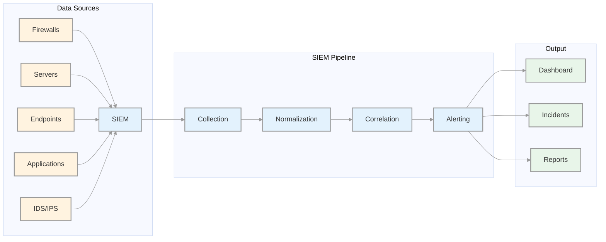
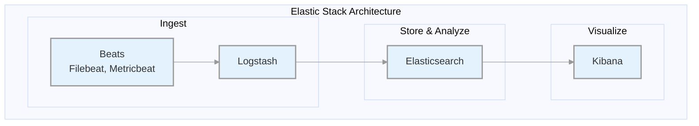
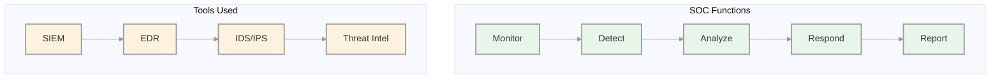
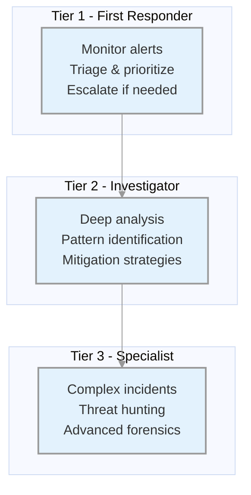
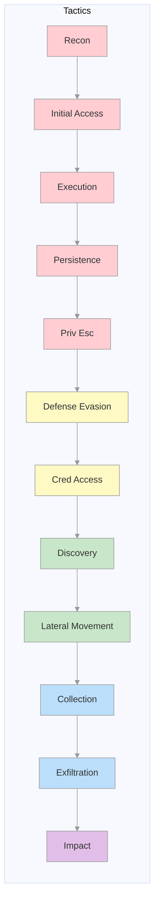
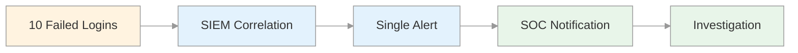
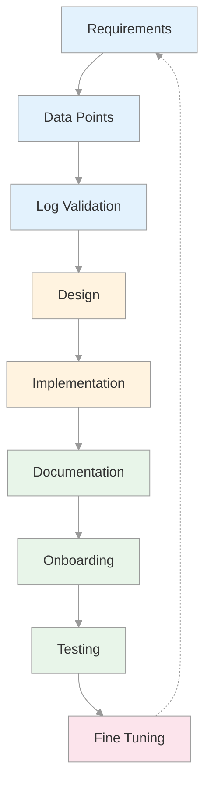

# Security Monitoring & SIEM Fundamentals
## SOC Analyst Cheatsheet - Module 2/15

---

## 0. Overview

This module covers the **foundations of Security Information and Event Management (SIEM)** and Security Operations Centers (SOC). You'll learn how SIEM solutions work, the Elastic Stack architecture, SOC organizational structures, MITRE ATT&CK framework applications, and how to develop effective SIEM use cases.

```mermaid
%%{init: {'theme': 'base', 'themeVariables': { 'lineColor': '#999', 'nodeBorder': '#999'}}}%%
flowchart TB
    subgraph "What You'll Learn"
        A["SIEM Fundamentals<br/>Collection, Normalization, Correlation"] --> B["Elastic Stack<br/>Beats, Logstash, ES, Kibana"]
        B --> C["SOC Structure<br/>Tiers, Roles, Responsibilities"]
        C --> D["MITRE ATT&CK<br/>Detection & Mapping"]
        D --> E["Use Case Development<br/>Lifecycle, Design, Tuning"]
    end
    
    subgraph "Skills Gained"
        F["KQL Query Writing"] --> G["SIEM Architecture Understanding"]
        G --> H["Alert Triaging Basics"]
        H --> I["Use Case Creation"]
    end
    
    classDef learn fill:#e8f5e9,stroke:#999,stroke-width:2px,color:#333;
    classDef skill fill:#e3f2fd,stroke:#999,stroke-width:2px,color:#333;
    class A,B,C,D,E learn;
    class F,G,H,I skill;
```



### Key Takeaways

| Concept | Description |
|---------|-------------|
| **SIEM** | Security Information and Event Management - centralizes log collection, normalization, and correlation |
| **Elastic Stack** | Elasticsearch + Logstash + Kibana + Beats for data pipeline |
| **SOC** | Security Operations Center - continuous monitoring and incident response |
| **Use Case** | Specific detection scenario that triggers alerts based on correlated events |
| **KQL** | Kibana Query Language for searching Elasticsearch data |

### Prerequisites

- Basic understanding of networking concepts
- Familiarity with operating systems (Windows, Linux)
- Basic knowledge of security concepts

### Module Sections

1. SIEM Definition & Fundamentals
2. Introduction To The Elastic Stack
3. SOC Definition & Fundamentals
4. MITRE ATT&CK & Security Operations
5. SIEM Use Case Development

---

## Table of Contents

1. [SIEM Definition & Fundamentals](#1-siem-definition--fundamentals)
2. [Introduction To The Elastic Stack](#2-introduction-to-the-elastic-stack)
3. [SOC Definition & Fundamentals](#3-soc-definition--fundamentals)
4. [MITRE ATT&CK & Security Operations](#4-mitre-attck--security-operations)
5. [SIEM Use Case Development](#5-siem-use-case-development)
6. [KQL Queries & Examples](#6-kql-queries--examples)
7. [Interview Questions](#7-interview-questions)
8. [Additional Resources](#8-additional-resources)

---

## 1. SIEM Definition & Fundamentals

### What Is SIEM?

SIEM (Security Information and Event Management) combines:
- **Security Information Management (SIM)** - log storage, reporting, compliance
- **Security Event Management (SEM)** - real-time monitoring, correlation, alerting

**Core Capabilities:**

| Capability | Description |
|------------|-------------|
| **Log Aggregation** | Centralize logs from multiple sources |
| **Normalization** | Convert diverse log formats to common schema |
| **Correlation** | Link related events across sources |
| **Alerting** | Notify on detected threats |
| **Compliance** | Generate audit reports |
| **Forensics** | Search and investigate incidents |

### How Does A SIEM Solution Work?



### Data Flows Within A SIEM

| Stage | Description |
|-------|-------------|
| **1. Ingestion** | Collect logs from various sources (agents, syslog, APIs) |
| **2. Normalization** | Convert raw data to common format (ECS) |
| **3. Storage** | Index and store normalized data |
| **4. Correlation** | Apply rules to detect patterns |
| **5. Visualization** | Display via dashboards |
| **6. Alerting** | Generate notifications |

### SIEM Business Requirements & Use Cases

#### Log Aggregation & Normalization

- Centralize terabytes of security data from firewalls, databases, applications
- Correlate events across different sources
- Improve threat visibility

#### Threat Alerting

- Real-time alerts based on detected threats
- Integration with threat intelligence
- Faster investigation and response

#### Contextualization

- Reduce alert fatigue by filtering false positives
- Provide context: who, what, when, where
- Automate threat filtering

#### Compliance

| Regulation | Requirements |
|------------|--------------|
| **PCI DSS** | Real-time monitoring, log retention |
| **HIPAA** | Audit trails, access monitoring |
| **GDPR** | Data breach notification, logging |

### Benefits of SIEM

| Benefit | Description |
|---------|-------------|
| **Centralized View** | Single pane of glass for all logs |
| **Proactive Detection** | Detect threats before damage |
| **Faster Response** | Reduced MTTR (Mean Time To Respond) |
| **Compliance** | Meet regulatory requirements |
| **Forensics** | Historical investigation capability |

---

## 2. Introduction To The Elastic Stack

### What Is The Elastic Stack?

The Elastic Stack consists of four main components:



### Components

#### Beats (Data Shippers)

| Beat | Purpose |
|------|---------|
| **Filebeat** | Log files collection |
| **Metricbeat** | Metrics collection |
| **Winlogbeat** | Windows Event Logs |
| **Packetbeat** | Network traffic |
| **Heartbeat** | Uptime monitoring |

#### Logstash

Three main functions:
1. **Input** - Collect logs from files, syslog, network
2. **Filter/Transform** - Parse, enrich, normalize
3. **Output** - Send to Elasticsearch

#### Elasticsearch

- Distributed search and analytics engine
- JSON-based RESTful APIs
- Index and query log data

#### Kibana

- Visualization interface
- Create dashboards and charts
- Query data with KQL

### Data Flow Options

```
Option 1: Beats -> Logstash -> Elasticsearch -> Kibana
          (With transformation and enrichment)

Option 2: Beats -> Elasticsearch -> Kibana
          (Direct ingestion, less processing)
```

### Elastic Stack As SIEM

The Elastic Stack can function as a SIEM solution:

1. **Ingest** security data from firewalls, IDS/IPS, endpoints
2. **Store & Index** in Elasticsearch
3. **Analyze** using search and correlations
4. **Visualize** via Kibana dashboards
5. **Detect** using Elastic Security rules

---

## 3. SOC Definition & Fundamentals

### What Is A SOC?

A **Security Operations Center (SOC)** is a facility with a team responsible for:
- Continuous monitoring
- Threat detection
- Incident response
- Security event management



### SOC Team Roles

| Role | Responsibilities |
|------|------------------|
| **SOC Director** | Strategic planning, budgeting, leadership |
| **SOC Manager** | Day-to-day operations, team management |
| **Tier 1 Analyst** | Alert triage, initial assessment, escalation |
| **Tier 2 Analyst** | Deep investigation, incident handling |
| **Tier 3 Analyst** | Threat hunting, advanced forensics |
| **Detection Engineer** | Create/update detection rules |
| **Incident Responder** | Active incident management |
| **Threat Intel Analyst** | Threat intelligence gathering |

### SOC Tier Structure



| Tier | Focus | Skills Required |
|------|-------|-----------------|
| **Tier 1** | Triage | Basic log analysis, alert categorization |
| **Tier 2** | Investigation | Deep packet analysis, malware triage |
| **Tier 3** | Advanced | Forensics, threat hunting, APT analysis |

### SOC Evolution Stages

| Generation | Description |
|------------|-------------|
| **SOC 1.0** | Network-focused, perimeter security, separate tools |
| **SOC 2.0** | Integrated threat intel, anomaly detection, behavioral analytics |
| **Cognitive SOC** | AI/ML-assisted, automated decision making |

---

## 4. MITRE ATT&CK & Security Operations

### What Is MITRE ATT&CK?

**ATT&CK** = Adversarial Tactics, Techniques, and Common Knowledge

A framework documenting adversary attack methods:
- **Tactics** - The goal/objective (why)
- **Techniques** - How they achieve the goal (how)
- **Procedures** - Specific implementations



### ATT&CK Use Cases in Security Operations

| Use Case | Description |
|----------|-------------|
| **Detection & Response** | Design detection rules based on TTPs |
| **Gap Analysis** | Identify coverage gaps in security posture |
| **SOC Maturity** | Measure detection capability |
| **Threat Intel** | Common language for adversary activities |
| **Behavioral Analytics** | Map TTPs to detect anomalies |
| **Red Teaming** | Plan attack simulations |
| **Training** | Educate on adversary techniques |

### Mapping Detection to ATT&CK

Example: Detecting MSBuild being used for execution

| Attribute | Value |
|-----------|-------|
| **Tactic** | Execution (TA0002) |
| **Technique** | Trusted Developer Utilities (T1127) |
| **Sub-technique** | MSBuild (T1127.001) |

---

## 5. SIEM Use Case Development

### What Is A SIEM Use Case?

A **use case** defines specific conditions that trigger an alert:
- Brute force detection
- Malware execution
- Data exfiltration
- Privilege escalation



### Use Case Development Lifecycle



### Steps to Build SIEM Use Cases

| Step | Description |
|------|-------------|
| **1. Requirements** | Define what to detect (e.g., 10 failed logins in 4 min) |
| **2. Data Points** | Identify log sources (Windows, Linux, endpoints) |
| **3. Log Validation** | Ensure logs contain required fields |
| **4. Design** | Define condition, aggregation, priority |
| **5. Implementation** | Create detection rule in SIEM |
| **6. Documentation** | Write SOP for analysts |
| **7. Onboarding** | Move to production |
| **8. Testing** | Validate with known scenarios |
| **9. Fine Tuning** | Reduce false positives |

### Use Case Design Parameters

| Parameter | Description |
|-----------|-------------|
| **Condition** | What triggers the alert |
| **Aggregation** | Time window and grouping |
| **Priority** | Severity level (High/Medium/Low) |

### Example: MSBuild Detection

**Scenario**: Detect MSBuild.exe started by Office applications

| Attribute | Value |
|-----------|-------|
| **Risk** | Attacker may use MSBuild to execute malicious code |
| **Severity** | HIGH |
| **MITRE Mapping** | T1127.001 - Trusted Developer Utilities: MSBuild |
| **Tactic** | Execution, Defense Evasion |

**Detection Logic:**
```
process.name: "msbuild.exe" AND 
process.parent.name: "excel.exe" OR "winword.exe"
```

### Example: Brute Force Detection

| Attribute | Value |
|-----------|-------|
| **Condition** | 10 failed logins within 4 minutes |
| **Aggregation** | Group by username |
| **Priority** | HIGH (if admin account) |

---

## 6. KQL Queries & Examples

### Basic KQL Structure

```kql
field:value
```

### Free Text Search

```kql
"search term"
```

### Logical Operators

```kql
event.code:4625 AND winlog.event_data.SubStatus:0xC0000072
```

### Comparison Operators

```kql
@timestamp >= "2023-03-03T00:00:00.000Z"
```

### Wildcards

```kql
user.name: admin*
```

### Practical Queries

#### Failed Login Attempts (Event ID 4625)

```kql
event.code:4625
```

#### Failed Logins to Disabled Accounts

```kql
event.code:4625 AND winlog.event_data.SubStatus:0xC0000072
```

#### Failed Logins Within Time Range

```kql
event.code:4625 AND winlog.event_data.SubStatus:0xC0000072 AND @timestamp >= "2023-03-03T00:00:00.000Z" AND @timestamp <= "2023-03-06T23:59:59.999Z"
```

#### Successful RDP Logons

```kql
event.code:4624 AND logon.type:10
```

#### Process Execution

```kql
event.category:process AND process.name:"cmd.exe"
```

#### Network Connections

```kql
event.category:network AND destination.ip:10.0.0.50
```

### ECS Fields Reference

| Field | Description |
|-------|-------------|
| `@timestamp` | Event time |
| `event.code` | Event identifier |
| `event.category` | Event category |
| `event.action` | Event action |
| `user.name` | Username |
| `source.ip` | Source IP |
| `destination.ip` | Destination IP |
| `process.name` | Process name |
| `host.name` | Hostname |

---

## 7. Interview Questions

### General SIEM Questions

1. **What is the difference between SIEM and SOC?**
2. **Explain the SIEM data flow from source to alert.**
3. **What is log normalization and why is it important?**
4. **How do you reduce alert fatigue in a SOC?**
5. **What is the difference between event correlation and aggregation?**

### Elastic Stack Questions

1. **Explain the components of the Elastic Stack.**
2. **What is the difference between Beats and Logstash?**
3. **What is ECS (Elastic Common Schema)?**
4. **How do you write a basic KQL query?**

### Use Case Development

1. **Describe the use case development lifecycle.**
2. **What factors determine alert severity?**
3. **How do you tune a detection rule to reduce false positives?**
4. **How do you map a detection rule to MITRE ATT&CK?**

### Scenario-Based

1. **You're seeing 500 failed logins from one IP. How would you investigate?**
2. **A user reports suspicious email. What logs would you check?**
3. **How would you detect lateral movement in your environment?**

---

## 8. Additional Resources

### Official Documentation

- [Elastic Documentation](https://www.elastic.co/guide/index.html)
- [Elastic Common Schema](https://www.elastic.co/guide/en/ecs/current/index.html)
- [Kibana Query Language](https://www.elastic.co/guide/en/kibana/current/kuery-query.html)

### MITRE ATT&CK

- [MITRE ATT&CK Framework](https://attack.mitre.org)
- [ATT&CK Navigator](https://mitre-attack.github.io/attack-navigator/)

### SOC Best Practices

- [NIST SP 800-61](https://csrc.nist.gov/publications/detail/sp/800-61/rev-2/final) - Computer Security Incident Handling Guide
- [SANS SOC Research](https://www.sans.org/security-resources/)

### Books

- "The Practice of Network Security Monitoring" - Richard Bejtlich
- "Security Operations Center: A Guide to SOC Operations"

---

*Module 2 Complete - Security Monitoring & SIEM Fundamentals*
