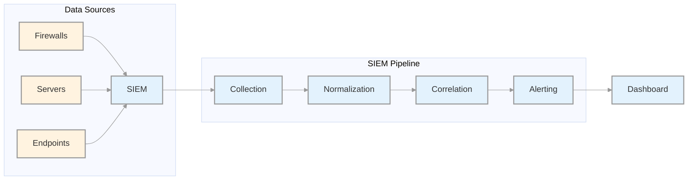
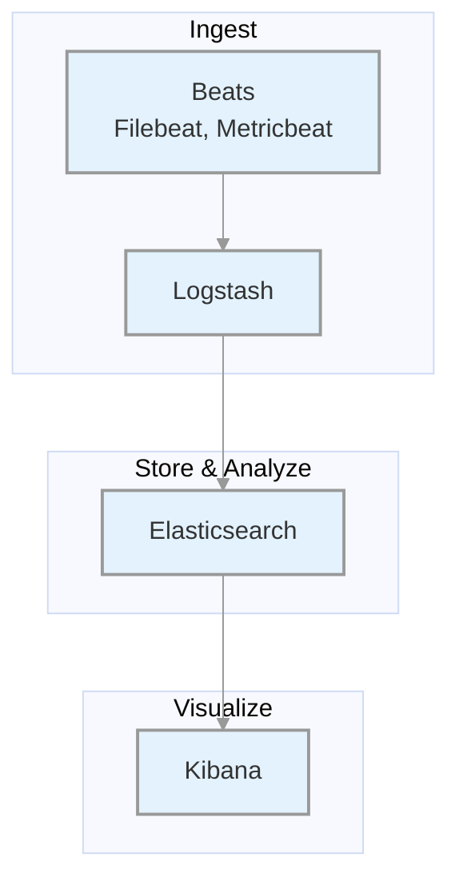
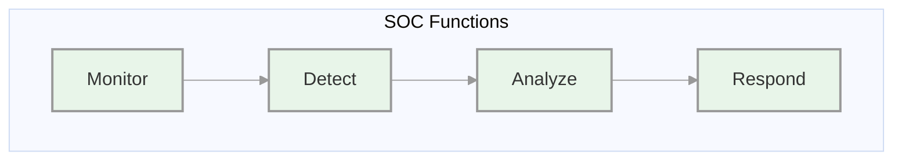
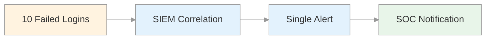
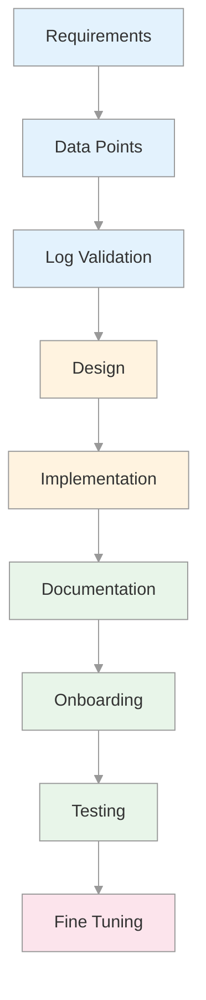

# Security Monitoring & SIEM Fundamentals
## SOC Analyst Cheatsheet - Module 2/15

---

## 0. Overview

This module covers the **foundations of SIEM and SOC operations**. You'll learn how SIEM solutions work, the Elastic Stack architecture, SOC organizational structures, MITRE ATT&CK framework applications, and how to develop effective SIEM use cases.

### Key Takeaways

| Concept | Description |
|---------|-------------|
| **SIEM** | Security Information and Event Management - centralizes log collection, normalization, and correlation |
| **Elastic Stack** | Elasticsearch + Logstash + Kibana + Beats |
| **SOC** | Security Operations Center - continuous monitoring and incident response |
| **Use Case** | Detection scenario that triggers alerts based on correlated events |
| **KQL** | Kibana Query Language |

---

## Table of Contents

1. [SIEM Definition & Fundamentals](#1-siem-definition--fundamentals)
2. [Introduction To The Elastic Stack](#2-introduction-to-the-elastic-stack)
3. [SOC Definition & Fundamentals](#3-soc-definition--fundamentals)
4. [MITRE ATT&CK & Security Operations](#4-mitre-attck--security-operations)
5. [SIEM Use Case Development](#5-siem-use-case-development)
6. [SIEM Visualization - Dashboard Development](#6-siem-visualization---dashboard-development)
7. [Additional Resources](#7-additional-resources)

---

## 1. SIEM Definition & Fundamentals

### What Is SIEM?

SIEM (Security Information and Event Management) combines:
- **SIM** (Security Information Management) - log storage, reporting, compliance
- **SEM** (Security Event Management) - real-time monitoring, correlation, alerting

**Core Capabilities:**

| Capability | Description |
|------------|-------------|
| **Log Aggregation** | Centralize logs from multiple sources |
| **Normalization** | Convert diverse log formats to common schema |
| **Correlation** | Link related events across sources |
| **Alerting** | Notify on detected threats |
| **Compliance** | Generate audit reports |

### How Does A SIEM Solution Work?



### Data Flows Within A SIEM

| Stage | Description |
|-------|-------------|
| **1. Ingestion** | Collect logs from sources (agents, syslog, APIs) |
| **2. Normalization** | Convert raw data to common format |
| **3. Storage** | Index and store normalized data |
| **4. Correlation** | Apply rules to detect patterns |
| **5. Visualization** | Display via dashboards |

### SIEM Business Requirements

#### Log Aggregation & Normalization

- Centralize security data from firewalls, databases, applications
- Correlate events across different sources
- Improve threat visibility

#### Threat Alerting

- Real-time alerts based on detected threats
- Integration with threat intelligence
- Faster investigation and response

#### Contextualization

- Reduce alert fatigue by filtering false positives
- Provide context: who, what, when, where
- Determine actors involved, affected parts, timing

#### Compliance

| Regulation | Requirements |
|------------|--------------|
| **PCI DSS** | Real-time monitoring, log retention |
| **HIPAA** | Audit trails, access monitoring |
| **GDPR** | Data breach notification |
| **ISO 27001** | Security logging and monitoring |

### Benefits of SIEM

| Benefit | Description |
|---------|-------------|
| **Centralized View** | Single pane of glass for all logs |
| **Proactive Detection** | Detect threats before damage |
| **Faster Response** | Reduced MTTR |
| **Compliance** | Meet regulatory requirements |

---

## 2. Introduction To The Elastic Stack

### What Is The Elastic Stack?

The Elastic Stack is an open-source collection of applications:



### Components

#### Beats (Data Shippers)

| Beat | Purpose |
|------|---------|
| **Filebeat** | Log files collection |
| **Metricbeat** | Metrics collection |
| **Winlogbeat** | Windows Event Logs |
| **Packetbeat** | Network traffic |

#### Logstash

Three main functions:
1. **Input** - Collect logs from files, syslog, network
2. **Filter** - Parse, enrich, normalize
3. **Output** - Send to Elasticsearch

#### Elasticsearch

- Distributed search and analytics engine
- JSON-based RESTful APIs
- Index and query log data

#### Kibana

- Visualization interface
- Create dashboards and charts
- Query data with KQL

### Data Flow Options

```
Beats -> Logstash -> Elasticsearch -> Kibana
Beats -> Elasticsearch -> Kibana
```

### Elastic Stack As SIEM

1. **Ingest** security data from firewalls, IDS/IPS, endpoints
2. **Store & Index** in Elasticsearch
3. **Analyze** using search and correlations
4. **Visualize** via Kibana dashboards

### Kibana Query Language (KQL)

#### Basic Structure

```kql
field:value
```

#### Free Text Search

```kql
"svc-sql1"
```

#### Logical Operators

```kql
event.code:4625 AND winlog.event_data.SubStatus:0xC0000072
```

#### Comparison Operators

```kql
@timestamp >= "2023-03-03T00:00:00.000Z"
```

#### Wildcards

```kql
user.name: admin*
```

### Elastic Common Schema (ECS)

ECS provides **consistent field formats** across data sources:

| Benefit | Description |
|---------|-------------|
| **Unified Data View** | Search across Windows, network, cloud |
| **Improved Search Efficiency** | Standard field names |
| **Enhanced Correlation** | Cross-source event correlation |
| **Better Visualizations** | Consistent dashboard creation |

---

## 3. SOC Definition & Fundamentals

### What Is A SOC?

A **Security Operations Center (SOC)** is a facility with a team responsible for:
- Continuous monitoring
- Threat detection
- Incident response
- Security event management



### SOC Team Roles

| Role | Responsibilities |
|------|------------------|
| **SOC Director** | Strategic planning, budgeting |
| **SOC Manager** | Day-to-day operations |
| **Tier 1 Analyst** | Alert triage, initial assessment |
| **Tier 2 Analyst** | Deep investigation |
| **Tier 3 Analyst** | Threat hunting, advanced forensics |
| **Detection Engineer** | Create detection rules |
| **Incident Responder** | Active incident handling |
| **Threat Intel Analyst** | Threat intelligence |

### SOC Tier Structure

| Tier | Focus | Skills Required |
|------|-------|-----------------|
| **Tier 1** | Triage | Basic log analysis, alert categorization |
| **Tier 2** | Investigation | Deep analysis, malware triage |
| **Tier 3** | Advanced | Forensics, threat hunting |

### SOC Evolution Stages

| Generation | Description |
|------------|-------------|
| **SOC 1.0** | Network-focused, separate tools |
| **SOC 2.0** | Integrated threat intel, anomaly detection |
| **Cognitive SOC** | AI/ML-assisted decision making |

---

## 4. MITRE ATT&CK & Security Operations

### What Is MITRE ATT&CK?

**ATT&CK** = Adversarial Tactics, Techniques, and Common Knowledge

A framework documenting adversary attack methods:
- **Tactics** - The goal/objective
- **Techniques** - How they achieve the goal

```mermaid
%%{init: {'theme': 'base', 'themeVariables': { 'lineColor': '#999', 'nodeBorder': '#999'}}}%%
flowchart LR
    A[Recon] --> B[Initial Access]
    B --> C[Execution]
    C --> D[Persistence]
    D --> E[Priv Esc]
    E --> F[Defense Evasion]
    F --> G[Cred Access]
    G --> H[Discovery]
    H --> I[Lateral Movement]
    I --> J[Exfiltration]
    
    style A fill:#ffcdd2,stroke:#999
    style B fill:#ffcdd2,stroke:#999
    style C fill:#ffcdd2,stroke:#999
    style D fill:#fff9c4,stroke:#999
    style E fill:#fff9c4,stroke:#999
    style F fill:#c8e6c9,stroke:#999
    style G fill:#c8e6c9,stroke:#999
    style H fill:#bbdefb,stroke:#999
    style I fill:#bbdefb,stroke:#999
    style J fill:#e1bee7,stroke:#999
```



### ATT&CK Use Cases in Security Operations

| Use Case | Description |
|----------|-------------|
| **Detection & Response** | Design detection rules based on TTPs |
| **Gap Analysis** | Identify coverage gaps |
| **SOC Maturity** | Measure detection capability |
| **Threat Intel** | Common language for adversary activities |
| **Behavioral Analytics** | Map TTPs to detect anomalies |
| **Red Teaming** | Plan attack simulations |

---

## 5. SIEM Use Case Development

### What Is A SIEM Use Case?

A **use case** defines specific conditions that trigger an alert:



### Use Case Development Lifecycle



### Steps to Build SIEM Use Cases

| Step | Description |
|------|-------------|
| **1. Requirements** | Define what to detect |
| **2. Data Points** | Identify log sources |
| **3. Log Validation** | Ensure logs contain required fields |
| **4. Design** | Define condition, aggregation, priority |
| **5. Implementation** | Create detection rule |
| **6. Documentation** | Write SOP |
| **7. Onboarding** | Move to production |
| **8. Testing** | Validate with known scenarios |
| **9. Fine Tuning** | Reduce false positives |

### Use Case Design Parameters

| Parameter | Description |
|-----------|-------------|
| **Condition** | What triggers the alert |
| **Aggregation** | Time window and grouping |
| **Priority** | Severity (High/Medium/Low) |

### Example: MSBuild Detection

| Attribute | Value |
|-----------|-------|
| **Risk** | Attacker uses MSBuild to execute code |
| **Severity** | HIGH |
| **MITRE** | T1127.001 - MSBuild |
| **Tactic** | Execution, Defense Evasion |

---

## 6. SIEM Visualization - Dashboard Development

### Creating Failed Logon Attempts Dashboard

Dashboards in SIEM solutions serve as containers for multiple visualizations, allowing us to organize and display data in a meaningful way.

In this and the following sections, we will create a dashboard and some visualizations from scratch.

#### Step 1: Navigate to Dashboard

Navigate to http://[Target IP]:5601, click on the side navigation toggle, and click on "Dashboard".

Delete the existing "SOC-Alerts" dashboard as follows.


> **Description**: Elastic dashboard interface showing 'SOC-Alerts' with options to delete or create a dashboard.

When visiting the Dashboard page again we will be presented with a message indicating that no dashboards currently exist. Additionally, there will be an option available to create a new Dashboard and its first visualization. To initiate the creation of our first dashboard, we simply have to click on the "Create new dashboard" button.


> **Description**: Elastic interface prompting to create the first dashboard with options to install sample data and create a new dashboard.


#### Step 2: Create First Visualization

Now, to initiate the creation of our first visualization, we simply have to click on the "Create visualization" button.


> **Description**: Elastic interface for editing a new dashboard, prompting to add the first visualization with options to create or add from library.

Upon initiating the creation of our first visualization, the following new window will appear with various options and settings.

Before proceeding with any configuration, it is important for us to first click on the calendar icon to open the time picker. Then, we need to specify the date range as "last 15 years". Finally, we can click on the "Apply" button to apply the specified date range to the data.


> **Description**: Elastic dashboard creation interface with options to add filter, select index pattern 'windows*', search field names, and choose 'Bar vertical stacked' visualization.

There are four things for us to notice on this window:

1. **Filter Option** - A filter option that allows us to filter the data before creating a graph. For example, if our goal is to display failed logon attempts, we can use a filter to only consider event IDs that match 4625 – Failed logon attempt on a Windows system.


> **Description**: Elastic dashboard interface with 'Add filter' option open, setting filter for 'event.code' to '4625' using operator 'is'.

2. **Index Pattern** - This field indicates the data set (index) that we are going to use. It is common for data from various infrastructure sources to be separated into different indices, such as network, Windows, Linux, etc. In this particular example, we will specify `windows*` in the "Index pattern".

3. **Field Search** - This search bar provides us with the ability to double-check the existence of a specific field within our data set. For example, let's say we are interested in the `user.name.keyword` field. We can use the search bar to quickly perform a search and verify if this field is present.


> **Description**: Elastic dashboard interface with a filter for 'event.code: 4625' and search for fields starting with 'user.' showing available fields like 'user.name.keyword'.

> **Note**: We should use the `.keyword` field when it comes to aggregations.

4. **Visualization Type** - This drop-down menu enables us to select the type of visualization we want to create. The default option is "Bar vertical stacked".


> **Description**: Elastic interface showing visualization type options with 'Bar vertical stacked' selected, including other options like 'Metric' and 'Table'.

#### Step 3: Configure Table Visualization

For this visualization, let's select the "Table" option. After selecting the "Table", we can proceed to click on the "Rows" option. This will allow us to choose the specific data elements that we want to include in the table view.


> **Description**: Elastic table configuration interface with options to add or drag-and-drop fields for rows, columns, and metrics.

Let's configure the "Rows" settings as follows.


> **Description**: Elastic interface for configuring rows, selecting 'user.name.keyword' field, displaying top 1000 values, ranked by count of records in descending order.

> **Note**: You will notice "Rank by Alphabetical" and not "Rank by Count of records" like in the screenshot above. This is OK. By the time you perform the next configuration below, Count of records will become available.

Moving forward, let's close the "Rows" window and proceed to enter the "Metrics" configuration.


> **Description**: Elastic table configuration showing 'windows*' index pattern, with 'Top values of user.name.keyword' in rows, and options to add fields to columns and metrics.

In the "Metrics" window, let's select "count" as the desired metric.


> **Description**: Elastic metrics configuration interface showing quick functions like Average, Count, and Sum, with 'Count' selected.

As soon as we select "Count" as the metric, we will observe that the table gets populated with data.


> **Description**: Elastic table showing top values of 'user.name.keyword' with counts, and metrics configuration set to 'Count' for records.

One final addition to the table is to include another "Rows" setting to show the machine where the failed logon attempt occurred. To do this, we will select the `host.hostname.keyword` field, which represents the computer reporting the failed logon attempt.


> **Description**: Elastic table showing top values of 'user.name.keyword' and 'host.hostname.keyword' with record counts, configured in rows.

Now we can see three columns in the table, which contain the following information:

- The username of the individuals logging in (Note: It currently displays both users and computers. Ideally, a filter should be implemented to exclude computer devices and only display users)
- The machine on which the logon attempt occurred
- The number of times the event has occurred (based on the specified time frame or the entire data set, depending on the settings)

Finally, click on "Save and return", and you will observe that the new visualization is added to the dashboard.


> **Description**: Elastic dashboard showing a table with top values of user names and hostnames, and their record counts.

Let's not forget to save the dashboard as well. We can do so by simply clicking on the "Save" button.


> **Description**: Elastic interface showing 'Save dashboard' dialog with title 'SOC-Alerts', description for HTB Academy's SOC Analyst Job-Role Path, and option to store time with dashboard.

### Refining The Visualization

Suppose the SOC Manager suggested the following refinements:

- Clearer column names should be specified in the visualization
- The Logon Type should be included in the visualization
- The results in the visualization should be sorted
- The DESKTOP-DPOESND, WIN-OK9BH1BCKSD, and WIN-RMMGJA7T9TC usernames should not be monitored
- Computer accounts should not be monitored (not a good practice)

Let's refine the visualization we created, so that it fulfills the suggestions above.

Navigate to http://[Target IP]:5601, click on the side navigation toggle, and click on "Dashboard".

The dashboard we previously created should be visible. Let's click on the "pencil"/edit icon.


> **Description**: Elastic dashboard interface showing a list with 'SOC-Alerts' and options to create or edit a dashboard.

Let's now click on the "gear" button at the upper-right corner of our visualization, and then click on "Edit lens".


> **Description**: Elastic dashboard editing 'SOC-Alerts' with a table of top user and hostnames, and options to edit lens, clone panel, or edit panel title.

#### Update Column Names

"Top values of user.name.keyword" should be changed as follows.


> **Description**: Elastic interface for configuring rows, selecting 'user.name.keyword' field, displaying top 1000 values, ranked alphabetically in ascending order, with display name 'Username'.

"Top values of host.hostname.keyword" should be changed as follows.


> **Description**: Elastic interface for configuring rows, selecting 'host.hostname.keyword' field, displaying top 1000 values, ranked by count of records in descending order, with display name 'Event logged by'.

The "Logon Type" can be added as follows (we will use the `winlog.logon.type.keyword` field).


> **Description**: Rows configuration panel with 'winlog.logon.type.keyword' field selected, number of values set to 1000, ranked by count of records in descending order, display name 'Logon Type'.

"Count of records" should be changed as follows.


> **Description**: Metrics panel with 'Count' function selected, field set to 'Records', display name '# of logins', text alignment 'Right'.

We can introduce result sorting as follows.


> **Description**: Elastic dashboard showing a table with columns: Username, Event logged by, Logon Type, and '# of logins' sorted descending.

All we have to do now is click on "Save and return".

#### Exclude Specific Usernames

The DESKTOP-DPOESND, WIN-OK9BH1BCKSD, and WIN-RMMGJA7T9TC usernames can be excluded by specifying additional filters as follows.


> **Description**: Elastic dashboard with filter settings: Field 'user.name.keyword', operator 'is not', value 'DESKTOP-DPOESND'.

#### Exclude Computer Accounts

Computer accounts can be excluded by specifying the following KQL query and clicking on the "Update" button.

```kql
NOT user.name: *$ AND winlog.channel.keyword: Security
```

> **Note**: The `AND winlog.channel.keyword: Security` part is to ensure that no unrelated logs are accounted for.


> **Description**: Elastic dashboard with filters: NOT user.name:*$ AND winlog.channel.keyword: Security, showing a table with columns: Username, Event logged by, Logon Type, and '# of logins'.

This is our visualization after all the refinements we performed.


> **Description**: Elastic dashboard with filters applied, displaying a table with columns: Username, Event logged by, Logon Type, and '# of logins'.

Finally, let's give our visualization a title by clicking on "No Title".


> **Description**: Customize panel dialog open with 'Show panel title' option.

Don't forget to click on the "Save" button (the one on the upper-right hand side of the window).

### Failed Logon Attempts (Disabled Users) - Visualization Example 2

This visualization builds upon the previous failed logon attempts dashboard but focuses specifically on detecting login attempts to **disabled user accounts** - a significant security indicator that may suggest account compromise or credential stuffing attacks.

> **Security Note**: When an attacker obtains credentials for a disabled account, they may attempt to use those credentials without knowing the account is disabled. Detecting these attempts is crucial as it could indicate:
> - Previous legitimate user credentials that were disabled (departed employee)
> - Stolen credentials from a decommissioned account
> - Credential stuffing attempts using old credential databases

#### Understanding the Windows Event

Windows Security Event **4625** (Failed Logon) includes a **SubStatus** field that indicates the reason for the failure. The SubStatus `0xC0000072` specifically indicates:

| SubStatus | Meaning |
|-----------|---------|
| `0xC0000072` | Account is currently disabled |

#### Step-by-Step Configuration

##### Step 1: Create New Visualization

Navigate to your dashboard in Kibana and create a new visualization using the same index pattern `windows*`.

##### Step 2: Add Filter for Disabled Accounts

Add a filter using the following criteria:

- **Field**: `winlog.event_data.SubStatus`
- **Operator**: `is`
- **Value**: `0xc0000072`

This filter ensures we only capture failed logon attempts where the account is disabled.


> **Description**: Elastic dashboard interface with 'Add filter' option, setting filter for SubStatus to 0xc0000072 to capture disabled account logon failures.

##### Step 3: Add Event Code Filter

Additionally, filter for Event ID 4625 (Failed Logon):

```kql
event.code:4625 AND winlog.event_data.SubStatus:0xc0000072
```

##### Step 4: Configure Table Visualization

Select **Table** visualization and configure the following **Rows**:

| Field | Display Name | Settings |
|-------|--------------|----------|
| `user.name.keyword` | Username | Top 1000 values, Rank by Count |
| `host.hostname.keyword` | Source Machine | Top 1000 values, Rank by Count |

##### Step 5: Configure Metrics

In the **Metrics** section:
- Select **Count** as the metric
- Display Name: `# of Failed Attempts`

##### Step 6: Add Time Range

Set the time picker to cover a significant period (e.g., last 30 days or last 15 years depending on data available).

##### Step 7: Exclude Computer Accounts

Add a KQL filter to exclude computer accounts (accounts ending with `$`):

```kql
NOT user.name: *$
```

##### Step 8: Save the Visualization

Save the visualization with an appropriate title such as "Failed Logon - Disabled Accounts".

#### Sample Query

The resulting KQL query should look like:

```kql
event.code:4625 AND winlog.event_data.SubStatus:0xc0000072 AND NOT user.name:*$
```

#### Why This Matters

| Aspect | Importance |
|--------|------------|
| **Detection** | Identifies unauthorized access attempts on disabled accounts |
| **Investigation** | Helps determine if attacker knows about old/departed user credentials |
| **Response** | May indicate need for credential rotation and account cleanup |
| **Compliance** | Provides audit trail for access attempts on sensitive accounts |

#### Investigation Workflow

When this alert triggers:

1. **Identify the target account** - Which disabled account is being targeted?
2. **Check source IP** - Is this from internal or external IP?
3. **Review frequency** - Is this a one-time attempt or part of a brute force campaign?
4. **Check for related alerts** - Are there similar attempts on other disabled accounts?
5. **Escalate** - If external source and frequent, escalate to Tier 2/3

---

## 7. Additional Resources

### Official Documentation

- [Elastic Documentation](https://www.elastic.co/guide/index.html)
- [ECS Fields](https://www.elastic.co/guide/en/ecs/current/index.html)
- [KQL Reference](https://www.elastic.co/guide/en/kibana/current/kuery-query.html)

### MITRE ATT&CK

- [MITRE ATT&CK](https://attack.mitre.org)
- [ATT&CK Navigator](https://mitre-attack.github.io/attack-navigator/)

---

*Module 2 Complete - Security Monitoring & SIEM Fundamentals*


	
	
	
	
	
	
	
---

## 7. Additional Resources
	


---

### Successful RDP Logon (Service Accounts) - Visualization Example 3

This visualization monitors **successful RDP logons to service accounts** - a critical security indicator. Service accounts should never require remote interactive (RDP) access.

> **Security Note**: Service accounts typically have elevated privileges. Any RDP login to a service account is anomalous and could indicate:
> - Compromised service account credentials
> - Privilege escalation from a regular user account
> - Misconfiguration allowing unintended access
> - Attackers moving laterally using service account credentials

#### Understanding the Windows Event

| Event ID | Description | Logon Type |
|----------|-------------|------------|
| **4624** | An account was successfully logged on | **RemoteInteractive** (Type 10) |

#### Step-by-Step Configuration

##### Step 1: Create New Visualization

Navigate to your dashboard in Kibana and create a new visualization using the index pattern `windows*`.

##### Step 2: Add Filters

Add the following filters:

| Field | Operator | Value |
|-------|----------|-------|
| `event.code` | is | `4624` |
| `winlog.logon.type` | is | `RemoteInteractive` |

##### Step 3: Filter for Service Accounts

Add a KQL query to filter for service accounts (typically prefixed with `svc-`):

```kql
user.name: svc-*
```

> **Note**: In KQL queries, you typically don't need to use the `.keyword` field.

##### Step 4: Configure Table Visualization

Select **Table** visualization and configure the following **Rows**:

| Field | Display Name | Settings |
|-------|--------------|----------|
| `user.name.keyword` | Service Account | Top 1000 values, Rank by Count |
| `host.hostname.keyword` | Target Machine | Top 1000 values, Rank by Count |
| `related.ip.keyword` | Source IP | Top 1000 values, Rank by Count |

##### Step 5: Configure Metrics

In the **Metrics** section:
- Select **Count** as the metric
- Display Name: `# of RDP Sessions`

##### Step 6: Save the Visualization

Save the visualization with title "Successful RDP - Service Accounts".

#### Sample Query

```kql
event.code:4624 AND winlog.logon.type:RemoteInteractive AND user.name:svc-*
```

#### Resulting Table Columns

| Column | Description |
|--------|-------------|
| **Service Account** | The account used for RDP |
| **Target Machine** | Computer where RDP connection was made |
| **Source IP** | IP address initiating the RDP connection |
| **# of RDP Sessions** | Count of RDP sessions |

#### Why This Matters

| Aspect | Importance |
|--------|------------|
| **Lateral Movement** | Detects attackers using compromised service accounts |
| **Privilege Escalation** | Identifies unauthorized access to high-privilege accounts |
| **Compliance** | Service accounts should never have RDP access |
| **Forensics** | Provides audit trail of service account usage |

#### Investigation Workflow

When this alert triggers:

1. **Verify legitimacy** - Is this expected RDP usage for the service account?
2. **Check source machine** - Is the source IP from a legitimate workstation?
3. **Review timing** - Is this during business hours or unusual times?
4. **Check recent changes** - Any recent changes to this service account?
5. **Escalate** - If suspicious, escalate to Tier 2/3 for further investigation

---

*Module 2 Complete - Security Monitoring & SIEM Fundamentals*


Security Monitoring & SIEM Fundamentals
Security Monitoring & SIEM Fundamentals 100%

---

### Local Group Membership Changes - Visualization Example 4

This visualization monitors **user additions or removals from local groups** (particularly the Administrators group) - a critical security indicator for detecting privilege escalation.

> **Security Note**: Unauthorized changes to local group membership can indicate:
> - Privilege escalation attacks
> - Malicious admin activity
> - Insider threats
> - Attackers establishing persistence

#### Understanding the Windows Events

| Event ID | Description |
|----------|-------------|
| **4732** | A member was added to a security-enabled local group |
| **4733** | A member was removed from a security-enabled local group |

#### Step-by-Step Configuration

##### Step 1: Create New Visualization

Navigate to your dashboard in Kibana and create a new visualization using the index pattern `windows*`.

##### Step 2: Add Filters

Add filters for Event IDs 4732 and 4733 targeting the Administrators group:

| Field | Operator | Value |
|-------|----------|-------|
| `event.code` | is one of | `4732`, `4733` |
| `group.name` | is | `Administrators` |

##### Step 3: Configure Time Range

Set the time picker to the desired timeframe (e.g., from March 5th 2023 to present).

##### Step 4: Configure Table Visualization

Select **Table** visualization and configure the following **Rows**:

| Field | Display Name | Settings |
|-------|--------------|----------|
| `user.name.keyword` | Actor Account | Top 1000 values |
| `group.name.keyword` | Target Group | Top 1000 values |
| `winlog.event_data.MemberName` | Target User | Top 1000 values |
| `host.hostname.keyword` | Target Machine | Top 1000 values |

##### Step 5: Configure Metrics

In the **Metrics** section:
- Select **Count** as the metric
- Display Name: `# of Membership Changes`

##### Step 6: Save the Visualization

Save the visualization with title "Local Group Membership Changes".

#### Sample Query

```kql
event.code:4732 OR event.code:4733 AND group.name:Administrators
```

#### Why This Matters

| Aspect | Importance |
|--------|------------|
| **Privilege Escalation** | Detects unauthorized privilege grants |
| **Persistence** | Identifies attackers establishing admin access |
| **Insider Threat** | Monitors admin behavior |
| **Compliance** | Audit trail for group changes |

#### Investigation Workflow

When this alert triggers:

1. **Identify the actor** - Who made the change (user account)?
2. **Check authorization** - Is this user authorized to modify group membership?
3. **Identify the target** - What account was added/removed?
4. **Check timing** - Is this during business hours?
5. **Verify with IT** - Consult IT Operations if change is unexpected
6. **Escalate** - If malicious, escalate to Tier 2/3

---

### Alert Triaging - Section 10

## What Is Alert Triaging?

**Alert triaging** is the process of evaluating and prioritizing security alerts to determine their level of threat and potential impact. It involves systematically reviewing and categorizing alerts to effectively allocate resources and respond to security incidents.

### The Triaging Process

| Stage | Description |
|-------|-------------|
| **1. Initial Alert Review** | Review metadata, timestamps, IPs, affected systems, triggering rules |
| **2. Alert Classification** | Classify based on severity, impact, urgency |
| **3. Alert Correlation** | Cross-reference with related alerts and IOCs |
| **4. Enrichment** | Gather additional context from threat intelligence |
| **5. Risk Assessment** | Evaluate potential impact to critical assets |
| **6. Contextual Analysis** | Consider affected assets, security controls, compliance |
| **7. Response Execution** | Determine appropriate response actions |
| **8. Escalation** | Notify higher-level teams if necessary |

### Escalation Triggers

Escalate when:
- Critical systems/assets are compromised
- Ongoing active attacks detected
- Sophisticated/unfamiliar techniques used
- Widespread impact across environment
- Potential insider threat detected

### Key Questions During Triaging

| Question | Purpose |
|----------|---------|
| Is this a true positive or false positive? | Determine if alert represents real threat |
| What is the severity and urgency? | Prioritize response |
| What systems are affected? | Assess scope |
| Are there related alerts? | Identify campaign/attack chain |
| What is the potential impact? | Determine response priority |
| Should I escalate? | Decide on escalation |

---

*Module 2 Complete - Security Monitoring & SIEM Fundamentals*
