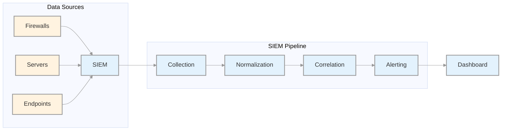
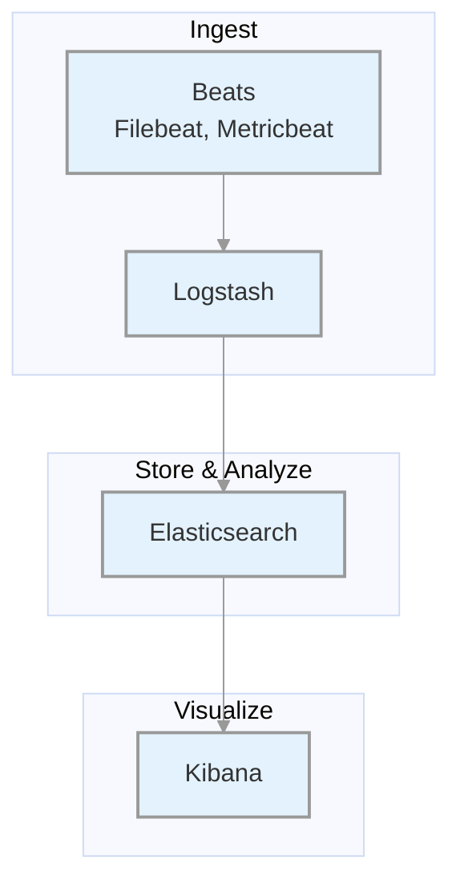
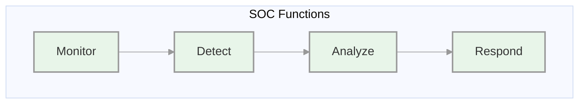
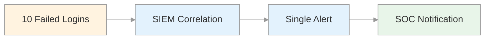
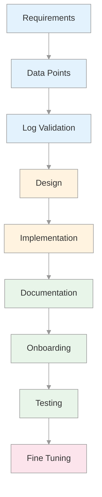

# Security Monitoring & SIEM Fundamentals
## SOC Analyst Cheatsheet - Module 2/15

---

## 0. Overview

This module covers the **foundations of SIEM and SOC operations**. You'll learn how SIEM solutions work, the Elastic Stack architecture, SOC organizational structures, MITRE ATT&CK framework applications, and how to develop effective SIEM use cases.

### Key Takeaways

| Concept | Description |
|---------|-------------|
| **SIEM** | Security Information and Event Management - centralizes log collection, normalization, and correlation |
| **Elastic Stack** | Elasticsearch + Logstash + Kibana + Beats |
| **SOC** | Security Operations Center - continuous monitoring and incident response |
| **Use Case** | Detection scenario that triggers alerts based on correlated events |
| **KQL** | Kibana Query Language |

---

## Table of Contents

1. [SIEM Definition & Fundamentals](#1-siem-definition--fundamentals)
2. [Introduction To The Elastic Stack](#2-introduction-to-the-elastic-stack)
3. [SOC Definition & Fundamentals](#3-soc-definition--fundamentals)
4. [MITRE ATT&CK & Security Operations](#4-mitre-attck--security-operations)
5. [SIEM Use Case Development](#5-siem-use-case-development)
6. [Additional Resources](#6-additional-resources)

---

## 1. SIEM Definition & Fundamentals

### What Is SIEM?

SIEM (Security Information and Event Management) combines:
- **SIM** (Security Information Management) - log storage, reporting, compliance
- **SEM** (Security Event Management) - real-time monitoring, correlation, alerting

**Core Capabilities:**

| Capability | Description |
|------------|-------------|
| **Log Aggregation** | Centralize logs from multiple sources |
| **Normalization** | Convert diverse log formats to common schema |
| **Correlation** | Link related events across sources |
| **Alerting** | Notify on detected threats |
| **Compliance** | Generate audit reports |

### How Does A SIEM Solution Work?



### Data Flows Within A SIEM

| Stage | Description |
|-------|-------------|
| **1. Ingestion** | Collect logs from sources (agents, syslog, APIs) |
| **2. Normalization** | Convert raw data to common format |
| **3. Storage** | Index and store normalized data |
| **4. Correlation** | Apply rules to detect patterns |
| **5. Visualization** | Display via dashboards |

### SIEM Business Requirements

#### Log Aggregation & Normalization

- Centralize security data from firewalls, databases, applications
- Correlate events across different sources
- Improve threat visibility

#### Threat Alerting

- Real-time alerts based on detected threats
- Integration with threat intelligence
- Faster investigation and response

#### Contextualization

- Reduce alert fatigue by filtering false positives
- Provide context: who, what, when, where
- Determine actors involved, affected parts, timing

#### Compliance

| Regulation | Requirements |
|------------|--------------|
| **PCI DSS** | Real-time monitoring, log retention |
| **HIPAA** | Audit trails, access monitoring |
| **GDPR** | Data breach notification |
| **ISO 27001** | Security logging and monitoring |

### Benefits of SIEM

| Benefit | Description |
|---------|-------------|
| **Centralized View** | Single pane of glass for all logs |
| **Proactive Detection** | Detect threats before damage |
| **Faster Response** | Reduced MTTR |
| **Compliance** | Meet regulatory requirements |

---

## 2. Introduction To The Elastic Stack

### What Is The Elastic Stack?

The Elastic Stack is an open-source collection of applications:



### Components

#### Beats (Data Shippers)

| Beat | Purpose |
|------|---------|
| **Filebeat** | Log files collection |
| **Metricbeat** | Metrics collection |
| **Winlogbeat** | Windows Event Logs |
| **Packetbeat** | Network traffic |

#### Logstash

Three main functions:
1. **Input** - Collect logs from files, syslog, network
2. **Filter** - Parse, enrich, normalize
3. **Output** - Send to Elasticsearch

#### Elasticsearch

- Distributed search and analytics engine
- JSON-based RESTful APIs
- Index and query log data

#### Kibana

- Visualization interface
- Create dashboards and charts
- Query data with KQL

### Data Flow Options

```
Beats -> Logstash -> Elasticsearch -> Kibana
Beats -> Elasticsearch -> Kibana
```

### Elastic Stack As SIEM

1. **Ingest** security data from firewalls, IDS/IPS, endpoints
2. **Store & Index** in Elasticsearch
3. **Analyze** using search and correlations
4. **Visualize** via Kibana dashboards

### Kibana Query Language (KQL)

#### Basic Structure

```kql
field:value
```

#### Free Text Search

```kql
"svc-sql1"
```

#### Logical Operators

```kql
event.code:4625 AND winlog.event_data.SubStatus:0xC0000072
```

#### Comparison Operators

```kql
@timestamp >= "2023-03-03T00:00:00.000Z"
```

#### Wildcards

```kql
user.name: admin*
```

### Elastic Common Schema (ECS)

ECS provides **consistent field formats** across data sources:

| Benefit | Description |
|---------|-------------|
| **Unified Data View** | Search across Windows, network, cloud |
| **Improved Search Efficiency** | Standard field names |
| **Enhanced Correlation** | Cross-source event correlation |
| **Better Visualizations** | Consistent dashboard creation |

---

## 3. SOC Definition & Fundamentals

### What Is A SOC?

A **Security Operations Center (SOC)** is a facility with a team responsible for:
- Continuous monitoring
- Threat detection
- Incident response
- Security event management



### SOC Team Roles

| Role | Responsibilities |
|------|------------------|
| **SOC Director** | Strategic planning, budgeting |
| **SOC Manager** | Day-to-day operations |
| **Tier 1 Analyst** | Alert triage, initial assessment |
| **Tier 2 Analyst** | Deep investigation |
| **Tier 3 Analyst** | Threat hunting, advanced forensics |
| **Detection Engineer** | Create detection rules |
| **Incident Responder** | Active incident handling |
| **Threat Intel Analyst** | Threat intelligence |

### SOC Tier Structure

| Tier | Focus | Skills Required |
|------|-------|-----------------|
| **Tier 1** | Triage | Basic log analysis, alert categorization |
| **Tier 2** | Investigation | Deep analysis, malware triage |
| **Tier 3** | Advanced | Forensics, threat hunting |

### SOC Evolution Stages

| Generation | Description |
|------------|-------------|
| **SOC 1.0** | Network-focused, separate tools |
| **SOC 2.0** | Integrated threat intel, anomaly detection |
| **Cognitive SOC** | AI/ML-assisted decision making |

---

## 4. MITRE ATT&CK & Security Operations

### What Is MITRE ATT&CK?

**ATT&CK** = Adversarial Tactics, Techniques, and Common Knowledge

A framework documenting adversary attack methods:
- **Tactics** - The goal/objective
- **Techniques** - How they achieve the goal

```mermaid
%%{init: {'theme': 'base', 'themeVariables': { 'lineColor': '#999', 'nodeBorder': '#999'}}}%%
flowchart LR
    A[Recon] --> B[Initial Access]
    B --> C[Execution]
    C --> D[Persistence]
    D --> E[Priv Esc]
    E --> F[Defense Evasion]
    F --> G[Cred Access]
    G --> H[Discovery]
    H --> I[Lateral Movement]
    I --> J[Exfiltration]
    
    style A fill:#ffcdd2,stroke:#999
    style B fill:#ffcdd2,stroke:#999
    style C fill:#ffcdd2,stroke:#999
    style D fill:#fff9c4,stroke:#999
    style E fill:#fff9c4,stroke:#999
    style F fill:#c8e6c9,stroke:#999
    style G fill:#c8e6c9,stroke:#999
    style H fill:#bbdefb,stroke:#999
    style I fill:#bbdefb,stroke:#999
    style J fill:#e1bee7,stroke:#999
```



### ATT&CK Use Cases in Security Operations

| Use Case | Description |
|----------|-------------|
| **Detection & Response** | Design detection rules based on TTPs |
| **Gap Analysis** | Identify coverage gaps |
| **SOC Maturity** | Measure detection capability |
| **Threat Intel** | Common language for adversary activities |
| **Behavioral Analytics** | Map TTPs to detect anomalies |
| **Red Teaming** | Plan attack simulations |

---

## 5. SIEM Use Case Development

### What Is A SIEM Use Case?

A **use case** defines specific conditions that trigger an alert:



### Use Case Development Lifecycle



### Steps to Build SIEM Use Cases

| Step | Description |
|------|-------------|
| **1. Requirements** | Define what to detect |
| **2. Data Points** | Identify log sources |
| **3. Log Validation** | Ensure logs contain required fields |
| **4. Design** | Define condition, aggregation, priority |
| **5. Implementation** | Create detection rule |
| **6. Documentation** | Write SOP |
| **7. Onboarding** | Move to production |
| **8. Testing** | Validate with known scenarios |
| **9. Fine Tuning** | Reduce false positives |

### Use Case Design Parameters

| Parameter | Description |
|-----------|-------------|
| **Condition** | What triggers the alert |
| **Aggregation** | Time window and grouping |
| **Priority** | Severity (High/Medium/Low) |

### Example: MSBuild Detection

| Attribute | Value |
|-----------|-------|
| **Risk** | Attacker uses MSBuild to execute code |
| **Severity** | HIGH |
| **MITRE** | T1127.001 - MSBuild |
| **Tactic** | Execution, Defense Evasion |

---

## 6. Additional Resources

### Official Documentation

- [Elastic Documentation](https://www.elastic.co/guide/index.html)
- [ECS Fields](https://www.elastic.co/guide/en/ecs/current/index.html)
- [KQL Reference](https://www.elastic.co/guide/en/kibana/current/kuery-query.html)

### MITRE ATT&CK

- [MITRE ATT&CK](https://attack.mitre.org)
- [ATT&CK Navigator](https://mitre-attack.github.io/attack-navigator/)

---

*Module 2 Complete - Security Monitoring & SIEM Fundamentals*
