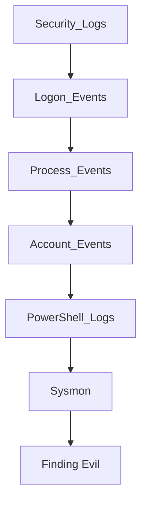
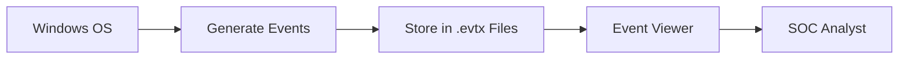
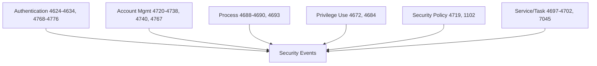
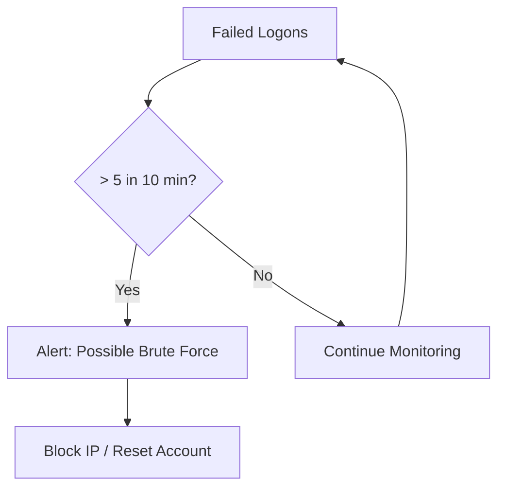
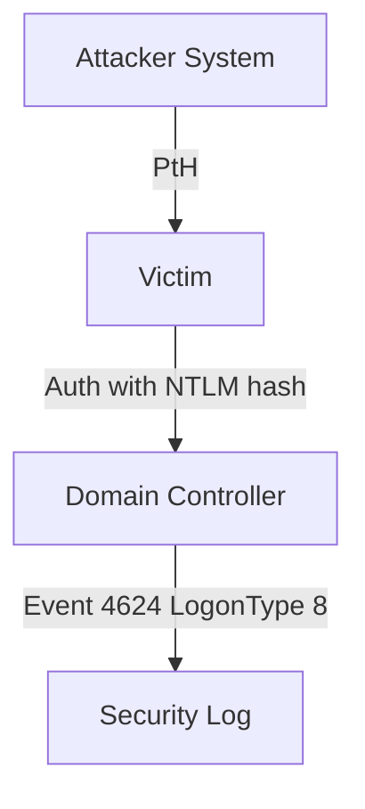
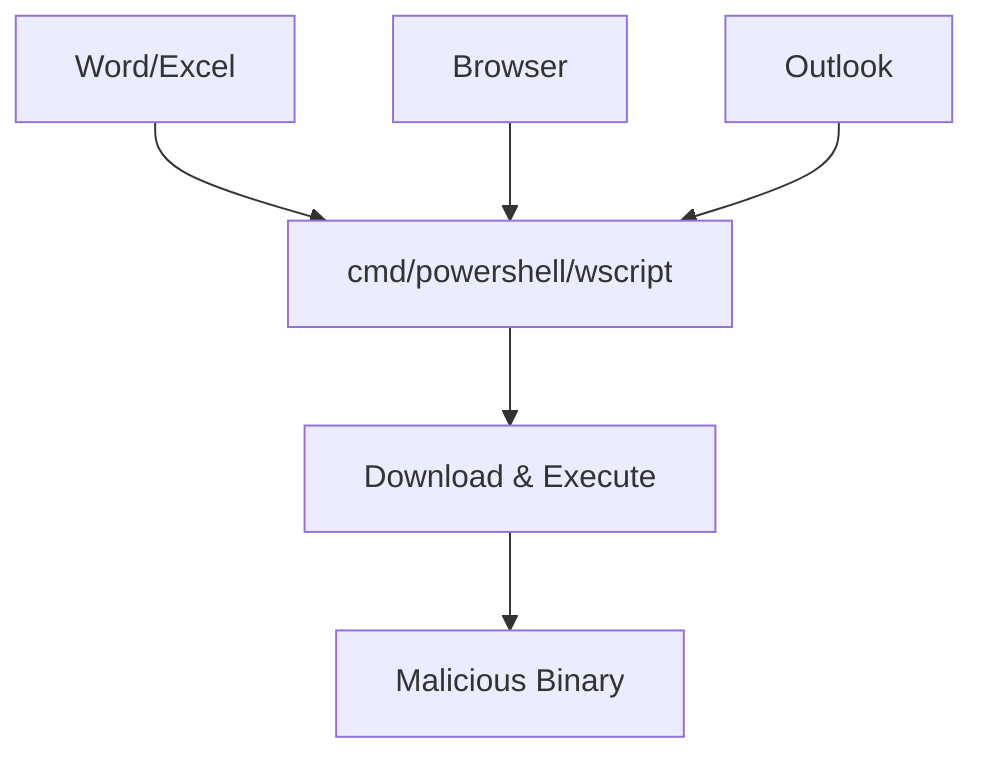
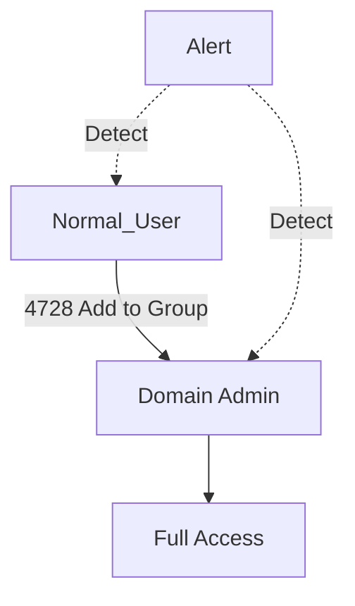
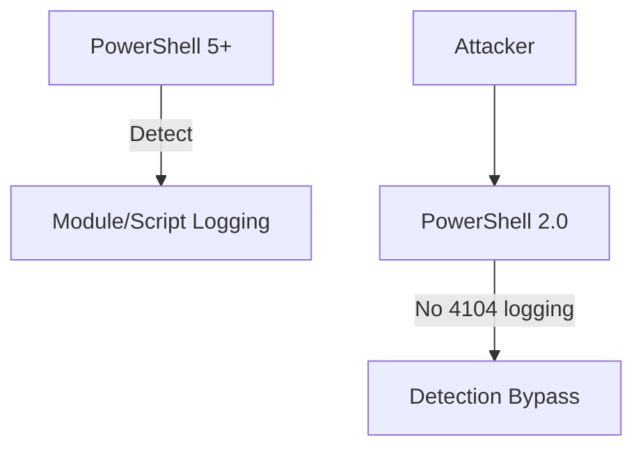
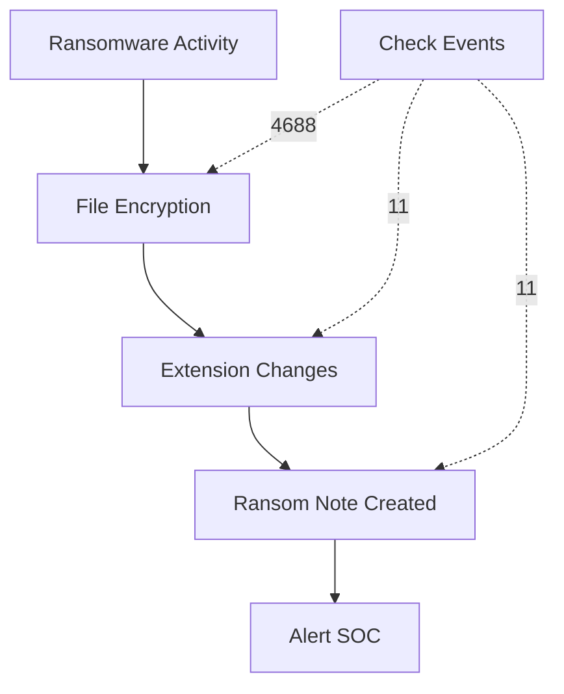

# Windows Event Logs & Finding Evil
## SOC Analyst Cheatsheet - Module 3/15

---

## 0. Overview

This module covers **Windows Event Logs** - the primary data source for detecting malicious activity on Windows endpoints. You'll learn how to analyze security logs, identify suspicious behavior, and find evil using Windows event log analysis.



### Key Takeaways

| Concept | Description |
|---------|-------------|
| **Windows Event Logs** | Records of system, security, and application events |
| **Security Event IDs** | Windows security log event identifiers |
| **Sysmon** | System Monitor - enhanced logging for security |
| **Event Tracing** | Windows ETW for advanced logging |

### Prerequisites

- Basic understanding of Windows OS
- Familiarity with Windows administration
- Understanding of networking concepts

### Module Duration

- **Theory**: 2-3 hours
- **Hands-on Practice**: 3-4 hours
- **Total**: ~6-7 hours

---

## Table of Contents

0. [Overview](#0-overview)
1. [Windows Event Log Fundamentals](#1-windows-event-log-fundamentals)
2. [Security Event IDs Overview](#2-security-event-ids-overview)
3. [Logon Events Analysis](#3-logon-events-analysis)
4. [Process Creation Events](#4-process-creation-events)
5. [Account Management Events](#5-account-management-events)
6. [PowerShell Logging](#6-powershell-logging)
7. [Sysmon Configuration](#7-sysmon-configuration)
8. [Finding Evil - Detection Techniques](#8-finding-evil---detection-techniques)
9. [Investigation Queries](#9-investigation-queries)
10. [Interview Questions](#10-interview-questions)
11. [Additional Resources](#11-additional-resources)

---

## 1. Windows Event Log Fundamentals

### What Are Windows Event Logs?

Windows Event Logs are records of significant system, security, and application events stored in `.evtx` files.



### Key Log Locations

| Log Name | Location | Purpose |
|----------|----------|---------|
| **Security** | `%SystemRoot%\System32\Winevt\Logs\Security.evtx` | Security events, logons, audits |
| **System** | `%SystemRoot%\System32\Winevt\Logs\System.evtx` | Driver, service, system issues |
| **Application** | `%SystemRoot%\System32\Winevt\Logs\Application.evtx` | Application errors, crashes |
| **Setup** | `%SystemRoot%\System32\Winevt\Logs\Setup.evtx` | Installation and setup events |
| **Forwarded Events** | Configured collection point | Aggregated logs from remote systems |

### Event Log Structure

```
Event ID: 4624
Time: 2024-10-10 14:32:15
Computer: DC01.contoso.com
User: CONTOSO\jsmith
Source: Microsoft-Windows-Security-Auditing
Level: Information
```

### Log Types by Priority

| Priority | Log Type | Description |
|----------|----------|-------------|
| **Critical** | Security | Authentication, privilege use, audit |
| **High** | System | Service failures, driver issues |
| **Medium** | Application | Application errors |
| **Low** | Setup | OS setup events |

### Enabling Security Logging

```powershell
# Check current audit policy
auditpol /get /category:"Logon/Logoff"

# Enable logon events auditing
auditpol /set /subcategory:"Logon" /success:enable /failure:enable

# Enable process tracking
auditpol /set /subcategory:"Process Creation" /success:enable /failure:enable

# Enable account management
auditpol /set /subcategory:"User Account Management" /success:enable /failure:enable
```

### Important Channels

| Channel | Provider | Description |
|---------|----------|-------------|
| **Microsoft-Windows-Security-Auditing** | Security | Core security events |
| **Microsoft-Windows-PowerShell/Operational** | PowerShell | PowerShell script block logging |
| **Microsoft-Windows-Sysmon/Operational** | Sysmon | Process, network, file events |
| **Microsoft-Windows-Windows Defender/Operational** | Defender | Antivirus detections |

---

## 2. Security Event IDs Overview

### Key Security Event IDs for SOC Analysts

| Event ID | Name | Category | Detection Value |
|----------|------|-----------|-----------------|
| **4624** | Successful Logon | Authentication | High |
| **4625** | Failed Logon | Authentication | High |
| **4634** | Logoff | Session | Medium |
| **4648** | Explicit Credential Logon | Authentication | High |
| **4672** | Special Privileges Assigned | Privilege Use | High |
| **4688** | Process Creation | Process Tracking | High |
| **4689** | Process Termination | Process Tracking | Low |
| **4697** | Service Installed | Security | High |
| **4698** | Scheduled Task Created | Security | High |
| **4702** | Scheduled Task Updated | Security | Medium |
| **4719** | System Audit Policy Changed | Security | Medium |
| **4720** | User Account Created | Account Management | High |
| **4722** | User Account Enabled | Account Management | Medium |
| **4723** | Password Change Attempt | Account Management | Medium |
| **4724** | Password Reset Attempt | Account Management | Medium |
| **4725** | User Account Disabled | Account Management | Medium |
| **4726** | User Account Deleted | Account Management | High |
| **4728** | Member Added to Security Group | Account Management | High |
| **4729** | Member Removed from Security Group | Account Management | Medium |
| **4732** | Member Added to Local Group | Account Management | High |
| **4733** | Member Removed from Local Group | Account Management | Medium |
| **4735** | Security-Enabled Local Group Changed | Account Management | Medium |
| **4738** | User Account Changed | Account Management | High |
| **4740** | Account Locked Out | Account Management | Medium |
| **4756** | Member Added to Security-Enabled Universal Group | Account Management | High |
| **4767** | Account Unlocked | Account Management | Medium |
| **4768** | Kerberos TGT Requested | Authentication | Medium |
| **4769** | Kerberos Service Ticket Requested | Authentication | Medium |
| **4776** | Credential Validation | Authentication | Medium |
| **1102** | Audit Log Cleared | Security | Critical |
| **7045** | New Service Installed | Security | High |

### Event ID Categories



---

## 3. Logon Events Analysis

### Understanding Logon Types

| Logon Type | Value | Description | Security Concern |
|------------|-------|-------------|------------------|
| **Interactive** | 2 | Local keyboard logon | Low (normal) |
| **Network** | 3 | File share, RPC access | Low (normal) |
| **Batch** | 4 | Scheduled task | Medium |
| **Service** | 5 | Service account logon | Medium |
| **Unlock** | 7 | Workstation unlock | Low (normal) |
| **NetworkCleartext** | 8 | Pass-the-hash target | High |
| **NewCredentials** | 9 | RunAs with new creds | High |
| **RemoteInteractive** | 10 | RDP logon | High |
| **CachedInteractive** | 11 | Logon with cached cred | Low (normal) |

### Successful Logon (Event ID 4624)

**Fields to Analyze:**

```
EventID: 4624
LogonType: 10
Account Name: administrator
Account Domain: CONTOSO
Workstation Name: WORKSTATION01
Source Network Address: 192.168.1.100
IpAddress: 192.168.1.100
Process Name: -
Failure Reason: -
Status: 0x0
```

**Key Fields for Detection:**

| Field | What to Look For |
|-------|------------------|
| LogonType | 10 (RDP), 9 (RunAs), 2 (interactive) |
| Account Name | Service accounts, admin accounts |
| Source Network Address | External IPs, unusual subnets |
| Time | Off-hours logons |

### Failed Logon (Event ID 4625)

```
EventID: 4625
LogonType: 10
Account Name: administrator
Account Domain: CONTOSO
Failure Reason: Unknown user name or bad password
Status: 0xC000006D
Sub Status: 0xC000006A
```

**Failure Reasons:**

| Status Code | Meaning |
|-------------|---------|
| 0xC0000064 | User does not exist |
| 0xC000006A | Wrong password |
| 0xC000006D | Bad username or password |
| 0xC000006E | Account restriction |
| 0xC000006F | Outside authorized hours |
| 0xC0000070 | Workstation not authorized |
| 0xC00000DC | Server unavailable |
| 0xC0000133 | Clock skew too great |
| 0xC000015B | Logon type not granted |

### Detecting Brute Force Attacks



**Detection Query:**
```
EventID=4625 | stats count by Account_Name, Source_Network_Address | where count > 5
```

### RDP Logon Detection

**Event 4624 with Logon Type 10 (RemoteInteractive):**

```
Logon Type: 10 (RemoteInteractive)
```

**Red Flags:**
- RDP from external IP (not VPN)
- RDP for service accounts (should never RDP)
- RDP at unusual hours
- First-time RDP for user

### Detecting Pass-the-Hash

**Event 4624 with Logon Type 8 (NetworkCleartext):**



**Indicators:**
- Logon Type 8 (NetworkCleartext)
- Same account logging in from multiple sources simultaneously
- Accounts that never do network logon suddenly doing so

---

## 4. Process Creation Events

### Event ID 4688 - Process Creation

**Raw Event Fields:**
```
EventID: 4688
NewProcessName: C:\Windows\System32\cmd.exe
NewProcessId: 0x1234
ParentProcessName: C:\Windows\System32\powershell.exe
ParentProcessId: 0x5678
TokenElevationType: TokenElevationTypeFull
SubjectUserName: CONTOSO\jsmith
SubjectDomainName: CONTOSO
```

### What to Look For

| Field | Suspicious Indicator |
|-------|---------------------|
| **NewProcessName** | cmd.exe, powershell.exe, wscript.exe, cscript.exe, mshta.exe |
| **ParentProcessName** | Office apps, browser, email client spawning scripts |
| **Command Line** | Encoded commands, suspicious paths, downloading scripts |

### Common Malicious Process Patterns



**Suspicious Parent-Child Relationships:**

| Parent | Child (Suspicious) |
|--------|-------------------|
| Microsoft Word | cmd.exe, powershell.exe |
| Chrome/Edge | cmd.exe, powershell.exe |
| Outlook | cmd.exe, powershell.exe |
| Adobe Reader | cmd.exe |
| Microsoft Excel | cmd.exe, powershell.exe |

### PowerShell from Office

**Alert if:**
- ParentProcessName contains: WINWORD.EXE, EXCEL.EXE, OUTLOOK.EXE, POWERPNT.EXE
- NewProcessName contains: powershell.exe, cmd.exe, wscript.exe, cscript.exe, mshta.exe

**Query:**
```
EventID=4688 AND NewProcessName="*\\powershell.exe" AND ParentProcessName="*\\WINWORD.EXE"
```

### Detecting Masquerading

**Look for processes with:**
- Double extensions (invoice.pdf.exe)
- System process names in user directories
- Legitimate system names from temp folders

**Query:**
```
EventID=4688 AND NewProcessName="C:\\Users\\*\\*.exe"
```

### Process Creation Without Command Line

**Normal:** Command line logged by default
**Suspicious:** Process created but command line not logged = likely disabled logging

---

## 5. Account Management Events

### User Account Created (Event ID 4720)

**Critical Alert - Could be malicious account creation:**

```
EventID: 4720
TargetUserName: backup_admin
TargetDomainName: CONTOSO
SubjectUserName: administrator
SubjectDomainName: CONTOSO
```

**Red Flags:**
- New admin account created
- Account created outside business hours
- Created by regular user (should require admin)

### Member Added to Security Group (Event ID 4728)

**Critical groups to monitor:**

| Group | Why Critical |
|-------|--------------|
| Domain Admins | Full domain control |
| Enterprise Admins | Full forest control |
| Schema Admins | AD structure control |
| Administrators | Local admin rights |
| Remote Desktop Users | Remote access |
| Backup Operators | Access all files |

**Event Fields:**
```
EventID: 4728
MemberAdded: CN=john,OU=Users,DC=contoso,DC=com
TargetGroupName: Domain Admins
SubjectUserName: attacker
```

### Account Locked Out (Event ID 4740)

**Could indicate brute force attempt:**

```
EventID: 4740
TargetUserName: admin
TargetDomainName: CONTOSO
CallerComputer: ATTACKER-PC
```

### Password Reset (Event ID 4724)

**High value target for attackers:**

```
EventID: 4724
TargetUserName: domain_admin
SubjectUserName: helpdesk_user
```

### Detecting Privilege Escalation



**Monitor these events together:**
- 4720: User created
- 4672: Special privileges assigned
- 4728: Added to security group
- 4732: Added to local group

---

## 6. PowerShell Logging

### Why PowerShell?

PowerShell is the #1 attack tool used by adversaries due to:
- Built into Windows
- Powerful for reconnaissance and execution
- Can be obfuscated easily
- Lots of living-off-the-land (LotL) tools

### Enabling PowerShell Logging

```powershell
# Module Logging (PowerShell 5+)
$PSLogPath = 'HKLM:\SOFTWARE\Policies\Microsoft\Windows\PowerShell\ModuleLogging'
New-Item -Path $PSLogPath -Force
Set-ItemProperty -Path $PSLogPath -Name EnableModuleLogging -Value 1
Set-ItemProperty -Path $PSLogPath -Name ModuleNames -Value '*'

# Script Block Logging (PowerShell 5+)
$PSScriptLogPath = 'HKLM:\SOFTWARE\Policies\Microsoft\Windows\PowerShell\ScriptBlockLogging'
New-Item -Path $PSScriptLogPath -Force
Set-ItemProperty -Path $PSScriptLogPath -Name EnableScriptBlockLogging -Value 1

# Transcription
$PSTransPath = 'HKLM:\SOFTWARE\Policies\Microsoft\Windows\PowerShell\Transcription'
New-Item -Path $PSTransPath -Force
Set-ItemProperty -Path $PSTransPath -Name EnableTranscripting -Value 1
Set-ItemProperty -Path $PSTransPath -Name OutputDirectory -Value 'C:\Logs'
```

### PowerShell Event IDs

| Event ID | Description |
|----------|-------------|
| **400** | Engine startup |
| **403** | Engine shutdown |
| **500** | Command execution |
| **501** | Command start/stop |
| **4103** | Module logging (Pipeline execution) |
| **4104** | Script block logging |

### Event 4104 - Script Block Logging

**This captures the actual PowerShell commands:**

```
EventID: 4104
Message: Invoke-Mimikatz -DumpCreds
```

**This is GOLD for SOC analysts - shows obfuscated commands decoded!**

### Common Malicious PowerShell Patterns

```mermaid
flowchart TD
    Encoded[Encoded Command] --> Decode[Decode]
    Decode --> Download[Download Script]
    Download --> Execute[Execute]
    Execute --> Exfil[Data Exfiltration]
    
    Patterns[Malicious Patterns] --> IEX[IEX (Invoke-Expression)]
    Patterns --> Download[DownloadString]
    Patterns --> Invoke[Invoke-WebRequest]
    Patterns --> Mimikatz[Mimikatz]
    Patterns --> DD[Get-Process lsass]
```

**Detecting Malicious PowerShell:**

| Pattern | Query |
|---------|-------|
| Download cradle | `Message: "*WebRequest*" OR "*DownloadString*"` |
| Encoded command | `Message: "*-enc*" OR "*encodedcommand*"` |
| Mimikatz | `Message: "*Mimikatz*" OR "*DumpCreds*"` |
| Recon | `Message: "*Get-Process*" OR "*Get-Service*"` |
| Credential access | `Message: "*Get-ADUser*" OR "*Get-VaultCredential*"` |

### PowerShell Downgrade Attack

**Attackers use PowerShell 2.0 to bypass logging:**



**Detection:** Event 400 with version "2.0" but system has PowerShell 5+

---

## 7. Sysmon Configuration

### What is Sysmon?

Sysmon (System Monitor) is a Windows system service that provides enhanced logging for security analysis.

**Key Capabilities:**
- Process creation logging with command line
- Network connections
- File creation time changes
- Registry modifications
- Driver loading
- Named pipe creation

### Installing Sysmon

```powershell
# Download Sysmon
Invoke-WebRequest -Uri https://docs.microsoft.com/en-us/sysinternals/downloads/sysmon -OutFile Sysmon.zip
Expand-Archive Sysmon.zip

# Install with basic config
.\sysmon.exe -accepteula -i

# Install with config
.\sysmon.exe -accepteula -i config.xml
```

### Critical Sysmon Event IDs

| Event ID | Description | Security Value |
|----------|-------------|----------------|
| **1** | Process creation | High |
| **2** | File creation time changed | Medium |
| **3** | Network connection | High |
| **4** | Sysmon service state changed | Low |
| **5** | Process termination | Low |
| **6** | Driver loaded | Medium |
| **7** | Image loaded | Medium |
| **8** | CreateRemoteThread | High |
| **9** | RawAccessRead | Medium |
| **10** | ProcessAccess (lsass access) | High |
| **11** | FileCreate | High |
| **12** | Registry object added/deleted | High |
| **13** | Registry value set | High |
| **14** | Registry key renamed | Medium |
| **15** | FileCreateStreamHash | High |
| **17** | Named pipe created | Medium |
| **18** | Named pipe connected | Medium |
| **19** | WmiEventFilter activity | High |
| **20** | WmiEventConsumer activity | High |
| **21** | WmiEventConsumerToFilter activity | High |

### Sysmon Event 1 - Process Creation

**Enhanced over Windows 4688:**
- Command line always captured
- Parent command line captured
- Hash of executable
- Working directory
- Rule name (if using config)

```
EventID: 1
Image: C:\Windows\System32\cmd.exe
CommandLine: cmd.exe /c whoami
ParentImage: C:\Windows\System32\powershell.exe
ParentCommandLine: powershell.exe -nop -w hidden -c "..."
Hash: SHA256=abc123...
```

### Sysmon Event 3 - Network Connection

**Key for C2 detection:**

```
EventID: 3
Image: C:\Windows\System32\cmd.exe
DestinationPort: 443
DestinationIp: 185.243.115.84
Protocol: tcp
```

**Red Flags:**
- Outbound to port 4444, 8080, 8443 (common C2)
- Unusual destinations
- Beaconing patterns (regular intervals)
- Large data transfers

### Sysmon Event 10 - ProcessAccess

**Detects credential dumping (lsass access):**

```
EventID: 10
SourceImage: C:\Windows\System32\lsass.exe
TargetImage: C:\Windows\Temp\mimikatz.exe
GrantedAccess: 0x1410
```

**GrantedAccess flags:**
- 0x1400 = VM_READ + READ_CONTROL (normal)
- 0x1410 = VM_READ + READ_CONTROL + PROCESS_VM_READ (suspicious)
- 0x1430 = Full access (very suspicious!)

### Sysmon Event 11 - FileCreate

**Detects file creation:**

```
EventID: 11
Image: C:\Windows\System32\cmd.exe
TargetFilename: C:\Temp\malware.exe
```

### Sysmon Config for SOC

**Recommended settings:**

```xml
<!-- Process creation with cmdline -->
<Event name="ProcessCreate" value="1" include="CommandLine, Hashes, ParentCommandLine">
  <OnEvent>
    <Subject>
      <Filters>
        <!-- Exclude system processes -->
      </Filters>
    </Subject>
  </OnEvent>
</Event>

<!-- Network connections -->
<Event name="NetworkConnect" value="3">
  <OnEvent>
    <Subject>
      <!-- Filter internal IPs -->
    </Subject>
  </OnEvent>
</Event>
```

---

## 8. Finding Evil - Detection Techniques

### The Kill Chain in Event Logs

```mermaid
flowchart TD
    Recon[Reconnaissance] --> Initial[Initial Access]
    Initial --> Execution[Execution]
    Execution --> Persistence[Persistence]
    Persistence --> PrivEsc[Privilege Escalation]
    PrivEsc --> Lateral[Lateral Movement]
    Lateral --> Exfil[Exfiltration]
    
    Recon -.-> Event[Event IDs]
    Initial -.-> 4624
    Execution -.-> 4688
    Persistence -.-> 4720, 7045
    PrivEsc -.-> 4672, 4728
    Lateral -.-> 4624 Type 10
    Exfil -.-> 5145
```

### Detection Techniques by Stage

#### 1. Initial Access Detection

**Phishing (T1566):**
- Look for: Word/Excel spawning cmd/powershell
- Events: 4688 (process creation)
- Query: `ParentImage: *WINWORD.EXE* AND Image: *powershell.exe*`

**Exploitation (T1190):**
- Look for: Unusual process creation, DLL loads
- Events: 4688, Sysmon 7 (Image Load)
- Query: Check for web server process spawning cmd

#### 2. Execution Detection

**PowerShell (T1059.001):**
- Events: 4104, Sysmon 1
- Look for: Encoded commands, download cradles

**Scheduled Task (T1053):**
- Events: 4698 (task created)
- Look for: Tasks running from temp directories

**Registry Run Key (T1547.001):**
- Events: Sysmon 13 (Registry value set)
- Look for: HKLM\SOFTWARE\Microsoft\Windows\CurrentVersion\Run

#### 3. Persistence Detection

**Services (T1543.003):**
- Events: 7045 (new service)
- Look for: Service installing from temp path

**Scheduled Task (T1053.005):**
- Events: 4698, 4702
- Look for: New scheduled tasks

**Registry Run Keys (T1547.001):**
- Events: Sysmon 13
- Look for: Autorun modifications

#### 4. Privilege Escalation Detection

**Token Theft:**
- Events: 4672 (special privileges)
- Look for: SeDebugPrivilege on non-admin processes

**New Admin Account:**
- Events: 4720, 4728
- Look for: New accounts added to Domain Admins

#### 5. Lateral Movement Detection

**RDP:**
- Events: 4624 Type 10
- Look for: RDP from unusual IPs, service account RDP

**SMB/WMI:**
- Events: 5145 (SMB file copy)
- Look for: Admin shares accessed from unusual hosts

### Detecting Common Attack Patterns

#### Ransomware Detection



**Indicators:**
- Sysmon 11: Files created with .encrypted, .locked extensions
- Process creation of cipher.exe (Windows cipher tool)
- New processes in rapid succession
- Event log cleared (1102)

#### Credential Dumping Detection

**Mimikatz Detection:**
```
Events to monitor:
- Sysmon 10: ProcessAccess to lsass.exe with 0x1410+
- 4688: Mimikatz, Procdump, lsass processes
- 4104: PowerShell Mimikatz commands
```

**LSASS Access:**
```
Event 10: TargetImage = "C:\\Windows\\System32\\lsass.exe"
GrantedAccess CONTAINS "0x10" or "0x40" or "0x100" or "0x1000"
```

#### C2 Beaconing Detection

**Network Patterns:**
- Regular intervals (every 30s, 5min, 1hr)
- Same amount of data each time
- Same destination IP/port
- After hours when user not present

**Query:**
```
EventID=3 | stats avg(PacketCount), median(PacketCount) by DestinationIp | where avg ~= median
```

### Finding Evil Quick Wins

| Technique | Check This |
|-----------|------------|
| Check what ran | Event 4688 - CommandLine in temp folders |
| Check who ran it | Event 4688 + 4624 - correlate user + process |
| Check what's new | Event 4720, 7045 - new accounts/services |
| Check what's different | Event 4732, 4728 - new group memberships |
| Check what was cleared | Event 1102 - log clearing |

---

## 9. Investigation Queries

### Splunk/EQL Queries

**Failed Logins by User:**
```
EventID=4625 | stats count by Account_Name, Account_Domain, Source_Network_Address | where count > 10
```

**RDP Logons - Last 24 Hours:**
```
EventID=4624 LogonType=10 | stats count by Account_Name, Source_Network_Address, Computer
```

**PowerShell Encoded Commands:**
```
EventID=4104 Message="*-encodedcommand*" OR Message="*-enc*"
```

**Process Created from Office:**
```
EventID=4688 (ParentProcessName="*WINWORD.EXE*" OR ParentProcessName="*EXCEL.EXE*" OR ParentProcessName="*OUTLOOK.EXE*") AND (NewProcessName="*powershell.exe*" OR NewProcessName="*cmd.exe*")
```

**Suspicious Scheduled Task:**
```
EventID=4698 | search TaskName IN ("*\\Temp\\*", "*\\AppData\\*")
```

**Account Added to Domain Admins:**
```
EventID=4728 | search TargetGroupName="Domain Admins"
```

**Service Installed from Temp:**
```
EventID=7045 | search ServicePath="*Temp*" OR ServicePath="*AppData*"
```

### Timeline Building Query

```
EventID=4624 OR EventID=4625 OR EventID=4688 OR EventID=4720 | sort _time | where Account_Name="target_user"
```

### Quick Wins for Every Investigation

1. **Who** - Search for account in security logs
2. **What** - Look for 4624 (logon), 4688 (process), 4720 (created)
3. **When** - Timeline the activity
4. **Where** - Source IP, hostname
5. **Why** - Context - is this normal for this user/role?

---

## 10. Interview Questions

### Q1: What Windows Event ID indicates a successful logon?

**Answer:** Event ID 4624 - An account was successfully logged on.

**Key fields to analyze:**
- LogonType (2=interactive, 3=network, 10=RDP)
- Account Name and Domain
- Source Network Address (IP)
- Workstation Name

---

### Q2: What is the difference between Event ID 4624 and 4625?

**Answer:**
- **4624** = Successful logon - account logged on successfully
- **4625** = Failed logon - account failed to log on

Failed logons (4625) are critical for detecting brute force attacks. Look for multiple failures from the same source IP.

---

### Q3: What Event ID shows when an account is added to a security group?

**Answer:** Event ID 4728 - A member was added to a security-enabled global group.

**Related events:**
- 4729: Member removed from security-enabled global group
- 4732: Member added to security-enabled local group
- 4733: Member removed from security-enabled local group

---

### Q4: How do you detect a brute force attack in Windows logs?

**Answer:**

1. Look for multiple 4625 events (failed logon) from same Source Network Address
2. Threshold: >5 failed attempts in 10 minutes
3. Then look for 4624 (successful logon) after the failed attempts

**Query:**
```
EventID=4625 | stats count by Account_Name, Source_Network_Address | where count > 5
```

---

### Q5: What is the difference between Sysmon Event 1 and Windows Event 4688?

**Answer:**

| Feature | Windows 4688 | Sysmon Event 1 |
|---------|-------------|----------------|
| Command Line | May be empty | Always captured |
| Parent Command Line | Not captured | Captured |
| Hash | Not captured | SHA256, MD5 |
| Configurable | Limited | Extensive |
| Requires | Built-in | Additional install |

Sysmon provides richer data - always use it if possible.

---

### Q6: How do you detect PowerShell encoded commands?

**Answer:**

**Event IDs to use:**
- 4104 (Script Block Logging) - shows decoded commands
- 4688 - shows command line including "-encodedcommand"

**Query:**
```
EventID=4104 Message="*-encodedcommand*" OR Message="-enc*"
```

---

### Q7: What Event ID indicates the security log was cleared?

**Answer:** Event ID 1102 - The audit log was cleared.

**This is a critical indicator of attempted cover-up! Always investigate these events.**

---

### Q8: What log shows process access to lsass.exe?

**Answer:** Sysmon Event ID 10 - ProcessAccess.

This is critical for detecting credential dumping attacks (Mimikatz). The `GrantedAccess` field shows what access was requested - 0x1410 or higher is suspicious.

---

### Q9: How do you detect lateral movement via RDP?

**Answer:**

1. Look for Event 4624 with LogonType=10 (RemoteInteractive)
2. Filter for Source Network Address external IPs
3. Check for service accounts doing RDP (they shouldn't)
4. Cross-reference with normal working hours

---

### Q10: What Event ID shows a new scheduled task was created?

**Answer:** Event ID 4698 - A scheduled task was created.

**Also monitor:**
- 4702: Scheduled task updated
- 4700: Scheduled task enabled
- 4701: Scheduled task disabled

---

### Q11: How do you detect a Pass-the-Hash attack?

**Answer:**

Look for:
- Logon Type 8 (NetworkCleartext) in Event 4624
- Same account logging in from multiple source IPs simultaneously
- Unusual network logons for accounts that typically use interactive logon

---

### Q12: What events would you check when investigating a potential ransomware incident?

**Answer:**

1. **Process creation** (4688/Sysmon 1) - rapid file encryption processes
2. **File creation** (Sysmon 11) - new .encrypted/.locked files
3. **Service creation** (7045) - new services related to ransomware
4. **Log clearing** (1102) - attacker trying to hide
5. **Process termination** (4689) - files being terminated before encryption

---

### Q13: Explain the difference between Logon Type 2, 3, and 10.

**Answer:**
- **Type 2 (Interactive)**: Local logon at keyboard - normal user activity
- **Type 3 (Network)**: File sharing, RPC, network access - typical for servers
- **Type 10 (RemoteInteractive)**: RDP - should only be from expected IPs for expected users

---

### Q14: How would you investigate a "Golden Ticket" attack?

**Answer:**

1. Look for TGT requests (4768) with unusual lifetimes (>10 hours)
2. Check for 4672 (special privileges) on new accounts
3. Look for logons (4624) from unusual sources
4. Monitor for DCSync behavior (4769 with unusual service ticket requests)

---

## 11. Additional Resources

### Tools

- [Sysinternals Sysmon](https://docs.microsoft.com/en-us/sysinternals/downloads/sysmon)
- [Swift On Security Sysmon Config](https://github.com/SwiftOnSecurity/sysmon-config)
- [Splunk TA for Sysmon](https://splunkbase.splunk.com/app/5709/)
- [Event Log Explorer](https://eventlogxp.com/)

### References

- [Microsoft Security Event ID Reference](https://learn.microsoft.com/en-us/windows/security/threat-protection/audit/security-auditing)
- [MITRE ATT&CK - T1059.001 PowerShell](https://attack.mitre.org/techniques/T1059/001/)
- [Ultimate Windows Security - Security Events](https://www.ultimatewindowssecurity.com/)

### Communities

- r/sysadmin (Reddit)
- r/dfir (Reddit)
- SANS Digital Forensics

---

*Module 3 Complete - Windows Event Logs & Finding Evil*
*Built with research + HTB Academy materials*