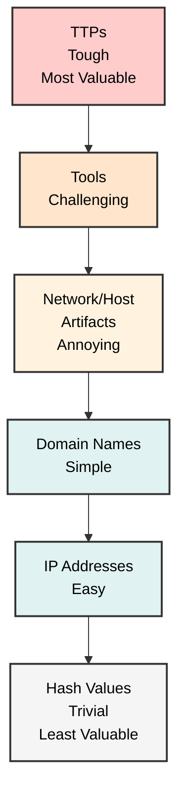
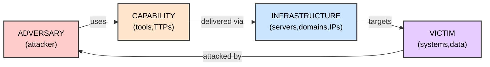
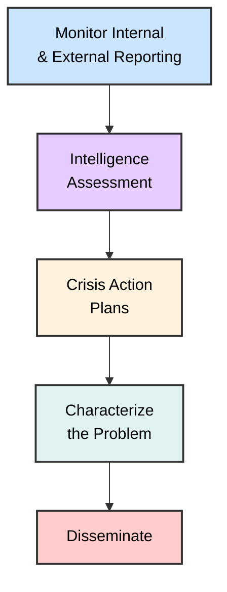
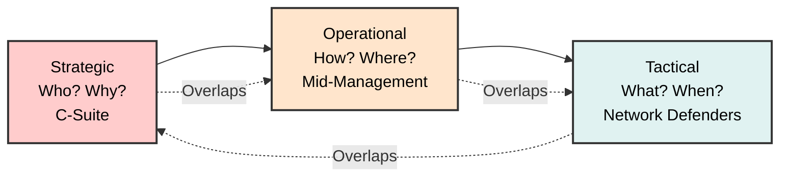
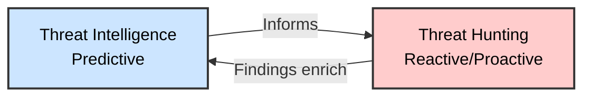

# Introduction to Threat Hunting & Hunting With Elastic
## SOC Analyst Cheatsheet - Module 4/15

---

## Table of Contents

0. [Overview](#0-overview)
1. [Threat Hunting Fundamentals](#1-threat-hunting-fundamentals)
2. [The Threat Hunting Process](#2-the-threat-hunting-process)
3. [Threat Hunting Glossary](#3-threat-hunting-glossary)
4. [Threat Intelligence Fundamentals](#4-threat-intelligence-fundamentals)
5. [Hunting With Elastic](#5-hunting-with-elastic)
6. [Interview Questions](#6-interview-questions)
7. [Additional Resources](#7-additional-resources)

---

## 0. Overview

> 📌 **WHY IT MATTERS**: The median "dwell time" (time between breach and detection) is **several weeks to months** (~3 weeks average). This means attackers could be in your network for weeks before you detect them!

### What is Threat Hunting?

**Threat hunting** is an active, human-led, and often hypothesis-driven practice that systematically combs through network data to identify stealthy, advanced threats that evade existing security solutions.

> 🔴 **KEY OBJECTIVE**: Reduce dwell time by recognizing malicious entities at the earliest stage of the cyber kill chain!

### Key Facets of Threat Hunting

- 📊 **Offensive, proactive strategy** - Prioritizes threat anticipation over reaction
- 🔴 **Offensive, reactive response** - Searches for artifacts related to verified incidents
- 🧠 **Adversarial mindset** - Understanding the attacker's perspective
- 📈 **Deep environment knowledge** - Network topology, assets, normal activity
- 🛠️ **High-fidelity data** - Quality telemetry and advanced tools (SIEM, EDR, IDS)

---

## The Relationship Between Incident Handling & Threat Hunting

> 📌 **INTEGRATION**: Threat hunting intersects with Incident Handling across all phases:

| IR Phase | Hunter's Role |
|---------|---------------|
| **Preparation** | Set up rules of engagement, establish operational protocols |
| **Detection & Analysis** | Augment investigations, validate IoCs, uncover hidden artifacts |
| **Containment/Eradication/Recovery** | Execute remediation (varies by organization) |
| **Post-Incident** | Provide recommendations to fortify security posture |

---

## A Threat Hunting Team's Structure

> 🔑 **IDEAL TEAM COMPOSITION**:

| Role | Responsibilities |
|------|-----------------|
| **Threat Hunter** | Core role - proactive search for IoCs, tool/platform proficiency |
| **Threat Intelligence Analyst** | Gather/analyze OSINT, dark web, threat feeds |
| **Incident Responders** | Manage confirmed threats, containment, eradication |
| **Forensics Experts** | DFIR, malware analysis, reverse engineering |
| **Data Analysts/Scientists** | ML, statistical models, pattern discovery |
| **Security Engineers/Architects** | Design security infrastructure |
| **Network Security Analyst** | Network behavior and traffic patterns |
| **SOC Manager** | Coordinate team operations |

---

## When Should We Hunt?

> 🚨 **TRIGGERS FOR IMMEDIATE HUNTING**:

1. **New Adversary/Vulnerability Info** - Newly discovered threat or vulnerability in your software
2. **New IoCs for Known Adversary** - Threat intelligence releases new indicators for a known threat actor targeting your industry
3. **Multiple Network Anomalies** - Several anomalies appearing together may indicate coordinated attack
4. **During Incident Response** - Hunt for connected threats while IR team contains the incident
5. **Periodic Proactive Actions** - Regular proactive hunting for latent threats

> 💡 **KEY MESSAGE**: The ideal time for threat hunting is **always the present**!

---

## The Relationship Between Risk Assessment & Threat Hunting

> 📌 **RISK ASSESSMENT ENABLES PRIORITIZED HUNTING**:

- **Prioritizing Hunting Efforts** - Focus on "crown jewels" - critical assets
- **Understanding Threat Landscape** - Use TTPs to develop hunting hypotheses
- **Highlighting Vulnerabilities** - Look for exploitation indicators in known weak areas
- **Informing Threat Intelligence** - Apply intel to likely threat actors and methods
- **Refining Incident Response Plans** - Anticipate and plan for potential breaches
- **Enhancing Cybersecurity Controls** - Feed back into security improvements

---

## 1. Threat Hunting Fundamentals

### Threat Hunting Definition

The threat hunting process commences with the identification of assets – systems or data – that could be high-value targets for threat actors. Next, we analyze the **TTPs (Tactics, Techniques, and Procedures)** these adversaries are likely to employ, based on current threat intelligence. We subsequently strive to proactively detect, isolate, and validate any artifacts related to the abovementioned TTPs and any anomalous activity that deviates from established baseline norms.

During the hunting endeavor, we regularly employ **Threat Intelligence**, a vital component that aids in formulating effective hunting hypotheses, developing counter-tactics, and executing protective measures to prevent system compromise.

---

## 2. The Threat Hunting Process

Below is a step-by-step description of the threat hunting process:

### 1. Setting the Stage

> 📌 **PLANNING & PREPARATION**:
- Lay out clear targets based on threat landscape, business requirements, threat intelligence
- Enable extensive logging across systems
- Ensure SIEM, EDR, IDS are correctly configured
- Stay informed about latest cyber threats and threat actor profiles

### 2. Formulating Hypotheses

> 🔍 **HYPOTHESIS-DRIVEN**:
- Make educated predictions to guide the hunt
- Sources: threat intelligence, industry updates, security tool alerts, intuition
- Must be **specific and testable**

**Example Hypothesis**: *"An APT group is leveraging a known vulnerability in our web server to establish a C2 channel"*

### 3. Designing the Hunt

> 🛠️ **HUNTING STRATEGY**:
- Identify data sources to analyze
- Define methodologies and tools
- Determine specific IoCs or patterns to hunt for
- Create custom scripts/queries if needed

### 4. Data Gathering and Examination

> 📊 **ACTIVE HUNTING**:
- Collect log files, network traffic, endpoint data
- Analyze using predetermined methodologies
- Find evidence supporting or refuting hypothesis
- Iterative process - refine as new info emerges

### 5. Evaluating Findings and Testing Hypotheses

> ✅ **ANALYSIS**:
- Confirm or disprove hypothesis
- Understand behavior of detected threats
- Identify affected systems
- Determine potential impact

### 6. Mitigating Threats

> 🚨 **REMEDIATION**:
- Isolate affected systems
- Eliminate malware
- Patch vulnerabilities
- Modify configurations

### 7. After the Hunt

> 📝 **LESSONS LEARNED**:
- Document findings, methods, outcomes
- Update threat intelligence platforms
- Enhance detection rules
- Refine incident response playbooks

---

## The Threat Hunting Process VS Emotet (Example)

Let's see how the threat hunting process could have been applied to hunt for Emotet malware:

1. **Setting the Stage**: Research Emotet's TTPs, identify critical assets (endpoints with admin privileges, email servers)
2. **Formulating Hypotheses**: "Emotet is using compromised email accounts to send phishing emails with malicious Word documents"
3. **Designing the Hunt**: Analyze email server logs, network traffic, endpoint logs for Emotet IoCs
4. **Data Gathering and Examination**: Search for suspicious emails, C2 communications
5. **Evaluating Findings**: Confirm Emotet infections, assess scope
6. **Mitigating Threats**: Isolate infected systems, block C2 servers, remove malware
7. **After the Hunt**: Update IoCs, improve detection rules

---

## 3. Threat Hunting Glossary

### Key Terms

> 🔑 **MUST-KNOW TERMS**:

**Adversary**: An entity (cyber criminals, insider threats, hacktivists, state-sponsored) seeking unauthorized access to your organization.

**APT (Advanced Persistent Threat)**: Highly organized groups with extensive resources, targeting high-value entities over prolonged periods.

> ⚠️ **NOTE**: "Advanced" refers to sophisticated strategic planning, not necessarily advanced techniques. "Persistent" refers to dogged persistence backed by substantial resources.

**TTPs (Tactics, Techniques, Procedures)**:
- **Tactics** - Strategic objectives (the "why")
- **Techniques** - Methods to accomplish objectives (the "how")
- **Procedures** - Step-by-step instructions (the "recipe")

**Indicator**: Technical data plus contextual information. 

> 📌 **Formula**: **Data + Context = Indicator**

**Threat**: Three factors:
- **Intent** - Why adversaries target you (espionage, financial gain)
- **Capability** - Tools, resources, skill level
- **Opportunity** - Conditions that allow attacks

**Campaign**: Collection of incidents sharing similar TTPs, believed to have comparable collection requirements.

**IOCs (Indicators of Compromise)**: Digital traces from active/past intrusions - file hashes, IPs, URLs, domains, executable names.

---

### Pyramid of Pain

> 🔴 **KEY CONCEPT**: The Pyramid of Pain shows hierarchy of indicators - harder for attacker to change = more valuable for defenders!



| Level | Indicator | Difficulty to Change |
|-------|-----------|---------------------|
| 🔴 **TTPs** | Adversary's tactics, techniques, procedures | Toughest |
| 🟠 **Tools** | Malware, exploits, C2 frameworks | Challenging |
| 🟡 **Network/Host Artifacts** | Unusual traffic patterns, registry entries | Annoying |
| 🟢 **Domain Names** | Malicious domains | Simple |
| 🟢 **IP Addresses** | C2 server IPs | Easy |
| ⚪ **Hash Values** | File hashes (MD5, SHA) | Trivial |

---

### Diamond Model of Intrusion Analysis

> 📌 **FRAMEWORK** for understanding cyber intrusions:



| Component | Description |
|-----------|-------------|
| **Adversary** | Individual/group responsible - capabilities, motivations |
| **Capability** | Tools, techniques, procedures (TTPs) used |
| **Infrastructure** | Physical/virtual resources - servers, domains, IPs |
| **Victim** | Target - systems, data, vulnerabilities |

---

## 4. Threat Intelligence Fundamentals

### Cyber Threat Intelligence Definition

> 📌 **WHY CTI MATTERS**: CTI provides essential insights to **fortify defenses** against cyberattacks. Goal: transition from reactive to **proactive, anticipatory** stance!

### Four Principles of CTI

> 🔑 **CTI requires**:
- ⏰ **Time** - Intelligence must be timely
- 🎯 **Actionable** - Must enable concrete actions  
- ✅ **Accurate** - Must be reliable
- 📊 **Relevant** - Must apply to your organization

### CTI Process Flow



### Three Levels of CTI



| Level | Audience | Focus | Questions |
|-------|----------|-------|------------|
| **Strategic** | C-Suite, VPs | Overview of adversary operations, TTPs, MO | Who? Why? |
| **Operational** | Mid-level Management | Campaigns, TTPs, how adversary operates | How? Where? |
| **Tactical** | Network Defenders | Immediate actionable IoCs, specific indicators | What? When? |

### Strategic Intelligence Details

- **Audience**: C-suite executives, VPs, company leaders
- **Purpose**: Align intelligence with company risks to inform decisions
- **Content**: Overview of adversary's operations over time, mapping TTPs and Modus Operandi (MO)
- **Questions**: Who? Why?
- **Example**: Report on APT28 (Fancy Bear) - past campaigns, motivations, targets, long-term strategies

### Operational Intelligence Details

- **Audience**: Mid-level management
- **Purpose**: Detailed campaign analysis
- **Content**: TTPs, adversary campaigns, operational details
- **Questions**: How? Where?
- **Example**: Detailed analysis of a ransomware campaign - initial access methods, lateral movement tactics, execution methods

### Tactical Intelligence Details

- **Audience**: Network Defenders, SOC analysts
- **Purpose**: Immediate actionable information
- **Content**: Specific IP addresses, URLs, domains, file hashes, registry keys
- **Questions**: What? When?
- **Example**: Specific C2 server IPs, malware hashes, phishing email indicators

---

## Difference Between Threat Intelligence & Threat Hunting

> 🔑 **Two distinct but interconnected specialties**:

### Threat Intelligence (Predictive)

**Purpose**: Anticipate the adversary's moves, ascertain their targets, and discern their methods of information acquisition.

**Mission**: Predict:
- 📍 **Location** of the intended attack
- ⏰ **Timing** of the attack
- 🎯 **Operational strategies** the adversary will employ
- 🎯 **Ultimate objectives** of the adversary

### Threat Hunting (Reactive & Proactive)

**Purpose**: Determine whether an adversary is present in the network (or was present and evaded detection).

**Triggered by**: An initiating event or incident - within our network or in a industry network

### How They Bolster Each Other



- CTI team analyzes adversary activities → shares with threat hunters
- Threat hunting findings → refine CTI predictions

---

### How To Go Through A Tactical Threat Intelligence Report

> 📌 **Step-by-step methodology for SOC analysts & threat hunters**:

#### 1. Comprehend the Report's Scope and Narrative

- Understand the broader context of the threat
- Identify macro-level insights about attacker's objectives
- Assess the pertinence of the threat to your organization

#### 2. Spotting and Classifying the IOCs

**IOC Categories:**
| Type | Examples |
|------|----------|
| **Network-based** | IP addresses, domains |
| **Host-based** | File hashes, registry keys |
| **Email-based** | Email addresses, subject lines |

**Additional IOC Types:**
- Mutex names generated by malware
- SSL certificate hashes
- Specific API calls
- Network traffic patterns (User-Agents, HTTP headers, DNS request patterns)

**IOC Enrichment**: IP addresses can be supplemented with geolocation data, WHOIS information, or associated domains.

#### 3. Comprehend the Attack's Lifecycle

- Report depicts TTPs mapped to MITRE ATT&CK framework
- Example (Emotet): Spear-phishing (Initial Access) → Payload execution → Persistence → Defense Evasion → C2
- Understanding lifecycle helps forecast attacker's moves and formulate response

#### 4. Analysis and Validation of IOCs

- **Cross-reference** with threat intelligence sources (VirusTotal, AlienVault OTX)
- **Consider age** of IOCs - older ones may not be relevant
- **Contextualize** IOCs correctly (e.g., C2 IP may also host legitimate websites)
- **Check source reliability** and whitelist history
- **Understand false positive rate** to avoid alert fatigue

#### 5. Incorporating IOCs into Security Infrastructure

| Action | Implementation |
|--------|----------------|
| Firewall | Update rules with malicious IPs/domains |
| EDR | Incorporate file hashes |
| IDS/IPS | Create new signatures |
| Email Security | Update gateway with email-based IOCs |

> ⚠️ **Consider business impact** - blocking an IP might affect business-critical services. Consider alerting vs blocking.

#### 6. Proactive Threat Hunting

- Search logs for network connections to C2 servers
- Scan endpoints for identified file hashes
- Check email logs for phishing indicators
- Hunt for broader TTP signs, not just specific IOCs
- Example: Hunt for suspicious PowerShell activity (Emotet uses it for execution/evasion)

#### 7. Continuous Monitoring and Learning

- Monitor environment for hits
- Trigger predefined incident response on detection
- Enhance security posture (user education, detection rules)
- **Contribute back** to threat intelligence community - share new IOCs/TTPs with ISACs/ISAOs

---

## 5. Hunting With Elastic

### Stuxbot Malware Overview

> 🔴 **THREAT ACTIVE**: Organized cybercrime collective targeting Windows users

| Attribute | Details |
|-----------|---------|
| **Platform** | Microsoft Windows |
| **Target** | Windows Users |
| **Impact** | Complete computer takeover / Domain escalation |
| **Risk Level** | Critical |
| **Motivation** | Espionage |

### Attack Characteristics

- **Initial Access**: Opportunistic phishing via email
- **Delivery Method**: OneNote files with embedded batch files
- **Payload**: PowerShell scripts downloaded from Pastebin
- **RAT Capabilities**: Modular - screen capture, Mimikatz, interactive CMD shell

### Persistence Mechanisms

- **EXE files** deposited on disk

### Lateral Movement Methods

1. **Microsoft-signed PsExec** (original)
2. **WinRM** (PowerShell Remoting)

### Indicators of Compromise (IOCs)

**Malicious Files:**
- `invoice.one` (OneNote file)

**Staging URLs:**
- `https://transfer.sh/get/kNxU7/invoice.one`
- `https://mega.io/dl9o1Dz/invoice.one`

**PowerShell Scripts:**
- `https://pastebin.com/raw/AvHtdKb2`
- `https://pastebin.com/raw/gj58DKz`

**C2 Servers:**
- `91.90.213.14:443`
- `103.248.70.64:443`
- `141.98.6.59:443`

**File Hashes (SHA256):**
- `226A723FFB4A91D9950A8B266167C5B354AB0DB1DC225578494917FE53867EF2`
- `C346077DAD0342592DB753FE2AB36D2F9F1C76E55CF8556FE5CDA92897E99C7E`
- `018D37CBD3878258C29DB3BC3F2988B6AE688843801B9ABC28E6151141AB66D4`

---

### Threat Intelligence Report: Stuxbot

> 📌 **CASE STUDY**: This section demonstrates real threat hunting using the Stuxbot malware case

The organized cybercrime collective known as "Stuxbot" initiated phishing campaigns targeting Windows users. The primary motivation is espionage, with potential impact being complete takeover of victim's computer or domain escalation.

**Attack Sequence:**


Phishing email → OneNote file → Batch file → PowerShell script in memory → RAT executable for persistence.

---

### Initial Access - Phishing Detection

**Hunting for downloaded OneNote files:**

Using Sysmon Event ID 15 (FileCreateStreamHash) to detect browser file downloads:

```
event.code:15 AND file.name:*invoice.one
```


**Finding:** 3 hits detected - file downloaded by user Bob to Downloads folder on March 26, 2023 @ 22:05:47.

**Alternative detection using Sysmon Event ID 11 (File create):**

```
event.code:11 AND file.name:invoice.one*
```


**Key Findings:**
- Hostname: WS001
- IP Address: 192.168.28.130

---

### Network Activity Analysis

**DNS Query Analysis:**

```
source.ip:192.168.28.130 AND dns.question.name:*
```


Filter out noise (google.com, google-analytics.com) to identify suspicious domains:


**Key Finding:** User accessed `file.io` (file hosting provider) - the source of the malicious OneNote file.

**Network Connections to file.io:**

```
source.ip:192.168.28.130 AND destination.ip:34.197.10.85
```


**Confirmed:** User Bob successfully downloaded "invoice.one" from file.io.

---

### Execution Analysis

**Detecting OneNote file access:**

```
event.code:1 AND process.command_line:*invoice.one*
```


**Finding:** OneNote file was accessed ~6 seconds after download.

**Finding child processes spawned by OneNote:**

```
event.code:1 AND process.parent.name:"ONENOTE.EXE"
```


**Critical Finding:** cmd.exe executed "invoice.bat" from a temporary location!

---

### Payload Analysis

**Tracking the batch file execution:**

```
event.code:1 AND process.parent.command_line:*invoice.bat*
```


**Finding:** PowerShell was launched with suspicious arguments to download from Pastebin!

**PowerShell Activity Tracking:**

```
process.pid:"9944" and process.name:"powershell.exe"
```


**Key Observations:**
- File creation events
- Network connections
- DNS resolutions
- Password spraying script detected
- EXE file drop ("default.exe")
- NGROK DNS queries (C2 communication)
- Connections to DC1

---

### Command & Control (C2) Analysis

**C2 Network Connections:**

```
source.ip:192.168.28.130 AND destination.ip:18.158.249.75
```


**NGROK DNS Analysis:**

```
dns.question.name:*ngrok*
```


**Finding:** C2 IP changed over time - attacker used dynamic DNS!

---

### Persistence Analysis

**Detecting the dropped executable:**

```
process.name:"default.exe"
```


**Findings:**
- Initiated DNS queries for NGROK
- Connected to C2 IP addresses
- Uploaded "svchost.exe" and "SharpHound.exe"
- SharpHound is used for Active Directory enumeration!

**SharpHound Execution:**

```
process.name:"SharpHound.exe"
```


**Finding:** SharpHound executed twice to collect AD attack paths!

---

### Lateral Movement Detection

**Hash-based detection - finding all infected machines:**

```
process.hash.sha256:018d37cbd3878258c29db3bc3f2988b6ae688843801b9abc28e6151141ab66d4
```


**Critical Finding:** 
- Infection spread to WS001 AND PKI server!
- Backdoor placed under user "svc-sql1" profile

**Lateral Movement via PSExec:**


**Finding:** Parent process was PSEXESVC - lateral movement via PSExec!

---

### Credential Access Detection

**Detecting password spraying:**

```
(event.code:4624 OR event.code:4625) AND winlog.event_data.LogonType:3 AND source.ip:192.168.28.130
```


**Findings:**
- Failed administrator login attempts (password cracking)
- Successful logons for "svc-sql1" - account compromised!

---

### KQL (Kibana Query Language) Reference

| Query Type | Syntax | Example |
|------------|--------|---------|
| **Basic Search** | `field:value` | `event.code:15` |
| **Boolean AND** | `field:value AND other:value` | `event.code:1 AND process.name:cmd.exe` |
| **Boolean OR** | `field:value OR other:value` | `process.name:powershell.exe OR process.name:cmd.exe` |
| **Wildcards** | `field:*pattern*` | `file.name:*invoice*` |
| **Parent Process** | `process.parent.name:"NAME"` | `process.parent.name:"ONENOTE.EXE"` |
| **Specific Value** | `field:"value"` | `process.name:"default.exe"` |
| **Time Range** | `@timestamp:[start TO end]` | `@timestamp:[2023-03-26 TO 2023-03-28]` |

### Common Sysmon Event Codes for Hunting

| Event ID | Description |
|----------|-------------|
| **1** | Process Create |
| **3** | Network Connection |
| **11** | File Create |
| **15** | FileCreateStreamHash |
| **22** | DNSEvent |
| **4648** | Lateral Movement |

### Hunting Queries Summary

| Hunt Objective | KQL Query |
|----------------|------------|
| Find downloaded malicious files | `event.code:15 AND file.name:*invoice.one*` |
| Track process execution | `event.code:1 AND process.parent.name:"ONENOTE.EXE"` |
| Detect PowerShell activity | `process.name:"powershell.exe"` |
| Find C2 communications | `dns.question.name:*ngrok*` |
| Detect lateral movement | `process.parent.command_line:*PSEXESVC*` |
| Find by file hash | `process.hash.sha256:<hash>` |

---

## 6. Interview Questions

### Q1: What is threat hunting and why is it important?

**Answer:** Threat hunting is a proactive, human-led practice that searches through network data to identify stealthy threats that evade existing security solutions. It's important because the average dwell time (time from breach to detection) is several weeks, meaning attackers could be in your network for ~3 weeks before detection.

---

### Q2: What is the difference between proactive and reactive threat hunting?

**Answer:**
- **Proactive**: Based on hypotheses, attacker TTPs, and intelligence - searching for unknown threats
- **Reactive**: Searching for artifacts related to a verified incident based on evidence

---

### Q3: What is the Pyramid of Pain and why does it matter?

**Answer:** The Pyramid of Pain is a hierarchy of indicators where harder-to-change indicators (TTPs) are more valuable for detection. Changing TTPs forces attackers to fundamentally change their attack methodology, which is expensive and difficult.

---

### Q4: What is the Diamond Model of Intrusion Analysis?

**Answer:** A framework with four components: Adversary, Capability, Infrastructure, and Victim. It helps understand the relationships between attackers, their tools, their resources, and their targets.

---

### Q5: What are the key roles in a threat hunting team?

**Answer:** Threat Hunter, Threat Intelligence Analyst, Incident Responder, Forensics Expert, Data Analyst, Security Engineer, Network Security Analyst, SOC Manager.

---

### Q6: When should you initiate threat hunting?

**Answer:** 
- New vulnerability/adversary discovered
- New IoCs for known threat actor
- Multiple network anomalies detected
- During incident response
- As periodic proactive exercise

---

### Q7: What is the threat hunting process lifecycle?

**Answer:** Setting the Stage → Formulating Hypotheses → Designing the Hunt → Data Gathering → Evaluating Findings → Mitigating Threats → After the Hunt → Continuous Learning

---

### Q8: What is the relationship between risk assessment and threat hunting?

**Answer:** Risk assessment helps prioritize hunting efforts by identifying critical assets ("crown jewels"), understanding the threat landscape, highlighting vulnerabilities, and informing threat intelligence application.

---

### Q9: How does threat hunting integrate with incident handling?

**Answer:** Hunters support in Detection & Analysis phase, may assist in Containment/Eradication/Recovery, and provide recommendations in Post-Incident phase.

---

### Q10: What is dwell time?

**Answer:** Dwell time is the median duration between a security breach and its detection - typically several weeks to months.

---

## 7. Additional Resources

### Tools
- [Elastic Security](https://www.elastic.co/security)
- [Kibana](https://www.elastic.co/kibana)
- [TheHive](https://thehive-project.org/)
- [MISP](https://www.misp-project.org/)

### References
- [MITRE ATT&CK](https://attack.mitre.org)
- [Diamond Model Paper](https://www.zerodayinitiative.com/blog/)
- [Pyramid of Pain - David Bianco](https://www.fireeye.com/)

### Communities
- r/dfir (Reddit)
- SANS Threat Hunting Community
- OpenCTI Community

---

*Module 4/15 - Introduction to Threat Hunting & Hunting With Elastic*
*Built with research + HTB Academy materials*