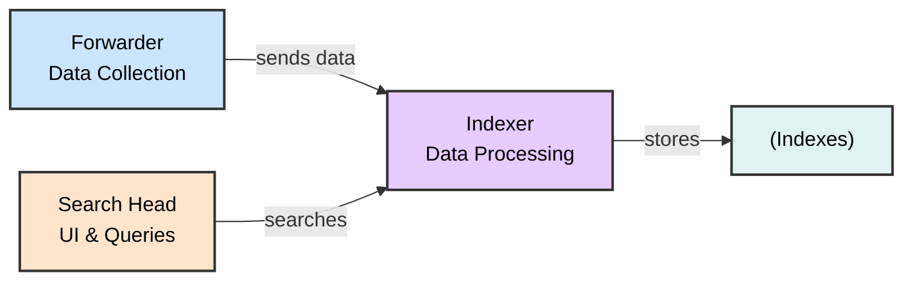

# Understanding Log Sources & Investigating with Splunk
## SOC Analyst Cheatsheet - Module 5/15

---

## Table of Contents

0. [Overview](#0-overview)
1. [Introduction To Splunk & SPL](#1-introduction-to-splunk--spl)
2. [Splunk Architecture](#2-splunk-architecture)
3. [Splunk as a SIEM Solution](#3-splunk-as-a-siem-solution)
4. [SPL Commands Reference](#4-spl-commands-reference)
5. [How To Identify The Available Data](#5-how-to-identify-the-available-data)
6. [Practical Exercises](#6-practical-exercises)

---

## 0. Overview

> 📌 **WHY IT MATTERS**: Splunk is a highly scalable, versatile, and robust data analytics software solution known for its ability to ingest, index, analyze, and visualize massive amounts of machine data. Splunk drives a wide range of initiatives including cybersecurity, compliance, data pipelines, IT monitoring, observability, and overall IT and business management.

### Key Capabilities

- **Data Ingestion**: Collects machine data from various sources
- **Indexing**: Organizes and stores data in indexes
- **Analysis**: Enables searching, filtering, and transforming data
- **Visualization**: Provides dashboards, reports, and alerts

---

## 1. Introduction To Splunk & SPL

### What Is Splunk?

Splunk is a powerful data analytics platform that can:

- ✅ Ingest massive amounts of machine data
- ✅ Index and organize data efficiently
- ✅ Analyze and visualize data in real-time
- ✅ Power cybersecurity, compliance, and IT monitoring initiatives


> 📌 **DATA SOURCES**:
> - Aggregated/API data → Heavy Forwarder
> - Event logs and OS stats → Universal Forwarder
> - Wire data → Splunk Stream or HTTP Event Collector
> - Local file monitoring → Universal Forwarder
> - DevOps, IoT, containers, syslog hosts


> 📌 **ARCHITECTURE**: Search Head for UI, Indexer for data processing, Forwarder for data collection. Includes agentless data sources like change tickets, logs, and metrics, with auto-load balanced indexing.

---

## 2. Splunk Architecture

### Core Components



| Component | Function |
|-----------|----------|
| **Forwarders** | Data collection from various sources |
| **Indexers** | Receive, organize, and store data in indexes |
| **Search Heads** | Coordinate search jobs, provide UI, create Knowledge Objects |
| **Deployment Server** | Manage configuration for forwarders |
| **Cluster Master** | Coordinate indexers in clustered environment |
| **License Master** | Manage Splunk licensing |

### Forwarder Types

| Type | Description | Use Case |
|------|-------------|----------|
| **Universal Forwarder (UF)** | Lightweight agent, no preprocessing | Remote data collection, minimal impact |
| **Heavy Forwarder (HF)** | Parses data before forwarding, can route based on criteria | Data aggregation, firewall logs, API data |
| **HTTP Event Collector (HEC)** | Token-based JSON/raw API for applications | Direct data ingestion from apps |

> 🔴 **KEY DIFFERENCE**: Heavy Forwarders parse data BEFORE forwarding, Universal Forwarders forward raw data.

### Splunk Key Components

- **Splunk Web Interface**: GUI for searching, alerts, dashboards, reports
- **SPL (Search Processing Language)**: Query language for searching/filtering/manipulating data
- **Apps and Add-ons**: Extend functionality, found on Splunkbase
- **Knowledge Objects**: Fields, tags, event types, lookups, macros, data models, alerts

---

## 3. Splunk as a SIEM Solution

> 📌 **SIEM CAPABILITIES**: Splunk as a SIEM solution provides:

- 🔴 **Real-time data analysis** - Monitor events as they occur
- 🔴 **Historical data analysis** - Investigate past incidents
- 🔴 **Cybersecurity monitoring** - Detect and respond to threats
- 🔴 **Incident response** - Support investigation and remediation
- 🔴 **Threat hunting** - Proactively search for threats
- 🔴 **User Behavior Analytics (UBA)** - Detect anomalous user behavior

---

## 4. SPL Commands Reference

### Basic Searching

```splunk
search index="main" "UNKNOWN"
```

> 🔴 **KEY CONCEPT**: By default, a search returns all events, but it can be narrowed down with keywords, boolean operators (AND, OR, NOT), comparison operators, and wildcard characters.

**Example**: By specifying the index as main, the query narrows down the search to only the events stored in the main index. The term UNKNOWN is then used as a keyword to filter and retrieve events that include this specific term.

### Wildcard Search

```splunk
index="main" "*UNKNOWN*"
```

> 📌 Searches for events containing "UNKNOWN" anywhere in the event data. Wildcards (*) can replace any number of characters.

### Fields and Comparison Operators

```splunk
index="main" EventCode!=1
```

> 🔴 Searches for events where EventCode is NOT equal to 1. Splunk automatically identifies fields like source, sourcetype, host, EventCode, etc.

> 📌 **COMPARISON OPERATORS**: =, !=, <, >, <=, >=

### The fields Command

```splunk
index="main" sourcetype="WinEventLog:Sysmon" EventCode=1 | fields - User
```

> 📌 The fields command specifies which fields should be included or excluded. After retrieving process creation events, this excludes the User field from results.

### The table Command

```splunk
index="main" sourcetype="WinEventLog:Sysmon" EventCode=1 | table _time, host, Image
```

> 📌 Presents search results in tabular format with specified fields:
> - `_time`: timestamp of the event
> - `host`: name of the host where event occurred
> - `Image`: name of the executable file representing the process

### The rename Command

```splunk
index="main" sourcetype="WinEventLog:Sysmon" EventCode=1 | rename Image as Process
```

> 📌 Renames a field in search results. Image field represents executable name; renaming it to Process allows subsequent references.

### The dedup Command

```splunk
index="main" sourcetype="WinEventLog:Sysmon" EventCode=1 | dedup Image
```

> 📌 Removes duplicate entries based on Image field. If same process is created multiple times, it appears only once.

### The sort Command

```splunk
index="main" sourcetype="WinEventLog:Sysmon" EventCode=1 | sort - _time
```

> 📌 Sorts results in descending order (most recent first). Use `-` for descending.

### The stats Command

```splunk
index="main" sourcetype="WinEventLog:Sysmon" EventCode=3 | stats count by _time, Image
```

> 📌 Returns table where each row represents unique timestamp and process combination. Count shows network connection events per process at that time.

### The chart Command

```splunk
index="main" sourcetype="WinEventLog:Sysmon" EventCode=3 | chart count by _time, Image
```

> 📌 Creates visualization where each column represents a unique process. Easily see network events over time for each process.

### The eval Command

```splunk
index="main" sourcetype="WinEventLog:Sysmon" EventCode=1 | eval Process_Path=lower(Image)
```

> 📌 Creates new field with lowercase version of Image field. Does not change original field.

### The rex Command

```splunk
index="main" EventCode=4662 | rex max_match=0 "[^%](?<guid>{.*})" | table guid
```

> 🔴 **EXTRACTS GUIDs**: Useful because GUIDs are not automatically extracted from 4662 event logs.
> - `rex max_match=0` ensures all occurrences are extracted (not just first)
> - Pattern `{.*}` finds substrings beginning with { and ending with }
> - `[^%]` ensures match doesn't begin with % character

### The lookup Command

#### Step 1: Create Lookup CSV File

```csv
filename, is_malware
notepad.exe, false
cmd.exe, false
powershell.exe, false
sharphound.exe, true
randomfile.exe, true
```

#### Step 2: Add Lookup Table in Splunk UI


#### Step 3: Use Lookup in SPL

```splunk
index="main" sourcetype="WinEventLog:Sysmon" EventCode=1 
| rex field=Image "(?P<filename>[^\\]+)$" 
| eval filename=lower(filename) 
| lookup malware_lookup.csv filename OUTPUTNEW is_malware 
| table filename, is_malware
```

**Step-by-step breakdown:**
1. `index="main" sourcetype="WinEventLog:Sysmon" EventCode=1`: Search for Sysmon process creation events
2. `| rex field=Image "(?P<filename>[^\\]+)$"`: Extract filename after last backslash
3. `| eval filename=lower(filename)`: Convert to lowercase for case-insensitive match
4. `| lookup malware_lookup.csv filename OUTPUTNEW is_malware`: Check if malicious
5. `| table filename, is_malware`: Display results

#### Alternative with dedup

```splunk
index="main" sourcetype="WinEventLog:Sysmon" EventCode=1 
| eval filename=mvdedup(split(Image, "\\")) 
| eval filename=mvindex(filename, -1) 
| eval filename=lower(filename) 
| lookup malware_lookup.csv filename OUTPUTNEW is_malware 
| table filename, is_malware 
| dedup filename, is_malware
```

**Breakdown:**
- `mvdedup(split(Image, "\\"))`: Split path into multivalue field, remove duplicates
- `mvindex(filename, -1)`: Select last element (actual filename)
- `dedup`: Remove duplicate entries

### The inputlookup Command

```splunk
| inputlookup malware_lookup.csv
```

> 📌 Retrieves all records from lookup file without joining to search results. Used to verify lookup content.

### Time Range Commands

```splunk
index="main" earliest=-7d EventCode!=1
```

> 📌 Retrieves events from last 7 days where EventCode is NOT 1. Use negative numbers for relative time.

### The transaction Command

```splunk
index="main" sourcetype="WinEventLog:Sysmon" (EventCode=1 OR EventCode=3) 
| transaction Image startswith=eval(EventCode=1) endswith=eval(EventCode=3) maxspan=1m 
| table Image 
| dedup Image
```

> 🔴 **THREAT HUNTING USE CASE**: Groups events sharing common characteristics.
> - Groups by Image field
> - Starts with EventCode=1 (process creation)
> - Ends with EventCode=3 (network connection)
> - Max 1-minute window
> - Identifies sequences of process creation followed by network connection - useful for detecting malware behavior

### Subsearches

```splunk
index="main" sourcetype="WinEventLog:Sysmon" EventCode=1 
NOT [ search index="main" sourcetype="WinEventLog:Sysmon" EventCode=1 | top limit=100 Image | fields Image ] 
| table _time, Image, CommandLine, User, ComputerName
```

> 🔴 **RARE PROCESS HUNTING**:
> - Main search: Process creation events
> - `NOT []`: Excludes subsearch results
> - Subsearch: Returns top 100 most common processes
> - Result: Shows rare processes not in top 100 - may indicate malicious activity

> ⚠️ **NOTE**: This type of search can generate a lot of noise in environments where new and unique processes are frequently created. Careful tuning and context are important.

---

## 5. How To Identify The Available Data

### Approach 1: Using SPL Commands

#### List All Indexes

```splunk
| eventcount summarize=false index=* | table index
```

> 📌 Uses eventcount to count events in all indexes. `summarize=false` shows counts separately.

#### List All Source Types

```splunk
| metadata type=sourcetypes
```

> 📌 Returns all sourcetypes with metadata: firstTime, lastTime, totalCount

#### List Source Types (Simplified)

```splunk
| metadata type=sourcetypes index=* | table sourcetype
```

#### List All Data Sources

```splunk
| metadata type=sources index=* | table source
```

#### View Raw Data for Specific Sourcetype

```splunk
sourcetype="WinEventLog:Security" | table _raw
```

> 📌 Shows raw event data for specified sourcetype

#### View All Fields for Sourcetype

```splunk
sourcetype="WinEventLog:Security" | table *
```

> ⚠️ Can produce very wide table if many fields exist

#### Specific Field Extraction

```splunk
sourcetype="WinEventLog:Security" | fields Account_Name, EventCode | table Account_Name, EventCode
```

#### Field Summary

```splunk
sourcetype="WinEventLog:Security" | fieldsummary
```

> 📌 **FIELDSUMMARY OUTPUT**:
> | Field | Description |
> |-------|-------------|
> | field | The name of the field |
> | count | Number of events containing the field |
> | distinct_count | Number of distinct values |
> | is_exact | Whether count is exact or estimated |
> | max | Maximum value |
> | mean | Mean value |
> | min | Minimum value |
> | numeric_count | Number of numeric values |
> | stdev | Standard deviation |
> | values | Sample values |
> | modes | The most common values |
> | numBuckets | Number of buckets used to estimate distinct count |

> ⚠️ Note: Values are calculated based on search results. Ensure time range is large enough to capture all possible fields.

#### Event Distribution Over Time

```splunk
index=* sourcetype=* | bucket _time span=1d | stats count by _time, index, sourcetype | sort - _time
```

> 📌 Groups events into 1-day buckets, counts by time/index/sourcetype

#### Rare Event Types

```splunk
index=* sourcetype=* | rare limit=10 index, sourcetype
```

> 📌 Finds 10 rarest combinations - may indicate abnormal behavior

#### Rare Parent Processes

```splunk
index="main" | rare limit=20 useother=f ParentImage
```

> 📌 Shows 20 least common ParentImage values

#### Fields with Low Count

```splunk
index=* sourcetype=* | fieldsummary | where count < 100 | table field, count, distinct_count
```

> 📌 Shows fields appearing in less than 100 events

#### Event Diversity

```splunk
index=* | sistats count by index, sourcetype, source, host
```

> 📌 Shows event diversity across indexes, sources, and hosts

#### Rare Field Combinations

```splunk
index=* sourcetype=* | rare limit=10 field1, field2, field3
```

> 📌 Find uncommon combinations of field values. Replace field1, field2, field3 with actual field names.

---

### Approach 2: Using Splunk User Interface

> 🔴 **UI-BASED IDENTIFICATION**:

1. **Data Sources**: Settings → Data inputs → Review input methods
2. **Data Events**: Search & Reporting app → Fast/Verbose mode
3. **Fields**: Click event → View Selected/Interesting/All fields
4. **Data Models**: Settings → Data Models → Explore hierarchical structures

#### Search Modes


> 📌 **Search Modes**:
> - **Fast Mode**: Quick scanning through data
> - **Verbose Mode**: Dive deep into event details
> - **Smart Mode**: Auto-detect best mode

#### Event Details


> 📌 Click any event to expand and view:
> - Raw event data
> - All extracted fields
> - Selected Fields (always shown: host, source, sourcetype)
> - Interesting Fields (appear in ≥20% of events)

#### Data Models


> 📌 **Data Models** provide hierarchical view of data:
> - Access: Settings → Data Models
> - Each model has objects with relevant fields
> - No SPL knowledge required

#### Pivots


> 📌 **Pivots**: Drag-and-drop interface for reports/visualizations without writing SPL

---

## 6. Practical Exercises

### Key Exercises Summary

> 📌 **SPLUNK PRACTICE TASKS**:

1. **Data Source Identification** - Use metadata commands to identify available indexes and sourcetypes
2. **Field Exploration** - Use fieldsummary to understand available fields
3. **Process Analysis** - Search for Sysmon EventCode=1 (process creation)
4. **Network Connection Analysis** - Search for EventCode=3 (network connections)
5. **Threat Hunting** - Use transaction command to identify malicious process sequences
6. **Lookup Enrichment** - Create and use lookup tables for malware detection

> 🔴 **Remember**: Always follow your organization's data governance policies when exploring data!

---

### SPL Reference Resources

- [Splunk Search Reference](https://docs.splunk.com/Documentation/SCS/current/SearchReference/Introduction)
- [Splunk Cloud Search Reference](https://docs.splunk.com/Documentation/SplunkCloud/latest/SearchReference/)
- [Splunk Cloud Search](https://docs.splunk.com/Documentation/SplunkCloud/latest/Search/)

---

### Common Sysmon Event Codes Reference

| Event ID | Description |
|----------|-------------|
| **1** | Process Create |
| **3** | Network Connection |
| **5** | Process Terminated |
| **6** | Driver Loaded |
| **8** | CreateRemoteThread |
| **10** | ProcessAccess |
| **11** | FileCreate |
| **12** | RegistryEvent (Object Create/Delete) |
| **13** | RegistryEvent (Value Set) |
| **15** | FileCreateStreamHash |
| **22** | DNSEvent |
| **23** | FileDelete |

---

*Module 5/15 - Understanding Log Sources & Investigating with Splunk*
*Built with research + HTB Academy materials*

---

## 2. Using Splunk Applications

### What Are Splunk Apps?

> 📌 **DEFINITION**: Splunk applications (apps) are packages that extend Splunk capabilities to manage specific types of operational data. Each app is tailored to handle data from specific technologies or use cases, acting as a pre-built knowledge package.

### Key Features of Splunk Apps

- ✅ Custom data inputs
- ✅ Custom visualizations
- ✅ Dashboards
- ✅ Alerts
- ✅ Reports

> 🔴 **MULTIPLE WORKSPACES**: Splunk Apps enable coexistence of multiple workspaces on a single Splunk instance, catering to different use cases and user roles.

### Splunk Apps for SIEM

> 📌 **SECURITY APPS**: Apps designed for SIEM purposes provide capabilities to:
- ✅ Ingest security-related data
- ✅ Analyze security events
- ✅ Visualize security data
- ✅ Detect complex threats
- ✅ Perform in-depth investigations

### Important Considerations

> ⚠️ **RESOURCE & LICENSING NOTES**:
- Many apps can be **resource-intensive**
- Ensure Splunk deployment is **sized correctly** for additional workload
- Verify **correct licenses** for premium apps
- Be aware of **increased license usage** due to added data inputs

---

### Installing Sysmon App for Splunk

> 📌 **APP**: We'll use the Sysmon App for Splunk by Mike Haag - provides insights and visibility into Sysmon deployments.

#### Step 1: Sign Up for Splunkbase Account


> 🔴 Register at [splunkbase](https://splunkbase.splunk.com) - the marketplace for Splunk apps.

#### Step 2: Download the Sysmon App


#### Step 3: Add App to Search Head


> 📌 Navigate to: **Apps** → **Manage Apps** → **Install from file**

#### Step 4: Configure the Macro

> 🔴 **IMPORTANT**: Adjust the application's macro so events are loaded correctly.

1. Go to **Settings** → **Advanced Search** → **Search Macros**


2. Find the **sysmon** macro under "Sysmon App for Splunk"


3. Edit the definition to:

```
index="main" sourcetype="WinEventLog:Sysmon"
```


---

### Using the Sysmon App

#### Accessing the App

> 📌 Locate **Sysmon App for Splunk** in the "Apps" column on Splunk home page

#### File Activity Tab


Let's now specify "All time" on the time picker and click "Submit". Results are generated successfully; however, no results are appearing in the "Top Systems" section.


> ⚠️ If "Top Systems" shows no results, the dashboard needs fixing.

#### Fixing the Search

1. Click **"Edit"** in the upper right corner


2. The issue: Sysmon Event ID 11 doesn't have a field named **Computer**, but does have **ComputerName**


3. Fix: Change `top Computer` to `top ComputerName`

4. Click **"Apply"**

#### Results After Fix


> 📌 Results now generate successfully in "Top Systems" section.

---

### Practical Exercises

> 📌 **SPLUNK PRACTICE TASKS**:

1. **Explore Sysmon App** - Navigate to different tabs (File Activity, Network Activity, Reports)
2. **Fix Dashboard Searches** - Modify searches when no results appear due to non-existent fields
3. **Net View Report** - Fix the "Net - net view" report search
4. **Network Connections** - Find connections initiated by SharpHound.exe

> 🔴 **LEARNING EXERCISE**: Modify searches when no results are generated due to non-existent fields, continuing until desired results are obtained.

---

### Sysmon App Navigation Reference

| Tab | Description |
|-----|-------------|
| **File Activity** | Monitor file creation events |
| **Network Activity** | View network connections |
| **Processes** | Process creation and termination |
| **Reports** | Pre-built security reports |

---

*Module 5/15 - Understanding Log Sources & Investigating with Splunk*
*Built with research + HTB Academy materials*


---

*Module 5/15 - Understanding Log Sources & Investigating with Splunk*
*Built with research + HTB Academy materials*


