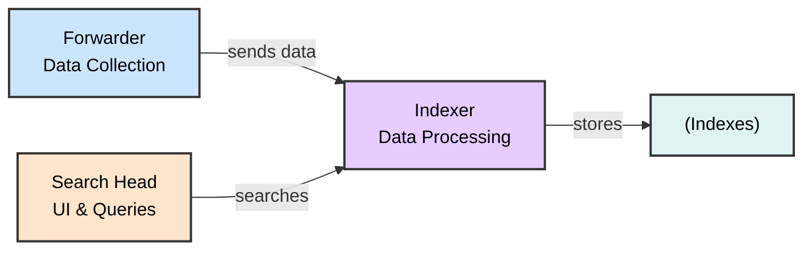

# Understanding Log Sources & Investigating with Splunk
## SOC Analyst Cheatsheet - Module 5/15

---

## Table of Contents

0. [Overview](#0-overview)
1. [Introduction To Splunk & SPL](#1-introduction-to-splunk--spl)
2. [Splunk Architecture](#2-splunk-architecture)
3. [Intrusion Detection With Splunk (Real-world Scenario)](#3-intrusion-detection-with-splunk-real-world-scenario)
4. [Detecting Attacker Behavior With Splunk Based On TTPs](#4-detecting-attacker-behavior-with-splunk-based-on-ttps)
5. [Splunk as a SIEM Solution](#3-splunk-as-a-siem-solution)
6. [SPL Commands Reference](#4-spl-commands-reference)
7. [How To Identify The Available Data](#5-how-to-identify-the-available-data)
8. [Practical Exercises](#6-practical-exercises)

---

## 0. Overview

> 📌 **WHY IT MATTERS**: Splunk is a highly scalable, versatile, and robust data analytics software solution known for its ability to ingest, index, analyze, and visualize massive amounts of machine data. Splunk drives a wide range of initiatives including cybersecurity, compliance, data pipelines, IT monitoring, observability, and overall IT and business management.

### Key Capabilities

- **Data Ingestion**: Collects machine data from various sources
- **Indexing**: Organizes and stores data in indexes
- **Analysis**: Enables searching, filtering, and transforming data
- **Visualization**: Provides dashboards, reports, and alerts

---

## 1. Introduction To Splunk & SPL

### What Is Splunk?

Splunk is a powerful data analytics platform that can:

- ✅ Ingest massive amounts of machine data
- ✅ Index and organize data efficiently
- ✅ Analyze and visualize data in real-time
- ✅ Power cybersecurity, compliance, and IT monitoring initiatives


> 📌 **DATA SOURCES**:
> - Aggregated/API data → Heavy Forwarder
> - Event logs and OS stats → Universal Forwarder
> - Wire data → Splunk Stream or HTTP Event Collector
> - Local file monitoring → Universal Forwarder
> - DevOps, IoT, containers, syslog hosts


> 📌 **ARCHITECTURE**: Search Head for UI, Indexer for data processing, Forwarder for data collection. Includes agentless data sources like change tickets, logs, and metrics, with auto-load balanced indexing.

---

## 2. Splunk Architecture

### Core Components



| Component | Function |
|-----------|----------|
| **Forwarders** | Data collection from various sources |
| **Indexers** | Receive, organize, and store data in indexes |
| **Search Heads** | Coordinate search jobs, provide UI, create Knowledge Objects |
| **Deployment Server** | Manage configuration for forwarders |
| **Cluster Master** | Coordinate indexers in clustered environment |
| **License Master** | Manage Splunk licensing |

### Forwarder Types

| Type | Description | Use Case |
|------|-------------|----------|
| **Universal Forwarder (UF)** | Lightweight agent, no preprocessing | Remote data collection, minimal impact |
| **Heavy Forwarder (HF)** | Parses data before forwarding, can route based on criteria | Data aggregation, firewall logs, API data |
| **HTTP Event Collector (HEC)** | Token-based JSON/raw API for applications | Direct data ingestion from apps |

> 🔴 **KEY DIFFERENCE**: Heavy Forwarders parse data BEFORE forwarding, Universal Forwarders forward raw data.

### Splunk Key Components

- **Splunk Web Interface**: GUI for searching, alerts, dashboards, reports
- **SPL (Search Processing Language)**: Query language for searching/filtering/manipulating data
- **Apps and Add-ons**: Extend functionality, found on Splunkbase
- **Knowledge Objects**: Fields, tags, event types, lookups, macros, data models, alerts

---

## 3. Splunk as a SIEM Solution

> 📌 **SIEM CAPABILITIES**: Splunk as a SIEM solution provides:

- 🔴 **Real-time data analysis** - Monitor events as they occur
- 🔴 **Historical data analysis** - Investigate past incidents
- 🔴 **Cybersecurity monitoring** - Detect and respond to threats
- 🔴 **Incident response** - Support investigation and remediation
- 🔴 **Threat hunting** - Proactively search for threats
- 🔴 **User Behavior Analytics (UBA)** - Detect anomalous user behavior

---

## 4. SPL Commands Reference

### Basic Searching

```splunk
search index="main" "UNKNOWN"
```

> 🔴 **KEY CONCEPT**: By default, a search returns all events, but it can be narrowed down with keywords, boolean operators (AND, OR, NOT), comparison operators, and wildcard characters.

**Example**: By specifying the index as main, the query narrows down the search to only the events stored in the main index. The term UNKNOWN is then used as a keyword to filter and retrieve events that include this specific term.

### Wildcard Search

```splunk
index="main" "*UNKNOWN*"
```

> 📌 Searches for events containing "UNKNOWN" anywhere in the event data. Wildcards (*) can replace any number of characters.

### Fields and Comparison Operators

```splunk
index="main" EventCode!=1
```

> 🔴 Searches for events where EventCode is NOT equal to 1. Splunk automatically identifies fields like source, sourcetype, host, EventCode, etc.

> 📌 **COMPARISON OPERATORS**: =, !=, <, >, <=, >=

### The fields Command

```splunk
index="main" sourcetype="WinEventLog:Sysmon" EventCode=1 | fields - User
```

> 📌 The fields command specifies which fields should be included or excluded. After retrieving process creation events, this excludes the User field from results.

### The table Command

```splunk
index="main" sourcetype="WinEventLog:Sysmon" EventCode=1 | table _time, host, Image
```

> 📌 Presents search results in tabular format with specified fields:
> - `_time`: timestamp of the event
> - `host`: name of the host where event occurred
> - `Image`: name of the executable file representing the process

### The rename Command

```splunk
index="main" sourcetype="WinEventLog:Sysmon" EventCode=1 | rename Image as Process
```

> 📌 Renames a field in search results. Image field represents executable name; renaming it to Process allows subsequent references.

### The dedup Command

```splunk
index="main" sourcetype="WinEventLog:Sysmon" EventCode=1 | dedup Image
```

> 📌 Removes duplicate entries based on Image field. If same process is created multiple times, it appears only once.

### The sort Command

```splunk
index="main" sourcetype="WinEventLog:Sysmon" EventCode=1 | sort - _time
```

> 📌 Sorts results in descending order (most recent first). Use `-` for descending.

### The stats Command

```splunk
index="main" sourcetype="WinEventLog:Sysmon" EventCode=3 | stats count by _time, Image
```

> 📌 Returns table where each row represents unique timestamp and process combination. Count shows network connection events per process at that time.

### The chart Command

```splunk
index="main" sourcetype="WinEventLog:Sysmon" EventCode=3 | chart count by _time, Image
```

> 📌 Creates visualization where each column represents a unique process. Easily see network events over time for each process.

### The eval Command

```splunk
index="main" sourcetype="WinEventLog:Sysmon" EventCode=1 | eval Process_Path=lower(Image)
```

> 📌 Creates new field with lowercase version of Image field. Does not change original field.

### The rex Command

```splunk
index="main" EventCode=4662 | rex max_match=0 "[^%](?<guid>{.*})" | table guid
```

> 🔴 **EXTRACTS GUIDs**: Useful because GUIDs are not automatically extracted from 4662 event logs.
> - `rex max_match=0` ensures all occurrences are extracted (not just first)
> - Pattern `{.*}` finds substrings beginning with { and ending with }
> - `[^%]` ensures match doesn't begin with % character

### The lookup Command

#### Step 1: Create Lookup CSV File

```csv
filename, is_malware
notepad.exe, false
cmd.exe, false
powershell.exe, false
sharphound.exe, true
randomfile.exe, true
```

#### Step 2: Add Lookup Table in Splunk UI


#### Step 3: Use Lookup in SPL

```splunk
index="main" sourcetype="WinEventLog:Sysmon" EventCode=1 
| rex field=Image "(?P<filename>[^\\]+)$" 
| eval filename=lower(filename) 
| lookup malware_lookup.csv filename OUTPUTNEW is_malware 
| table filename, is_malware
```

**Step-by-step breakdown:**
1. `index="main" sourcetype="WinEventLog:Sysmon" EventCode=1`: Search for Sysmon process creation events
2. `| rex field=Image "(?P<filename>[^\\]+)$"`: Extract filename after last backslash
3. `| eval filename=lower(filename)`: Convert to lowercase for case-insensitive match
4. `| lookup malware_lookup.csv filename OUTPUTNEW is_malware`: Check if malicious
5. `| table filename, is_malware`: Display results

#### Alternative with dedup

```splunk
index="main" sourcetype="WinEventLog:Sysmon" EventCode=1 
| eval filename=mvdedup(split(Image, "\\")) 
| eval filename=mvindex(filename, -1) 
| eval filename=lower(filename) 
| lookup malware_lookup.csv filename OUTPUTNEW is_malware 
| table filename, is_malware 
| dedup filename, is_malware
```

**Breakdown:**
- `mvdedup(split(Image, "\\"))`: Split path into multivalue field, remove duplicates
- `mvindex(filename, -1)`: Select last element (actual filename)
- `dedup`: Remove duplicate entries

### The inputlookup Command

```splunk
| inputlookup malware_lookup.csv
```

> 📌 Retrieves all records from lookup file without joining to search results. Used to verify lookup content.

### Time Range Commands

```splunk
index="main" earliest=-7d EventCode!=1
```

> 📌 Retrieves events from last 7 days where EventCode is NOT 1. Use negative numbers for relative time.

### The transaction Command

```splunk
index="main" sourcetype="WinEventLog:Sysmon" (EventCode=1 OR EventCode=3) 
| transaction Image startswith=eval(EventCode=1) endswith=eval(EventCode=3) maxspan=1m 
| table Image 
| dedup Image
```

> 🔴 **THREAT HUNTING USE CASE**: Groups events sharing common characteristics.
> - Groups by Image field
> - Starts with EventCode=1 (process creation)
> - Ends with EventCode=3 (network connection)
> - Max 1-minute window
> - Identifies sequences of process creation followed by network connection - useful for detecting malware behavior

### Subsearches

```splunk
index="main" sourcetype="WinEventLog:Sysmon" EventCode=1 
NOT [ search index="main" sourcetype="WinEventLog:Sysmon" EventCode=1 | top limit=100 Image | fields Image ] 
| table _time, Image, CommandLine, User, ComputerName
```

> 🔴 **RARE PROCESS HUNTING**:
> - Main search: Process creation events
> - `NOT []`: Excludes subsearch results
> - Subsearch: Returns top 100 most common processes
> - Result: Shows rare processes not in top 100 - may indicate malicious activity

> ⚠️ **NOTE**: This type of search can generate a lot of noise in environments where new and unique processes are frequently created. Careful tuning and context are important.

---

## 5. How To Identify The Available Data

### Approach 1: Using SPL Commands

#### List All Indexes

```splunk
| eventcount summarize=false index=* | table index
```

> 📌 Uses eventcount to count events in all indexes. `summarize=false` shows counts separately.

#### List All Source Types

```splunk
| metadata type=sourcetypes
```

> 📌 Returns all sourcetypes with metadata: firstTime, lastTime, totalCount

#### List Source Types (Simplified)

```splunk
| metadata type=sourcetypes index=* | table sourcetype
```

#### List All Data Sources

```splunk
| metadata type=sources index=* | table source
```

#### View Raw Data for Specific Sourcetype

```splunk
sourcetype="WinEventLog:Security" | table _raw
```

> 📌 Shows raw event data for specified sourcetype

#### View All Fields for Sourcetype

```splunk
sourcetype="WinEventLog:Security" | table *
```

> ⚠️ Can produce very wide table if many fields exist

#### Specific Field Extraction

```splunk
sourcetype="WinEventLog:Security" | fields Account_Name, EventCode | table Account_Name, EventCode
```

#### Field Summary

```splunk
sourcetype="WinEventLog:Security" | fieldsummary
```

> 📌 **FIELDSUMMARY OUTPUT**:
> | Field | Description |
> |-------|-------------|
> | field | The name of the field |
> | count | Number of events containing the field |
> | distinct_count | Number of distinct values |
> | is_exact | Whether count is exact or estimated |
> | max | Maximum value |
> | mean | Mean value |
> | min | Minimum value |
> | numeric_count | Number of numeric values |
> | stdev | Standard deviation |
> | values | Sample values |
> | modes | The most common values |
> | numBuckets | Number of buckets used to estimate distinct count |

> ⚠️ Note: Values are calculated based on search results. Ensure time range is large enough to capture all possible fields.

#### Event Distribution Over Time

```splunk
index=* sourcetype=* | bucket _time span=1d | stats count by _time, index, sourcetype | sort - _time
```

> 📌 Groups events into 1-day buckets, counts by time/index/sourcetype

#### Rare Event Types

```splunk
index=* sourcetype=* | rare limit=10 index, sourcetype
```

> 📌 Finds 10 rarest combinations - may indicate abnormal behavior

#### Rare Parent Processes

```splunk
index="main" | rare limit=20 useother=f ParentImage
```

> 📌 Shows 20 least common ParentImage values

#### Fields with Low Count

```splunk
index=* sourcetype=* | fieldsummary | where count < 100 | table field, count, distinct_count
```

> 📌 Shows fields appearing in less than 100 events

#### Event Diversity

```splunk
index=* | sistats count by index, sourcetype, source, host
```

> 📌 Shows event diversity across indexes, sources, and hosts

#### Rare Field Combinations

```splunk
index=* sourcetype=* | rare limit=10 field1, field2, field3
```

> 📌 Find uncommon combinations of field values. Replace field1, field2, field3 with actual field names.

---

### Approach 2: Using Splunk User Interface

> 🔴 **UI-BASED IDENTIFICATION**:

1. **Data Sources**: Settings → Data inputs → Review input methods
2. **Data Events**: Search & Reporting app → Fast/Verbose mode
3. **Fields**: Click event → View Selected/Interesting/All fields
4. **Data Models**: Settings → Data Models → Explore hierarchical structures

#### Search Modes


> 📌 **Search Modes**:
> - **Fast Mode**: Quick scanning through data
> - **Verbose Mode**: Dive deep into event details
> - **Smart Mode**: Auto-detect best mode

#### Event Details


> 📌 Click any event to expand and view:
> - Raw event data
> - All extracted fields
> - Selected Fields (always shown: host, source, sourcetype)
> - Interesting Fields (appear in ≥20% of events)

#### Data Models


> 📌 **Data Models** provide hierarchical view of data:
> - Access: Settings → Data Models
> - Each model has objects with relevant fields
> - No SPL knowledge required

#### Pivots


> 📌 **Pivots**: Drag-and-drop interface for reports/visualizations without writing SPL

---

## 6. Practical Exercises

### Key Exercises Summary

> 📌 **SPLUNK PRACTICE TASKS**:

1. **Data Source Identification** - Use metadata commands to identify available indexes and sourcetypes
2. **Field Exploration** - Use fieldsummary to understand available fields
3. **Process Analysis** - Search for Sysmon EventCode=1 (process creation)
4. **Network Connection Analysis** - Search for EventCode=3 (network connections)
5. **Threat Hunting** - Use transaction command to identify malicious process sequences
6. **Lookup Enrichment** - Create and use lookup tables for malware detection

> 🔴 **Remember**: Always follow your organization's data governance policies when exploring data!

---

### SPL Reference Resources

- [Splunk Search Reference](https://docs.splunk.com/Documentation/SCS/current/SearchReference/Introduction)
- [Splunk Cloud Search Reference](https://docs.splunk.com/Documentation/SplunkCloud/latest/SearchReference/)
- [Splunk Cloud Search](https://docs.splunk.com/Documentation/SplunkCloud/latest/Search/)

---

### Common Sysmon Event Codes Reference

| Event ID | Description |
|----------|-------------|
| **1** | Process Create |
| **3** | Network Connection |
| **5** | Process Terminated |
| **6** | Driver Loaded |
| **8** | CreateRemoteThread |
| **10** | ProcessAccess |
| **11** | FileCreate |
| **12** | RegistryEvent (Object Create/Delete) |
| **13** | RegistryEvent (Value Set) |
| **15** | FileCreateStreamHash |
| **22** | DNSEvent |
| **23** | FileDelete |

---

*Module 5/15 - Understanding Log Sources & Investigating with Splunk*
*Built with research + HTB Academy materials*

---

## 2. Using Splunk Applications

### What Are Splunk Apps?

> 📌 **DEFINITION**: Splunk applications (apps) are packages that extend Splunk capabilities to manage specific types of operational data. Each app is tailored to handle data from specific technologies or use cases, acting as a pre-built knowledge package.

### Key Features of Splunk Apps

- ✅ Custom data inputs
- ✅ Custom visualizations
- ✅ Dashboards
- ✅ Alerts
- ✅ Reports

> 🔴 **MULTIPLE WORKSPACES**: Splunk Apps enable coexistence of multiple workspaces on a single Splunk instance, catering to different use cases and user roles.

### Splunk Apps for SIEM

> 📌 **SECURITY APPS**: Apps designed for SIEM purposes provide capabilities to:
- ✅ Ingest security-related data
- ✅ Analyze security events
- ✅ Visualize security data
- ✅ Detect complex threats
- ✅ Perform in-depth investigations

### Important Considerations

> ⚠️ **RESOURCE & LICENSING NOTES**:
- Many apps can be **resource-intensive**
- Ensure Splunk deployment is **sized correctly** for additional workload
- Verify **correct licenses** for premium apps
- Be aware of **increased license usage** due to added data inputs

---

### Installing Sysmon App for Splunk

> 📌 **APP**: We'll use the Sysmon App for Splunk by Mike Haag - provides insights and visibility into Sysmon deployments.

#### Step 1: Sign Up for Splunkbase Account


> 🔴 Register at [splunkbase](https://splunkbase.splunk.com) - the marketplace for Splunk apps.

#### Step 2: Download the Sysmon App


#### Step 3: Add App to Search Head


> 📌 Navigate to: **Apps** → **Manage Apps** → **Install from file**

#### Step 4: Configure the Macro

> 🔴 **IMPORTANT**: Adjust the application's macro so events are loaded correctly.

1. Go to **Settings** → **Advanced Search** → **Search Macros**


2. Find the **sysmon** macro under "Sysmon App for Splunk"


3. Edit the definition to:

```
index="main" sourcetype="WinEventLog:Sysmon"
```


---

### Using the Sysmon App

#### Accessing the App

> 📌 Locate **Sysmon App for Splunk** in the "Apps" column on Splunk home page

#### File Activity Tab


Let's now specify "All time" on the time picker and click "Submit". Results are generated successfully; however, no results are appearing in the "Top Systems" section.


> ⚠️ If "Top Systems" shows no results, the dashboard needs fixing.

#### Fixing the Search

1. Click **"Edit"** in the upper right corner


2. The issue: Sysmon Event ID 11 doesn't have a field named **Computer**, but does have **ComputerName**


3. Fix: Change `top Computer` to `top ComputerName`

4. Click **"Apply"**

#### Results After Fix


> 📌 Results now generate successfully in "Top Systems" section.

---

### Practical Exercises

> 📌 **SPLUNK PRACTICE TASKS**:

1. **Explore Sysmon App** - Navigate to different tabs (File Activity, Network Activity, Reports)
2. **Fix Dashboard Searches** - Modify searches when no results appear due to non-existent fields
3. **Net View Report** - Fix the "Net - net view" report search
4. **Network Connections** - Find connections initiated by SharpHound.exe

> 🔴 **LEARNING EXERCISE**: Modify searches when no results are generated due to non-existent fields, continuing until desired results are obtained.

---

### Sysmon App Navigation Reference

| Tab | Description |
|-----|-------------|
| **File Activity** | Monitor file creation events |
| **Network Activity** | View network connections |
| **Processes** | Process creation and termination |
| **Reports** | Pre-built security reports |

---

## 3. Intrusion Detection With Splunk (Real-world Scenario)

### Introduction

> 📌 **SCALE UP**: The Windows Event Logs & Finding Evil module focused on single-machine log exploration. Now we expand to analyze across **numerous machines** to uncover irregular activities across the entire network.

### What We'll Learn

- 🔴 **Large-scale investigations** - Hunt across 500,000+ events
- 🔴 **Craft precise queries** - Target specific data for efficiency
- 🔴 **Trigger alerts** - Proactively enhance security
- 🔴 **Eliminate false positives** - Critical skill for SOC analysts

### The Strategy

> 🔴 **KEY APPROACH**: Mirror initial lessons but scale to larger datasets. From the Splunk dashboard, weeding out false positives is essential.

---

### Ingesting Data Sources

> 📌 **DATA SOURCES**: When starting hunts, alerts, or queries, the volume of information can be daunting. Part of the art is:

- Pinpointing the most meaningful data
- Determining how to sift through quickly and efficiently
- Ensuring robustness of analysis

**Available Data Sources:**
- **BOTS** (Blue Team Ops Training Suite) - Provided by Splunk with installation instructions
- **nginx_json_logs** - Dummy logs in JSON format
- **Custom sources** - Ensure source type correctly extracts JSON (set Indexed Extractions to JSON)

> 📌 **OUR DATASET**: We'll work with over **500,000 events**. To retrieve all accessible events:

```splunk
index="main" earliest=0
```


> 🔴 **DATA SCALE**: 581,073 events across various sourcetypes with multiple infections. Our goal is to understand how to detect attacks within this vast data pool.

---

### Searching Effectively

> 📌 **EFFICIENCY MATTERS**: In Splunk, certain queries take considerable time, especially with larger datasets. Effective threat hunting hinges on crafting the right queries.

### The Importance of Targeted Searches

> 🔴 **SIGNAL vs NOISE**: Data contains valuable signals to track attacks AND extraneous noise to filter. Our job as blue team is to:

- Methodically trace down TTPs
- Craft alerts and hunting queries
- Cover as many threat vectors as possible

> ⚠️ This is a marathon, not a sprint!

### Listing Sourcetypes

> 📌 **STARTING POINT**: First, list all sourcetypes to approach as an unknown environment:

```splunk
index="main" | stats count by sourcetype
```


### Querying Sysmon Data

```splunk
index="main" sourcetype="WinEventLog:Sysmon"
```


> 📌 Click the arrow on the left to delve into events and verify extracted fields.


### Search Performance Examples

#### 1. Basic Search (Fast)

```splunk
index="main" uniwaldo.local
```

> 📌 Returns results quickly. Searches for string in ALL sourcetypes.


#### 2. Wildcard Search (Slow)

```splunk
index="main" *uniwaldo.local*
```


> ⚠️ Returns SAME results but MUCH more slowly!

#### 3. Field-Targeted Search (Fastest)

```splunk
index="main" ComputerName="*uniwaldo.local"
```


> 🔴 **KEY LESSON**: Targeted searches execute faster, lessen resource consumption, and reduce irrelevant data. Always aim searches at specific users, networks, machines!

---

### Embracing The Mindset Of Analysts, Threat Hunters, & Detection Engineers

> 📌 **ANOMALY DETECTION**: Let's pivot to spotting anomalies. Remember the foundation from Windows Event Logs module - using event codes to trace peculiar activities.

### Identifying Sysmon EventCodes

```splunk
index="main" sourcetype="WinEventLog:Sysmon" | stats count by EventCode
```


> 📌 **20 distinct EventCodes found**. EventCode 11 has highest count (184,678).

### Sysmon Event Codes Reference

| Event ID | Description | Detection Use |
|----------|-------------|---------------|
| **1** | Process Creation | Abnormal parent-child process hierarchies |
| **2** | File creation time change | "Time stomp" attacks |
| **3** | Network connection | High noise - always occurring |
| **4** | Sysmon service state changed | Detect if attackers stop Sysmon |
| **5** | Process terminated | Detect process killing (Cobalt Strike) |
| **6** | Driver loaded | BYOD attacks |
| **7** | Image loaded | Track DLL loads - DLL hijacks |
| **8** | CreateRemoteThread | Detect injected threads |
| **10** | ProcessAccess | Remote code injection, memory dumping (lsass) |
| **11** | FileCreate | Correlation, file origins |
| **12** | RegistryEvent (Object) | Registry tampering |
| **13** | RegistryEvent (Value Set) | Registry value changes |
| **15** | FileCreateStreamHash | Mark of the Web downloads |
| **16** | Config state changed | Detect Sysmon tampering |
| **17** | Pipe created | IPC, PsExec, SMB lateral movement |
| **18** | Pipe connected | IPC connections |
| **22** | DNSEvent | Monitor DNS beacon resolutions |
| **23** | FileDelete | Cleanup, ransomware |
| **25** | ProcessTampering | Process herpadering, mini-AV alert |

---

### Hunting: Finding Malicious Activity

> 📌 **HUNTING PROCESS**: Unusual parent-child process trees are always suspicious.

#### Step 1: Find All Parent-Child Relationships

```splunk
index="main" sourcetype="WinEventLog:Sysmon" EventCode=1 | stats count by ParentImage, Image
```


> 📌 5,427 events - need to filter further.

#### Step 2: Target Suspicious Processes

```splunk
index="main" sourcetype="WinEventLog:Sysmon" EventCode=1 (Image="*cmd.exe" OR Image="*powershell.exe") | stats count by ParentImage, Image
```


> 🔴 **ALERT**: notepad.exe → powershell.exe chain is suspicious!

#### Step 3: Investigate Notepad Spawning PowerShell

```splunk
index="main" sourcetype="WinEventLog:Sysmon" EventCode=1 (Image="*cmd.exe" OR Image="*powershell.exe") ParentImage="C:\\Windows\\System32\\notepad.exe"
```


> 🔴 **MALICIOUS ACTIVITY FOUND**:
> - PowerShell downloading `file.exe` from `http://10.0.0.229:8080`
> - Executed by `NT AUTHORITY\SYSTEM`
> - ParentImage was notepad.exe

---

### Investigating the Suspicious IP

#### Find All Events with IP 10.0.0.229

```splunk
index="main" 10.0.0.229 | stats count by sourcetype
```


> 📌 97 events found - Sysmon (73) and linux:syslog (24)

#### Check Linux Syslog

```splunk
index="main" 10.0.0.229 sourcetype="linux:syslog"
```


> 📌 IP 10.0.0.229 belongs to host `waldo-virtual-machine` on ens160 interface


> ⚠️ **CONCERN**: Linux system appears to be infected, transmitting additional utilities!

#### Investigate Sysmon Connections

```splunk
index="main" 10.0.0.229 sourcetype="WinEventLog:sysmon" | stats count by CommandLine
```


> 🔴 **ALARMING**: Multiple malicious binaries detected!

#### Identify Affected Hosts

```splunk
index="main" 10.0.0.229 sourcetype="WinEventLog:sysmon" | stats count by CommandLine, host
```


> 🔴 **TWO HOSTS COMPROMISED**:
> - DESKTOP-EGSS5IS
> - DESKTOP-UN7T4R8
> - DCSync PowerShell script executed on second host!

---

### Detecting DCSync Attack

#### DCSync Detection Query

```splunk
index="main" EventCode=4662 Access_Mask=0x100 Account_Name!=*$
```


> 🔴 **EXPLANATION**:
> - EventCode 4662 = AD object accessed
> - Access Mask 0x100 = Control Access (needed for DCSync)
> - Account_Name excludes machine accounts ($)


> 📌 **GUIDs IDENTIFIED**:
> - `{1131f6ad-9c07-11d1-f79f-00c04fc2dcd2}` = DS-Replication-Get-Changes-All
> - `{19195a5b-6da0-11d0-afd3-00c04fd930c9}`


> 🔴 **CONFIRMATION**: DS-Replication-Get-Changes-All "...allows the replication of secret domain data"

> 📌 **IMPACT**: DCSync executed by user `waldo` on UNIWALDO domain - full compromise! Recommendation: rotate krbtgt.

---

### Detecting LSASS Dumping

#### Find Process Access to LSASS

```splunk
index="main" EventCode=10 lsass | stats count by SourceImage
```


> 📌 High count (99) for lsass.exe itself = normal. Look for unusual access.

#### Find Notepad Accessing LSASS

```splunk
index="main" EventCode=10 lsass SourceImage="C:\\Windows\\System32\\notepad.exe"
```


> 🔴 **MALICIOUS**: notepad.exe accessing lsass.exe with GrantedAccess 0x1FFFFF!


> 📌 **CALL STACK ANALYSIS**: UNKNOWN segment in ntdll indicates shellcode - memory regions not backed by files on disk.

---

### Creating Meaningful Alerts

> 📌 **ALERT vs HUNT**: Alerts must be resilient and effective. Poor alerts flood defense teams with data, providing cover for attackers!

#### Step 1: Find All UNKNOWN Call Traces

```splunk
index="main" CallTrace="*UNKNOWN*" | stats count by EventCode
```


> 📌 1,575 events - only EventCode 10 shows UNKNOWN call traces.

#### Step 2: Group by SourceImage

```splunk
index="main" CallTrace="*UNKNOWN*" | stats count by SourceImage
```


> ⚠️ **FALSE POSITIVES**: JIT processes (.NET, Squirrel/Electron) - need to filter these.

#### Step 3: Filter Self-Access

```splunk
index="main" CallTrace="*UNKNOWN*" | where SourceImage!=TargetImage | stats count by SourceImage
```


#### Step 4: Exclude .NET JIT

```splunk
index="main" CallTrace="*UNKNOWN*" SourceImage!="*Microsoft.NET*" CallTrace!=*ni.dll* CallTrace!=*clr.dll* | where SourceImage!=TargetImage | stats count by SourceImage
```


#### Step 5: Exclude WOW64

```splunk
index="main" CallTrace="*UNKNOWN*" SourceImage!="*Microsoft.NET*" CallTrace!=*ni.dll* CallTrace!=*clr.dll* CallTrace!=*wow64* | where SourceImage!=TargetImage | stats count by SourceImage
```


#### Step 6: Exclude Explorer.exe

```splunk
index="main" CallTrace="*UNKNOWN*" SourceImage!="*Microsoft.NET*" CallTrace!=*ni.dll* CallTrace!=*clr.dll* CallTrace!=*wow64* SourceImage!="C:\\Windows\\Explorer.EXE" | where SourceImage!=TargetImage | stats count by SourceImage
```


#### Step 7: Detailed Investigation

```splunk
index="main" CallTrace="*UNKNOWN*" SourceImage!="*Microsoft.NET*" CallTrace!=*ni.dll* CallTrace!=*clr.dll* CallTrace!=*wow64* SourceImage!="C:\\Windows\\Explorer.EXE" | where SourceImage!=TargetImage | stats count by SourceImage, TargetImage, CallTrace
```


> 📌 **ALERT CREATION SUMMARY**:
> 1. Filter self-accessing processes
> 2. Exclude .NET JIT (Microsoft.NET, ni.dll, clr.dll)
> 3. Exclude WOW64 regions
> 4. Exclude Explorer.exe (too versatile)

> ⚠️ **BYPASS POSSIBLE**: Attackers could append "ni.dll" to random DLLs to bypass this alert!

---

### Key Hunting Queries Reference

| Hunt Objective | SPL Query |
|----------------|-----------|
| All events | `index="main" earliest=0` |
| List sourcetypes | `index="main" \| stats count by sourcetype` |
| Sysmon data | `index="main" sourcetype="WinEventLog:Sysmon"` |
| EventCode stats | `index="main" sourcetype="WinEventLog:Sysmon" \| stats count by EventCode` |
| Parent-child processes | `index="main" sourcetype="WinEventLog:Sysmon" EventCode=1 \| stats count by ParentImage, Image` |
| Suspicious processes | `index="main" sourcetype="WinEventLog:Sysmon" EventCode=1 (Image="*cmd.exe" OR Image="*powershell.exe")` |
| IP investigation | `index="main" 10.0.0.229 \| stats count by sourcetype` |
| DCSync detection | `index="main" EventCode=4662 Access_Mask=0x100 Account_Name!=*$` |
| LSASS access | `index="main" EventCode=10 lsass \| stats count by SourceImage` |
| Unknown call traces | `index="main" CallTrace="*UNKNOWN*" \| stats count by EventCode` |

---

### Summary

> 📌 **KEY TAKEAWAYS**:

1. **Large-scale data analysis** requires efficient queries - always target specific fields
2. **Sysmon EventCodes** provide valuable detection opportunities
3. **Parent-child process relationships** reveal suspicious activity
4. **DCSync attacks** detected via EventCode 4662 with specific Access Mask
5. **LSASS dumping** detected via EventCode 10 with CallTrace analysis
6. **UNKNOWN memory regions** in call stacks indicate potential shellcode
7. **Alert creation** requires filtering false positives (JIT, WOW64, Explorer)
8. **Alert bypass** is possible - always think about evasion techniques

---

## 4. Detecting Attacker Behavior With Splunk Based On TTPs

### Introduction

> 📌 **WHY IT MATTERS**: Effective threat detection requires understanding attacker TTPs and network normal behaviors. Detection focuses on patterns matching known malicious behaviors OR deviations from expected norms.

### Two Approaches to Detection

| Approach | Description | Method |
|----------|-------------|--------|
| **TTP-Based** | Leverage knowledge of specific threats and attack vectors | Game of "spot the known" - recognize characteristic behaviors |
| **Anomaly-Based** | Use statistical analysis to identify abnormal behavior | Game of "spot the unusual" - highlight deviations from norm |

> 📌 **KEY INSIGHT**: Both approaches require understanding your data and environment, then carefully tuning queries/thresholds to balance detection accuracy with false positive avoidance.

---

### Approach 1: Crafting SPL Searches Based On Known TTPs

> 🔴 **STRATEGY**: Focus on recognizing patterns we've seen before that are indicative of specific threats or attack vectors.

#### Example 1: Detection Of Reconnaissance Activities Using Native Windows Binaries

> 📌 **ATTACK CONTEXT**: Attackers use native Windows binaries (net.exe, ipconfig.exe, whoami.exe, etc.) to gather environment info, find privilege escalation opportunities, and perform lateral movement.

```splunk
index="main" sourcetype="WinEventLog:Sysmon" EventCode=1 Image="*\\ipconfig.exe" OR Image="*\\net.exe" OR Image="*\\whoami.exe" OR Image="*\\netstat.exe" OR Image="*\\nbtstat.exe" OR Image="*\\hostname.exe" OR Image="*\\tasklist.exe" | stats count by Image, CommandLine | sort - count
```


> 🔴 **DETECTION**: Look for execution of native binaries with unusual command lines - clear indication of reconnaissance.

---

#### Example 2: Detection Of Malicious Payloads On Reputable Domains (githubusercontent.com)

> 📌 **ATTACK CONTEXT**: Attackers host payloads on whitelisted domains like githubusercontent.com because company proxies often allow them.

```splunk
index="main" sourcetype="WinEventLog:Sysmon" EventCode=22 QueryName="*github*" | stats count by Image, QueryName
```


> 🔴 **DETECTION**: DNS queries to githubusercontent.com indicate potential payload downloads.

---

#### Example 3: Detection Of PsExec Usage

> 📌 **ATTACK CONTEXT**: PsExec is a legitimate admin tool that's frequently abused. It copies a service executable to Admin$ share and uses Service Control Manager API.

**MITRE ATT&CK Techniques**: T1569.002, T1021.002, T1570

##### Case 1: Leveraging Sysmon Event ID 13 (Registry Value Set)

```splunk
index="main" sourcetype="WinEventLog:Sysmon" EventCode=13 Image="C:\\Windows\\system32\\services.exe" TargetObject="HKLM\\System\\CurrentControlSet\\Services\\*\\ImagePath" | rex field=Details "(?<reg_file_name>[^\\\]+)$" | eval file_name = if(isnull(file_name),reg_file_name,lower(file_name)) | stats values(Image) AS Image, values(Details) AS RegistryDetails, values(_time) AS EventTimes, count by file_name, ComputerName
```


> 📌 **QUERY BREAKDOWN**:
> - EventCode 13 = Registry value set
> - Image = services.exe (Windows service manager)
> - TargetObject = ImagePath registry value
> - rex extracts file name from Details
> - stats aggregates by file and computer

##### Case 2: Leveraging Sysmon Event ID 11 (File Created)

```splunk
index="main" sourcetype="WinEventLog:Sysmon" EventCode=11 Image=System | stats count by TargetFilename
```


##### Case 3: Leveraging Sysmon Event ID 18 (Named Pipe Connected)

```splunk
index="main" sourcetype="WinEventLog:Sysmon" EventCode=18 Image=System | stats count by PipeName
```


> 🔴 **DETECTION**: Look for PSEXESVC-related artifacts in registry, files, or named pipes.

---

#### Example 4: Detection Of Archive Files For Tool Transfer/Data Exfiltration

> 📌 **ATTACK CONTEXT**: Attackers use zip, rar, or 7z files to transfer tools or exfiltrate data.

```splunk
index="main" EventCode=11 (TargetFilename="*.zip" OR TargetFilename="*.rar" OR TargetFilename="*.7z") | stats count by ComputerName, User, TargetFilename | sort - count
```


> 🔴 **DETECTION**: Archive file creation in unusual locations indicates tool transfer or exfiltration.

---

#### Example 5: Detection Of PowerShell/MS Edge For Downloading Payloads

> 📌 **ATTACK CONTEXT**: PowerShell and MS Edge are commonly used to download malicious payloads.

##### PowerShell Downloads

```splunk
index="main" sourcetype="WinEventLog:Sysmon" EventCode=11 Image="*powershell.exe*" | stats count by Image, TargetFilename | sort + count
```


##### MS Edge Downloads (Zone.Identifier)

```splunk
index="main" sourcetype="WinEventLog:Sysmon" EventCode=11 Image="*msedge.exe" TargetFilename="*Zone.Identifier" | stats count by TargetFilename | sort + count
```


> 📌 **ZONE IDENTIFIER**: The `Zone.Identifier` ADS tracks where a file was downloaded from - indicates internet-sourced files.

---

#### Example 6: Detection Of Execution From Atypical Locations (Downloads Folder)

> 📌 **ATTACK CONTEXT**: Attackers often execute malware from user-accessible folders like Downloads.

```splunk
index="main" EventCode=1 | regex Image="C:\\\\Users\\\\.*\\\\Downloads\\\\.*" | stats count by Image
```


> 🔴 **DETECTION**: Process creation in Downloads folder - especially suspicious executables like PsExec64.exe, SharpHound.exe

---

#### Example 7: Detection Of Executables/DLLs Outside Windows Directory

```splunk
index="main" EventCode=11 (TargetFilename="*.exe" OR TargetFilename="*.dll") TargetFilename!="*\\windows\\*" | stats count by User, TargetFilename | sort + count
```


> 🔴 **DETECTION**: EXE/DLL creation outside Windows directory - potential malware activity.

---

#### Example 8: Detection Of Misspelled Legitimate Binaries

> 📌 **ATTACK CONTEXT**: Attackers disguise malware by misspelling legitimate binaries (e.g., PSEXESVC → PSEXESVC, psexesvc)

```splunk
index="main" sourcetype="WinEventLog:Sysmon" EventCode=1 (CommandLine="*psexe*.exe" NOT (CommandLine="*PSEXESVC.exe" OR CommandLine="*PsExec64.exe")) OR (ParentCommandLine="*psexe*.exe" NOT (ParentCommandLine="*PSEXESVC.exe" OR ParentCommandLine="*PsExec64.exe")) OR (ParentImage="*psexe*.exe" NOT (ParentImage="*PSEXESVC.exe" OR ParentImage="*PsExec64.exe")) OR (Image="*psexe*.exe" NOT (Image="*PSEXESVC.exe" OR Image="*PsExec64.exe")) | table Image, CommandLine, ParentImage, ParentCommandLine
```


> 🔴 **DETECTION**: Variations of PSEXE in process fields indicate attempt to masquerade as PsExec.

---

#### Example 9: Detection Of Non-Standard Ports

> 📌 **ATTACK CONTEXT**: Attackers use non-standard ports to avoid detection by basic port monitoring.

```splunk
index="main" EventCode=3 NOT (DestinationPort=80 OR DestinationPort=443 OR DestinationPort=22 OR DestinationPort=21) | stats count by SourceIp, DestinationIp, DestinationPort | sort - count
```


> 🔴 **DETECTION**: Network connections to non-standard ports (exclude 80, 443, 22, 21) indicate suspicious activity.

---

### TTP Detection Queries Reference

| Detection Category | SPL Query | EventCode |
|-------------------|-----------|-----------|
| Reconnaissance (binaries) | `EventCode=1 Image="*\\net.exe" OR Image="*\\whoami.exe"...` | 1 |
| GitHub downloads | `EventCode=22 QueryName="*github*"` | 22 |
| PsExec registry | `EventCode=13 Image="*services.exe" TargetObject="*ImagePath"` | 13 |
| PsExec file | `EventCode=11 Image=System` | 11 |
| PsExec pipe | `EventCode=18 Image=System` | 18 |
| Archive files | `EventCode=11 ("*.zip" OR "*.rar" OR "*.7z")` | 11 |
| PowerShell downloads | `EventCode=11 Image="*powershell.exe*"` | 11 |
| Downloads execution | `EventCode=1 \| regex Image="C:\\\\Users\\\\.*\\\\Downloads"` | 1 |
| Non-Windows EXE/DLL | `EventCode=11 ("*.exe" OR "*.dll") TargetFilename!="*\\windows\\*"` | 11 |
| Misspelled binaries | `EventCode=1 "*psexe*.exe" NOT "*PSEXESVC.exe"` | 1 |
| Non-standard ports | `EventCode=3 NOT (port=80 OR port=443 OR port=22 OR port=21)` | 3 |

---

### Summary

> 📌 **KEY TAKEAWAYS**:

1. **Two detection approaches**: TTP-based (known patterns) and anomaly-based (statistical)
2. **Native binary usage** - reconnaissance detected via EventCode 1
3. **Whitelisted domains** - githubusercontent.com downloads detected via EventCode 22
4. **PsExec detection** - use EventCodes 13, 11, and 18 in combination
5. **Archive files** - tool transfer/exfiltration detected via EventCode 11
6. **Downloads folder** - suspicious execution detected via regex matching
7. **Non-Windows executables** - malware activity detected via EventCode 11
8. **Binary misspelling** - evasion technique detected via string matching
9. **Non-standard ports** - lateral movement detected via EventCode 3

> 🔴 **IMPORTANT**: TTP-based detection alone is insufficient - attackers continuously evolve and use obscure/unknown TTPs to evade detection. Combine with anomaly-based detection for comprehensive coverage.

---

*Module 5/15 - Understanding Log Sources & Investigating with Splunk*
*Built with research + HTB Academy materials*

---

### Practical Exercises

> 🔴 **COMING SOON**: Practical exercises will be added here after all sections are completed.


HTB Academy Logo
Understanding Log Sources & Investigating with Splunk
Understanding Log Sources & Investigating with Splunk 100%

Section 4 / 6
Go to Questions
Detecting Attacker Behavior With Splunk Based On TTPs

In the ever-evolving world of cybersecurity, proficient threat detection is crucial. This necessitates a thorough understanding of the myriad tactics, techniques, and procedures (TTPs) utilized by potential adversaries, along with a deep insight into our own network systems and their typical behaviors. Effective threat detection often revolves around identifying patterns that either match known malicious behaviors or diverge significantly from expected norms.

In crafting detection-related SPL (Search Processing Language) searches in Splunk, we utilize two main approaches:

    The first approach is grounded in known adversary TTPs, leveraging our extensive knowledge of specific threats and attack vectors. This strategy is akin to playing a game of spot the known. If an entity behaves in a way that we recognize as characteristic of a particular threat, it draws our attention.
    The second approach, while still informed by an understanding of attacker TTPs, leans heavily on statistical analysis and anomaly detection to identify abnormal behavior within the sea of normal activity. This strategy is more of a game of spot the unusual. Here, we're not just relying on pre-existing knowledge of specific threats. Instead, we make extensive use of mathematical and statistical techniques to highlight anomalies, working on the premise that malicious activity will often manifest as an aberration from the norm.

Together, these approaches give us a comprehensive toolkit for identifying and responding to a wide spectrum of cybersecurity threats. Each methodology offers unique advantages and, when used in tandem, they create a robust detection mechanism, one that is capable of identifying known threats while also surfacing potential unknown risks.

Additionally, in both approaches, the key is to understand our data and environment, then carefully tune our queries and thresholds to balance the need for accurate detection with the desire to avoid false positives. Through continuous review and revision of our SPL queries, we can maintain a high level of security posture and readiness.

Now, let's delve deeper into these two approaches.

Please be aware that the upcoming sections do not pertain to detection engineering. The emphasis in these sections is on comprehending the two distinct approaches for constructing searches, rather than the actual process of analyzing an attack, identifying relevant log sources, and formulating searches. Furthermore, the provided searches are not finely tuned. As previously mentioned, fine-tuning necessitates a deep comprehension of the environment and its normal activity.
Crafting SPL Searches Based On Known TTPs

As mentioned above, the first approach revolves around a comprehensive understanding of known attacker behavior and TTPs. With this strategy, our focus is on recognizing patterns that we've seen before, which are indicative of specific threats or attack vectors.

Below are some detection examples that follow this approach.

    Example: Detection Of Reconnaissance Activities Leveraging Native Windows Binaries
    Attackers often leverage native Windows binaries (such as net.exe) to gain insights into the target environment, identify potential privilege escalation opportunities, and perform lateral movement. Sysmon Event ID 1 can assist in identifying such behavior.

            shellsession
    index="main" sourcetype="WinEventLog:Sysmon" EventCode=1 Image=*\\ipconfig.exe OR Image=*\\net.exe OR Image=*\\whoami.exe OR Image=*\\netstat.exe OR Image=*\\nbtstat.exe OR Image=*\\hostname.exe OR Image=*\\tasklist.exe | stats count by Image,CommandLine | sort - count


    Splunk search results showing system executable paths, command lines, and event counts.
   
    
    Within the search results, clear indications emerge, highlighting the utilization of native Windows binaries for reconnaissance purposes.
    
    Example: Detection Of Requesting Malicious Payloads/Tools Hosted On Reputable/Whitelisted Domains (Such As githubusercontent.com)
    Attackers frequently exploit the use of githubusercontent.com as a hosting platform for their payloads. This is due to the common whitelisting and permissibility of the domain by company proxies. Sysmon Event ID 22 can assist in identifying such behavior.

            shellsession
    index="main" sourcetype="WinEventLog:Sysmon" EventCode=22  QueryName="*github*" | stats count by Image, QueryName


    Splunk search results showing PowerShell and svchost executable paths with GitHub query names and event counts.

    
    Within the search results, clear indications emerge, highlighting the utilization of githubusercontent.com for payload/tool-hosting purposes.
    Example: Detection Of PsExec Usage
    PsExec, a part of the Windows Sysinternals suite, was initially conceived as a utility to aid system administrators in managing remote Windows systems. It offers the convenience of connecting to and interacting with remote systems via a command-line interface, and it's available to members of a computer’s Local Administrator group.
    The very features that make PsExec a powerful tool for system administrators also make it an attractive option for malicious actors. Several MITRE ATT&CK techniques, including T1569.002 (System Services: Service Execution), T1021.002 (Remote Services: SMB/Windows Admin Shares), and T1570 (Lateral Tool Transfer), have seen PsExec in play.
    Despite its simple facade, PsExec packs a potent punch. It works by copying a service executable to the hidden Admin$ share. Subsequently, it taps into the Windows Service Control Manager API to jump-start the service. The service uses named pipes to link back to the PsExec tool. A major highlight is that PsExec can be deployed on both local and remote machines, and it can enable a user to act under the NT AUTHORITY\SYSTEM account. By studying https://www.synacktiv.com/publications/traces-of-windows-remote-command-execution and https://hurricanelabs.com/splunk-tutorials/splunking-with-sysmon-part-3-detecting-psexec-in-your-environment/ we deduce that Sysmon Event ID 13, Sysmon Event ID 11, and Sysmon Event ID 17 or Sysmon Event ID 18 can assist in identifying usage of PsExec.
    Case 1: Leveraging Sysmon Event ID 13

            shellsession
    index="main" sourcetype="WinEventLog:Sysmon" EventCode=13 Image="C:\\Windows\\system32\\services.exe" TargetObject="HKLM\\System\\CurrentControlSet\\Services\\*\\ImagePath" | rex field=Details "(?<reg_file_name>[^\\\]+)$" | eval reg_file_name = lower(reg_file_name), file_name = if(isnull(file_name),reg_file_name,lower(file_name)) | stats values(Image) AS Image, values(Details) AS RegistryDetails, values(_time) AS EventTimes, count by file_name, ComputerName


    Let's break down each part of this query:
        index="main" sourcetype="WinEventLog:Sysmon" EventCode=13 Image="C:\\Windows\\system32\\services.exe" TargetObject="HKLM\\System\\CurrentControlSet\\Services\\*\\ImagePath": This part of the query is selecting logs from the main index with the sourcetype of WinEventLog:Sysmon. We're specifically looking for events with EventCode=13. In Sysmon logs, EventCode 13 represents an event where a registry value was set. The Image field is set to C:\\Windows\\system32\\services.exe to filter for events where the services.exe process was involved, which is the Windows process responsible for handling service creation and management. The TargetObject field specifies the registry keys that we're interested in. In this case, we're looking for changes to the ImagePath value under any service key in HKLM\\System\\CurrentControlSet\\Services. The ImagePath registry value of a service specifies the path to the executable file for the service.
        | rex field=Details "(?<reg_file_name>[^\\\]+)$": The rex command here is extracting the file name from the Details field using a regular expression. The pattern [^\\\]+)$ captures the part of the path after the last backslash, which is typically the file name. This value is stored in a new field reg_file_name.
        | eval file_name = if(isnull(file_name),reg_file_name,(file_name)): This eval command checks if the file_name field is null. If it is, it sets file_name to the value of reg_file_name (the file name we extracted from the Details field). If file_name is not null, it remains the same.
        | stats values(Image), values(Details), values(TargetObject), values(_time), values(EventCode), count by file_name, ComputerName: Finally, the stats command aggregates the data by file_name and ComputerName. For each unique combination of file_name and ComputerName, it collects all the unique values of Image, Details, TargetObject, and _time, and counts the number of events.

    In summary, this query is looking for instances where the services.exe process has modified the ImagePath value of any service. The output will include the details of these modifications, including the name of the modified service, the new ImagePath value, and the time of the modification.


    
    Splunk search results showing file names, computer names, executable paths, registry details, event times, and counts.


    
    Among the less frequent search results, it is evident that there are indications of execution resembling PsExec.
    Case 2: Leveraging Sysmon Event ID 11

            shellsession
    index="main" sourcetype="WinEventLog:Sysmon" EventCode=11 Image=System | stats count by TargetFilename


    Splunk search results showing Windows Update log file paths and event counts.

    
    Again, among the less frequent search results, it is evident that there are indications of execution resembling PsExec.
    Case 3: Leveraging Sysmon Event ID 18

            shellsession
    index="main" sourcetype="WinEventLog:Sysmon" EventCode=18 Image=System | stats count by PipeName
    


    Splunk search results showing pipe names and event counts.  
    
    This time, the results are more manageable to review and they continue to suggest an execution pattern resembling PsExec.
    
    Example: Detection Of Utilizing Archive Files For Transferring Tools Or Data Exfiltration
    Attackers may employ zip, rar, or 7z files for transferring tools to a compromised host or exfiltrating data from it. The following search examines the creation of zip, rar, or 7z files, with results sorted in descending order based on count.

            shellsession
    index="main" EventCode=11 (TargetFilename="*.zip" OR TargetFilename="*.rar" OR TargetFilename="*.7z") | stats count by ComputerName, User, TargetFilename | sort - count


    Splunk search results showing computer names, users, target filenames, and event counts for zip, rar, and 7z files.

    
    Within the search results, clear indications emerge, highlighting the usage of archive files for tool-transferring and/or data exfiltration purposes.
    Example: Detection Of Utilizing PowerShell or MS Edge For Downloading Payloads/Tools
    Attackers may exploit PowerShell to download additional payloads and tools, or deceive users into downloading malware via web browsers. The following SPL searches examine files downloaded through PowerShell or MS Edge.

            shellsession
    index="main" sourcetype="WinEventLog:Sysmon" EventCode=11 Image="*powershell.exe*" |  stats count by Image, TargetFilename |  sort + count


    Splunk search results showing PowerShell executable paths, target filenames, and event counts.

            shellsession
    index="main" sourcetype="WinEventLog:Sysmon" EventCode=11 Image="*msedge.exe" TargetFilename=*"Zone.Identifier" |  stats count by TargetFilename |  sort + count


    The *Zone.Identifier is indicative of a file downloaded from the internet or another potentially untrustworthy source. Windows uses this zone identifier to track the security zones of a file. The Zone.Identifier is an ADS (Alternate Data Stream) that contains metadata about where the file was downloaded from and its security settings.

    

    Splunk search results showing target filenames with Zone.Identifier and event counts.
 
    Within both search results, clear indications emerge, highlighting the usage of PowerShell and MS edge for payload/tool-downloading purposes.
    Example: Detection Of Execution From Atypical Or Suspicious Locations
    The following SPL search is designed to identify any process creation (EventCode=1) occurring in a user's Downloads folder.

            shellsession
    index="main" EventCode=1 | regex Image="C:\\\\Users\\\\.*\\\\Downloads\\\\.*" |  stats count by Image


    Splunk search results showing download paths for PsExec64.exe, SharpHound.exe, and randomfile.exe with event counts.

    
    Within the less frequent search results, clear indications emerge, highlighting execution from a user's Downloads folder.
    Example: Detection Of Executables or DLLs Being Created Outside The Windows Directory
    The following SPL identifies potential malware activity by checking for the creation of executable and DLL files outside the Windows directory. It then groups and counts these activities by user and target filename.

            shellsession
    index="main" EventCode=11 (TargetFilename="*.exe" OR TargetFilename="*.dll") TargetFilename!="*\\windows\\*" | stats count by User, TargetFilename | sort + count


    Splunk search results showing users, target filenames, and event counts for executable and DLL files.
    
    
    Within the less frequent search results, clear indications emerge, highlighting the creation of executables outside the Windows directory.
    Example: Detection Of Misspelling Legitimate Binaries
    Attackers often disguise their malicious binaries by intentionally misspelling legitimate ones to blend in and avoid detection. The purpose of the following SPL search is to detect potential misspellings of the legitimate PSEXESVC.exe binary, commonly used by PsExec. By examining the Image, ParentImage, CommandLine and ParentCommandLine fields, the search aims to identify instances where variations of psexe are used, potentially indicating the presence of malicious binaries attempting to masquerade as the legitimate PsExec service binary.

            shellsession
    index="main" sourcetype="WinEventLog:Sysmon" EventCode=1 (CommandLine="*psexe*.exe" NOT (CommandLine="*PSEXESVC.exe" OR CommandLine="*PsExec64.exe")) OR (ParentCommandLine="*psexe*.exe" NOT (ParentCommandLine="*PSEXESVC.exe" OR ParentCommandLine="*PsExec64.exe")) OR (ParentImage="*psexe*.exe" NOT (ParentImage="*PSEXESVC.exe" OR ParentImage="*PsExec64.exe")) OR (Image="*psexe*.exe" NOT (Image="*PSEXESVC.exe" OR Image="*PsExec64.exe")) |  table Image, CommandLine, ParentImage, ParentCommandLine


    Splunk search results showing images, command lines, parent images, and parent command lines with event counts.
    
    Within the search results, clear indications emerge, highlighting the misspelling of PSEXESVC.exe for evasion purposes.
    Example: Detection Of Using Non-standard Ports For Communications/Transfers
    Attackers often utilize non-standard ports during their operations. The following SPL search detects suspicious network connections to non-standard ports by excluding standard web and file transfer ports (80, 443, 22, 21). The stats command aggregates these connections, and they are sorted in descending order by count.

            shellsession
    index="main" EventCode=3 NOT (DestinationPort=80 OR DestinationPort=443 OR DestinationPort=22 OR DestinationPort=21) | stats count by SourceIp, DestinationIp, DestinationPort | sort - count


    Splunk search results showing source IPs, destination IPs, destination ports, and event counts.
    Within the search results, clear indications emerge, highlighting the usage of non-standard ports communication or tool-transferring purposes.

It should be apparent by now that with a comprehensive understanding of attacker tactics, techniques, and procedures (TTPs), we could have detected the compromise of our environment more swiftly. However, it is essential to note that crafting searches solely based on attacker TTPs is insufficient as adversaries continuously evolve and employ obscure or unknown TTPs to avoid detection.
Practical Exercises

Navigate to the bottom of this section and click on Click here to spawn the target system!

Now, navigate to http://[Target IP]:8000, open the Search & Reporting application, and answer the question below.
Connect to HTB
Target(s)

Spawn the target system to get IPs and answer questions

Enable step-by-step solutions
PRO

    Question 1

    +2

4 / 6 Sections
adblock modal image


