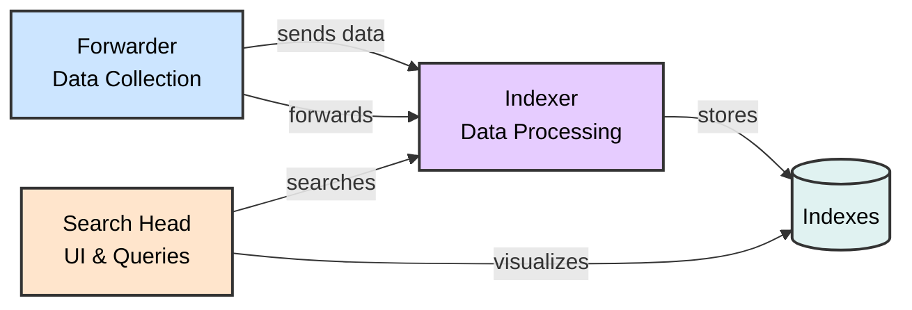

# Understanding Log Sources & Investigating with Splunk
## SOC Analyst Cheatsheet - Module 5/15

---

## Table of Contents

0. [Overview](#0-overview)
1. [Introduction To Splunk & SPL](#1-introduction-to-splunk--spl)
2. [Splunk Architecture](#2-splunk-architecture)
3. [Splunk as a SIEM Solution](#3-splunk-as-a-siem-solution)
4. [SPL Commands Reference](#4-spl-commands-reference)
5. [How To Identify The Available Data](#5-how-to-identify-the-available-data)
6. [Practical Exercises](#6-practical-exercises)

---

## 0. Overview

> 📌 **WHY IT MATTERS**: Splunk is a highly scalable, versatile, and robust data analytics software solution known for its ability to ingest, index, analyze, and visualize massive amounts of machine data. Splunk drives a wide range of initiatives including cybersecurity, compliance, data pipelines, IT monitoring, observability, and overall IT and business management.

### Key Capabilities

- **Data Ingestion**: Collects machine data from various sources
- **Indexing**: Organizes and stores data in indexes
- **Analysis**: Enables searching, filtering, and transforming data
- **Visualization**: Provides dashboards, reports, and alerts

---

## 1. Introduction To Splunk & SPL

### What Is Splunk?

Splunk is a powerful data analytics platform that can:

- ✅ Ingest massive amounts of machine data
- ✅ Index and organize data efficiently
- ✅ Analyze and visualize data in real-time
- ✅ Power cybersecurity, compliance, and IT monitoring initiatives


> 📌 **DATA FLOW**: Aggregated/API data → Heavy Forwarder | Event logs → Universal Forwarder | Wire data → Splunk Stream/HEC | Local files → Universal Forwarder

---

## 2. Splunk Architecture

### Core Components



| Component | Function |
|-----------|----------|
| **Forwarders** | Data collection from various sources |
| **Indexers** | Receive, organize, and store data in indexes |
| **Search Heads** | Coordinate search jobs, provide UI, create Knowledge Objects |
| **Deployment Server** | Manage configuration for forwarders |
| **Cluster Master** | Coordinate indexers in clustered environment |
| **License Master** | Manage Splunk licensing |

### Forwarder Types

| Type | Description | Use Case |
|------|-------------|----------|
| **Universal Forwarder (UF)** | Lightweight agent, no preprocessing | Remote data collection, minimal impact |
| **Heavy Forwarder (HF)** | Parses data before forwarding, can route based on criteria | Data aggregation, firewall logs, API data |
| **HTTP Event Collector (HEC)** | Token-based JSON/raw API for applications | Direct data ingestion from apps |

> 🔴 **KEY DIFFERENCE**: Heavy Forwarders parse data BEFORE forwarding, Universal Forwarders forward raw data.

### Splunk Key Components

- **Splunk Web Interface**: GUI for searching, alerts, dashboards, reports
- **SPL (Search Processing Language)**: Query language for searching/filtering/manipulating data
- **Apps and Add-ons**: Extend functionality, found on Splunkbase
- **Knowledge Objects**: Fields, tags, event types, lookups, macros, data models, alerts

---

## 3. Splunk as a SIEM Solution

> 📌 **SIEM CAPABILITIES**: Splunk as a SIEM solution provides:

- 🔴 **Real-time data analysis** - Monitor events as they occur
- 🔴 **Historical data analysis** - Investigate past incidents
- 🔴 **Cybersecurity monitoring** - Detect and respond to threats
- 🔴 **Incident response** - Support investigation and remediation
- 🔴 **Threat hunting** - Proactively search for threats
- 🔴 **User Behavior Analytics (UBA)** - Detect anomalous user behavior

---

## 4. SPL Commands Reference

### Basic Searching

```splunk
index="main" "UNKNOWN"
```

> 🔴 **KEY CONCEPT**: By default, a search returns all events. Use keywords, boolean operators (AND, OR, NOT), comparison operators, and wildcards (*) to narrow results.

### Wildcard Search

```splunk
index="main" "*UNKNOWN*"
```

> 📌 Searches for events containing "UNKNOWN" anywhere in the event data.

### Fields and Comparison Operators

```splunk
index="main" EventCode!=1
```

> 🔴 Searches for events where EventCode is NOT equal to 1.

### SPL Commands Cheatsheet

| Command | Syntax | Description |
|---------|--------|-------------|
| **fields** | `fields - User` | Include/exclude specific fields |
| **table** | `table _time, host, Image` | Present results in tabular format |
| **rename** | `rename Image as Process` | Rename a field in results |
| **dedup** | `dedup Image` | Remove duplicate events |
| **sort** | `sort - _time` | Sort results (use - for descending) |
| **stats** | `stats count by _time, Image` | Statistical operations |
| **chart** | `chart count by _time, Image` | Create data visualizations |
| **eval** | `eval Process_Path=lower(Image)` | Create/redefine fields |
| **rex** | `rex max_match=0 "[^%](?<guid>{.*})"` | Extract fields using regex |
| **lookup** | `lookup malware_lookup.csv filename` | Enrich data with external sources |
| **inputlookup** | `\| inputlookup malware_lookup.csv` | Retrieve data from lookup file |
| **transaction** | `transaction Image startswith=eval(EventCode=1)` | Group related events |
| **subsearch** | `NOT [ search ... \| top limit=100 Image ]` | Nested search for exclusions |

### Time Range Commands

```splunk
index="main" earliest=-7d EventCode!=1
```

> 📌 **Earliest/Latest**: Use negative numbers for relative time (e.g., -7d = 7 days ago) or absolute dates.

### The lookup Command Example

```splunk
index="main" sourcetype="WinEventLog:Sysmon" EventCode=1 
| rex field=Image "(?P<filename>[^\\]+)$" 
| eval filename=lower(filename) 
| lookup malware_lookup.csv filename OUTPUTNEW is_malware 
| table filename, is_malware
```

**Step-by-step breakdown:**
1. Search for Sysmon process creation events
2. Extract filename from Image path using regex
3. Convert filename to lowercase
4. Lookup against malware CSV to check if malicious
5. Display results in table

### Transaction Command Example

```splunk
index="main" sourcetype="WinEventLog:Sysmon" (EventCode=1 OR EventCode=3) 
| transaction Image startswith=eval(EventCode=1) endswith=eval(EventCode=3) maxspan=1m 
| table Image 
| dedup Image
```

> 🔴 **THREAT HUNTING USE CASE**: Identifies sequences of process creation followed by network connection within 1 minute - useful for detecting malware behavior.

### Subsearch Example

```splunk
index="main" sourcetype="WinEventLog:Sysmon" EventCode=1 
NOT [ search index="main" sourcetype="WinEventLog:Sysmon" EventCode=1 | top limit=100 Image | fields Image ] 
| table _time, Image, CommandLine, User, ComputerName
```

> 📌 **USE CASE**: Find rare processes (not in top 100) that may indicate malicious activity.

---

## 5. How To Identify The Available Data

### Approach 1: Using SPL Commands

#### List All Indexes

```splunk
| eventcount summarize=false index=* | table index
```

#### List All Source Types

```splunk
| metadata type=sourcetypes
```

#### List Source Types (Simplified)

```splunk
| metadata type=sourcetypes index=* | table sourcetype
```

#### List All Data Sources

```splunk
| metadata type=sources index=* | table source
```

#### View Raw Data for Specific Sourcetype

```splunk
sourcetype="WinEventLog:Security" | table _raw
```

#### View All Fields for Sourcetype

```splunk
sourcetype="WinEventLog:Security" | table *
```

#### Specific Field Extraction

```splunk
sourcetype="WinEventLog:Security" | fields Account_Name, EventCode | table Account_Name, EventCode
```

#### Field Summary

```splunk
sourcetype="WinEventLog:Security" | fieldsummary
```

> 📌 **FIELDSUMMARY OUTPUT**:
> - field: Field name
> - count: Events containing the field
> - distinct_count: Unique values
> - max/min: Value range
> - mean: Average value
> - values: Sample values

#### Event Distribution Over Time

```splunk
index=* sourcetype=* | bucket _time span=1d | stats count by _time, index, sourcetype | sort - _time
```

#### Rare Event Types

```splunk
index=* sourcetype=* | rare limit=10 index, sourcetype
```

#### Rare Parent Processes

```splunk
index="main" | rare limit=20 useother=f ParentImage
```

#### Fields with Low Count

```splunk
index=* sourcetype=* | fieldsummary | where count < 100 | table field, count, distinct_count
```

#### Event Diversity

```splunk
index=* | sistats count by index, sourcetype, source, host
```

### Approach 2: Using Splunk User Interface

> 🔴 **UI-BASED IDENTIFICATION**:

1. **Data Sources**: Settings → Data inputs → Review input methods
2. **Data Events**: Search & Reporting app → Fast/Verbose mode
3. **Fields**: Click event → View selected/interesting fields
4. **Data Models**: Settings → Data Models → Explore hierarchical structures

---

## 6. Practical Exercises

### Key Exercises Summary

> 📌 **SPLUNK PRACTICE TASKS**:

1. **Data Source Identification** - Use metadata commands to identify available indexes and sourcetypes
2. **Field Exploration** - Use fieldsummary to understand available fields
3. **Process Analysis** - Search for Sysmon EventCode=1 (process creation)
4. **Network Connection Analysis** - Search for EventCode=3 (network connections)
5. **Threat Hunting** - Use transaction command to identify malicious process sequences
6. **Lookup Enrichment** - Create and use lookup tables for malware detection

> 🔴 **Remember**: Always follow your organization's data governance policies when exploring data!

---

### Common Sysmon Event Codes Reference

| Event ID | Description |
|----------|-------------|
| **1** | Process Create |
| **3** | Network Connection |
| **5** | Process Terminated |
| **6** | Driver Loaded |
| **8** | CreateRemoteThread |
| **10** | ProcessAccess |
| **11** | FileCreate |
| **12** | RegistryEvent (Object Create/Delete) |
| **13** | RegistryEvent (Value Set) |
| **15** | FileCreateStreamHash |
| **22** | DNSEvent |
| **23** | FileDelete |

---

*Module 5/15 - Understanding Log Sources & Investigating with Splunk*
*Built with research + HTB Academy materials*
