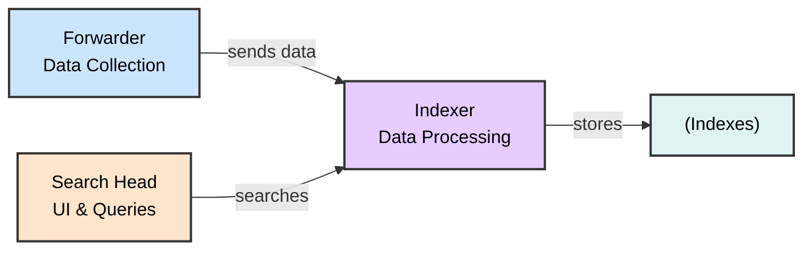

# Understanding Log Sources & Investigating with Splunk
## SOC Analyst Cheatsheet - Module 5/15

---

## Table of Contents

0. [Overview](#0-overview)
1. [Introduction To Splunk & SPL](#1-introduction-to-splunk--spl)
2. [Splunk Architecture](#2-splunk-architecture)
3. [Splunk as a SIEM Solution](#3-splunk-as-a-siem-solution)
4. [SPL Commands Reference](#4-spl-commands-reference)
5. [How To Identify The Available Data](#5-how-to-identify-the-available-data)
6. [Practical Exercises](#6-practical-exercises)

---

## 0. Overview

> 📌 **WHY IT MATTERS**: Splunk is a highly scalable, versatile, and robust data analytics software solution known for its ability to ingest, index, analyze, and visualize massive amounts of machine data. Splunk drives a wide range of initiatives including cybersecurity, compliance, data pipelines, IT monitoring, observability, and overall IT and business management.

### Key Capabilities

- **Data Ingestion**: Collects machine data from various sources
- **Indexing**: Organizes and stores data in indexes
- **Analysis**: Enables searching, filtering, and transforming data
- **Visualization**: Provides dashboards, reports, and alerts

---

## 1. Introduction To Splunk & SPL

### What Is Splunk?

Splunk is a powerful data analytics platform that can:

- ✅ Ingest massive amounts of machine data
- ✅ Index and organize data efficiently
- ✅ Analyze and visualize data in real-time
- ✅ Power cybersecurity, compliance, and IT monitoring initiatives


> 📌 **DATA SOURCES**:
> - Aggregated/API data → Heavy Forwarder
> - Event logs and OS stats → Universal Forwarder
> - Wire data → Splunk Stream or HTTP Event Collector
> - Local file monitoring → Universal Forwarder
> - DevOps, IoT, containers, syslog hosts


> 📌 **ARCHITECTURE**: Search Head for UI, Indexer for data processing, Forwarder for data collection. Includes agentless data sources like change tickets, logs, and metrics, with auto-load balanced indexing.

---

## 2. Splunk Architecture

### Core Components



| Component | Function |
|-----------|----------|
| **Forwarders** | Data collection from various sources |
| **Indexers** | Receive, organize, and store data in indexes |
| **Search Heads** | Coordinate search jobs, provide UI, create Knowledge Objects |
| **Deployment Server** | Manage configuration for forwarders |
| **Cluster Master** | Coordinate indexers in clustered environment |
| **License Master** | Manage Splunk licensing |

### Forwarder Types

| Type | Description | Use Case |
|------|-------------|----------|
| **Universal Forwarder (UF)** | Lightweight agent, no preprocessing | Remote data collection, minimal impact |
| **Heavy Forwarder (HF)** | Parses data before forwarding, can route based on criteria | Data aggregation, firewall logs, API data |
| **HTTP Event Collector (HEC)** | Token-based JSON/raw API for applications | Direct data ingestion from apps |

> 🔴 **KEY DIFFERENCE**: Heavy Forwarders parse data BEFORE forwarding, Universal Forwarders forward raw data.

### Splunk Key Components

- **Splunk Web Interface**: GUI for searching, alerts, dashboards, reports
- **SPL (Search Processing Language)**: Query language for searching/filtering/manipulating data
- **Apps and Add-ons**: Extend functionality, found on Splunkbase
- **Knowledge Objects**: Fields, tags, event types, lookups, macros, data models, alerts

---

## 3. Splunk as a SIEM Solution

> 📌 **SIEM CAPABILITIES**: Splunk as a SIEM solution provides:

- 🔴 **Real-time data analysis** - Monitor events as they occur
- 🔴 **Historical data analysis** - Investigate past incidents
- 🔴 **Cybersecurity monitoring** - Detect and respond to threats
- 🔴 **Incident response** - Support investigation and remediation
- 🔴 **Threat hunting** - Proactively search for threats
- 🔴 **User Behavior Analytics (UBA)** - Detect anomalous user behavior

---

## 4. SPL Commands Reference

### Basic Searching

```splunk
search index="main" "UNKNOWN"
```

> 🔴 **KEY CONCEPT**: By default, a search returns all events, but it can be narrowed down with keywords, boolean operators (AND, OR, NOT), comparison operators, and wildcard characters.

**Example**: By specifying the index as main, the query narrows down the search to only the events stored in the main index. The term UNKNOWN is then used as a keyword to filter and retrieve events that include this specific term.

### Wildcard Search

```splunk
index="main" "*UNKNOWN*"
```

> 📌 Searches for events containing "UNKNOWN" anywhere in the event data. Wildcards (*) can replace any number of characters.

### Fields and Comparison Operators

```splunk
index="main" EventCode!=1
```

> 🔴 Searches for events where EventCode is NOT equal to 1. Splunk automatically identifies fields like source, sourcetype, host, EventCode, etc.

> 📌 **COMPARISON OPERATORS**: =, !=, <, >, <=, >=

### The fields Command

```splunk
index="main" sourcetype="WinEventLog:Sysmon" EventCode=1 | fields - User
```

> 📌 The fields command specifies which fields should be included or excluded. After retrieving process creation events, this excludes the User field from results.

### The table Command

```splunk
index="main" sourcetype="WinEventLog:Sysmon" EventCode=1 | table _time, host, Image
```

> 📌 Presents search results in tabular format with specified fields:
> - `_time`: timestamp of the event
> - `host`: name of the host where event occurred
> - `Image`: name of the executable file representing the process

### The rename Command

```splunk
index="main" sourcetype="WinEventLog:Sysmon" EventCode=1 | rename Image as Process
```

> 📌 Renames a field in search results. Image field represents executable name; renaming it to Process allows subsequent references.

### The dedup Command

```splunk
index="main" sourcetype="WinEventLog:Sysmon" EventCode=1 | dedup Image
```

> 📌 Removes duplicate entries based on Image field. If same process is created multiple times, it appears only once.

### The sort Command

```splunk
index="main" sourcetype="WinEventLog:Sysmon" EventCode=1 | sort - _time
```

> 📌 Sorts results in descending order (most recent first). Use `-` for descending.

### The stats Command

```splunk
index="main" sourcetype="WinEventLog:Sysmon" EventCode=3 | stats count by _time, Image
```

> 📌 Returns table where each row represents unique timestamp and process combination. Count shows network connection events per process at that time.

### The chart Command

```splunk
index="main" sourcetype="WinEventLog:Sysmon" EventCode=3 | chart count by _time, Image
```

> 📌 Creates visualization where each column represents a unique process. Easily see network events over time for each process.

### The eval Command

```splunk
index="main" sourcetype="WinEventLog:Sysmon" EventCode=1 | eval Process_Path=lower(Image)
```

> 📌 Creates new field with lowercase version of Image field. Does not change original field.

### The rex Command

```splunk
index="main" EventCode=4662 | rex max_match=0 "[^%](?<guid>{.*})" | table guid
```

> 🔴 **EXTRACTS GUIDs**: Useful because GUIDs are not automatically extracted from 4662 event logs.
> - `rex max_match=0` ensures all occurrences are extracted (not just first)
> - Pattern `{.*}` finds substrings beginning with { and ending with }
> - `[^%]` ensures match doesn't begin with % character

### The lookup Command

#### Step 1: Create Lookup CSV File

```csv
filename, is_malware
notepad.exe, false
cmd.exe, false
powershell.exe, false
sharphound.exe, true
randomfile.exe, true
```

#### Step 2: Add Lookup Table in Splunk UI


#### Step 3: Use Lookup in SPL

```splunk
index="main" sourcetype="WinEventLog:Sysmon" EventCode=1 
| rex field=Image "(?P<filename>[^\\]+)$" 
| eval filename=lower(filename) 
| lookup malware_lookup.csv filename OUTPUTNEW is_malware 
| table filename, is_malware
```

**Step-by-step breakdown:**
1. `index="main" sourcetype="WinEventLog:Sysmon" EventCode=1`: Search for Sysmon process creation events
2. `| rex field=Image "(?P<filename>[^\\]+)$"`: Extract filename after last backslash
3. `| eval filename=lower(filename)`: Convert to lowercase for case-insensitive match
4. `| lookup malware_lookup.csv filename OUTPUTNEW is_malware`: Check if malicious
5. `| table filename, is_malware`: Display results

#### Alternative with dedup

```splunk
index="main" sourcetype="WinEventLog:Sysmon" EventCode=1 
| eval filename=mvdedup(split(Image, "\\")) 
| eval filename=mvindex(filename, -1) 
| eval filename=lower(filename) 
| lookup malware_lookup.csv filename OUTPUTNEW is_malware 
| table filename, is_malware 
| dedup filename, is_malware
```

**Breakdown:**
- `mvdedup(split(Image, "\\"))`: Split path into multivalue field, remove duplicates
- `mvindex(filename, -1)`: Select last element (actual filename)
- `dedup`: Remove duplicate entries

### The inputlookup Command

```splunk
| inputlookup malware_lookup.csv
```

> 📌 Retrieves all records from lookup file without joining to search results. Used to verify lookup content.

### Time Range Commands

```splunk
index="main" earliest=-7d EventCode!=1
```

> 📌 Retrieves events from last 7 days where EventCode is NOT 1. Use negative numbers for relative time.

### The transaction Command

```splunk
index="main" sourcetype="WinEventLog:Sysmon" (EventCode=1 OR EventCode=3) 
| transaction Image startswith=eval(EventCode=1) endswith=eval(EventCode=3) maxspan=1m 
| table Image 
| dedup Image
```

> 🔴 **THREAT HUNTING USE CASE**: Groups events sharing common characteristics.
> - Groups by Image field
> - Starts with EventCode=1 (process creation)
> - Ends with EventCode=3 (network connection)
> - Max 1-minute window
> - Identifies sequences of process creation followed by network connection - useful for detecting malware behavior

### Subsearches

```splunk
index="main" sourcetype="WinEventLog:Sysmon" EventCode=1 
NOT [ search index="main" sourcetype="WinEventLog:Sysmon" EventCode=1 | top limit=100 Image | fields Image ] 
| table _time, Image, CommandLine, User, ComputerName
```

> 🔴 **RARE PROCESS HUNTING**:
> - Main search: Process creation events
> - `NOT []`: Excludes subsearch results
> - Subsearch: Returns top 100 most common processes
> - Result: Shows rare processes not in top 100 - may indicate malicious activity

> ⚠️ **NOTE**: This type of search can generate a lot of noise in environments where new and unique processes are frequently created. Careful tuning and context are important.

---

## 5. How To Identify The Available Data

### Approach 1: Using SPL Commands

#### List All Indexes

```splunk
| eventcount summarize=false index=* | table index
```

> 📌 Uses eventcount to count events in all indexes. `summarize=false` shows counts separately.

#### List All Source Types

```splunk
| metadata type=sourcetypes
```

> 📌 Returns all sourcetypes with metadata: firstTime, lastTime, totalCount

#### List Source Types (Simplified)

```splunk
| metadata type=sourcetypes index=* | table sourcetype
```

#### List All Data Sources

```splunk
| metadata type=sources index=* | table source
```

#### View Raw Data for Specific Sourcetype

```splunk
sourcetype="WinEventLog:Security" | table _raw
```

> 📌 Shows raw event data for specified sourcetype

#### View All Fields for Sourcetype

```splunk
sourcetype="WinEventLog:Security" | table *
```

> ⚠️ Can produce very wide table if many fields exist

#### Specific Field Extraction

```splunk
sourcetype="WinEventLog:Security" | fields Account_Name, EventCode | table Account_Name, EventCode
```

#### Field Summary

```splunk
sourcetype="WinEventLog:Security" | fieldsummary
```

> 📌 **FIELDSUMMARY OUTPUT**:
> | Field | Description |
> |-------|-------------|
> | field | The name of the field |
> | count | Number of events containing the field |
> | distinct_count | Number of distinct values |
> | is_exact | Whether count is exact or estimated |
> | max | Maximum value |
> | mean | Mean value |
> | min | Minimum value |
> | numeric_count | Number of numeric values |
> | stdev | Standard deviation |
> | values | Sample values |
> | modes | The most common values |
> | numBuckets | Number of buckets used to estimate distinct count |

> ⚠️ Note: Values are calculated based on search results. Ensure time range is large enough to capture all possible fields.

#### Event Distribution Over Time

```splunk
index=* sourcetype=* | bucket _time span=1d | stats count by _time, index, sourcetype | sort - _time
```

> 📌 Groups events into 1-day buckets, counts by time/index/sourcetype

#### Rare Event Types

```splunk
index=* sourcetype=* | rare limit=10 index, sourcetype
```

> 📌 Finds 10 rarest combinations - may indicate abnormal behavior

#### Rare Parent Processes

```splunk
index="main" | rare limit=20 useother=f ParentImage
```

> 📌 Shows 20 least common ParentImage values

#### Fields with Low Count

```splunk
index=* sourcetype=* | fieldsummary | where count < 100 | table field, count, distinct_count
```

> 📌 Shows fields appearing in less than 100 events

#### Event Diversity

```splunk
index=* | sistats count by index, sourcetype, source, host
```

> 📌 Shows event diversity across indexes, sources, and hosts

#### Rare Field Combinations

```splunk
index=* sourcetype=* | rare limit=10 field1, field2, field3
```

> 📌 Find uncommon combinations of field values. Replace field1, field2, field3 with actual field names.

---

### Approach 2: Using Splunk User Interface

> 🔴 **UI-BASED IDENTIFICATION**:

1. **Data Sources**: Settings → Data inputs → Review input methods
2. **Data Events**: Search & Reporting app → Fast/Verbose mode
3. **Fields**: Click event → View Selected/Interesting/All fields
4. **Data Models**: Settings → Data Models → Explore hierarchical structures

#### Search Modes


> 📌 **Search Modes**:
> - **Fast Mode**: Quick scanning through data
> - **Verbose Mode**: Dive deep into event details
> - **Smart Mode**: Auto-detect best mode

#### Event Details


> 📌 Click any event to expand and view:
> - Raw event data
> - All extracted fields
> - Selected Fields (always shown: host, source, sourcetype)
> - Interesting Fields (appear in ≥20% of events)

#### Data Models


> 📌 **Data Models** provide hierarchical view of data:
> - Access: Settings → Data Models
> - Each model has objects with relevant fields
> - No SPL knowledge required

#### Pivots


> 📌 **Pivots**: Drag-and-drop interface for reports/visualizations without writing SPL

---

## 6. Practical Exercises

### Key Exercises Summary

> 📌 **SPLUNK PRACTICE TASKS**:

1. **Data Source Identification** - Use metadata commands to identify available indexes and sourcetypes
2. **Field Exploration** - Use fieldsummary to understand available fields
3. **Process Analysis** - Search for Sysmon EventCode=1 (process creation)
4. **Network Connection Analysis** - Search for EventCode=3 (network connections)
5. **Threat Hunting** - Use transaction command to identify malicious process sequences
6. **Lookup Enrichment** - Create and use lookup tables for malware detection

> 🔴 **Remember**: Always follow your organization's data governance policies when exploring data!

---

### SPL Reference Resources

- [Splunk Search Reference](https://docs.splunk.com/Documentation/SCS/current/SearchReference/Introduction)
- [Splunk Cloud Search Reference](https://docs.splunk.com/Documentation/SplunkCloud/latest/SearchReference/)
- [Splunk Cloud Search](https://docs.splunk.com/Documentation/SplunkCloud/latest/Search/)

---

### Common Sysmon Event Codes Reference

| Event ID | Description |
|----------|-------------|
| **1** | Process Create |
| **3** | Network Connection |
| **5** | Process Terminated |
| **6** | Driver Loaded |
| **8** | CreateRemoteThread |
| **10** | ProcessAccess |
| **11** | FileCreate |
| **12** | RegistryEvent (Object Create/Delete) |
| **13** | RegistryEvent (Value Set) |
| **15** | FileCreateStreamHash |
| **22** | DNSEvent |
| **23** | FileDelete |

---

*Module 5/15 - Understanding Log Sources & Investigating with Splunk*
*Built with research + HTB Academy materials*

---

## 2. Using Splunk Applications

### What Are Splunk Apps?

> 📌 **DEFINITION**: Splunk applications (apps) are packages that extend Splunk capabilities to manage specific types of operational data. Each app is tailored to handle data from specific technologies or use cases, acting as a pre-built knowledge package.

### Key Features of Splunk Apps

- ✅ Custom data inputs
- ✅ Custom visualizations
- ✅ Dashboards
- ✅ Alerts
- ✅ Reports

> 🔴 **MULTIPLE WORKSPACES**: Splunk Apps enable coexistence of multiple workspaces on a single Splunk instance, catering to different use cases and user roles.

### Splunk Apps for SIEM

> 📌 **SECURITY APPS**: Apps designed for SIEM purposes provide capabilities to:
- ✅ Ingest security-related data
- ✅ Analyze security events
- ✅ Visualize security data
- ✅ Detect complex threats
- ✅ Perform in-depth investigations

### Important Considerations

> ⚠️ **RESOURCE & LICENSING NOTES**:
- Many apps can be **resource-intensive**
- Ensure Splunk deployment is **sized correctly** for additional workload
- Verify **correct licenses** for premium apps
- Be aware of **increased license usage** due to added data inputs

---

### Installing Sysmon App for Splunk

> 📌 **APP**: We'll use the Sysmon App for Splunk by Mike Haag - provides insights and visibility into Sysmon deployments.

#### Step 1: Sign Up for Splunkbase Account


> 🔴 Register at [splunkbase](https://splunkbase.splunk.com) - the marketplace for Splunk apps.

#### Step 2: Download the Sysmon App


#### Step 3: Add App to Search Head


> 📌 Navigate to: **Apps** → **Manage Apps** → **Install from file**

#### Step 4: Configure the Macro

> 🔴 **IMPORTANT**: Adjust the application's macro so events are loaded correctly.

1. Go to **Settings** → **Advanced Search** → **Search Macros**


2. Find the **sysmon** macro under "Sysmon App for Splunk"


3. Edit the definition to:

```
index="main" sourcetype="WinEventLog:Sysmon"
```


---

### Using the Sysmon App

#### Accessing the App

> 📌 Locate **Sysmon App for Splunk** in the "Apps" column on Splunk home page

#### File Activity Tab


Let's now specify "All time" on the time picker and click "Submit". Results are generated successfully; however, no results are appearing in the "Top Systems" section.


> ⚠️ If "Top Systems" shows no results, the dashboard needs fixing.

#### Fixing the Search

1. Click **"Edit"** in the upper right corner


2. The issue: Sysmon Event ID 11 doesn't have a field named **Computer**, but does have **ComputerName**


3. Fix: Change `top Computer` to `top ComputerName`

4. Click **"Apply"**

#### Results After Fix


> 📌 Results now generate successfully in "Top Systems" section.

---

### Practical Exercises

> 📌 **SPLUNK PRACTICE TASKS**:

1. **Explore Sysmon App** - Navigate to different tabs (File Activity, Network Activity, Reports)
2. **Fix Dashboard Searches** - Modify searches when no results appear due to non-existent fields
3. **Net View Report** - Fix the "Net - net view" report search
4. **Network Connections** - Find connections initiated by SharpHound.exe

> 🔴 **LEARNING EXERCISE**: Modify searches when no results are generated due to non-existent fields, continuing until desired results are obtained.

---

### Sysmon App Navigation Reference

| Tab | Description |
|-----|-------------|
| **File Activity** | Monitor file creation events |
| **Network Activity** | View network connections |
| **Processes** | Process creation and termination |
| **Reports** | Pre-built security reports |

---

## 3. Intrusion Detection With Splunk (Real-world Scenario)

### Introduction

> 📌 **SCALE UP**: The Windows Event Logs & Finding Evil module focused on single-machine log exploration. Now we expand to analyze across **numerous machines** to uncover irregular activities across the entire network.

### What We'll Learn

- 🔴 **Large-scale investigations** - Hunt across 500,000+ events
- 🔴 **Craft precise queries** - Target specific data for efficiency
- 🔴 **Trigger alerts** - Proactively enhance security
- 🔴 **Eliminate false positives** - Critical skill for SOC analysts

### The Strategy

> 🔴 **KEY APPROACH**: Mirror initial lessons but scale to larger datasets. From the Splunk dashboard, weeding out false positives is essential.

---

### Ingesting Data Sources

> 📌 **DATA SOURCES**: When starting hunts, alerts, or queries, the volume of information can be daunting. Part of the art is:

- Pinpointing the most meaningful data
- Determining how to sift through quickly and efficiently
- Ensuring robustness of analysis

**Available Data Sources:**
- **BOTS** (Blue Team Ops Training Suite) - Provided by Splunk with installation instructions
- **nginx_json_logs** - Dummy logs in JSON format
- **Custom sources** - Ensure source type correctly extracts JSON (set Indexed Extractions to JSON)

> 📌 **OUR DATASET**: We'll work with over **500,000 events**. To retrieve all accessible events:

```splunk
index="main" earliest=0
```


> 🔴 **DATA SCALE**: 581,073 events across various sourcetypes with multiple infections. Our goal is to understand how to detect attacks within this vast data pool.

---

### Searching Effectively

> 📌 **EFFICIENCY MATTERS**: In Splunk, certain queries take considerable time, especially with larger datasets. Effective threat hunting hinges on crafting the right queries.

### The Importance of Targeted Searches

> 🔴 **SIGNAL vs NOISE**: Data contains valuable signals to track attacks AND extraneous noise to filter. Our job as blue team is to:

- Methodically trace down TTPs
- Craft alerts and hunting queries
- Cover as many threat vectors as possible

> ⚠️ This is a marathon, not a sprint!

### Listing Sourcetypes

> 📌 **STARTING POINT**: First, list all sourcetypes to approach as an unknown environment:

```splunk
index="main" | stats count by sourcetype
```


### Querying Sysmon Data

```splunk
index="main" sourcetype="WinEventLog:Sysmon"
```


> 📌 Click the arrow on the left to delve into events and verify extracted fields.


### Search Performance Examples

#### 1. Basic Search (Fast)

```splunk
index="main" uniwaldo.local
```

> 📌 Returns results quickly. Searches for string in ALL sourcetypes.


#### 2. Wildcard Search (Slow)

```splunk
index="main" *uniwaldo.local*
```

> ⚠️ Returns SAME results but MUCH more slowly!

#### 3. Field-Targeted Search (Fastest)

```splunk
index="main" ComputerName="*uniwaldo.local"
```

> 🔴 **KEY LESSON**: Targeted searches execute faster, lessen resource consumption, and reduce irrelevant data. Always aim searches at specific users, networks, machines!

---

### Embracing The Mindset Of Analysts, Threat Hunters, & Detection Engineers

> 📌 **ANOMALY DETECTION**: Let's pivot to spotting anomalies. Remember the foundation from Windows Event Logs module - using event codes to trace peculiar activities.

### Identifying Sysmon EventCodes

```splunk
index="main" sourcetype="WinEventLog:Sysmon" | stats count by EventCode
```


> 📌 **20 distinct EventCodes found**. EventCode 11 has highest count (184,678).

### Sysmon Event Codes Reference

| Event ID | Description | Detection Use |
|----------|-------------|---------------|
| **1** | Process Creation | Abnormal parent-child process hierarchies |
| **2** | File creation time change | "Time stomp" attacks |
| **3** | Network connection | High noise - always occurring |
| **4** | Sysmon service state changed | Detect if attackers stop Sysmon |
| **5** | Process terminated | Detect process killing (Cobalt Strike) |
| **6** | Driver loaded | BYOD attacks |
| **7** | Image loaded | Track DLL loads - DLL hijacks |
| **8** | CreateRemoteThread | Detect injected threads |
| **10** | ProcessAccess | Remote code injection, memory dumping (lsass) |
| **11** | FileCreate | Correlation, file origins |
| **12** | RegistryEvent (Object) | Registry tampering |
| **13** | RegistryEvent (Value Set) | Registry value changes |
| **15** | FileCreateStreamHash | Mark of the Web downloads |
| **16** | Config state changed | Detect Sysmon tampering |
| **17** | Pipe created | IPC, PsExec, SMB lateral movement |
| **18** | Pipe connected | IPC connections |
| **22** | DNSEvent | Monitor DNS beacon resolutions |
| **23** | FileDelete | Cleanup, ransomware |
| **25** | ProcessTampering | Process herpadering, mini-AV alert |

---

### Hunting: Finding Malicious Activity

> 📌 **HUNTING PROCESS**: Unusual parent-child process trees are always suspicious.

#### Step 1: Find All Parent-Child Relationships

```splunk
index="main" sourcetype="WinEventLog:Sysmon" EventCode=1 | stats count by ParentImage, Image
```


> 📌 5,427 events - need to filter further.

#### Step 2: Target Suspicious Processes

```splunk
index="main" sourcetype="WinEventLog:Sysmon" EventCode=1 (Image="*cmd.exe" OR Image="*powershell.exe") | stats count by ParentImage, Image
```


> 🔴 **ALERT**: notepad.exe → powershell.exe chain is suspicious!

#### Step 3: Investigate Notepad Spawning PowerShell

```splunk
index="main" sourcetype="WinEventLog:Sysmon" EventCode=1 (Image="*cmd.exe" OR Image="*powershell.exe") ParentImage="C:\\Windows\\System32\\notepad.exe"
```


> 🔴 **MALICIOUS ACTIVITY FOUND**:
> - PowerShell downloading `file.exe` from `http://10.0.0.229:8080`
> - Executed by `NT AUTHORITY\SYSTEM`
> - ParentImage was notepad.exe

---

### Investigating the Suspicious IP

#### Find All Events with IP 10.0.0.229

```splunk
index="main" 10.0.0.229 | stats count by sourcetype
```


> 📌 97 events found - Sysmon (73) and linux:syslog (24)

#### Check Linux Syslog

```splunk
index="main" 10.0.0.229 sourcetype="linux:syslog"
```


> 📌 IP 10.0.0.229 belongs to host `waldo-virtual-machine` on ens160 interface


> ⚠️ **CONCERN**: Linux system appears to be infected, transmitting additional utilities!

#### Investigate Sysmon Connections

```splunk
index="main" 10.0.0.229 sourcetype="WinEventLog:sysmon" | stats count by CommandLine
```


> 🔴 **ALARMING**: Multiple malicious binaries detected!

#### Identify Affected Hosts

```splunk
index="main" 10.0.0.229 sourcetype="WinEventLog:sysmon" | stats count by CommandLine, host
```


> 🔴 **TWO HOSTS COMPROMISED**:
> - DESKTOP-EGSS5IS
> - DESKTOP-UN7T4R8
> - DCSync PowerShell script executed on second host!

---

### Detecting DCSync Attack

#### DCSync Detection Query

```splunk
index="main" EventCode=4662 Access_Mask=0x100 Account_Name!=*$
```


> 🔴 **EXPLANATION**:
> - EventCode 4662 = AD object accessed
> - Access Mask 0x100 = Control Access (needed for DCSync)
> - Account_Name excludes machine accounts ($)


> 📌 **GUIDs IDENTIFIED**:
> - `{1131f6ad-9c07-11d1-f79f-00c04fc2dcd2}` = DS-Replication-Get-Changes-All
> - `{19195a5b-6da0-11d0-afd3-00c04fd930c9}`


> 🔴 **CONFIRMATION**: DS-Replication-Get-Changes-All "...allows the replication of secret domain data"

> 📌 **IMPACT**: DCSync executed by user `waldo` on UNIWALDO domain - full compromise! Recommendation: rotate krbtgt.

---

### Detecting LSASS Dumping

#### Find Process Access to LSASS

```splunk
index="main" EventCode=10 lsass | stats count by SourceImage
```


> 📌 High count (99) for lsass.exe itself = normal. Look for unusual access.

#### Find Notepad Accessing LSASS

```splunk
index="main" EventCode=10 lsass SourceImage="C:\\Windows\\System32\\notepad.exe"
```


> 🔴 **MALICIOUS**: notepad.exe accessing lsass.exe with GrantedAccess 0x1FFFFF!


> 📌 **CALL STACK ANALYSIS**: UNKNOWN segment in ntdll indicates shellcode - memory regions not backed by files on disk.

---

### Creating Meaningful Alerts

> 📌 **ALERT vs HUNT**: Alerts must be resilient and effective. Poor alerts flood defense teams with data, providing cover for attackers!

#### Step 1: Find All UNKNOWN Call Traces

```splunk
index="main" CallTrace="*UNKNOWN*" | stats count by EventCode
```


> 📌 1,575 events - only EventCode 10 shows UNKNOWN call traces.

#### Step 2: Group by SourceImage

```splunk
index="main" CallTrace="*UNKNOWN*" | stats count by SourceImage
```


> ⚠️ **FALSE POSITIVES**: JIT processes (.NET, Squirrel/Electron) - need to filter these.

#### Step 3: Filter Self-Access

```splunk
index="main" CallTrace="*UNKNOWN*" | where SourceImage!=TargetImage | stats count by SourceImage
```


#### Step 4: Exclude .NET JIT

```splunk
index="main" CallTrace="*UNKNOWN*" SourceImage!="*Microsoft.NET*" CallTrace!=*ni.dll* CallTrace!=*clr.dll* | where SourceImage!=TargetImage | stats count by SourceImage
```


#### Step 5: Exclude WOW64

```splunk
index="main" CallTrace="*UNKNOWN*" SourceImage!="*Microsoft.NET*" CallTrace!=*ni.dll* CallTrace!=*clr.dll* CallTrace!=*wow64* | where SourceImage!=TargetImage | stats count by SourceImage
```


#### Step 6: Exclude Explorer.exe

```splunk
index="main" CallTrace="*UNKNOWN*" SourceImage!="*Microsoft.NET*" CallTrace!=*ni.dll* CallTrace!=*clr.dll* CallTrace!=*wow64* SourceImage!="C:\\Windows\\Explorer.EXE" | where SourceImage!=TargetImage | stats count by SourceImage
```


#### Step 7: Detailed Investigation

```splunk
index="main" CallTrace="*UNKNOWN*" SourceImage!="*Microsoft.NET*" CallTrace!=*ni.dll* CallTrace!=*clr.dll* CallTrace!=*wow64* SourceImage!="C:\\Windows\\Explorer.EXE" | where SourceImage!=TargetImage | stats count by SourceImage, TargetImage, CallTrace
```


> 📌 **ALERT CREATION SUMMARY**:
> 1. Filter self-accessing processes
> 2. Exclude .NET JIT (Microsoft.NET, ni.dll, clr.dll)
> 3. Exclude WOW64 regions
> 4. Exclude Explorer.exe (too versatile)

> ⚠️ **BYPASS POSSIBLE**: Attackers could append "ni.dll" to random DLLs to bypass this alert!

---

### Key Hunting Queries Reference

| Hunt Objective | SPL Query |
|----------------|-----------|
| All events | `index="main" earliest=0` |
| List sourcetypes | `index="main" \| stats count by sourcetype` |
| Sysmon data | `index="main" sourcetype="WinEventLog:Sysmon"` |
| EventCode stats | `index="main" sourcetype="WinEventLog:Sysmon" \| stats count by EventCode` |
| Parent-child processes | `index="main" sourcetype="WinEventLog:Sysmon" EventCode=1 \| stats count by ParentImage, Image` |
| Suspicious processes | `index="main" sourcetype="WinEventLog:Sysmon" EventCode=1 (Image="*cmd.exe" OR Image="*powershell.exe")` |
| IP investigation | `index="main" 10.0.0.229 \| stats count by sourcetype` |
| DCSync detection | `index="main" EventCode=4662 Access_Mask=0x100 Account_Name!=*$` |
| LSASS access | `index="main" EventCode=10 lsass \| stats count by SourceImage` |
| Unknown call traces | `index="main" CallTrace="*UNKNOWN*" \| stats count by EventCode` |

---

### Summary

> 📌 **KEY TAKEAWAYS**:

1. **Large-scale data analysis** requires efficient queries - always target specific fields
2. **Sysmon EventCodes** provide valuable detection opportunities
3. **Parent-child process relationships** reveal suspicious activity
4. **DCSync attacks** detected via EventCode 4662 with specific Access Mask
5. **LSASS dumping** detected via EventCode 10 with CallTrace analysis
6. **UNKNOWN memory regions** in call stacks indicate potential shellcode
7. **Alert creation** requires filtering false positives (JIT, WOW64, Explorer)
8. **Alert bypass** is possible - always think about evasion techniques

> 🔴 **FINAL LESSON**: Building alerts in lab is straightforward with limited data. Real-world scenarios require more nuanced mechanisms to pinpoint malicious activities among extensive datasets.

---

*Module 5/15 - Understanding Log Sources & Investigating with Splunk*
*Built with research + HTB Academy materials*


HTB Academy Logo
Understanding Log Sources & Investigating with Splunk
Understanding Log Sources & Investigating with Splunk 100%

Section 3 / 6
Go to Questions
Intrusion Detection With Splunk (Real-world Scenario)
Introduction

The Windows Event Logs & Finding Evil module familiarized us with log exploration on a single machine to pinpoint malicious activity. Now, we're stepping up our game. We'll be conducting similar investigations, but on a much larger scale, across numerous machines to uncover irregular activities within the entire network instead of just one device. Our tools will still include Windows Event logs, but the scope of our work will broaden significantly, demanding careful scrutiny of a larger pool of information, and identifying and discarding false positives whenever possible.

In this module, we'll be zooming in on specific malicious machines. We'll master the art of crafting precise queries and triggering alerts to proactively enhance the security of our environment.

The strategy we'll follow to identify events will mirror our initial lessons. However, we're going up against a much larger data set instead of merely one collection of event logs. And from our vantage point at the Splunk dashboard, we'll aim to weed out false positives.
Ingesting Data Sources

At the start of creating hunts, alerts, or queries, the sheer volume of information and data can be daunting. Part of the art of being a cybersecurity professional involves pinpointing the most meaningful data, determining how to sift through it quickly and efficiently, and ensuring the robustness of our analysis.

To proceed, we need access to data we can analyze and use for threat hunting. There are a few sources we can turn to. One source that Splunk provides, along with installation instructions, is BOTS. Alternatively, nginx_json_logs is a handy resource providing us with dummy logs in JSON format. If you upload data from arbitrary sources, ensure your source type correctly extracts the JSON by adjusting the Indexed Extractions setting to JSON when crafting a new source type before uploading the JSON data.

Our focus in this module, however, will be on a data set that we've personally created. This data set will assist your progress. You'll be working with over 500,000 events. By setting the time picker to All time and submitting the query below, we can retrieve all accessible events.

        shellsession
index="main" earliest=0


Splunk search interface showing query 'index=main earliest=0', with 581,073 events listed. Event details include time, log name, event code, and computer name. Options for timeline format and page navigation are visible.


We now have a mammoth data set to sift through and analyze across various sourcetypes with multiple infections. Within this data, we will encounter different types of attacks and infections. Our goal here isn't to identify every single one but to understand how we can begin to detect any sort of attack within this vast data pool. By the end of this lesson, we will have identified several attacks, and we encourage you to dive into the data and uncover more on your own.
Searching Effectively

If you're new to Splunk, you might notice that certain queries take considerable time to process and return data, particularly when dealing with larger, more realistic data sets. Effective threat hunting in any SIEM hinges on crafting the right queries and targeting relevant data.

We've touched upon the significance of relevant or accurate data multiple times. What does this really mean? The data within these events contains a mixture of valuable signals that can help us track down attacks and extraneous noise that we need to filter out. It can be a daunting thought that potential threats may be hiding in the background noise, and while this is a possibility, our job as the blue team is to methodically trace down tactics, techniques, and procedures (TTPs), and to craft alerts and hunting queries to cover as many potential threat vectors as we can. This is not a sprint; it's more of a marathon, a process that often spans across the life of an organization. We start by targeting what we know is malicious from familiar data.

Let's dive into our data. Our first objective is to see what we can identify within the Sysmon data. We'll start by listing all our sourcetypes to approach this as an unknown environment from scratch. Run the following query to observe the possible sourcetypes (the screenshot may contain a WinEventLog sourcetype that you will not have).

        shellsession
index="main" | stats count by sourcetype


Splunk search interface showing query 'index=main | stats count by sourcetype', with 581,073 events listed. Event types include WinEventLog:Application, WinEventLog:Security, and others, with counts displayed.


This will list all the sourcetypes available in your Splunk environment. Now let's query our Sysmon sourcetype and take a look at the incoming data.

        shellsession
index="main" sourcetype="WinEventLog:Sysmon"


Splunk search interface showing query 'index=main sourcetype="WinEventLog:Sysmon"', with 358,108 events listed. Event details include time, log name, event code, and computer name. Options for timeline format and page navigation are visible.

We can delve into the events by clicking the arrow on the left.


Splunk event log interface showing event details for 'WinEventLog:Sysmon' with fields like host, sourcetype, event code, and computer name. Event actions and detailed field values are displayed.

Here we can verify that it is indeed Sysmon data and further identify extracted fields that we can target for searching. The extracted fields aid us in crafting more efficient searches. Here's the reasoning.

There are several ways we can run searches to achieve our goal, but some methods will be more efficient than others. We can query all fields, which essentially performs regex searches for our data assuming we don't know what field it exists in. For demonstration, let's execute some generalized queries to illustrate performance differences. Let's search for all possible instances of uniwaldo.local.

        shellsession
index="main" uniwaldo.local


Splunk search interface showing query 'index=main univaldo.local', with 30,826 events listed. Event details include time, log name, event code, and computer name. Options for timeline format and page navigation are visible.

This should return results rather quickly. It will display any instances of this specific string found in any and all sourcetypes the way we ran it. It can be case insensitive and still return the same results. Now let's attempt to find all instances of this string concatenated within any other string such as "myuniwaldo.localtest" by using a wildcard before and after it.

        shellsession
index="main" *uniwaldo.local*


Splunk search interface showing query 'index=main univaldo.local*', with 30,826 events listed. Event details include time, log name, event code, and computer name. Options for timeline format and page navigation are visible.

You'll observe that this query returns results much more slowly than before, even though the number of results is exactly the same! Now let's target this string within the ComputerName field only, as we might only care about this string if it shows up in ComputerName. Because no ComputerName only contains this string, we need to prepend a wildcard to return relevant results.

        shellsession
    
index="main" ComputerName="*uniwaldo.local"


Splunk search interface showing query 'index=main ComputerName=univaldo.local', with 30,685 events listed. Event details include time, log name, event code, and computer name. Options for timeline format and page navigation are visible.

You'll find that this query returns results much more swiftly than our previous search. The point being made here is that targeted searches in your SIEM will execute and return results much more quickly. They also lessen resource consumption and allow your colleagues to use the SIEM with less disruption and impact. As we devise our queries to hunt anomalies, it's crucial that we keep crafting efficient queries at the forefront of our thinking, particularly if we aim to convert this query into an alert later. Having many slow-running alerts won't benefit our systems or us. If you can aim the search at specific users, networks, machines, etc., it will always be to your advantage to do so, as it also cuts down a lot of irrelevant data, enabling you to focus on what truly matters. But again, how do we know what we need to focus on?
Embracing The Mindset Of Analysts, Threat Hunters, & Detection Engineers

Making progress on our journey, let's pivot our focus towards spotting anomalies in our data. Remember the foundation we established in the Windows Event Logs & Finding Evil module, where we explored the potential of event codes in tracing peculiar activities? We utilized public resources such as the Microsoft Sysinternals guide for Sysmon. Let's apply the same approach and identify all Sysmon EventCodes prevalent in our data with this query.

        shellsession
index="main" sourcetype="WinEventLog:Sysmon" | stats count by EventCode


Splunk search results showing event counts by EventCode, with a total of 358,108 events. EventCode 11 has the highest count of 184,678.

Our scan uncovers 20 distinct EventCodes. Before we move further, let's remind ourselves of some of the Sysmon event descriptions and their potential usage in detecting malicious activity.

    Sysmon Event ID 1 - Process Creation: Useful for hunts targeting abnormal parent-child process hierarchies, as illustrated in the first lesson with Process Hacker. It's an event we can use later.
    Sysmon Event ID 2 - A process changed a file creation time: Helpful in spotting "time stomp" attacks, where attackers alter file creation times. Bear in mind, not all such actions signal malicious intent.
    Sysmon Event ID 3 - Network connection: A source of abundant noise since machines are perpetually establishing network connections. We may uncover anomalies, but let's consider other quieter areas first.
    Sysmon Event ID 4 - Sysmon service state changed: Could be a useful hunt if attackers attempt to stop Sysmon, though the majority of these events are likely benign and informational, considering Sysmon's frequent legitimate starts and stops.
    Sysmon Event ID 5 - Process terminated: This might aid us in detecting when attackers kill key processes or use sacrificial ones. For instance, Cobalt Strike often spawns temporary processes like werfault, the termination of which would be logged here, as well as the creation in ID 1.
    Sysmon Event ID 6 - Driver loaded: A potential flag for BYOD (bring your own driver) attacks, though this is less common. Before diving deep into this, let's weed out more conspicuous threats first.
    Sysmon Event ID 7 - Image loaded: Allows us to track dll loads, which is handy in detecting DLL hijacks.
    Sysmon Event ID 8 - CreateRemoteThread: Potentially aids in identifying injected threads. While remote threads can be created legitimately, if an attacker misuses this API, we can potentially trace their rogue process and what they injected into.
    Sysmon Event ID 10 - ProcessAccess: Useful for spotting remote code injection and memory dumping, as it records when handles on processes are made.
    Sysmon Event ID 11 - FileCreate: With many files being created frequently due to updates, downloads, etc., it might be challenging to aim our hunt directly here. However, these events can be beneficial in correlating or identifying a file's origins later.
    Sysmon Event ID 12 - RegistryEvent (Object create and delete) & Sysmon Event ID 13 - RegistryEvent (Value Set): While numerous events take place here, many registry events can be malicious, and with a good idea of what to look for, hunting here can be fruitful.
    Sysmon Event ID 15 - FileCreateStreamHash: Relates to file streams and the "Mark of the Web" pertaining to external downloads, but we'll leave this aside for now.
    Sysmon Event ID 16 - Sysmon config state changed: Logs alterations in Sysmon configuration, useful for spotting tampering.
    Sysmon Event ID 17 - Pipe created & Sysmon Event ID 18 - Pipe connected: Record pipe creations and connections. They can help observe malware's interprocess communication attempts, usage of PsExec, and SMB lateral movement.
    Sysmon Event ID 22 - DNSEvent: Tracks DNS queries, which can be beneficial for monitoring beacon resolutions and DNS beacons.
    Sysmon Event ID 23 - FileDelete: Monitors file deletions, which can provide insights into whether a threat actor cleaned up their malware, deleted crucial files, or possibly attempted a ransomware attack.
    Sysmon Event ID 25 - ProcessTampering (Process image change): Alerts on behaviors such as process herpadering, acting as a mini AV alert filter.

Based on these EventCodes, we can perform preliminary queries. As previously stated, unusual parent-child trees are always suspicious. Let's inspect all parent-child trees with this query.

        shellsession
index="main" sourcetype="WinEventLog:Sysmon" EventCode=1 | stats count by ParentImage, Image


Splunk search results showing event counts by ParentImage and Image, with a total of 5,427 events. The most frequent Image is 'C:\Windows\System32\WerFault.exe' with 115 occurrences.

We're met with 5,427 events, quite a heap to manually sift through. We have choices, weed out what seems benign or target child processes known to be problematic, like cmd.exe or powershell.exe. Let's target these two.

        shellsession
index="main" sourcetype="WinEventLog:Sysmon" EventCode=1 (Image="*cmd.exe" OR Image="*powershell.exe") | stats count by ParentImage, Image


Splunk search results showing event counts by ParentImage and Image, filtered for 'cmd.exe' and 'powershell.exe', with a total of 628 events. 'cmd.exe' appears most frequently with 200 occurrences.

The notepad.exe to powershell.exe chain stands out immediately. It implies that notepad.exe was run, which then spawned a child powershell to execute a command. The next steps? Question the why and validate if this is typical.

We can delve deeper by focusing solely on these events.

        shellsession
index="main" sourcetype="WinEventLog:Sysmon" EventCode=1 (Image="*cmd.exe" OR Image="*powershell.exe") ParentImage="C:\\Windows\\System32\\notepad.exe"


Splunk search results showing 21 events filtered by ParentImage 'C:\Windows\System32\notepad.exe', with details on event times and sources.

PowerShell command downloading 'file.exe' from 'http://10.0.0.229:8080' to 'C:\Users\waldo\Downloads', executed by 'NT AUTHORITY\SYSTEM' with ParentImage 'notepad.exe'.

We see the ParentCommandLine (just notepad.exe with no arguments) triggering a CommandLine of powershell.exe seemingly downloading a file from a server with the IP of 10.0.0.229!

Our path now forks. We could trace what initiated the notepad.exe, or we could investigate other machines interacting with this IP and assess its legitimacy. Let's unearth more about this IP by running some queries to explore all sourcetypes that could shed some light.

        shellsession
index="main" 10.0.0.229 | stats count by sourcetype


Splunk search results showing 97 events, with counts by sourcetype: 'WinEventLog:Sysmon' (73) and 'linux:syslog' (24).

Among the few options in this tiny 5-machine environment, most will just inform us that a connection occurred, but not much more.

        shellsession
index="main" 10.0.0.229 sourcetype="linux:syslog"


Splunk search results showing 24 'linux:syslog' events for host 'waldo-virtual-machine', including mDNS multicast group changes and address registrations for IP 10.0.0.229.

Here we see that based on the data and the host parameter, we can conclude that this IP belongs to the host named waldo-virtual-machine on its ens160 interface. The IP seems to be doing some generic stuff.


Syslog event on 11/8/22: 'waldo-virtual-machine' registers new address 10.0.0.229 on interface ens160.IPv4.

This finding indicates that our machine has engaged in some form of communication with a Linux system, notably downloading executable files through PowerShell. This sparks some concerns, hinting at the potential compromise of the Linux system as well! We're intrigued to dig deeper. So, let's initiate another inquiry using Sysmon data to unearth any further connections that might have been established.

        shellsession
index="main" 10.0.0.229 sourcetype="WinEventLog:sysmon" | stats count by CommandLine


Splunk search results showing 73 events with counts by CommandLine. Commands include PowerShell Invoke-WebRequest to download files from 10.0.0.229, and PsExec64 execution.

At this juncture, alarm bells should be sounding! We can spot several binaries with conspicuously malicious names, offering strong signals of their hostile intent. We would encourage you to exercise your investigative skills and try to trace these attacks independently – both for practice and for the thrill of it!

From our assessment, it's becoming increasingly clear that not only was the spawning of notepad.exe to powershell.exe malicious in nature, but the Linux system also appears to be infected. It seems to be instrumental in transmitting additional utilities. We can now fine-tune our search query to zoom in on the hosts executing these commands.

        shellsession
index="main" 10.0.0.229 sourcetype="WinEventLog:sysmon" | stats count by CommandLine, host


Splunk search results showing 73 events with counts by CommandLine and host. Commands include PowerShell Invoke-WebRequest to download files from 10.0.0.229, executed on DESKTOP-EGSS5IS and DESKTOP-UN7T4R8.

Our analysis indicates that two hosts fell prey to this Linux pivot. Notably, it appears that the DCSync PowerShell script was executed on the second host, indicating a likely DCSync attack. Instead of making an assumption, we'll seek validation by designing a more targeted query, zeroing in on the DCSync attack in this case. Here's the query.

        shellsession
index="main" EventCode=4662 Access_Mask=0x100 Account_Name!=*$


Splunk search results for EventCode 4662, showing security audit success for user 'waldo' on object 'DS' with Access Mask 0x10.

Now, let's dissect the rationale behind this query. Event Code 4662 is triggered when an Active Directory (AD) object is accessed. It's typically disabled by default and must be deliberately enabled by the Domain Controller to start appearing. Access Mask 0x100 specifically requests Control Access typically needed for DCSync's high-level permissions. The Account_Name checks where AD objects are directly accessed by users instead of accounts, as DCSync should only be performed legitimately by machine accounts or SYSTEM, not users. You might be wondering how we can ascertain these are DCSync attempts since they could be accessing anything. To address this, we evaluate based on the properties field.


Properties showing Control Access with GUIDs: {1131f6ad-9c07-11d1-f79f-00c04fc2dcd2} and {19195a5b-6da0-11d0-afd3-00c04fd930c9}.

We notice two intriguing GUIDs. A quick Google search can yield valuable insights. Let's look them up.


Google search results for GUID '1131f6ad-9c07-11d1-f79f-00c04fc2dcd2', showing links to Microsoft Learn about Control Access Rights and DS-Replication-Get-Changes-All.


Table showing 'DS-Replication-Get-Changes-All' with GUID '1131f6ad-9c07-11d1-f79f-00c04fc2dcd2' highlighted.


Microsoft Learn page on 'DS-Replication-Get-Changes-All' extended right, allowing replication of secret domain data. Rights-GUID: 1131f6ad-9c07-11d1-f79f-00c04fc2dcd2. Implementations include Windows Server 2003, ADAM, and more.

Upon researching, we find that the first one is linked to DS-Replication-Get-Changes-All, which, as per its description, "...allows the replication of secret domain data".

This gives us solid confirmation that a DCSync attempt was made and successfully executed by the Waldo user on the UNIWALDO domain. It's reasonable to presume that the Waldo user either possesses Domain Admin rights or has a certain level of access rights permitting this action. Furthermore, it's highly likely that the attacker has extracted all the accounts within the AD as well! This signifies a full compromise in our network, and we should consider rotating our krbtgt just in case a golden ticket was created.

However, it's evident that we've barely scratched the surface of the attacker's activities. The attacker must have initially infiltrated the system and undertaken several maneuvers to obtain domain admin rights, orchestrate lateral movement, and dump the domain credentials. With this knowledge, we will adopt an additional hunt strategy to try and deduce how the attacker managed to obtain Domain Admin rights initially.

We are aware of and have previously observed detections for lsass dumping as a prevalent credential harvesting technique. To spot this in our environment, we strive to identify processes opening handles to lsass, then evaluate whether we deem this behavior unusual or regular. Fortunately, Sysmon event code 10 can provide us with data on process access or processes opening handles to other processes. We'll deploy the following query to zero in on potential lsass dumping.

        shellsession
index="main" EventCode=10 lsass | stats count by SourceImage


Splunk search results showing 238 events for EventCode 10 with counts by SourceImage. 'C:\Windows\System32\lsass.exe' has the highest count of 99.

We prefer sorting by count to make the data more comprehensible. While it's not always safe to make assumptions, it's generally accepted that an activity occurring frequently is "normal" in an environment. It's also harder to detect malicious activity in a sea of 99 events compared to spotting it in just 1 or 5 possible events. With this logic, we'll begin by examining any conspicuous strange process accesses to lsass.exe by any source image. The most noticeable ones are notepad (given its absurdity) and rundll32 (given its limited frequency). We can further explore these as we usually do.

        shellsession
index="main" EventCode=10 lsass SourceImage="C:\\Windows\\System32\\notepad.exe"


Splunk search results for EventCode 10 with SourceImage 'C:\Windows\System32\notepad.exe'. TargetProcessId 640 accessing 'C:\Windows\System32\lsass.exe' with GrantedAccess 0x1FFFFF on host DESKTOP-EGSS5IS.

We are investigating the instances of notepad opening the handle. The data at hand is limited, but it's clear that Sysmon seems to think it's related to credential dumping. We can use the call stack to glean additional information about what triggered what and from where to ascertain how this attack was conducted.


Process accessed: Credential Dumping technique, SourceImage 'C:\Windows\System32\notepad.exe', TargetImage 'C:\Windows\System32\lsass.exe', GrantedAccess 0x1FFFFF, SourceUser 'DESKTOP-EGSS5IS\waldo', TargetUser 'NT AUTHORITY\SYSTEM'.

To the untrained eye, it might not be immediately apparent that the callstack refers to an UNKNOWN segment into ntdll. In most cases, any form of shellcode will be located in what's termed an unbacked memory region. This implies that ANY API calls from this shellcode don't originate from any identifiable file on disk, but from arbitrary, or UNKNOWN, regions in memory that don't map to disk at all. While false positives can occur, the scenarios are limited to processes such as JIT processes, and they can mostly be filtered out.
Creating Meaningful Alerts

Armed with this newfound source of information, we can now aim to create alerts from malicious malware based on API calls from UNKNOWN regions of memory. It's crucial to remember that generating alerts differs from hunting. Our alerts must be resilient and effective, or we risk flooding our defense team with a glut of data, inadvertently providing a smokescreen for attackers to slip through our false positives. Moreover, we must ensure they aren't easily circumvented, where a few tweaks and seconds is all it takes.

In this case, we'll attempt to create an alert that can detect threat actors based on them making calls from UNKNOWN memory regions. We want to focus on the malicious threads/regions while leaving standard items untouched to avoid alert fatigue. The approach we'll adopt in this lab will be more simplified and easier than many live environments due to the smaller amount of data we need to grapple with. However, the same concepts will apply when transitioning to an enterprise network – we'll just need to manage it against a much larger volume of data more effectively and creatively.

We'll start by listing all the call stacks containing UNKNOWN during this lab period based on event code to see which can yield the most meaningful data.

        shellsession
index="main" CallTrace="*UNKNOWN*" | stats count by EventCode


Splunk search results showing 1,575 events with counts by EventCode. EventCode 10 has 1,575 occurrences.

It appears that only event code 10 shows anything related to our CallTrace, so our alert will be tied to process access! This means we'll be alerting on anything attempting to open handles to other processes that don't map back to disk, assuming it's shellcode. We see 1575 counts though...so we'll begin by grouping based on SourceImage. Ordering can be applied by clicking on the arrows next to count.

        shellsession
index="main" CallTrace="*UNKNOWN*" | stats count by SourceImage


Splunk search results showing a list of executable files with their source paths and event counts.

Here are the false positives we mentioned, and they're all JITs as well! .Net is a JIT, and Squirrel utilities are tied to electron, which is a chromium browser and also contains a JIT. Even with our smaller dataset, there's a lot to sift through, and we're not sure what's malicious and what's not. The most effective way to manage this is by linking a few queries together.

First, we're not concerned when a process accesses itself (necessarily), so let's filter those out for now.

        shellsession
index="main" CallTrace="*UNKNOWN*" | where SourceImage!=TargetImage | stats count by SourceImage


Splunk search results displaying executable file paths and their event counts.

Next, we know that C Sharp will be hard to weed out, and we want a high-fidelity alert. So we'll exclude anything C Sharp related due to its JIT. We can achieve this by excluding the Microsoft.Net folders and anything that has ni.dll in its call trace or clr.dll.

        shellsession
index="main" CallTrace="*UNKNOWN*" SourceImage!="*Microsoft.NET*" CallTrace!=*ni.dll* CallTrace!=*clr.dll* | where SourceImage!=TargetImage | stats count by SourceImage


Splunk search results showing executable file paths and event counts.

In the next phase, we'll be focusing on eradicating anything related to WOW64 within its call stack. Why, you may ask? Well, it's quite often that WOW64 comprises regions of memory that are not backed by any specific file, a phenomenon we believe is linked to the Heaven's Gate mechanism, though we've yet to delve deep into this matter.

        shellsession
index="main" CallTrace="*UNKNOWN*" SourceImage!="*Microsoft.NET*" CallTrace!=*ni.dll* CallTrace!=*clr.dll* CallTrace!=*wow64* | where SourceImage!=TargetImage | stats count by SourceImage


Splunk search results showing executable file paths and event counts.

Moving forward, we'll also exclude Explorer.exe, considering its versatile nature. It's akin to a wildcard, capable of undertaking an array of tasks. Identifying any malicious activity within Explorer directly is almost a Herculean task. The wide range of legitimate activities it performs and the multitude of tools that often dismiss it due to its intricacies make this process more challenging. It's tough to verify the UNKNOWN, especially in this context.

        shellsession
index="main" CallTrace="*UNKNOWN*" SourceImage!="*Microsoft.NET*" CallTrace!=*ni.dll* CallTrace!=*clr.dll* CallTrace!=*wow64* SourceImage!="C:\\Windows\\Explorer.EXE" | where SourceImage!=TargetImage | stats count by SourceImage


Splunk search results showing executable file paths and event counts.

With the steps outlined above, we've now established a reasonably robust alert system for our environment. This alert system is adept at identifying known threats. However, it's essential that we review the remaining data to verify its legitimacy. In addition, we must inspect the system to spot any unseen activities. To gain a more comprehensive understanding, we could reintroduce some fields we removed earlier, like TargetImage and CallTrace, or scrutinize each source image individually to weed out any remaining false positives.

        shellsession
index="main" CallTrace="*UNKNOWN*" SourceImage!="*Microsoft.NET*" CallTrace!=*ni.dll* CallTrace!=*clr.dll* CallTrace!=*wow64* SourceImage!="C:\\Windows\\Explorer.EXE" | where SourceImage!=TargetImage | stats count by SourceImage, TargetImage, CallTrace


Splunk search results showing source and target executable file paths, call traces, and event counts.

Please note that building this alert system was relatively straightforward in our current environment due to the limited data and false positives we had to deal with. However, in a real-world scenario, you might face extensive data that requires more nuanced mechanisms to pinpoint potentially malicious activities. Moreover, it's worth reflecting on the strength of this alert. How easily could it be bypassed? Unfortunately, there are a few ways to get past the alert we crafted.

Imagine the ways to fortify this alert. For instance, a hacker could simply sidestep our alert by loading any random DLL with NI appended to its name. How could we enhance our alert further? What other ways could this alert be bypassed?

Wrapping up, we've equipped ourselves with skills to sift through vast quantities of data, identify potential threats, explore our Security Information and Event Management (SIEM) for valuable data sources, trace attacks from their potential sources, and create potent alerts to keep a close watch on emerging threats. While the techniques we discussed were relatively simplified due to our smaller dataset of around 500.000 events, real-world scenarios may entail much larger or smaller datasets, requiring more rigorous techniques to identify malicious activities.

As you advance in your cybersecurity journey, remember the importance of maintaining effective search strategies, getting innovative with analyzing massive datasets, leveraging open-source intelligence tools like Google to identify threats, and crafting robust alerts that aren't easily bypassed by incorporating arbitrary strings in your scripts.
Practical Exercises

Navigate to the bottom of this section and click on Click here to spawn the target system!

Now, navigate to http://[Target IP]:8000, open the Search & Reporting application, and answer the questions below.
Connect to HTB
Target(s)

Spawn the target system to get IPs and answer questions

Enable step-by-step solutions
PRO

Question 1

+1
Navigate to http://[Target IP]:8000, open the "Search & Reporting" application, and find through an SPL search against all data the other process that dumped lsass. Enter its name as your answer. Answer format: _.exe
Question 2

+1
Navigate to http://[Target IP]:8000, open the "Search & Reporting" application, and find through SPL searches against all data the method through which the other process dumped lsass. Enter the misused DLL's name as your answer. Answer format: _.dll
Question 3

+1
Navigate to http://[Target IP]:8000, open the "Search & Reporting" application, and find through an SPL search against all data any suspicious loads of clr.dll that could indicate a C# injection/execute-assembly attack. Then, again through SPL searches, find if any of the suspicious processes that were returned in the first place were used to temporarily execute code. Enter its name as your answer. Answer format: _.exe
Question 4

+1
Navigate to http://[Target IP]:8000, open the "Search & Reporting" application, and find through SPL searches against all data the two IP addresses of the C2 callback server. Answer format: 10.0.0.1XX and 10.0.0.XX
Question 5

+1
Navigate to http://[Target IP]:8000, open the "Search & Reporting" application, and find through SPL searches against all data the port that one of the two C2 callback server IPs used to connect to one of the compromised machines. Enter it as your answer.


---

*Module 5/15 - Understanding Log Sources & Investigating with Splunk*
*Built with research + HTB Academy materials*


