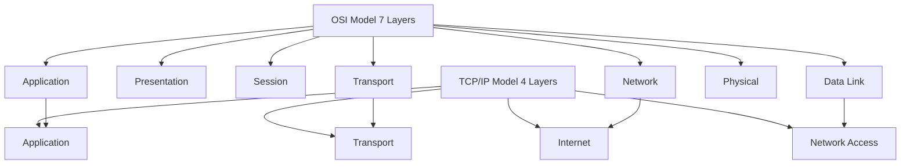
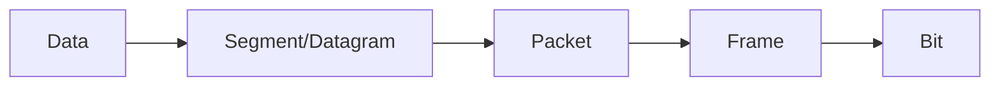
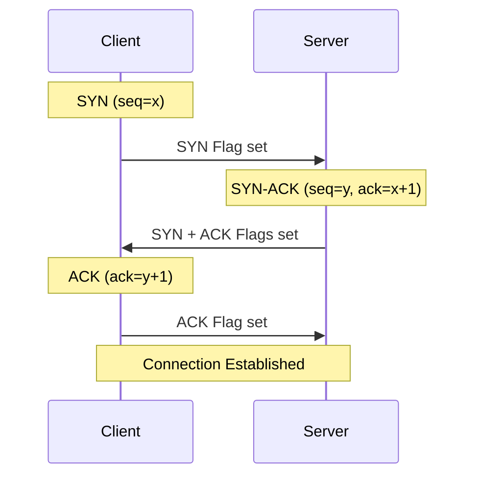
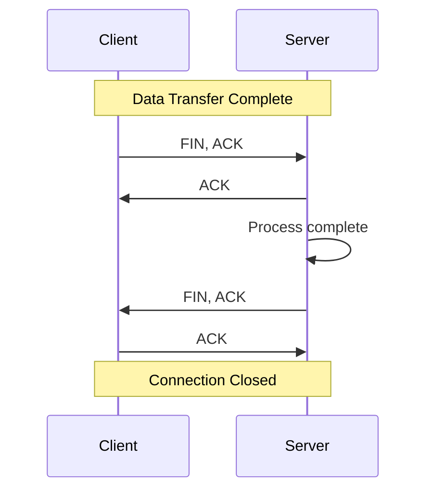
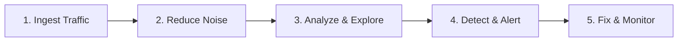
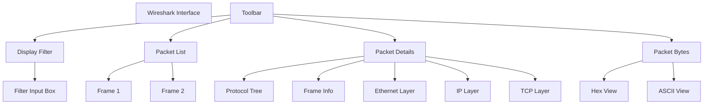
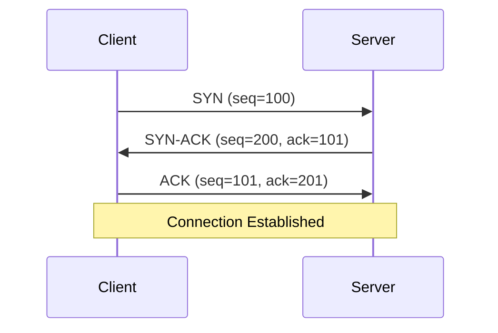

# 🛡️ INTRO TO NETWORK TRAFFIC ANALYSIS

## SOC Analyst Cheatsheet - Module 7/15

---

## 0. Overview

> 📌 **Network Traffic Analysis (NTA)** - The act of examining network traffic to characterize common ports and protocols utilized, establish a baseline for our environment, monitor and respond to threats, and ensure the greatest possible insight into organization's network.

### Why Network Traffic Analysis Matters

Network Traffic Analysis helps security specialists:
- Determine anomalies including security threats early and effectively
- Identify threats in the network quickly
- Meet security guidelines
- Detect attacks that use legitimate credentials
- Investigate past incidents
- Hunt for threats proactively

### Key Use Cases

| Use Case | Description |
|---------|-------------|
| **Real-time Monitoring** | Collecting real-time traffic within the network to analyze upcoming threats |
| **Baseline Establishment** | Setting a baseline for day-to-day network communications |
| **Anomaly Detection** | Identifying non-standard ports, suspicious hosts, networking issues |
| **Malware Detection** | Detecting ransomware, exploits, non-standard interactions |
| **Incident Investigation** | Investigating past incidents and threat hunting |

> 🔴 Attackers must inevitably interact and communicate with our infrastructure to breach the network. NTA helps spot this malicious traffic!

---

## Table of Contents

1. [Introduction & Networking Primer - Layers 1-4](#1-introduction--networking-primer-layers-1-4)
2. [Networking Primer - Layers 5-7](#2-networking-primer---layers-5-7)
3. [The Analysis Process](#3-the-analysis-process)
4. [Analysis in Practice](#4-analysis-in-practice)
5. [Tcpdump](#5-tcpdump)
6. [Wireshark](#6-wireshark)

---

## 1. Introduction & Networking Primer - Layers 1-4

### Required Skills and Knowledge

### TCP/IP Stack & OSI Model

### OSI vs TCP-IP Models

| OSI Layer | TCP/IP Layer | Example |
|-----------|-------------|---------|
| 7. Application | Application | HTTP, FTP |
| 6. Presentation | Application | SSL/TLS |
| 5. Session | Application | RPC |
| 4. Transport | Transport | TCP, UDP |
| 3. Network | Internet | IP, ICMP |
| 2. Data Link | Network Access | Ethernet |
| 1. Physical | Network Access | Cabling |


Comparison of OSI and TCP/IP models: OSI has 7 layers including Application, Presentation, Session, Transport, Network, Data-Link, and Physical. TCP/IP has 4 layers: Application, Transport, Internet, and Link.



| Trait | OSI | TCP-IP |
|-------|-----|--------|
| Layers | Seven | Four |
| Flexibility | Strict | Loose |
| Dependency | Protocol independent | Based on common protocols |

### PDU (Protocol Data Units)

| Layer | PDU Type | Description |
|-------|----------|-------------|
| Application | Data | End user data |
| Transport | Segment/Datagram | TCP/UDP |
| Network | Packet | IP |
| Data Link | Frame | Ethernet |
| Physical | Bit | Binary |


Comparison of OSI and TCP/IP models: OSI has 7 layers including Application, Presentation, Session, Transport, Network, Data-Link, and Physical. TCP/IP has 4 layers: Application, Transport, Internet, and Link. PDU types are Data, Segment/Datagram, Packet, Frame, and Bit.



**Encapsulation:** As data moves down the protocol stack, each layer wraps the previous layer's data. This bubble adds necessary information including:
- Operational flags
- Options for negotiation
- Source/destination IP addresses
- Ports
- Transport and application layer protocols


PDU Packet Breakdown - Diagram showing PDU types: Data, Segment/Datagram, Packet, Frame, Bit. Network packet details include Ethernet II, IPv4, and UDP headers with source and destination addresses.

### MAC Addressing

- **MAC Address:** 48-bit (6 octets) address in hexadecimal format
- **Layer:** OSI Layer 2 (Data Link)
- **Purpose:** Host-to-host communication within broadcast domain
- **Example:** `00:0c:29:4f:8e:35`


Mac-Address - Network interface configuration for en0: flags, MAC address, IPv6 and IPv4 addresses, netmask, and status details.

When layer 2 traffic needs to cross a layer 3 interface, the PDU is sent to the layer 3 egress interface and routed to the correct network.

### IP Addressing

**IPv4:**
- 32-bit address (4 octets)
- Range: 0-255 per octet
- Example: `192.168.86.243`
- Layer: OSI Layer 3

**IPv6:**
- 128-bit address (16 octets)
- Hexadecimal format
- Example: `2001:0db8:85a3:0000:0000:8a2e:0370:7334`
- Types: Unicast, Anycast, Multicast (no Broadcast)


IP Address - Network interface configuration for en0: flags, MAC address, IPv6 and IPv4 addresses, netmask, and status details.

| IPv6 Type | Description |
|-----------|-------------|
| Unicast | Single interface |
| Anycast | Multiple interfaces, only one receives |
| Multicast | All interfaces receive same packet |
| Broadcast | Not used - replaced by multicast |


IPv6 Address - Network interface configuration for en0: flags, MAC address, IPv6 and IPv4 addresses, netmask, and status details.

Along with a much larger address space, IPv6 provides:
- Better support for Multicasting
- Global addressing per device
- Security within the protocol (IPSec)
- Simplified Packet headers


World map showing IPv6 adoption: Darker green indicates higher deployment.

### TCP vs UDP

| Characteristic | TCP | UDP |
|----------------|-----|-----|
| **Transmission** | Connection-oriented | Connectionless |
| **Connection** | Three-way handshake | Fire and forget |
| **Data Delivery** | Stream-based | Packet by packet |
| **Receipt** | Sequence & ACK numbers | No acknowledgment |
| **Speed** | Slower (more overhead) | Fast but unreliable |
| **Use Cases** | SSH, HTTP, Email | DNS, Video, VoIP |

**When to use TCP:** When you need completeness over speed (e.g., SSH, file transfers)

**When to use UDP:** When you need speed over completeness (e.g., DNS, streaming video)

### TCP Three-way Handshake



**Process:**
1. **Client → Server:** SYN packet (synchronization)
   - Proposes sequence number
   - Negotiates window size, MSS, selective ACKs
   
2. **Server → Client:** SYN-ACK packet
   - Acknowledges SYN
   - Proposes server's sequence number
   
3. **Client → Server:** ACK packet
   - Acknowledges server's SYN
   - Connection established


TCP Three-way Handshake - Network packet capture showing TCP connections between IPs 192.168.1.140 and 174.143.213.184.

**Analysis:**
- **Line 1:** Initial SYN flag set (red box)
- **Ports:** 57678 (client random high port) and 80 (server HTTP)
- **Line 2:** Server responds with SYN/ACK
- **Line 3:** Client acknowledges, establishing connection

### TCP Session Teardown



**Graceful Shutdown Sequence:**
1. FIN, ACK (client)
2. ACK (server)
3. FIN, ACK (server)
4. ACK (client)


TCP Session Teardown - Network packet capture showing TCP connections with SYN, ACK, and FIN flags.

> 📌 An adequately terminated connection shows pattern: FIN, ACK → FIN, ACK → ACK

**TCP Flags:**
| Flag | Description |
|------|-------------|
| SYN | Synchronize (start connection) |
| ACK | Acknowledgment |
| FIN | Finish (end connection) |
| RST | Reset (abort connection) |
| PSH | Push (send immediately) |
| URG | Urgent |

### Common Ports and Protocols

| Port | Protocol | Service |
|------|----------|---------|
| 20/21 | FTP | File Transfer |
| 22 | SSH | Secure Shell |
| 23 | Telnet | Unencrypted Shell |
| 25 | SMTP | Mail |
| 53 | DNS | Domain Name System |
| 80 | HTTP | Web |
| 110 | POP3 | Mail |
| 143 | IMAP | Mail |
| 443 | HTTPS | Secure Web |
| 445 | SMB | File Sharing |
| 3389 | RDP | Remote Desktop |
| 3306 | MySQL | Database |
| 5432 | PostgreSQL | Database |

---

## 2. Networking Primer - Layers 5-7

Now that we understand lower-level networking, let's look at upper layer protocols that handle applications.

### HTTP (Hypertext Transfer Protocol)

> 📌 **HTTP** - Stateless Application Layer protocol (port 80/8000) that transfers data in clear text between client and server over TCP.

**HTTP Methods:**

| Method | Description | Safe? |
|--------|-------------|-------|
| **GET** | Request information and content from server | ✅ Required |
| **HEAD** | Like GET but without message body | ✅ Required |
| **POST** | Submit information to server | ❌ Optional |
| **PUT** | Create or update object at URI | ❌ Optional |
| **DELETE** | Remove object at given URI | ❌ Optional |
| **TRACE** | Remote server diagnosis | ❌ Optional |
| **OPTIONS** | Get supported HTTP methods | ❌ Optional |
| **CONNECT** | Tunnel over HTTP (SSL proxies) | ❌ Optional |

> 📌 **GET and HEAD** are the only required methods. Others are optional.

**Common GET Request:**
```
GET /Webserver/index.html HTTP/1.1
```

### HTTPS (HTTP Secure)

> 📌 **HTTPS** - HTTP with TLS/SSL encryption (port 443/8443)

**Why HTTPS?**
- Encrypts entire conversation (not just data)
- Prevents Man-in-the-Middle attacks
- Secures web traffic, sessions, bank transactions

**TLS Handshake:**


Network packet capture showing TCP and TLSv1.3 connections between IPs.

**TLS Handshake Steps:**
1. Client and server exchange hello messages
2. Exchange cryptographic parameters for premaster secret
3. Exchange x.509 certificates for authentication
4. Generate master secret from premaster secret
5. Issue negotiated security parameters to record layer
6. Verify peer calculated same parameters

> 🔴 Once session established, all data appears as **TLS Application Data** (red box)

### FTP (File Transfer Protocol)

> 📌 **FTP** - Application Layer protocol for data transfer between computing devices

**FTP Ports:**
- Port 20: Data transfer
- Port 21: Commands (control session)

**FTP Modes:**

| Mode | Description |
|------|-------------|
| **Active** | Server listens for PORT command from client |
| **Passive** | Client sends PASV, server responds with IP/port for data channel |

> 📌 Passive mode used for FTP servers behind firewalls/NAT.

**FTP Commands:**

| Command | Description |
|---------|-------------|
| USER | Specify username |
| PASS | Send password |
| PORT | Change data port (active mode) |
| PASV | Switch to passive mode |
| LIST | List files in directory |
| CWD | Change working directory |
| PWD | Print working directory |
| SIZE | Get file size |
| RETR | Retrieve file |
| QUIT | End session |

**FTP Command & Response:**


FTP traffic showing directory changes, file transfers, and connection status.

### SMB (Server Message Block)

> 📌 **SMB** - Windows protocol for sharing resources (printer, drives, authentication)

**SMB Ports:**
- Port 445: Direct TCP
- Port 139: NetBIOS over TCP

**SMB Characteristics:**
- Connection-oriented
- Requires user authentication
- Used for file shares, printers, authentication servers

**SMB On The Wire:**


Network packet capture showing SMB and TCP traffic.

**SMB Analysis Tips:**
- TCP handshake performed for each session
- Port 445 = SMB over TCP
- Look for authentication failures (red flag!)
- Multiple auth failures = potential attacker trying to move laterally

> 🔴 Large cluster of SMB auth failures = potential credential stuffing/attack!

---

## 3. The Analysis Process - Detailed (Section 4)

### What is Network Traffic Analysis?

> 📌 **Traffic Analysis** - Breaking down network data into understandable chunks, examining for deviations from regular traffic, detecting malicious traffic (unauthorized RDP, SSH, Telnet), and identifying network issues.

**Key Points:**
- Highly versatile and essential defensive tool
- Provides visibility into network usage
- Enables baseline establishment for detecting changes
- Works with IDS/IPS, firewalls, logs, SIEMs (Splunk, ELK)
- Helps troubleshoot connection issues
- Manual analysis + automated tools = best detection

### Analysis Dependencies

| Dependency | Passive | Active | Description |
|------------|---------|--------|-------------|
| **Permission** | ✅ | ✅ | Must obtain written permission (legal/ethical requirement) |
| **Mirrored Port** | ✅ | ❌ | Switch/router configured to copy traffic to analysis port |
| **Capture Tool** | ✅ | ✅ | Tools like tcpdump, Wireshark, NetworkMiner |
| **In-line Placement** | ❌ | ✅ | Network tap requires topology change |
| **Network Tap/Multiple NICs** | ❌ | ✅ | Two NICs or tap device to maintain traffic flow |
| **Storage & Processing** | ✅ | ✅ | PCAP files get large; need plenty of resources |

### Passive vs Active Capture

| Type | Description |
|------|-------------|
| **Passive** | Copy data without directly interacting with packets |
| **Active/In-line** | Hands-on approach, acts as invisible next hop |

### Using a Baseline

> 💡 **Critical:** Understanding day-to-day traffic flow is essential for effective analysis!

**Scenario without baseline:**
- Grab a ton of captured data
- Must examine every conversation to ensure it's legitimate
- Determine if hosts belong on network or are rogue
- Time-consuming and daunting task

**Scenario with baseline:**
- Quickly strip away known-good communications
- Use "Top Talkers" to identify hosts sending unusual data
- Check against baseline to determine if out of character
- Spot anomalies (e.g., user PCs talking to each other over port 8080 or 445)
- Faster incident detection!

> 🔴 **Critical:** The faster we get visibility during network intrusions, the less potential damage!

---

## 4. Analysis in Practice (Section 5)

### The Analysis Workflow

This is not an exact science - it's a dynamic process influenced by:
- What we are looking for (network errors vs. malicious actions)
- Where we have visibility in our network

### 1. Descriptive Analysis

> 📌 **Descriptive Analysis** - Describes a data set based on individual characteristics. Helps detect errors and outliers.

**Questions to Answer:**
- What is the issue? (Suspected breach? Networking issue?)
- Define scope and goal (what are we looking for? which time period?)
- Define targets (network/host/protocol)

**Example:**
```
Issue: Suspected breach
Target: multiple hosts downloading malicious file from bad.example.com
When: last 48 hours + 2 hours from now
Filenames: 'superbad.exe', 'new-crypto-miner.exe'
Scope: 192.168.100.0/24, protocols: HTTP and FTP
```

### 2. Diagnostic Analysis

> 📌 **Diagnostic Analysis** - Clarifies causes, effects, and interactions. Backward-looking to find reasons for events.

**Steps:**
1. **Capture network traffic** - Plug into link with access to target network
2. **Filter** - Remove noise, keep relevant traffic (HTTP/FTP, GET requests for suspicious files)
3. **Understand** - Filter on `ftp-data` to reconstruct files, `http.request.method == "GET"`

### 3. Predictive Analysis

> 📌 **Predictive Analysis** - Creates predictive model for future probabilities based on historical/current data.

**Note-taking is crucial:**
- Timeframes of captured traffic
- Suspicious hosts
- Conversations containing files (timestamps, packet numbers)

**Summary:** Explain relevant details so superiors can decide to quarantine or perform incident response.

### 4. Prescriptive Analysis

> 📌 **Prescriptive Analysis** - Narrows down what actions to eliminate or prevent future problems.

**Actions:**
- Make decisions to solve the problem
- Prevent recurrence
- Document lessons learned
- Improve processes

### Complete Analysis Workflow Template

```
1. What is the issue?
   - Suspected breach? Networking issue?
2. Define scope and goal
   - Target: host(s) downloading malicious file
   - When: timeframe
   - Supporting info: filenames
3. Define targets (net/host/protocol)
   - Scope: network range, protocols
4. Capture network traffic
   - Live capture + historical from SIEM
5. Filter traffic
   - Remove baseline noise
   - Keep HTTP/GET requests for suspicious files
6. Understand captured traffic
   - ftp-data for file transfers
   - http.request.method == "GET"
7. Note-taking
   - Timestamps, packet numbers, suspicious hosts
8. Summary
   - Clear explanation for decision makers
```

> 🔴 This process is cyclic - may need to reanalyze PCAP to build bigger picture!

### Key Components of Effective Analysis

| Component | Description |
|-----------|-------------|
| **1. Know Your Environment** | Keep asset inventories and network maps. Know which hosts belong on network. |
| **2. Placement is Key** | Closest to source of issue is ideal. Inbound links for internet traffic, same segment for internal issues. |
| **3. Persistence** | Issue may not be frequent (C2 may call once/day). Don't lose drive to find the problem. |

### Analysis Approach - Easy Wins

**1. Start with standard protocols**
- HTTP/S, FTP, Email, TCP/UDP from internet
- Then check SSH, RDP, Telnet between networks

**2. Look for patterns**
- Same host checking in at same time daily = C2 profile

**3. Check host-to-host traffic**
- User hosts rarely talk to each other
- Suspicious if they do!

**4. Look for unique events**
- Host changing pattern
- Different User-Agent string
- Random port binding
- Anything sticking out in large environments

**5. Ask for help**
- Second set of eyes can spot things missed

> 💡 **Summary:** Keep learning, understand your environment, use tools (tcpdump, Wireshark, Snort, SIEMs). Don't rely solely on tools - human eye is best resource!

---

## 5. Tcpdump

| Tool | Description |
|------|-------------|
| **tcpdump** | Command-line utility that captures and interprets network traffic |
| **Tshark** | Command-line variant of Wireshark |
| **Wireshark** |Graphical network traffic analyzer |
| **NGrep** | Pattern-matching tool for network traffic (regex/BPF) |
| **tcpick** | Command-line packet sniffer for TCP streams |
| **Network Taps** | Devices (Gigamon, Niagara) that copy network traffic |
| **Span Ports** | Mirrored ports for traffic collection |
| **Elastic Stack** | Data ingestion and visualization |
| **SIEMs** | Central analysis point (Splunk, etc.) |

### BPF Syntax

Berkeley Packet Filter (BPF) syntax is shared among traffic analysis tools:

```bash
# Basic BPF filters
host 192.168.1.1          # Filter by host
port 80                    # Filter by port
tcp                        # Filter by protocol
udp                        # Filter UDP traffic
icmp                       # Filter ICMP

# Complex filters
host 192.168.1.1 and port 80
tcp and (port 80 or port 443)
not arp and not icmp
```

---

## 5. Tcpdump Fundamentals (Section 6)

### What is Tcpdump?

> 📌 **Tcpdump** - Command-line packet sniffer for Unix-like OS. Uses libpcap to capture packets from network interface in promiscuous mode.

**Key Features:**
- Captures packets from file or network interface
- No GUI required - works via terminal/SSH
- Requires root/admin privileges
- Available on AIX, BSD, Linux, Solaris
- Windows alternative: WinDump (discontinued)

### Locate Tcpdump

```bash
# Check if tcpdump exists
which tcpdump

# Install if needed
sudo apt install tcpdump

# Check version
sudo tcpdump --version

# Output:
# tcpdump version 4.9.3
# libpcap version 1.9.1 (with TPACKET_V3)
# OpenSSL 1.1.1f  31 Mar 2020
```

### Basic Capture Options

| Switch | Description |
|--------|-------------|
| `-D` | Display available interfaces |
| `-i` | Select interface (e.g., `-i eth0`) |
| `-n` | Don't convert addresses to names |
| `-e` | Grab ethernet header |
| `-X` | Show packets in hex and ASCII |
| `-XX` | Same as X + ethernet headers |
| `-v`, `-vv`, `-vvv` | Increase verbosity |
| `-c` | Grab specific number of packets |
| `-s` | Define snapshot length |
| `-S` | Show absolute sequence numbers |
| `-q` | Print less protocol info |
| `-r` | Read from file |
| `-w` | Write to file |

### Basic Commands

**List Available Interfaces:**
```bash
sudo tcpdump -D

# Output:
# 1.eth0 [Up, Running, Connected]
# 2.any (Pseudo-device that captures on all interfaces)
# 3.lo [Up, Running, Loopback]
```

**Capture on Interface:**
```bash
sudo tcpdump -i eth0

# Output shows: timestamp, IP, port, flags, seq, ack, length
```

**Disable Name Resolution:**
```bash
sudo tcpdump -i eth0 -nn

# Shows: IP.port instead of hostname/service
```

**Display Ethernet Header:**
```bash
sudo tcpdump -i eth0 -e

# Now shows: source MAC > dest MAC, ethertype
```

**Include ASCII and Hex:**
```bash
sudo tcpdump -i eth0 -X

# Shows hex on left, ASCII on right
```

**Combined Options:**
```bash
sudo tcpdump -i eth0 -nnvXX

# Full verbose output with hex and ASCII
```

### Tcpdump Output Breakdown

> 📌 Understanding the output fields:

| Field | Color | Description |
|-------|-------|-------------|
| **Timestamp** | Yellow | Time/date (configurable) |
| **Protocol** | Orange | Upper-layer header (IP, TCP, etc.) |
| **Source & Dest** | Orange | IP:Port format |
| **Flags** | Green | TCP flags (SYN, ACK, FIN, etc.) |
| **Seq/Ack Numbers** | Red | Sequence and acknowledgment |
| **Protocol Options** | Blue | Negotiated TCP values |
| **Notes** | White | Dissector notes (e.g., FTP) |


Tcpdump Shell Breakdown - Network packet capture showing FTP communication between IPs 172.16.146.2 and 172.16.146.1, including welcome message and password request.

**Example Output:**
```
10:58:33.719241 IP 172.16.146.2.55260 > 172.67.1.1.https: Flags [P.], seq 1953742992:1953743073, ack 2034210498, win 501, length 81
```

### File I/O with Tcpdump

**Save to File:**
```bash
sudo tcpdump -i eth0 -w ~/output.pcap

# Output:
# tcpdump: listening on eth0, link-type EN10MB (Ethernet), snapshot length 262144 bytes
# 10 packets captured
# 131 packets received by filter
# 0 packets dropped by kernel
```

> 🔴 Watch disk space - PCAPs can get large quickly!

**Read from File:**
```bash
sudo tcpdump -r ~/output.pcap
```

**Read with Options:**
```bash
sudo tcpdump -r ~/output.pcap -nnvXX
```

### Man Page

```bash
man tcpdump
```

> 💡 **Tip:** Tcpdump can be used to create a simple IDS by scripting pattern analysis!

---

## 6. Tcpdump - Packet Filtering (Section 8)

### Filtering and Advanced Syntax

> 📌 Tcpdump filters help trim down traffic printed to output or sent to file. Reduces storage and speeds up processing.

### Helpful Tcpdump Filters

| Filter | Description |
|--------|-------------|
| `host` | Filter by host (bi-directional) |
| `src / dest` | Source or destination host/port |
| `net` | Filter by network (CIDR notation) |
| `proto` | Filter by protocol (tcp, udp, icmp) |
| `port` | Filter by port (bi-directional) |
| `portrange` | Filter by port range (e.g., 0-1024) |
| `less / greater` | Filter by packet size |
| `and / &&` | Combine filters |
| `or / \|\|` | Match either condition |
| `not / !` | Negate filter |

### Host Filter

```bash
sudo tcpdump -i eth0 host 172.16.146.2

# Shows all traffic involving 172.16.146.2 (source or destination)
```

### Source/Destination Filter

```bash
# Source only
sudo tcpdump -i eth0 src host 172.16.146.2

# Destination only
sudo tcpdump -i eth0 dst net 172.16.146.0/24

# Source port
sudo tcpdump -i eth0 tcp src port 80
```

### Protocol Filter

```bash
# Using name
sudo tcpdump -i eth0 udp

# Using protocol number (17 = UDP)
sudo tcpdump -i eth0 proto 17
```

### Port Filter

```bash
# TCP port 443
sudo tcpdump -i eth0 tcp port 443

# Any port 53 (TCP or UDP)
sudo tcpdump -i eth0 port 53
```

### Port Range Filter

```bash
# Common ports only
sudo tcpdump -i eth0 portrange 0-1024
```

### Less/Greater Filter

```bash
# Packets less than 64 bytes
sudo tcpdump -i eth0 less 64

# Packets greater than 500 bytes
sudo tcpdump -i eth0 greater 500
```

### AND Filter

```bash
# Both conditions must match
sudo tcpdump -i eth0 host 192.168.0.1 and port 23
```

### OR Filter

```bash
# Either condition matches
sudo tcpdump -r sus.pcap icmp or host 172.16.146.1
```

### NOT Filter

```bash
# Exclude ICMP traffic
sudo tcpdump -r sus.pcap not icmp
```

### Pre-Capture vs Post-Capture Filters

| Type | Description |
|------|-------------|
| **Pre-capture** | Applied during capture - drops non-matching packets |
| **Post-capture** | Applied when reading file - doesn't modify PCAP |

### Tips and Tricks

**Absolute Sequence Numbers:**
```bash
# -S shows absolute sequence numbers (very long)
sudo tcpdump -i eth0 -S
```

**ASCII Only:**
```bash
# -A shows ASCII only (no hex)
sudo tcpdump -Ar telnet.pcap
```

**Line Buffer (for piping):**
```bash
# -l enables line buffering for grep
sudo tcpdump -Ar http.cap -l | grep 'mailto:*'
```

### TCP Flags Filtering

**Find SYN packets (port scan detection):**
```bash
# tcp[13] & 2 checks the 2nd bit (SYN flag)
sudo tcpdump -i eth0 'tcp[13] & 2 != 0'
```

> 📌 This counts to the 13th byte in TCP header and checks if 2nd bit is set (SYN flag).

### Protocol RFC Links

| Protocol | RFC |
|----------|-----|
| IP | RFC 791 |
| ICMP | RFC 792 |
| TCP | RFC 793 |
| UDP | RFC 768 |

---

## 7. Interrogating Network Traffic - Lab (Section 9)

### Lab Overview

This lab provides hands-on practice with packet filters to analyze PCAP files.

### Tasks

**Task #1: Read capture from file without filters**
```bash
sudo tcpdump -r capture.pcap
```

**Task #2: Identify traffic types**
- Common protocols observed
- Ports utilized
- Protocols used

**Task #3: Identify conversations**
- Find patterns between server and host
- Note client/server port numbers in TCP handshake
- Identify servers (responding on well-known ports)

**Task #4: Interpret capture in depth**
- Timestamp of first established conversation
- IP addresses for apache.org from DNS
- Protocol used in first conversation

**Task #5: Filter for DNS traffic**
```bash
# Filter DNS only
sudo tcpdump -r capture.pcap port 53

# DNS server for segment
# Domain names requested
# DNS record types (A, AAAA, PTR, etc.)
```

**Task #6: Filter for HTTP/HTTPS**
```bash
# HTTP traffic
sudo tcpdump -r capture.pcap tcp port 80

# HTTPS traffic  
sudo tcpdump -r capture.pcap tcp port 443
```
- Most common HTTP request methods (GET, POST)
- Most common HTTP response codes

**Task #7: Deep analysis**
- Use hex and ASCII output
```bash
sudo tcpdump -r capture.pcap -X port 80
```
- Determine what application is running the webserver

### Tips For Analysis

| Question | Purpose |
|----------|---------|
| What type of traffic do you see? | Protocol, port identification |
| Is there more than one conversation? | Count conversations |
| How many unique hosts? | Identify all endpoints |
| Timestamp of first conversation? | Establish timeline |
| What traffic to filter out? | Clean up view |
| Who are the servers? | Identify services |
| What records/methods used? | Understand activity |

### Summary

Through this lab you learned:
- Capture and display filters effectively
- Dissect traffic to identify protocols
- Identify DNS and Web servers
- Extract domain names and IP addresses
- Analyze HTTP request/response methods

> 💡 **Practice:** Try capturing traffic on your home network and answer the same questions!

---

## 8. Wireshark

### NTA Workflow



**Step 1: Ingest Traffic**
- Connect to network segment to capture
- Use capture filters if you know what you're looking for

**Step 2: Reduce Noise by Filtering**
- Filter out unnecessary traffic (Broadcast, Multicast)
- Makes analysis easier

**Step 3: Analyze and Explore**
- Look at specific hosts, protocols, TCP flags
- Ask: Is traffic encrypted? Should it be?
- Ask: Are users accessing unauthorized resources?
- Ask: Are hosts talking that shouldn't?

**Step 4: Detect and Alert**
- Look for errors, unresponsive devices
- Determine if traffic is benign or malicious
- Use IDS/IPS signatures

**Step 5: Fix and Monitor**
- Make changes and continue monitoring
- Verify issue is resolved

---

## 3. Tcpdump

### Basic Usage

```bash
# Capture traffic on interface
tcpdump -i eth0

# Capture to file
tcpdump -i eth0 -w capture.pcap

# Read from file
tcpdump -r capture.pcap

# Capture specific number of packets
tcpdump -i eth0 -c 100

# Capture with timestamp
tcpdump -i eth0 -tttt

# Resolve hostnames
tcpdump -i eth0 -n

# Resolve ports
tcpdump -i eth0 -nn
```

### Capture Filters

```bash
# Filter by host
tcpdump host 192.168.1.1

# Filter by source/destination
tcpdump src 192.168.1.1
tcpdump dst 10.0.0.1

# Filter by port
tcpdump port 80
tcpdump src port 22

# Filter by protocol
tcpdump tcp
tcpdump udp
tcpdump icmp

# Combine filters
tcpdump host 192.168.1.1 and port 80
tcpdump src 192.168.1.1 and not dst 10.0.0.1
tcpdump tcp and (port 80 or port 443)
```

### Display Filters (for analysis)

```bash
# Filter specific host after capture
tcpdump -r capture.pcap host 192.168.1.1

# Filter by port
tcpdump -r capture.pcap port 80

# TCP flags
tcpdump -r capture.pcap 'tcp[tcpflags] & (tcp-syn) != 0'

# Specific byte in payload
tcpdump -r capture.pcap 'tcp[20] = 0x47'
```

### Common Tcpdump Options

| Option | Description |
|--------|-------------|
| `-i` | Interface |
| `-c` | Count |
| `-w` | Write to file |
| `-r` | Read from file |
| `-n` | Don't resolve hostnames |
| `-nn` | Don't resolve hostnames or ports |
| `-v` | Verbose |
| `-vv` | More verbose |
| `-x` | Hex output |
| `-X` | Hex and ASCII |
| `-s` | Snapshot length |
| `-tttt` | Timestamp format |

---

## 4. Wireshark

### Interface



### Display Filters

**Comparison Operators**
| Operator | Meaning |
|----------|---------|
| `==` | Equal |
| `!=` | Not equal |
| `>` | Greater than |
| `<` | Less than |
| `>=` | Greater or equal |
| `<=` | Less or equal |

**Logical Operators**
| Operator | Meaning |
|----------|---------|
| `and` | Both must match |
| `or` | Either can match |
| `not` | Negate |

**Common Filters**

```wireshark
# IP filters
ip.addr == 192.168.1.1
ip.src == 192.168.1.1
ip.dst == 10.0.0.1

# Port filters
tcp.port == 80
udp.port == 53
tcp.srcport == 443

# Protocol filters
tcp
udp
icmp
dns
http
tls

# Combined filters
ip.addr == 192.168.1.1 and tcp.port == 80
not arp and not icmp
http.request.method == "GET"
tcp.flags.syn == 1
```

### Follow TCP Stream

```wireshark
# Right-click packet → Follow → TCP Stream
# Shows entire conversation between hosts
```

### Expert Information

```wireshark
# Analyze → Expert Information
# Shows anomalies, errors, notes by severity
```

### Statistics

| Menu | Description |
|------|-------------|
| Protocol Hierarchy | Breakdown by protocol |
| Conversations | Host pairs and traffic |
| Endpoints | Host statistics |
| IO Graphs | Traffic visualization |
| Flow Graph | TCP flow visualization |

### Export Options

```bash
# Export to CSV
tshark -r capture.pcap -T fields -e ip.src -e ip.dst -e tcp.len

# Extract HTTP objects
tshark -r capture.pcap --export-objects http,./export

# Extract files
tshark -r capture.pcap --export-objects smb,./export
```

---

## Key Takeaways

| Concept | Description |
|---------|-------------|
| **NTA** | Network Traffic Analysis - examining traffic for anomalies |
| **BPF** | Berkeley Packet Filter - common filtering syntax |
| **tcpdump** | CLI packet capture and analysis tool |
| **Wireshark** | GUI packet analysis tool |
| **PCAP** | Packet Capture - file format for captured traffic |
| **Capture Filter** | Filter during capture (BPF syntax) |
| **Display Filter** | Filter after capture (Wireshark syntax) |

---

## Interview Questions

### Q1: What is Network Traffic Analysis?

**Answer:** Network Traffic Analysis (NTA) is the process of examining network traffic to characterize common ports and protocols, establish a baseline, monitor and respond to threats. It helps detect anomalies, security threats, malware, and investigate incidents.

---

### Q2: What is the difference between Capture Filters and Display Filters?

**Answer:**

| Filter Type | When Applied | Tool |
|------------|--------------|------|
| **Capture Filter** | During capture | tcpdump, tshark |
| **Display Filter** | After capture | Wireshark |

Capture filters use BPF syntax and reduce CPU usage during capture. Display filters are more flexible and can analyze captured data in detail.

---

### Q3: How do you detect a port scan in network traffic?

**Answer:**
- Look for many SYN packets on different ports
- Multiple hosts scanning same target
- Unusual port activity
- Tools: `tcpdump 'tcp[tcpflags] & (tcp-syn) != 0 and tcp[tcpflags] & (tcp-ack) == 0'`

---

### Q4: What is the TCP three-way handshake?

**Answer:**



1. Client sends SYN
2. Server responds SYN-ACK
3. Client sends ACK

---

### Q5: How do you identify encrypted vs unencrypted traffic?

**Answer:**
- Port 443 = HTTPS (encrypted)
- Port 80 = HTTP (unencrypted)
- Wireshark: Look for "Secure" in protocol, TLS layer
- Plain text credentials in port 80 = suspicious

---

### Q6: What is the difference between TCP and UDP?

**Answer:**

| Feature | TCP | UDP |
|---------|-----|-----|
| **Connection** | Reliable, connection-oriented | Fire-and-forget |
| **Ordering** | Yes,Sequenced | No |
| **Speed** | Slower | Faster |
| **Use Cases** | HTTP, SSH, Email | DNS, VoIP, Gaming |
| **State** | Stateful | Stateless |

---

### Q7: How do you extract files from PCAP?

**Answer:**

```bash
# Using tcpdump
tcpdump -r capture.pcap -w extracted.pcap

# Using Wireshark
# File → Export Objects → HTTP

# Using tshark
tshark -r capture.pcap --export-objects http,./output
```

---

### Q8: What is the NTA workflow?

**Answer:**
1. **Ingest** - Capture traffic
2. **Reduce Noise** - Filter irrelevant traffic
3. **Analyze** - Explore relevant data
4. **Detect** - Identify threats, alert
5. **Monitor** - Continue watching after fix

---

## Additional Resources

### Tools

| Tool | Purpose |
|------|---------|
| Wireshark | GUI packet analysis |
| tcpdump | CLI packet capture |
| Tshark | CLI Wireshark |
| NetworkMiner | Extract artifacts from PCAP |
| tcpick | TCP stream reassembly |
| NGrep | Pattern matching |

### References

- [Wireshark Docs](https://www.wireshark.org/docs/)
- [tcpdump Man Page](https://www.tcpdump.org/manpages/tcpdump.1.html)
- [BPF Reference](https://www.tcpdump.org/manpages/pcap-filter.7.html)

---

*Module 7/15 - Intro to Network Traffic Analysis*
*For learning and SOC career preparation*