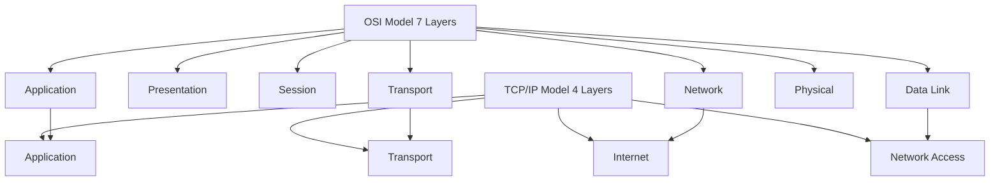
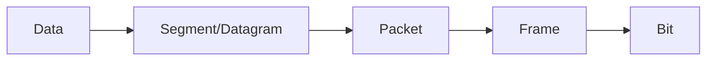
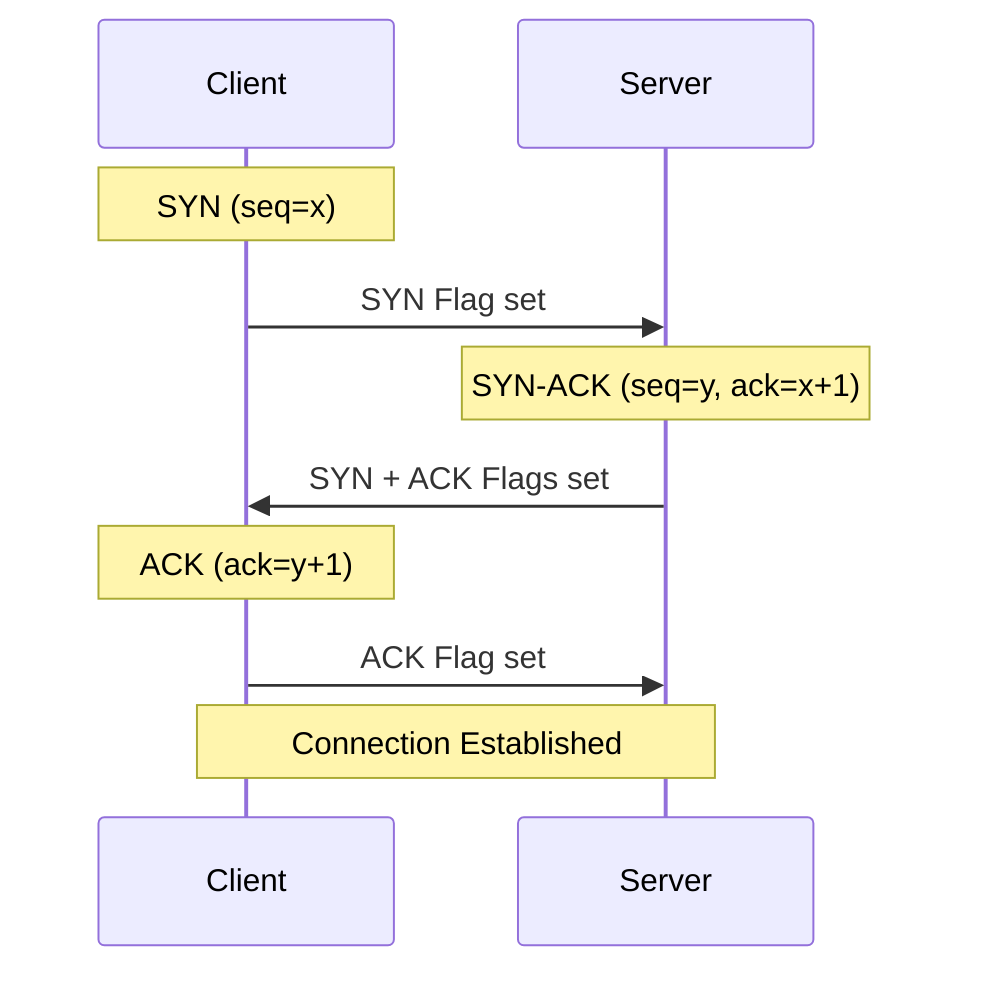
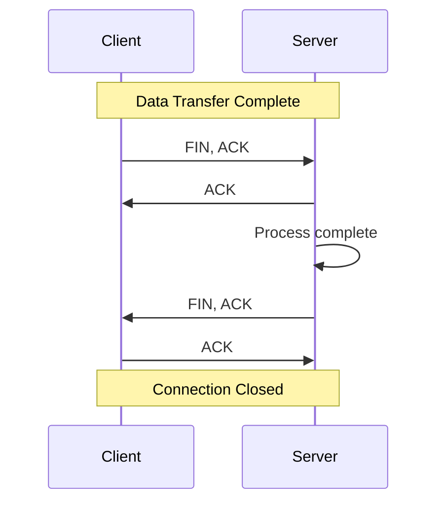
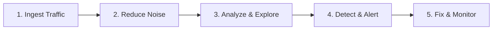
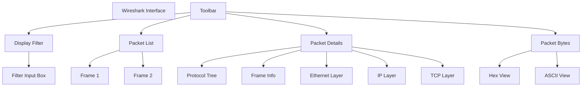
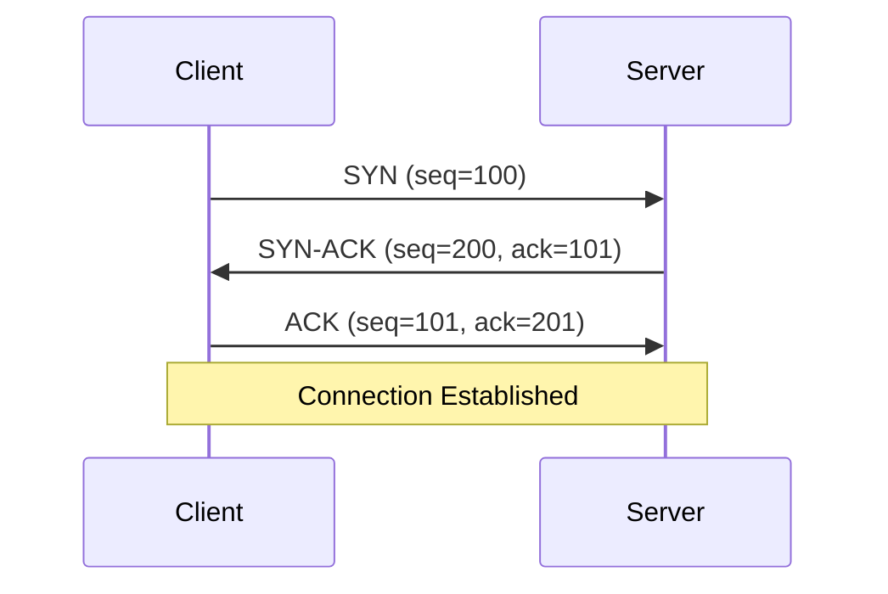

# 🛡️ INTRO TO NETWORK TRAFFIC ANALYSIS

## SOC Analyst Cheatsheet - Module 7/15

---

## 0. Overview

> 📌 **Network Traffic Analysis (NTA)** - The act of examining network traffic to characterize common ports and protocols utilized, establish a baseline for our environment, monitor and respond to threats, and ensure the greatest possible insight into organization's network.

### Why Network Traffic Analysis Matters

Network Traffic Analysis helps security specialists:
- Determine anomalies including security threats early and effectively
- Identify threats in the network quickly
- Meet security guidelines
- Detect attacks that use legitimate credentials
- Investigate past incidents
- Hunt for threats proactively

### Key Use Cases

| Use Case | Description |
|---------|-------------|
| **Real-time Monitoring** | Collecting real-time traffic within the network to analyze upcoming threats |
| **Baseline Establishment** | Setting a baseline for day-to-day network communications |
| **Anomaly Detection** | Identifying non-standard ports, suspicious hosts, networking issues |
| **Malware Detection** | Detecting ransomware, exploits, non-standard interactions |
| **Incident Investigation** | Investigating past incidents and threat hunting |

> 🔴 Attackers must inevitably interact and communicate with our infrastructure to breach the network. NTA helps spot this malicious traffic!

---

## Table of Contents

1. [Introduction & Networking Primer](#1-introduction--networking-primer-layers-1-4)
2. [The Analysis Process](#2-the-analysis-process)
3. [Tcpdump](#3-tcpdump)
4. [Wireshark](#4-wireshark)

---

## 1. Introduction & Networking Primer - Layers 1-4

### Required Skills and Knowledge

### TCP/IP Stack & OSI Model

### OSI vs TCP-IP Models

| OSI Layer | TCP/IP Layer | Example |
|-----------|-------------|---------|
| 7. Application | Application | HTTP, FTP |
| 6. Presentation | Application | SSL/TLS |
| 5. Session | Application | RPC |
| 4. Transport | Transport | TCP, UDP |
| 3. Network | Internet | IP, ICMP |
| 2. Data Link | Network Access | Ethernet |
| 1. Physical | Network Access | Cabling |


Comparison of OSI and TCP/IP models: OSI has 7 layers including Application, Presentation, Session, Transport, Network, Data-Link, and Physical. TCP/IP has 4 layers: Application, Transport, Internet, and Link.



| Trait | OSI | TCP-IP |
|-------|-----|--------|
| Layers | Seven | Four |
| Flexibility | Strict | Loose |
| Dependency | Protocol independent | Based on common protocols |

### PDU (Protocol Data Units)

| Layer | PDU Type | Description |
|-------|----------|-------------|
| Application | Data | End user data |
| Transport | Segment/Datagram | TCP/UDP |
| Network | Packet | IP |
| Data Link | Frame | Ethernet |
| Physical | Bit | Binary |


Comparison of OSI and TCP/IP models: OSI has 7 layers including Application, Presentation, Session, Transport, Network, Data-Link, and Physical. TCP/IP has 4 layers: Application, Transport, Internet, and Link. PDU types are Data, Segment/Datagram, Packet, Frame, and Bit.



**Encapsulation:** As data moves down the protocol stack, each layer wraps the previous layer's data. This bubble adds necessary information including:
- Operational flags
- Options for negotiation
- Source/destination IP addresses
- Ports
- Transport and application layer protocols


PDU Packet Breakdown - Diagram showing PDU types: Data, Segment/Datagram, Packet, Frame, Bit. Network packet details include Ethernet II, IPv4, and UDP headers with source and destination addresses.

### MAC Addressing

- **MAC Address:** 48-bit (6 octets) address in hexadecimal format
- **Layer:** OSI Layer 2 (Data Link)
- **Purpose:** Host-to-host communication within broadcast domain
- **Example:** `00:0c:29:4f:8e:35`


Mac-Address - Network interface configuration for en0: flags, MAC address, IPv6 and IPv4 addresses, netmask, and status details.

When layer 2 traffic needs to cross a layer 3 interface, the PDU is sent to the layer 3 egress interface and routed to the correct network.

### IP Addressing

**IPv4:**
- 32-bit address (4 octets)
- Range: 0-255 per octet
- Example: `192.168.86.243`
- Layer: OSI Layer 3

**IPv6:**
- 128-bit address (16 octets)
- Hexadecimal format
- Example: `2001:0db8:85a3:0000:0000:8a2e:0370:7334`
- Types: Unicast, Anycast, Multicast (no Broadcast)


IP Address - Network interface configuration for en0: flags, MAC address, IPv6 and IPv4 addresses, netmask, and status details.

| IPv6 Type | Description |
|-----------|-------------|
| Unicast | Single interface |
| Anycast | Multiple interfaces, only one receives |
| Multicast | All interfaces receive same packet |
| Broadcast | Not used - replaced by multicast |


IPv6 Address - Network interface configuration for en0: flags, MAC address, IPv6 and IPv4 addresses, netmask, and status details.

Along with a much larger address space, IPv6 provides:
- Better support for Multicasting
- Global addressing per device
- Security within the protocol (IPSec)
- Simplified Packet headers


World map showing IPv6 adoption: Darker green indicates higher deployment.

### TCP vs UDP

| Characteristic | TCP | UDP |
|----------------|-----|-----|
| **Transmission** | Connection-oriented | Connectionless |
| **Connection** | Three-way handshake | Fire and forget |
| **Data Delivery** | Stream-based | Packet by packet |
| **Receipt** | Sequence & ACK numbers | No acknowledgment |
| **Speed** | Slower (more overhead) | Fast but unreliable |
| **Use Cases** | SSH, HTTP, Email | DNS, Video, VoIP |

**When to use TCP:** When you need completeness over speed (e.g., SSH, file transfers)

**When to use UDP:** When you need speed over completeness (e.g., DNS, streaming video)

### TCP Three-way Handshake



**Process:**
1. **Client → Server:** SYN packet (synchronization)
   - Proposes sequence number
   - Negotiates window size, MSS, selective ACKs
   
2. **Server → Client:** SYN-ACK packet
   - Acknowledges SYN
   - Proposes server's sequence number
   
3. **Client → Server:** ACK packet
   - Acknowledges server's SYN
   - Connection established


TCP Three-way Handshake - Network packet capture showing TCP connections between IPs 192.168.1.140 and 174.143.213.184.

**Analysis:**
- **Line 1:** Initial SYN flag set (red box)
- **Ports:** 57678 (client random high port) and 80 (server HTTP)
- **Line 2:** Server responds with SYN/ACK
- **Line 3:** Client acknowledges, establishing connection

### TCP Session Teardown



**Graceful Shutdown Sequence:**
1. FIN, ACK (client)
2. ACK (server)
3. FIN, ACK (server)
4. ACK (client)


TCP Session Teardown - Network packet capture showing TCP connections with SYN, ACK, and FIN flags.

> 📌 An adequately terminated connection shows pattern: FIN, ACK → FIN, ACK → ACK

**TCP Flags:**
| Flag | Description |
|------|-------------|
| SYN | Synchronize (start connection) |
| ACK | Acknowledgment |
| FIN | Finish (end connection) |
| RST | Reset (abort connection) |
| PSH | Push (send immediately) |
| URG | Urgent |

### Common Ports and Protocols

| Port | Protocol | Service |
|------|----------|---------|
| 20/21 | FTP | File Transfer |
| 22 | SSH | Secure Shell |
| 23 | Telnet | Unencrypted Shell |
| 25 | SMTP | Mail |
| 53 | DNS | Domain Name System |
| 80 | HTTP | Web |
| 110 | POP3 | Mail |
| 143 | IMAP | Mail |
| 443 | HTTPS | Secure Web |
| 445 | SMB | File Sharing |
| 3389 | RDP | Remote Desktop |
| 3306 | MySQL | Database |
| 5432 | PostgreSQL | Database |

---

## 2. The Analysis Process

### Common Traffic Analysis Tools

| Tool | Description |
|------|-------------|
| **tcpdump** | Command-line utility that captures and interprets network traffic |
| **Tshark** | Command-line variant of Wireshark |
| **Wireshark** |Graphical network traffic analyzer |
| **NGrep** | Pattern-matching tool for network traffic (regex/BPF) |
| **tcpick** | Command-line packet sniffer for TCP streams |
| **Network Taps** | Devices (Gigamon, Niagara) that copy network traffic |
| **Span Ports** | Mirrored ports for traffic collection |
| **Elastic Stack** | Data ingestion and visualization |
| **SIEMs** | Central analysis point (Splunk, etc.) |

### BPF Syntax

Berkeley Packet Filter (BPF) syntax is shared among traffic analysis tools:

```bash
# Basic BPF filters
host 192.168.1.1          # Filter by host
port 80                    # Filter by port
tcp                        # Filter by protocol
udp                        # Filter UDP traffic
icmp                       # Filter ICMP

# Complex filters
host 192.168.1.1 and port 80
tcp and (port 80 or port 443)
not arp and not icmp
```

### NTA Workflow



**Step 1: Ingest Traffic**
- Connect to network segment to capture
- Use capture filters if you know what you're looking for

**Step 2: Reduce Noise by Filtering**
- Filter out unnecessary traffic (Broadcast, Multicast)
- Makes analysis easier

**Step 3: Analyze and Explore**
- Look at specific hosts, protocols, TCP flags
- Ask: Is traffic encrypted? Should it be?
- Ask: Are users accessing unauthorized resources?
- Ask: Are hosts talking that shouldn't?

**Step 4: Detect and Alert**
- Look for errors, unresponsive devices
- Determine if traffic is benign or malicious
- Use IDS/IPS signatures

**Step 5: Fix and Monitor**
- Make changes and continue monitoring
- Verify issue is resolved

---

## 3. Tcpdump

### Basic Usage

```bash
# Capture traffic on interface
tcpdump -i eth0

# Capture to file
tcpdump -i eth0 -w capture.pcap

# Read from file
tcpdump -r capture.pcap

# Capture specific number of packets
tcpdump -i eth0 -c 100

# Capture with timestamp
tcpdump -i eth0 -tttt

# Resolve hostnames
tcpdump -i eth0 -n

# Resolve ports
tcpdump -i eth0 -nn
```

### Capture Filters

```bash
# Filter by host
tcpdump host 192.168.1.1

# Filter by source/destination
tcpdump src 192.168.1.1
tcpdump dst 10.0.0.1

# Filter by port
tcpdump port 80
tcpdump src port 22

# Filter by protocol
tcpdump tcp
tcpdump udp
tcpdump icmp

# Combine filters
tcpdump host 192.168.1.1 and port 80
tcpdump src 192.168.1.1 and not dst 10.0.0.1
tcpdump tcp and (port 80 or port 443)
```

### Display Filters (for analysis)

```bash
# Filter specific host after capture
tcpdump -r capture.pcap host 192.168.1.1

# Filter by port
tcpdump -r capture.pcap port 80

# TCP flags
tcpdump -r capture.pcap 'tcp[tcpflags] & (tcp-syn) != 0'

# Specific byte in payload
tcpdump -r capture.pcap 'tcp[20] = 0x47'
```

### Common Tcpdump Options

| Option | Description |
|--------|-------------|
| `-i` | Interface |
| `-c` | Count |
| `-w` | Write to file |
| `-r` | Read from file |
| `-n` | Don't resolve hostnames |
| `-nn` | Don't resolve hostnames or ports |
| `-v` | Verbose |
| `-vv` | More verbose |
| `-x` | Hex output |
| `-X` | Hex and ASCII |
| `-s` | Snapshot length |
| `-tttt` | Timestamp format |

---

## 4. Wireshark

### Interface



### Display Filters

**Comparison Operators**
| Operator | Meaning |
|----------|---------|
| `==` | Equal |
| `!=` | Not equal |
| `>` | Greater than |
| `<` | Less than |
| `>=` | Greater or equal |
| `<=` | Less or equal |

**Logical Operators**
| Operator | Meaning |
|----------|---------|
| `and` | Both must match |
| `or` | Either can match |
| `not` | Negate |

**Common Filters**

```wireshark
# IP filters
ip.addr == 192.168.1.1
ip.src == 192.168.1.1
ip.dst == 10.0.0.1

# Port filters
tcp.port == 80
udp.port == 53
tcp.srcport == 443

# Protocol filters
tcp
udp
icmp
dns
http
tls

# Combined filters
ip.addr == 192.168.1.1 and tcp.port == 80
not arp and not icmp
http.request.method == "GET"
tcp.flags.syn == 1
```

### Follow TCP Stream

```wireshark
# Right-click packet → Follow → TCP Stream
# Shows entire conversation between hosts
```

### Expert Information

```wireshark
# Analyze → Expert Information
# Shows anomalies, errors, notes by severity
```

### Statistics

| Menu | Description |
|------|-------------|
| Protocol Hierarchy | Breakdown by protocol |
| Conversations | Host pairs and traffic |
| Endpoints | Host statistics |
| IO Graphs | Traffic visualization |
| Flow Graph | TCP flow visualization |

### Export Options

```bash
# Export to CSV
tshark -r capture.pcap -T fields -e ip.src -e ip.dst -e tcp.len

# Extract HTTP objects
tshark -r capture.pcap --export-objects http,./export

# Extract files
tshark -r capture.pcap --export-objects smb,./export
```

---

## Key Takeaways

| Concept | Description |
|---------|-------------|
| **NTA** | Network Traffic Analysis - examining traffic for anomalies |
| **BPF** | Berkeley Packet Filter - common filtering syntax |
| **tcpdump** | CLI packet capture and analysis tool |
| **Wireshark** | GUI packet analysis tool |
| **PCAP** | Packet Capture - file format for captured traffic |
| **Capture Filter** | Filter during capture (BPF syntax) |
| **Display Filter** | Filter after capture (Wireshark syntax) |

---

## Interview Questions

### Q1: What is Network Traffic Analysis?

**Answer:** Network Traffic Analysis (NTA) is the process of examining network traffic to characterize common ports and protocols, establish a baseline, monitor and respond to threats. It helps detect anomalies, security threats, malware, and investigate incidents.

---

### Q2: What is the difference between Capture Filters and Display Filters?

**Answer:**

| Filter Type | When Applied | Tool |
|------------|--------------|------|
| **Capture Filter** | During capture | tcpdump, tshark |
| **Display Filter** | After capture | Wireshark |

Capture filters use BPF syntax and reduce CPU usage during capture. Display filters are more flexible and can analyze captured data in detail.

---

### Q3: How do you detect a port scan in network traffic?

**Answer:**
- Look for many SYN packets on different ports
- Multiple hosts scanning same target
- Unusual port activity
- Tools: `tcpdump 'tcp[tcpflags] & (tcp-syn) != 0 and tcp[tcpflags] & (tcp-ack) == 0'`

---

### Q4: What is the TCP three-way handshake?

**Answer:**



1. Client sends SYN
2. Server responds SYN-ACK
3. Client sends ACK

---

### Q5: How do you identify encrypted vs unencrypted traffic?

**Answer:**
- Port 443 = HTTPS (encrypted)
- Port 80 = HTTP (unencrypted)
- Wireshark: Look for "Secure" in protocol, TLS layer
- Plain text credentials in port 80 = suspicious

---

### Q6: What is the difference between TCP and UDP?

**Answer:**

| Feature | TCP | UDP |
|---------|-----|-----|
| **Connection** | Reliable, connection-oriented | Fire-and-forget |
| **Ordering** | Yes,Sequenced | No |
| **Speed** | Slower | Faster |
| **Use Cases** | HTTP, SSH, Email | DNS, VoIP, Gaming |
| **State** | Stateful | Stateless |

---

### Q7: How do you extract files from PCAP?

**Answer:**

```bash
# Using tcpdump
tcpdump -r capture.pcap -w extracted.pcap

# Using Wireshark
# File → Export Objects → HTTP

# Using tshark
tshark -r capture.pcap --export-objects http,./output
```

---

### Q8: What is the NTA workflow?

**Answer:**
1. **Ingest** - Capture traffic
2. **Reduce Noise** - Filter irrelevant traffic
3. **Analyze** - Explore relevant data
4. **Detect** - Identify threats, alert
5. **Monitor** - Continue watching after fix

---

## Additional Resources

### Tools

| Tool | Purpose |
|------|---------|
| Wireshark | GUI packet analysis |
| tcpdump | CLI packet capture |
| Tshark | CLI Wireshark |
| NetworkMiner | Extract artifacts from PCAP |
| tcpick | TCP stream reassembly |
| NGrep | Pattern matching |

### References

- [Wireshark Docs](https://www.wireshark.org/docs/)
- [tcpdump Man Page](https://www.tcpdump.org/manpages/tcpdump.1.html)
- [BPF Reference](https://www.tcpdump.org/manpages/pcap-filter.7.html)

---

*Module 7/15 - Intro to Network Traffic Analysis*
*For learning and SOC career preparation*