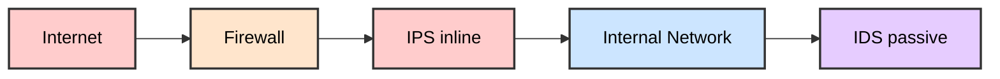
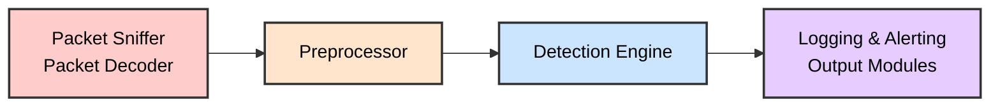
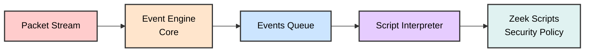

# 🛡️ WORKING WITH IDS/IPS

## SOC Analyst Cheatsheet - Module 9/15

---

## 0. Overview

### Module Description

This module offers an in-depth exploration of Suricata, Snort, and Zeek, covering both rule development and intrusion detection. We'll guide you through signature-based and analytics-based rule development, and you'll learn to tackle encrypted traffic.

> 🔴 **Prerequisite Knowledge:** Basic Windows operation knowledge and common attack principles

### What We'll Cover

| Topic | Description |
|-------|-------------|
| **Suricata** | Fundamentals, rule development (signature-based & encrypted traffic) |
| **Snort** | Fundamentals, rule development |
| **Zeek** | Fundamentals, intrusion detection |
| **Malware Detection** | PowerShell Empire, Covenant, Sliver, Cerber, Dridex, Ursnif, Patchwork |
| **Technique Detection** | DNS exfiltration, TLS/HTTP exfiltration, PsExec lateral movement, beaconing |

### Prerequisites

- Penetration Testing Process
- Incident Handling Process
- Security Monitoring & SIEM Fundamentals
- Intro to Network Traffic Analysis
- Intermediate Network Traffic Analysis

---

## Table of Contents

1. [Introduction To IDS/IPS](#1-introduction-to-idsips)
2. [Suricata Fundamentals](#2-suricata-fundamentals)
3. [Suricata Rule Development Part 1](#3-suricata-rule-development-part-1)
4. [Suricata Rule Development Part 2](#4-suricata-rule-development-part-2-encrypted-traffic)
5. [Snort Fundamentals](#5-snort-fundamentals)
6. [Snort Rule Development](#6-snort-rule-development)
7. [Zeek Fundamentals](#7-zeek-fundamentals)
8. [Intrusion Detection With Zeek](#8-intrusion-detection-with-zeek)
9. [Skills Assessment](#9-skills-assessment)
10. [Interview Questions](#interview-questions)
11. [Additional Resources](#additional-resources)

---

## 1. Introduction To IDS/IPS

### What is IDS/IPS?

In network security monitoring (NSM) operations, the use of Intrusion Detection Systems (IDS) and Intrusion Prevention Systems (IPS) is paramount. The purpose of these systems is not only to identify potential threats but also to mitigate their impact.

> 📌 **IDS (Intrusion Detection System)** - A device or application that monitors network or system activities for malicious activities or policy violations and produces reports primarily to a management station. It gives us a clear sense of what's happening within our network, ensuring we have visibility on any potentially harmful actions. An IDS doesn't prevent an intrusion but alerts us when one occurs.

> 📌 **IPS (Intrusion Prevention System)** - Sits directly behind the firewall and provides an additional layer of protection. It doesn't just passively monitor the network traffic, but actively prevents any detected potential threats. Such a system doesn't just alert us of intruders, but also actively stops them from entering.

### IDS vs IPS Comparison

| Feature | IDS | IPS |
|---------|-----|-----|
| **Operation Mode** | Passive monitoring | Active prevention |
| **Primary Action** | Alerts only | Drops packets, blocks traffic, resets connection |
| **Network Placement** | Behind firewall (passive tap) | Inline (directly behind firewall) |
| **Detection Methods** | Signature-based & Anomaly-based | Signature-based & Anomaly-based |
| **Impact on Traffic** | No impact (out-of-band) | Can impact performance (in-line) |
| **Purpose** | Detection & Alerting | Detection & Blocking |

### Detection Methods

#### Signature-Based Detection

> 📌 **Signature-Based Detection** - The IDS/IPS recognizes bad patterns, such as malware signatures and previously identified attack patterns.

- Limited to **known threats only**
- Requires continuous signature updates
- Low false positive rate
- Effective for known malware and attack vectors

#### Anomaly-Based Detection

> 📌 **Anomaly-Based Detection** - Establishes a baseline of normal behavior and sends an alert when it detects behavior deviating from this baseline.

- More proactive approach
- Can detect **zero-day attacks**
- Susceptible to **false positives**
- Requires baseline training period

> 🔴 **Best Practice:** Use both methods together to balance each other out!

### Network Placement



#### Placement Rationale

| Component | Placement | Reason |
|-----------|-----------|--------|
| **Firewall** | Network edge | First line of defense, filters traffic based on rules |
| **IPS** | Behind firewall, inline | Can see and stop traffic that passes firewall |
| **IDS** | Behind firewall, passive | Analyzes traffic that bypassed firewall, focused on subtle threats |
| **Internal Network** | End points | Resources being protected |

> 📌 **Placement Strategy:** Both IDS and IPS devices are generally positioned behind the firewall, closer to the resources they protect. As they both work by examining network traffic, it makes sense to place them where they can see as much of the relevant traffic as possible.

### Host-Based IDS/IPS

| System | Description |
|--------|-------------|
| **HIDS** | Host-based Intrusion Detection System - monitors individual host's inbound and outbound traffic |
| **HIPS** | Host-based Intrusion Prevention System - actively prevents suspicious activity on host |

> 📌 **Host-based systems** monitor the individual host's inbound and outbound traffic for any suspicious activity, providing granular protection at the endpoint level.

### Defense-in-Depth Strategy

> 📌 **Defense-in-Depth** - A security strategy where multiple layers of security measures are used to protect the network.

The placement of IDS/IPS systems is an integral part of this strategy. The exact architecture will depend on various factors, including:
- Nature of the network
- Sensitivity of the data
- Threat landscape
- Specific network requirements

### Keeping IDS/IPS Effective

To ensure these systems perform at their best:

> 🔴 **Essential Practices:**
- Consistently update with latest threat signatures
- Fine-tune anomaly detection algorithms
- Requires ongoing, diligent effort from security team
- Critical given continually evolving threat landscape

### SIEM Integration

> 📌 **SIEM (Security Information and Event Management)** - Systems that collect and aggregate logs from IDS and IPS along with other devices in the network.

**SIEM Benefits:**
- Correlates events from different sources
- Analyzes relationships between events
- Uses advanced analytics to detect complex, coordinated attacks
- Provides complete, unified view of network's security
- Enables quick response to threats

---

## 2. Suricata Fundamentals

> 📌 **Suricata** - A powerful open-source Network Intrusion Detection System (IDS), Intrusion Prevention System (IPS), and Network Security Monitoring (NSM) tool developed by the Open Information Security Foundation (OISF).

### What is Suricata?

Suricata is an open-source powerhouse that serves as a cornerstone of network security. Its objective is to dissect every iota of network traffic, seeking potential signs of malicious activities.

**Key Strengths:**
- Conducts sweeping evaluation of network condition
- Delves into details of individual application-layer transactions
- Operates using intricately designed rules
- Performs at high velocities on both off-the-shelf and specifically designed hardware

---

### Suricata Operation Modes

Suricata operates in four (4) distinct modes:

| Mode | Description | Action |
|------|-------------|--------|
| **IDS Mode** | Silent observer | Examines traffic, flags attacks, no intervention |
| **IPS Mode** | Proactive stance | All traffic passes through strict checks, blocks malicious traffic |
| **IDPS Mode** | Hybrid approach | Passive monitoring + ability to send RST packets for abnormal activities |
| **NSM Mode** | Dedicated logging | Logs all network information, no active/passive analysis |

#### IDS Mode (Intrusion Detection System)

> 📌 In IDS mode, Suricata acts as a silent observer. It meticulously examines traffic, flagging potential attacks but refraining from any form of intervention. This mode augments network visibility by providing an in-depth view of network activities and accelerating response times, albeit without offering direct protection.

#### IPS Mode (Intrusion Prevention System)

> 📌 In IPS mode, Suricata adopts a proactive stance. All network traffic must pass through Suricata's stringent checks and is only granted access to the internal network upon Suricata's approval.

> 🔴 **Important:** Deploying Suricata in IPS mode demands an intimate understanding of the network landscape to prevent inadvertently blocking legitimate traffic. Each rule activation necessitates rigorous testing and validation. While this mode enhances security, the inspection process may introduce latency.

#### IDPS Mode (Intrusion Detection Prevention System)

> 📌 IDPS mode brings together the best of both IDS and IPS. While Suricata continues to passively monitor traffic, it possesses the ability to actively transmit RST packets in response to abnormal activities. This mode strikes a balance between active protection and maintaining low latency.

#### NSM Mode (Network Security Monitoring)

> 📌 In NSM mode, Suricata transitions into a dedicated logging mechanism, eschewing active or passive traffic analysis or prevention capabilities. It meticulously logs every piece of network information it encounters, providing valuable data for retrospective security incident investigations.

---

### Suricata Inputs

Suricata can process traffic from two main input types:

| Input Type | Description | Use Case |
|------------|-------------|----------|
| **Offline Input** | Reads PCAP files in LibPCAP format | Post-mortem analysis, experimenting with rules |
| **Live Input** | Reads directly from network interfaces | Real-time monitoring |

#### Offline Input

```bash
suricata -r /home/htb-student/pcaps/suspicious.pcap
```

- Reads previously captured packets
- Not only advantageous for conducting post-mortem data examination but also instrumental when experimenting with various rule sets and configurations

#### Live Input Options

| Option | Description | Notes |
|--------|-------------|-------|
| **LibPCAP** | Reads packets directly from network interfaces | Performance limitations, no load-balancing |
| **NFQ** | Linux-specific inline IPS mode | Collaborates with IPTables, requires drop rules |
| **AF_PACKET** | Performance improvement over LibPCAP | Supports multi-threading, not compatible with older Linux |

##### Live Input - LibPCAP Mode

```bash
sudo suricata --pcap=ens160 -vv
```

##### Live Input - NFQ Mode (Inline)

```bash
# First, set up iptables
sudo iptables -I FORWARD -j NFQUEUE

# Then run Suricata in inline mode
sudo suricata -q 0
```

##### Live Input - AF_PACKET Mode

```bash
sudo suricata -i ens160
# or
sudo suricata --af-packet=ens160
```

> 📌 **Note:** The `-i` option helps Suricata choose the best input option. In the case of Linux, the best input option is AF_PACKET.

---

### Suricata Outputs

Suricata creates multiple outputs, including logs, alerts, and additional network-related data such as DNS requests and network flows.

#### Key Output Files

| Output File | Description | Format |
|-------------|-------------|--------|
| **eve.json** | Recommended output, JSON formatted | JSON |
| **fast.log** | Text-based alert log | Plain text |
| **stats.log** | Statistics log for debugging | Plain text |
| **suricata.log** | General Suricata logs | Plain text |

#### EVE JSON Output

> 📌 **EVE (Every Oddities and Various Events)** - A JSON formatted log that records a wide range of event types including alerts, HTTP, DNS, TLS metadata, drop, SMTP metadata, flow, netflow, and more.

**EVE JSON Event Types:**
- Alerts
- HTTP traffic
- DNS requests/responses
- TLS metadata
- Drop events
- SMTP metadata
- Flow/Netflow data
- And more...

**Example - Filter Alert Events:**
```bash
cat /var/log/suricata/eve.json | jq -c 'select(.event_type == "alert")'
```

**Example - Filter DNS Events:**
```bash
cat /var/log/suricata/eve.json | jq -c 'select(.event_type == "dns")' | head -1 | jq .
```

#### fast.log Output

```
07/06/2023-08:34:35.003163  [**] [1:1:0] Known bad DNS lookup, possible Dridex infection [**] [Classification: (null)] [Priority: 3] {UDP} 10.9.24.101:51833 -> 10.9.24.1:53
```

#### stats.log Output

```
------------------------------------------------------------------------------------
Date: 7/6/2023 -- 08:34:24 (uptime: 0d, 00h 00m 08s)
------------------------------------------------------------------------------------
Counter                                       | TM Name                   | Value
------------------------------------------------------------------------------------
capture.kernel_packets                        | Total                     | 4
decoder.pkts                                  | Total                     | 3
decoder.bytes                                 | Total                     | 212
decoder.ipv6                                  | Total                     | 1
decoder.ethernet                              | Total                     | 3
decoder.icmpv6                                | Total                     | 1
```

#### EVE JSON Key Fields

| Field | Description |
|-------|-------------|
| **timestamp** | Time of event |
| **flow_id** | Unique identifier for each network flow |
| **event_type** | Type of event (alert, dns, http, tls, etc.) |
| **src_ip/dst_ip** | Source and destination IP addresses |
| **src_port/dest_port** | Source and destination ports |
| **pcap_cnt** | Packet counter for tracing packet order |

> 📌 **flow_id** is a unique identifier assigned by Suricata to each network flow. This helps track and correlate various events related to the same network flow.

> 📌 **pcap_cnt** is a counter that Suricata increments for each packet it processes. This allows tracing a packet back to its original order in the PCAP file.

---

### Suricata Configuration

#### Rule Files Location

```bash
ls -lah /etc/suricata/rules/
```

**Common Rule Files:**
- `emerging-malware.rules` - Malware detection rules
- `emerging-exploit.rules` - Exploit detection rules
- `emerging-dos.rules` - Denial of Service rules
- `drop.rules` - Rules that drop traffic in IPS mode
- `botcc.rules` - Botnet command and control rules

#### Network Variables

Variables can be defined in `suricata.yaml`:

```yaml
vars:
  address-groups:
    HOME_NET: "[10.0.0.0/8]"
    EXTERNAL_NET: "!$HOME_NET"
    HTTP_SERVERS: "$HOME_NET"
    SMTP_SERVERS: "$HOME_NET"
    SQL_SERVERS: "$HOME_NET"
    DNS_SERVERS: "$HOME_NET"
```

> 📌 Each rule usually involves specific variables like `$HOME_NET` and `$EXTERNAL_NET`. The rule examines traffic from the IP addresses specified in `$HOME_NET` heading towards `$EXTERNAL_NET`.

---

### Configuring Custom Rules

To add a custom rules file:

```bash
sudo vim /etc/suricata/suricata.yaml

# Add /home/htb-student/local.rules to rule-files
```

#### Example Rule

```bash
alert http any any -> any any (msg:"FILE store all"; filestore; sid:2; rev:1;)
```

---

### Suricata File Extraction

Suricata has a powerful file extraction feature that captures and stores files transferred over various protocols.

#### Enabling File Extraction

Edit `suricata.yaml`:

```yaml
file-store:
  version: 2
  enabled: yes
  force-filestore: yes
  dir: /var/log/suricata/filestore
```

#### File Extraction Rule

```bash
alert http any any -> any any (msg:"FILE store all"; filestore; sid:2; rev:1;)
```

#### Running File Extraction

```bash
suricata -r /home/htb-student/pcaps/vm-2.pcap
```

#### Inspecting Extracted Files

Files are stored with SHA256 hash as filename in directories named after first 2 characters:

```bash
cd filestore
find . -type f
xxd ./21/21742fc621f83041db2e47b0899f5aea6caa00a4b67dbff0aae823e6817c5433 | head
```

> 📌 **File Storage:** The file-store module uses SHA256 of the file contents as the filename. Files are placed in directories named 00 to ff (first 2 characters of SHA256).

---

### Live Rule Reloading

Suricata allows updating ruleset without interrupting traffic inspection.

#### Enabling Live Rule Reloading

In `suricata.yaml`:

```yaml
detect-engine:
  - reload: true
```

#### Reloading Rules

```bash
sudo kill -usr2 $(pidof suricata)
```

> 🔴 This signals Suricata to check for changes in the ruleset periodically and apply them without needing to restart the service.

---

### Updating Suricata Rulesets

#### Basic Update

```bash
sudo suricata-update
```

#### List Available Rule Sources

```bash
sudo suricata-update list-sources
```

**Available Sources:**
| Source | Vendor | License |
|--------|--------|---------|
| et/open | Proofpoint | MIT |
| et/pro | Proofpoint | Commercial |
| sslbl/ssl-fp-blacklist | Abuse.ch | Non-Commercial |
| sslbl/ja3-fingerprints | Abuse.ch | Non-Commercial |
| tgreen/hunting | tgreen | GPLv3 |
| malsilo/win-malware | malsilo | MIT |
| stamus/lateral | Stamus Networks | GPL-3.0-only |

#### Enable a Rule Source

```bash
sudo suricata-update enable-source et/open
sudo suricata-update
```

#### Restart Suricata

```bash
sudo systemctl restart suricata
```

---

### Validating Suricata Configuration

```bash
sudo suricata -T -c /etc/suricata/suricata.yaml
```

**Expected Output:**
```
6/7/2023 -- 07:13:29 - <Info> - Running suricata under test mode
6/7/2023 -- 07:13:29 - <Notice> - This is Suricata version 6.0.13 RELEASE running in SYSTEM mode
6/7/2023 -- 07:13:29 - <Notice> - Configuration provided was successfully loaded. Exiting.
```

---

### Suricata Key Features

| Feature | Description |
|---------|-------------|
| **Deep packet inspection** | Packet capture logging |
| **Anomaly detection** | Network Security Monitoring |
| **Intrusion Detection/Prevention** | Hybrid mode available |
| **Lua scripting** | Custom rule development |
| **Geographic IP identification** | GeoIP support |
| **IPv4/IPv6 support** | Full protocol support |
| **IP reputation** | Reputation-based detection |
| **File extraction** | Extract files from traffic |
| **Advanced protocol inspection** | Application layer analysis |
| **Multitenancy** | Multiple tenant support |

> 📌 Suricata can also detect "non-standard/anomalous" traffic using Protocol Anomaly Detection strategies.

---

### Replaying Traffic for Testing

```bash
# Replay PCAP to network interface
sudo tcpreplay -i ens160 /home/htb-student/pcaps/suspicious.pcap
```

---

### Hands-on Commands Reference

| Command | Description |
|---------|-------------|
| `suricata -r <pcap>` | Run in offline mode with PCAP |
| `suricata -i <interface>` | Run in live mode (AF_PACKET) |
| `suricata --pcap=<interface>` | Run in live mode (LibPCAP) |
| `suricata -q <queue>` | Run in inline NFQ mode |
| `suricata -T` | Test configuration |
| `suricata-update` | Update ruleset |
| `suricata-update list-sources` | List available sources |
| `suricata-update enable-source <source>` | Enable a rule source |

---

## 3. Suricata Rule Development Part 1

> 📌 **Suricata Rule Development** - Creating directives that instruct the IDS/IPS engine to watch for specific markers in network traffic.

### What are Suricata Rules?

At its core, a rule in Suricata serves as a directive, instructing the engine to actively watch for certain markers in the network traffic. When such specific markers appear, we will receive a notification.

**Key Points:**
- Rules can detect malicious activities OR provide network defenders with insights
- Strike a balance between specificity (identify variations) and avoiding false positives
- Each rule consumes CPU and memory resources

---

### Suricata Rule Anatomy

A Suricata rule consists of three main components:

```bash
action protocol from_ip port -> to_ip port (msg:"Message"; content:"content"; sid:10000001; rev:1;)
```

#### 1. Rule Header

The header section defines the action, protocol, IP addresses, ports, and direction.

```
action protocol from_ip port -> to_ip port
```

| Component | Description | Examples |
|-----------|-------------|----------|
| **action** | What to do when match occurs | `alert`, `log`, `pass`, `drop`, `reject` |
| **protocol** | Protocol to match | `tcp`, `udp`, `icmp`, `http`, `tls`, `smb`, `dns` |
| **from_ip port** | Source IP and port | `$HOME_NET any`, `192.168.1.0/24 80` |
| **to_ip port** | Destination IP and port | `$EXTERNAL_NET 443`, `any any` |

##### Rule Actions

| Action | Description |
|--------|-------------|
| **alert** | Generate alert and log |
| **log** | Log without alert |
| **pass** | Ignore packet |
| **drop** | Drop in IPS mode |
| **reject** | Send TCP RST or ICMP |

##### Direction

| Direction | Symbol | Example |
|-----------|--------|---------|
| **Outbound** | `->` | `$HOME_NET any -> $EXTERNAL_NET 9090` |
| **Inbound** | `<-` | `$EXTERNAL_NET any -> $HOME_NET 8443` |
| **Bidirectional** | `<>` | `$EXTERNAL_NET any <> $HOME_NET any` |

##### Port Examples

```bash
alert tcp $HOME_NET any -> $EXTERNAL_NET 9443
alert tcp $HOME_NET any -> $EXTERNAL_NET $UNCOMMON_PORTS
alert tcp $HOME_NET any -> $EXTERNAL_NET [8443,8080,7001:7002,!8443]
```

> 🔴 **Note:** Port ranges use colon notation (`7001:7002`) and exclamation for exclusion (`!8443`).

---

#### 2. Rule Options (Body)

The rule body contains the detection logic and metadata.

##### msg (Rule Message)

```bash
msg:"Detect SSH connection attempt"
```

> 📌 Rule messages should contain details about malware architecture, family, and action.

##### flow

Identifies the originator and responder. Always monitor established TCP sessions.

```bash
# Monitor to server
alert tcp any any -> 192.168.1.0/24 22 (msg:"SSH connection attempt"; flow:to_server; sid:1001;)

# Monitor from client  
alert udp 10.0.0.0/24 any -> any 53 (msg:"DNS query"; flow:from_client; sid:1002;)

# Monitor established connections
alert tcp $EXTERNAL_NET any -> $HOME_NET 80 (msg:"Potential HTTP attack"; flow:established,to_server; sid:1003;)
```

##### dsize

Matches using the payload size of the packet.

```bash
alert http any any -> any any (msg:"Large HTTP response"; dsize:>10000; content:"HTTP/1.1 200 OK"; sid:2003;)
```

##### content

The unique values that help identify specific network traffic.

```bash
# Basic content match
content:"User-Agent|3a 20|Go-http-client/1.1|0d 0a|Accept-Encoding|3a 20|gzip"
```

> 📌 **Hex notation:** `|3a 20|` represents `:` followed by space character. `|0d 0a|` represents `\r\n`.

##### Rule Buffers

Use specific buffers to search in specific locations:

```bash
# Match on HTTP Accept header
alert http any any -> any any (http.accept; content:"image/gif"; sid:1;)
```

##### Rule Modifiers

| Modifier | Description | Example |
|---------|-------------|---------|
| **nocase** | Case-insensitive matching | `content:"User-Agent: Mozilla"; nocase;` |
| **offset** | Start position in packet | `content:"\|01 02 03\|"; offset:0; depth:5;` |
| **depth** | Search length from offset | `offset:0; depth:5;` |
| **distance** | Gap after previous match | `content:"GET"; distance:10;` |
| **within** | Search within N bytes | `distance:10; within:80;` |

##### Example - Complex Content Matching

```bash
alert http any any -> any any (msg:"Detect suspicious URL path after HTTP method"; content:"GET"; offset:0; depth:4; content:"/admin"; distance:10; within:80; sid:3001;)
```

This rule:
1. Matches "GET" in first 4 bytes
2. Then searches for "/admin" at least 10 bytes after "GET"
3. Within 80 bytes from that position

---

#### 3. Rule Metadata

```bash
sid:10000001; rev:1;
```

| Metadata | Description |
|----------|-------------|
| **sid** | Signature ID - unique numeric identifier |
| **rev** | Revision number - shows rule version |
| **reference** | Link to original threat intelligence |

---

### PCRE (Perl Compatible Regular Expression)

> 📌 **PCRE** - A powerful regex tool for advanced rule development.

```bash
pcre:"/pattern/flags"
```

**Example - Apache CMD Injection Detection:**

```bash
alert http any any -> $HOME_NET any (msg: "ATTACK Apache Continuum CMD Injection"; content: "POST"; http_method; content: "/continuum/saveInstallation.action"; offset: 0; depth: 34; http_uri; content: "installation.varValue="; nocase; http_client_body; pcre: !"/^\$?[\sa-z\\_0-9.-]*(\&|$)/iRP"; flow: to_server, established; sid: 10000048; rev: 1;)
```

**PCRE Components:**
| Component | Meaning |
|-----------|---------|
| `!` | Inverted match (triggers when pattern does NOT match) |
| `^` | Start of line |
| `$?` | Optional dollar sign |
| `[\sa-z\\_0-9.-]*` | Character set (spaces, letters, digits, etc.) |
| `(\&|$)` | Ampersand or end of line |
| `/i` | Case insensitive |
| `/R` | Relative to buffer |
| `/P` | Match on PCRE buffer |

> 🔴 **Advice:** Avoid authoring rules that rely solely on PCRE. Use content matches as anchors.

---

### IDS/IPS Rule Development Approaches

#### 1. Signature-Based Detection

> 📌 Detects specific patterns in packet payloads (malware signatures, distinctive strings).

**Pros:** High precision for known threats
**Cons:** Cannot detect novel threats

#### 2. Anomaly-Based Detection

> 📌 Identifies behaviors characteristic to malware (beaconing, unusual ports, data volumes).

**Examples:**
- HTTP response size thresholds
- Specific beaconing intervals
- Unusually high data transfers
- Uncommon ports

**Pros:** Can detect zero-day attacks
**Cons:** Higher false-positive rates

#### 3. Stateful Protocol Analysis

> 📌 Tracks protocol state and compares to expected behavior.

**Pros:** Detects protocol deviations
**Cons:** Complex to implement

---

### Rule Development Examples

#### Example 1: Detecting PowerShell Empire

```bash
alert http $HOME_NET any -> $EXTERNAL_NET any (msg:"ET MALWARE Possible PowerShell Empire Activity Outbound"; flow:established,to_server; content:"GET"; http_method; content:"/"; http_uri; depth:1; pcre:"/^(?:login\/process|admin\/get|news)\.php$/RU"; content:"session="; http_cookie; pcre:"/^(?:[A-Z0-9+/]{4})*(?:[A-Z0-9+/]{2}==|[A-Z0-9+/]{3}=|[A-Z0-9+/]{4})$/CRi"; content:"Mozilla|2f|5.0|20 28|Windows|20|NT|20|6.1"; http_user_agent; http_start; content:".php|20|HTTP|2f|1.1|0d 0a|Cookie|3a 20|session="; fast_pattern; http_header_names; content:!"Referer"; content:!"Cache"; content:!"Accept"; sid:2027512; rev:1;)
```

**Testing:**
```bash
sudo suricata -r /home/htb-student/pcaps/psempire.pcap -l . -k none
cat fast.log
```

**Detection Signs:**
- HTTP GET requests to external networks
- Specific URI patterns (login/process.php, admin/get.php, news.php)
- Base64-encoded session cookies
- Specific User-Agent string

---

#### Example 2: Detecting Covenant (Body Detection)

```bash
alert tcp any any -> $HOME_NET any (msg:"detected by body"; content:"<title>Hello World!</title>"; detection_filter: track by_src, count 4, seconds 10; priority:1; sid:3000011;)
```

**Testing:**
```bash
sudo suricata -r /home/htb-student/pcaps/covenant.pcap -l . -k none
cat fast.log
```

**Detection Logic:**
- Matches `<title>Hello World!</title>` in TCP payload
- Only alerts after 4 matches within 10 seconds from same source

---

#### Example 3: Detecting Covenant (Analytics-Based)

```bash
alert tcp $HOME_NET any -> any any (msg:"detected by size and counter"; dsize:312; detection_filter: track by_src, count 3, seconds 10; priority:1; sid:3000001;)
```

**Detection Logic:**
- Matches TCP traffic with exactly 312 bytes payload
- Only alerts after 3 matches within 10 seconds from same source IP

> 📌 **Analytics Approach:** Detects based on behavioral patterns (packet size) rather than content.

---

#### Example 4: Detecting Sliver C2

```bash
alert tcp any any -> any any (msg:"Sliver C2 Implant Detected"; content:"POST"; pcre:"/\/(php|api|upload|actions|rest|v1|oauth2callback|authenticate|oauth2|oauth|auth|database|db|namespaces)(.*?)((login|signin|api|samples|rpc|index|admin|register|sign-up)\.php)\?[a-z_]{1,2}=[a-z0-9]{1,10}/i"; sid:1000007; rev:1;)
```

**Testing:**
```bash
sudo suricata -r /home/htb-student/pcaps/sliver.pcap -l . -k none
cat fast.log
```

---

#### Example 5: Detecting Sliver (Cookie-Based)

```bash
alert tcp any any -> any any (msg:"Sliver C2 Implant Detected - Cookie"; content:"Set-Cookie"; pcre:"/(PHPSESSID|SID|SSID|APISID|csrf-state|AWSALBCORS)\=[a-z0-9]{32}\;/"; sid:1000003; rev:1;)
```

**Detection Logic:**
- Matches specific cookie names
- Cookie values must be 32-character alphanumeric strings

---

### Quick Reference - Suricata Rule Keywords

| Keyword | Description |
|---------|-------------|
| `msg` | Rule description |
| `content` | String/bytes to match |
| `nocase` | Case-insensitive |
| `offset` | Start position |
| `depth` | Search length |
| `distance` | Gap after match |
| `within` | Search within N bytes |
| `flow` | Traffic direction/state |
| `dsize` | Payload size |
| `sid` | Signature ID |
| `rev` | Rule revision |
| `pcre` | Perl regex |
| `http_*` | HTTP buffers (http_uri, http_method, etc.) |
| `detection_filter` | Post-detection filtering |

---

## 4. Suricata Rule Development Part 2 (Encrypted Traffic)

> 📌 **Encrypted Traffic Detection** - Developing rules to detect threats in encrypted SSL/TLS traffic using certificate analysis and JA3 fingerprinting.

### The Challenge of Encrypted Traffic

In the ever-evolving landscape of network security, we're often faced with a significant challenge: **encrypted traffic**. Encrypted traffic can pose significant obstacles when it comes to effectively analyzing traffic and developing reliable IDS/IPS rules.

However, there are still several aspects we can leverage to detect potential security threats:
- Elements within SSL/TLS certificates
- JA3 fingerprinting

---

### SSL/TLS Certificate Analysis

> 📌 **SSL/TLS Certificates** - During the initial handshake, certificates contain unencrypted details that can reveal malicious activity.

**What we can analyze:**
| Field | Description |
|-------|-------------|
| **Issuer** | Certificate authority information |
| **Issue Date** | When certificate was issued |
| **Expiry Date** | When certificate expires |
| **Subject** | Domain name and organization info |

> 📌 **Anomaly Detection:** Suspicious or malicious domains might utilize SSL/TLS certificates with anomalous or unique characteristics.

---

### JA3 Fingerprinting

> 📌 **JA3 Hash** - A fingerprinting method that provides a unique representation for each SSL/TLS client by combining details from the client hello packet.

**How JA3 Works:**
1. Collects SSL/TLS Client Hello parameters
2. Creates a hash/digest
3. Hash is unique for specific malware families

**Benefits:**
- Can identify malware without decrypting traffic
- Works with encrypted connections
- Useful for detecting specific C2 frameworks

---

### Rule Development Examples

#### Example 1: Detecting Dridex (TLS Encrypted)

```bash
alert tls $EXTERNAL_NET any -> $HOME_NET any (msg:"ET MALWARE ABUSE.CH SSL Blacklist Malicious SSL certificate detected (Dridex)"; flow:established,from_server; content:"|16|"; content:"|0b|"; within:8; byte_test:3,<,1200,0,relative; content:"|03 02 01 02 02 09 00|"; fast_pattern; content:"|30 09 06 03 55 04 06 13 02|"; distance:0; pcre:"/^[A-Z]{2}/R"; content:"|55 04 07|"; distance:0; content:"|55 04 0a|"; distance:0; pcre:"/^.{2}[A-Z][a-z]{3,}\s(?:[A-Z][a-z]{3,}\s)?(?:[A-Z](?:[A-Za-z]{0,4}?[A-Z]|(?:\.[A-Za-z]){1,3})|[A-Z]?[a-z]+|[a-z](?:\.\A-Za-z]){1,3})\.?[01]/Rs"; content:"|55 04 03|"; distance:0; byte_test:1,>,13,1,relative; content:!"www."; distance:2; within:4; pcre:"/^.{2}(?P<CN>(?:(?:\d?[A-Z]?|[A-Z]?\d?)(?:[a-z]{3,20}|[a-z]{3,6}[0-9_][a-z]{3,6})\.){0,2}?(?:\d?[A-Z]?|[A-Z]?\d?)[a-z]{3,}(?:[0-9_-][a-z]{3,})?\.(?!com|org|net|tv)[a-z]{2,9})[01].*?(?P=CN)[01]/Rs"; content:!"|2a 86 48 86 f7 0d 01 09 01|"; content:!"GoDaddy"; sid:2023476; rev:5;)
```

**Testing:**
```bash
sudo suricata -r /home/htb-student/pcaps/dridex.pcap -l . -k none
cat fast.log
```

**Detection Logic:**

| Component | Description |
|-----------|-------------|
| `content:"|16|"; content:"|0b|";` | TLS handshake (0x16) + certificate type (0x0b) |
| `content:"|03 02 01 02 02 09 00|"` | TLS version and certificate patterns |
| `content:"|30 09 06 03 55 04 06 13 02|"` | CountryName field (OID) |
| `pcre:"/^[A-Z]{2}/R"` | Country code must be 2 uppercase letters |
| `content:"|55 04 03|"` | CommonName field |
| `byte_test:1,>,13,1,relative` | CN length > 13 bytes |

**Key OIDs in X.509 Certificates:**

| OID | Field |
|-----|-------|
| `55 04 06` | countryName |
| `55 04 07` | localityName |
| `55 04 0a` | organizationName |
| `55 04 03` | commonName |

> 📌 **X.509 Standard:** These OIDs (Object Identifiers) are part of the PKI standard used to uniquely identify certificate fields.

---

#### Example 2: Detecting Sliver (TLS Encrypted - JA3)

```bash
alert tls any any -> any any (msg:"Sliver C2 SSL"; ja3.hash; content:"473cd7cb9faa642487833865d516e578"; sid:1002; rev:1;)
```

**Testing:**
```bash
sudo suricata -r /home/htb-student/pcaps/sliverenc.pcap -l . -k none
cat fast.log
```

**Calculating JA3 Hash:**

```bash
ja3 -a --json /home/htb-student/pcaps/sliverenc.pcap
```

**Example Output:**
```json
{
    "destination_ip": "23.152.0.91",
    "destination_port": 443,
    "ja3": "771,49195-49199-49196-49200-52393-52392-49161-49171-49162-49172-156-157-47-53-49170-10-4865-4866-4867,0-5-10-11-13-65281-18-43-51,29-23-24-25,0",
    "ja3_digest": "473cd7cb9faa642487833865d516e578",
    "source_ip": "10.10.20.101",
    "source_port": 53222
}
```

**Detection Logic:**
- Uses `ja3.hash` keyword to match JA3 fingerprint
- Detects specific hash: `473cd7cb9faa642487833865d516e578`

---

### Encrypted Traffic Detection Summary

| Technique | What It Detects | Example |
|-----------|-----------------|---------|
| **Certificate Analysis** | Malicious SSL/TLS certificates | Dridex trojan |
| **JA3 Fingerprinting** | Unique client signatures | Sliver C2 |
| **TLS/SSL Metadata** | Unencrypted handshake info | Malicious patterns |

---

### Suricata TLS/SSL Keywords

| Keyword | Description |
|---------|-------------|
| `tls` | Match TLS traffic |
| `ja3.hash` | Match JA3 fingerprint |
| `ja3.string` | Match JA3 string |
| `tls.version` | Match TLS version |
| `tls.subject` | Match certificate subject |
| `tls.issuer` | Match certificate issuer |
| `tls.sni` | Match Server Name Indication |
| `tls.store` | Match certificate from store |

---

## 5. Snort Fundamentals

> 📌 **Snort** - An open-source IDS/IPS that can also function as a packet logger or sniffer, similar to Suricata.

### What is Snort?

Snort is an open-source tool that serves as both an Intrusion Detection System (IDS) and Intrusion Prevention System (IPS), but can also function as a packet logger or sniffer. By thoroughly inspecting all network traffic, Snort has the capability to identify and log all activity within that traffic, providing a comprehensive view and detailed logs of all application layer transactions.

**Key Points:**
- Requires specific rule sets for inspection
- Created to operate efficiently on both general-purpose and custom hardware
- Similar to Suricata in many ways

---

### Snort Operation Modes

| Mode | Description |
|------|-------------|
| **Inline IDS/IPS** | Actively blocks traffic in IPS mode |
| **Passive IDS** | Monitors and alerts without blocking |
| **Network-based IDS** | Monitors network traffic |
| **Host-based IDS** | Monitors host-specific traffic (not ideal for Snort) |

> 📌 **DAQ (Data Acquisition Library):** LibDAQ is an abstraction layer used by modules to communicate with network data sources.

#### Passive vs Inline Mode

| Mode | Behavior |
|------|----------|
| **Passive** | Observes and detects traffic, cannot block |
| **Inline** | Can block traffic if a packet warrants it |

> 🔴 **Note:** Using `-r` (pcap) or `-i` (interface) runs Snort in passive mode. Using `-Q` flag enables inline mode (requires DAQ module like afpacket).

---

### Snort Architecture

Snort consists of four main components:



#### 1. Packet Sniffer / Packet Decoder
- Extracts network traffic
- Recognizes structure of each packet
- Forwards raw packets to Preprocessors

#### 2. Preprocessors
- Identify type/behaviour of packets
- Plugins include:
  - HTTP plugin - distinguishes HTTP traffic
  - port_scan - identifies port scanning attempts

#### 3. Detection Engine
- Compares packets with predefined Snort rules
- If match found → forwards to Logging/Alerting

#### 4. Logging and Alerting System / Output Modules
- Records or triggers alerts based on rule actions
- Output formats: syslog, unified2, database

---

### Snort Configuration

#### Configuration Files

| File | Description |
|------|-------------|
| `snort.lua` | Principal configuration file |
| `snort_defaults.lua` | Default settings |

**snort.lua Sections:**
- Network variables
- Decoder configuration
- Base detection engine configuration
- Dynamic library configuration
- Preprocessor configuration
- Output plugin configuration
- Rule set customization

#### Network Variables

```lua
HOME_NET = 'any'
EXTERNAL_NET = 'any'
```

#### Validating Configuration

```bash
snort -c /root/snorty/etc/snort/snort.lua --daq-dir /usr/local/lib/daq
```

---

### Snort Modules

#### Viewing Available Modules

```bash
snort --help-modules
```

#### Viewing Module Configuration

```bash
snort --help-config arp_spoof
```

#### Enabling Modules

In `snort.lua`, modules are enabled as Lua table literals:

```lua
stream = { }
stream_tcp = { }
arp_spoof = { }
```

---

### Snort Inputs

#### Offline Mode (PCAP)

```bash
snort -c /root/snorty/etc/snort/snort.lua --daq-dir /usr/local/lib/daq -r /home/htb-student/pcaps/icmp.pcap
```

#### Live Mode

```bash
snort -c /root/snorty/etc/snort/snort.lua --daq-dir /usr/local/lib/daq -i ens160
```

---

### Snort Rules

> 📌 **Snort Rules** - Resemble Suricata rules, consisting of rule header and rule options.

**Rule Structure:**
```bash
action protocol source_ip source_port -> dest_ip dest_port (msg:"Message"; content:"content"; sid:1000001; rev:1;)
```

**Including Rules:**

```lua
ips =
{
    { variables = default_variables, include = '/home/htb-student/local.rules' }
}
```

**Command Line:**
```bash
# Single rules file
snort -c snort.lua -R local.rules

# Rules directory
snort -c snort.lua --rule-path /path/to/rules
```

> 📌 **Reference:** For Snort rule writing, see [Snort Documentation](https://docs.snort.org/) and [Suricata vs Snort](https://docs.suricata.io/en/latest/rules/differences-from-snort.html)

---

### Snort Outputs

#### Alert Types

| Option | Description |
|--------|-------------|
| `-A cmg` | Fast + header + payload (`-A fast -d -e`) |
| `-A u2` | Unified2 binary format |
| `-A csv` | Comma-separated values |
| `-A fast` | Brief text format |
| `-A json` | JSON format |
| `-A full` | Full packet dump |

#### Example - CMG Output

```bash
snort -c snort.lua -r icmp.pcap -A cmg
```

**Output:**
```
06/19-08:45:56.838904 [**] [1:1000001:1] "ICMP test" [**] [Classification: Generic ICMP event] [Priority: 3] {ICMP} 192.168.158.139 -> 174.137.42.77
00:0C:29:34:0B:DE -> 00:50:56:E0:14:49 type:0x800 len:0x4A
192.168.158.139 -> 174.137.42.77 ICMP TTL:128 TOS:0x0 ID:55107 IpLen:20 DgmLen:60
Type:8  Code:0  ID:512   Seq:8448  ECHO
```

#### List Available Loggers

```bash
snort --list-plugins | grep logger
```

---

### Statistics Output

#### Packet Statistics
- Received/analyzed packets
- Protocol breakdown (TCP, UDP, ICMP, etc.)

#### Module Statistics
- Each module tracks activity through peg counts
- Examples: HTTP GET requests, TCP resets

#### Summary Statistics
- Total runtime
- Packets per second
- Profiling data (if configured)

---

### Snort Key Features

| Feature | Description |
|---------|-------------|
| **Deep packet inspection** | Packet capture and logging |
| **Intrusion detection/prevention** | Signature and anomaly detection |
| **Network Security Monitoring** | Comprehensive traffic analysis |
| **Anomaly detection** | Behavioral-based detection |
| **Multi-tenancy** | Support for multiple networks |
| **IPv4/IPv6** | Full protocol support |

---

## 6. Snort Rule Development

> 📌 **Snort Rule Development** - Crafting rules to identify and flag potential malicious activity in network traffic.

### Overview

Snort rules resemble Suricata rules. They are composed of a rule header and rule options. For Snort rule writing, refer to:
- [Snort Documentation](https://docs.snort.org/)
- [Differences from Snort](https://docs.suricata.io/en/latest/rules/differences-from-snort.html)

---

### Rule Development Examples

#### Example 1: Detecting Ursnif (Inefficient)

```bash
alert tcp any any -> any any (msg:"Possible Ursnif C2 Activity"; flow:established,to_server; content:"/images/", depth 12; content:"_2F"; content:"_2B"; content:"User-Agent|3a 20|Mozilla/4.0 (compatible|3b| MSIE 8.0|3b| Windows NT"; content:!"Accept"; content:!"Cookie|3a|"; content:!"Referer|3a|"; sid:1000002; rev:1;)
```

**Testing:**
```bash
sudo snort -c /root/snorty/etc/snort/snort.lua --daq-dir /usr/local/lib/daq -R /home/htb-student/local.rules -r /home/htb-student/pcaps/ursnif.pcap -A cmg
```

**Detection Logic:**
| Component | Description |
|-----------|-------------|
| `flow:established,to_server` | Matches established TCP connections to server |
| `content:"/images/", depth 12` | Look for /images/ in first 12 bytes |
| `content:"_2F"; content:"_2B"` | Search for URL-encoded characters |
| `content:"User-Agent..."` | Match specific User-Agent string |
| `content:!"Accept"; content:!"Cookie"` | Negative matches - absence of headers |

> 🔴 **Note:** This rule is inefficient as it misses HTTP sticky buffers.

---

#### Example 2: Detecting Cerber

```bash
alert udp $HOME_NET any -> $EXTERNAL_NET any (msg:"Possible Cerber Check-in"; dsize:9; content:"hi", depth 2, fast_pattern; pcre:"/^[af0-9]{7}$/R"; detection_filter:track by_src, count 1, seconds 60; sid:2816763; rev:4;)
```

**Testing:**
```bash
sudo snort -c /root/snorty/etc/snort/snort.lua --daq-dir /usr/local/lib/daq -R /home/htb-student/local.rules -r /home/htb-student/pcaps/cerber.pcap -A cmg
```

**Detection Logic:**
| Component | Description |
|-----------|-------------|
| `$HOME_NET any -> $EXTERNAL_NET any` | UDP from home to external |
| `dsize:9` | Payload size exactly 9 bytes |
| `content:"hi", depth 2, fast_pattern` | Match "hi" in first 2 bytes |
| `pcre:"/^[af0-9]{7}$/R"` | 7 hex characters after "hi" |
| `detection_filter:track by_src, count 1, seconds 60` | Alert after 1 match within 60 seconds |

---

#### Example 3: Detecting Patchwork (HTTP)

```bash
alert http $HOME_NET any -> $EXTERNAL_NET any (msg:"OISF TROJAN Targeted AutoIt FileStealer/Downloader CnC Beacon"; flow:established,to_server; http_method; content:"POST"; http_uri; content:".php?profile="; http_client_body; content:"ddager=", depth 7; http_client_body; content:"&r1=", distance 0; http_header; content:!"Accept"; http_header; content:!"Referer|3a|"; sid:10000006; rev:1;)
```

**Testing:**
```bash
sudo snort -c /root/snorty/etc/snort/snort.lua --daq-dir /usr/local/lib/daq -R /home/htb-student/local.rules -r /home/htb-student/pcaps/patchwork.pcap -A cmg
```

**Detection Logic:**
| Component | Description |
|-----------|-------------|
| `flow:established,to_server` | Established connection to server |
| `http_method; content:"POST"` | HTTP POST method |
| `http_uri; content:".php?profile="` | Match URI with profile parameter |
| `http_client_body; content:"ddager="` | Match in request body |
| `http_client_body; content:"&r1="` | Match additional parameter |
| `http_header; content:!"Accept"` | Absence of Accept header |

> 📌 **HTTP Sticky Buffers:** This rule uses HTTP-specific buffers (http_method, http_uri, http_client_body) for efficient matching.

---

#### Example 4: Detecting Patchwork (SSL)

```bash
alert tcp $EXTERNAL_NET any -> $HOME_NET any (msg:"Patchwork SSL Cert Detected"; flow:established,from_server; content:"|55 04 03|"; content:"|08|toigetgf", distance 1, within 9; classtype:trojan-activity; sid:10000008; rev:1;)
```

**Testing:**
```bash
sudo snort -c /root/snorty/etc/snort/snort.lua --daq-dir /usr/local/lib/daq -R /home/htb-student/local.rules -r /home/htb-student/pcaps/patchwork.pcap -A cmg
```

**Detection Logic:**
| Component | Description |
|-----------|-------------|
| `flow:established,from_server` | Traffic from server to client |
| `content:"\|55 04 03\|"` | ASN.1 tag for CommonName in X.509 |
| `content:"\|08\|toigetgf", distance 1, within 9` | Match domain "toigetgf" after CN field |

---

### Downloading PCAP Files

```bash
scp htb-student@[TARGET IP]:/home/htb-student/pcaps/ursnif.pcap .
scp htb-student@[TARGET IP]:/home/htb-student/pcaps/cerber.pcap .
scp htb-student@[TARGET IP]:/home/htb-student/pcaps/patchwork.pcap .
```

---

### Snort vs Suricata Rule Keywords

| Snort | Suricata | Description |
|-------|----------|-------------|
| `dsize` | `dsize` | Match payload size |
| `fast_pattern` | `fast_pattern` | Priority pattern matching |
| `http_method` | `http_method` | HTTP method buffer |
| `http_uri` | `http_uri` | HTTP URI buffer |
| `http_client_body` | `http_client_body` | HTTP request body |
| `http_header` | `http_header` | HTTP headers |
| `detection_filter` | `detection_filter` | Threshold-based filtering |

---

## 7. Zeek Fundamentals

> 📌 **Zeek** - An open-source network traffic analyzer used to scrutinize network traffic for suspicious or malicious activity.

### What is Zeek?

Zeek is an open-source network traffic analyzer typically employed to dig deep into network traffic for signs of suspicious or malicious activity. But Zeek isn't limited to just that - it can also be a handy tool for troubleshooting network issues and conducting various measurements.

**Key Points:**
- Produces log files with elevated view of all network activity
- Not just signature-based IDS - it's a platform for semantic misuse detection, anomaly detection, and behavioral analysis
- Highly capable scripting language similar to Suricata rules

---

### Zeek Operation Modes

| Mode | Description |
|------|-------------|
| **Fully Passive** | Traffic analysis without intervention |
| **libpcap Interface** | Packet capture using libpcap |
| **Real-time** | Live traffic analysis |
| **Offline** | PCAP-based analysis |
| **Cluster Support** | Large-scale deployments |

---

### Zeek Architecture

Zeek comprises two primary components:



#### 1. Event Engine (Core)
- Transforms packet stream into high-level events
- Events describe network activity in policy-neutral terms
- Example: HTTP request → `http_request` event
- Events don't offer interpretation - just the facts

#### 2. Script Interpreter
- Executes event handlers written in Zeek's scripting language
- Expresses site's security policy
- Defines actions upon detection of certain events

> 📌 **Event Handlers:** Most events are defined in `.bif` files in `/scripts/base/bif/plugins/`

---

### Zeek Logs

When using Zeek for offline analysis, logs are stored in the current directory.

#### Common Log Files

| Log File | Description |
|----------|-------------|
| **conn.log** | IP, TCP, UDP, ICMP connections |
| **dns.log** | DNS queries and responses |
| **http.log** | HTTP requests and responses |
| **ftp.log** | FTP requests and responses |
| **smtp.log** | SMTP transactions |

#### http.log Fields

| Field | Description |
|-------|-------------|
| **host** | HTTP domain/IP |
| **uri** | HTTP URI |
| **referrer** | Referrer of HTTP request |
| **user_agent** | Client's user agent |
| **status_code** | HTTP status code |

---

### Working with Zeek Logs

#### Log Compression
- Zeek compresses log files every hour (gzip)
- Older logs stored in directories named `YYYY-MM-DD`

#### Using zeek-cut

```bash
# Extract specific columns
zeek-cut -d < conn.log

# Common fields
zeek-cut id.orig_h id.resp_h conn_state < conn.log
```

#### Alternative Tools

```bash
# View compressed logs
gzcat conn.log.*.gz

# Search in compressed logs
zgrep "192.168.1.1" conn.log.*.gz
```

---

### Zeek Key Features

| Feature | Description |
|---------|-------------|
| **Comprehensive Logging** | Full network activity logging |
| **App-Layer Analysis** | HTTP, DNS, FTP, SMTP, SSH, SSL (protocol-aware, not port-based) |
| **File Inspection** | Analyze files exchanged over protocols |
| **IPv6 Support** | Full IPv6 support |
| **Tunnel Detection** | Detect and analyze tunnels |
| **Protocol Validation** | Sanity checks during protocol analysis |
| **IDS Pattern Matching** | Pattern matching capabilities |
| **Scripting Language** | Domain-aware scripting for arbitrary analysis |
| **Multiple Output Formats** | ASCII, ElasticSearch, DataSeries |
| **Real-time Integration** | External input integration |
| **External C Library** | Share events with external programs |
| **External Process Trigger** | Trigger arbitrary external processes |

---

### Zeek Resources

| Resource | URL |
|----------|-----|
| Event List | https://docs.zeek.org/en/stable/scripts/base/bif/ |
| Log Reference | https://docs.zeek.org/en/master/logs/index.html |
| Examples | https://docs.zeek.org/en/stable/examples/index.html |
| Quick Start | https://docs.zeek.org/en/stable/quickstart/index.html |
| Working with Logs | https://blog.rapid7.com/2016/06/02/working-with-bro-logs-queries-by-example/ |

---

## 8. Intrusion Detection With Zeek

> 📌 **Intrusion Detection With Zeek** - Using Zeek to detect beaconing, data exfiltration, and lateral movement.

### Overview

Zeek's flexibility and extensibility make it a cornerstone of advanced network-based intrusion detection. With its rich logs and scripting capabilities, we can customize detection for specific requirements.

---

### Example 1: Detecting Beaconing Malware

> 📌 **Beaconing** - Malware communicates with C2 server at consistent intervals to receive instructions or exfiltrate data.

#### Running Zeek Analysis

```bash
/usr/local/zeek/bin/zeek -C -r /home/htb-student/pcaps/psempire.pcap
```

#### Viewing Connection Logs

```bash
cat conn.log
```

**Key Fields in conn.log:**
| Field | Description |
|-------|-------------|
| ts | Timestamp |
| id.orig_h | Originating host IP |
| id.resp_h | Responding host IP |
| orig_bytes | Bytes sent by originator |
| conn_state | Connection state |

**Detection Sign:**
- Connections to same destination (~51.15.197.127:80) every ~5 seconds
- Consistent timing interval = beaconing pattern

> 🔴 **Indicator:** PowerShell Empire beacons every 5 seconds by default.

---

### Example 2: Detecting DNS Exfiltration

> 📌 **DNS Exfiltration** - Data encoded in DNS queries sent to suspicious domains.

#### Running Zeek Analysis

```bash
/usr/local/zeek/bin/zeek -C -r /home/htb-student/pcaps/dnsexfil.pcapng
```

#### Viewing DNS Logs

```bash
cat dns.log
```

#### Extracting Query Domains

```bash
cat dns.log | /usr/local/zeek/bin/zeek-cut query | cut -d . -f1-7
```

**Detection Signs:**
- Many subdomains from `letsgohunt.online`
- Patterns like `cdn.0600553f0.456c54f2.blue.letsgohunt.online`
- Large number of DNS queries to unusual domains

> 🔴 **Indicator:** Hundreds of subdomains from single domain = possible DNS tunneling/exfiltration.

---

### Example 3: Detecting TLS Exfiltration

> 📌 **TLS Exfiltration** - Large amounts of data sent over encrypted connections to suspicious destinations.

#### Running Zeek Analysis

```bash
/usr/local/zeek/bin/zeek -C -r /home/htb-student/pcaps/tlsexfil.pcap
```

#### Analyzing Data Transfer

```bash
cat conn.log | /usr/local/zeek/bin/zeek-cut id.orig_h id.resp_h orig_bytes | sort | grep -v -e '^$' | grep -v '-' | datamash -g 1,2 sum 3 | sort -k 3 -rn | head -10
```

**Command Breakdown:**
| Command | Description |
|---------|-------------|
| `zeek-cut id.orig_h id.resp_h orig_bytes` | Extract source, dest, bytes |
| `sort` | Sort output |
| `grep -v -e '^$'` | Remove empty lines |
| `grep -v '-'` | Remove undefined fields |
| `datamash -g 1,2 sum 3` | Group by IPs, sum bytes |
| `sort -k 3 -rn` | Sort by bytes descending |
| `head -10` | Show top 10 |

**Detection Sign:**
- ~270 MB sent to 192.168.151.181
- Unusual data transfer volume to internal IP

---

### Example 4: Detecting PsExec Lateral Movement

> 📌 **PsExec** - Used for remote code execution in Active Directory. Attackers use SMB to transfer and execute binaries.

#### Running Zeek Analysis

```bash
/usr/local/zeek/bin/zeek -C -r /home/htb-student/pcaps/psexec_add_user.pcap
```

#### Checking SMB Files Log

```bash
cat smb_files.log
```

**Indicators:**
- File transfer to `\\dc1\ADMIN$\PSEXESVC.exe`
- File size: 145568 bytes

#### Checking DCE/RPC Log

```bash
cat dce_rpc.log
```

**Indicators:**
- Named pipe: `\pipe\ntsvcs`
- Service operations: `OpenSCManagerW`, `CreateServiceWOW64W`, `StartServiceW`, `DeleteService`

#### Checking SMB Mapping Log

```bash
cat smb_mapping.log
```

**Indicators:**
- `\\dc1\ADMIN$` - Disk share
- `\\dc1\IPC$` - IPC pipe

> 🔴 **PsExec Detection Sequence:**
1. SMB connection to ADMIN$ share
2. PSEXESVC.exe file transfer
3. IPC$ connection for service creation
4. Service manipulation (CreateService, StartService)

---

### Downloading PCAP Files

```bash
scp htb-student@[TARGET IP]:/home/htb-student/pcaps/psempire.pcap .
scp htb-student@[TARGET IP]:/home/htb-student/pcaps/dnsexfil.pcapng .
scp htb-student@[TARGET IP]:/home/htb-student/pcaps/tlsexfil.pcap .
scp htb-student@[TARGET IP]:/home/htb-student/pcaps/psexec_add_user.pcap .
```

---

### Zeek Detection Summary

| Attack Type | Log Files | Detection Method |
|-------------|-----------|------------------|
| **Beaconing** | conn.log | Regular intervals to same destination |
| **DNS Exfiltration** | dns.log | Many subdomains, unusual patterns |
| **TLS Exfiltration** | conn.log | Large bytes to unusual destination |
| **PsExec** | smb_files.log, dce_rpc.log, smb_mapping.log | ADMIN$ share, service creation |

---

## 9. Skills Assessment

*Coming soon...*

---

## Interview Questions

### IDS/IPS Fundamentals

1. **What is the difference between IDS and IPS?**
2. **Explain signature-based vs anomaly-based detection.**
3. **What are the four operation modes of Suricata?**

### Suricata

4. **How do you configure Suricata in IPS mode?**
5. **What is the EVE JSON output format?**
6. **How do you extract files using Suricata?**
7. **What is live rule reloading in Suricata?**

### Snort

8. **How does Snort differ from Suricata?**
9. **What are the Snort rule components?**

### Zeek

10. **What is Zeek and how does it differ from IDS/IPS?**
11. **How do you detect malicious activity using Zeek logs?**

---

## Additional Resources

### Tools

| Tool | Description |
|------|-------------|
| Suricata | Open-source IDS/IPS/NSM |
| Snort | Open-source IDS/IPS |
| Zeek | Network security monitor |
| suricata-update | Rule update tool |

### Documentation

- [Suricata Documentation](https://suricata.readthedocs.io/)
- [Snort Documentation](https://www.snort.org/documents)
- [Zeek Documentation](https://docs.zeek.org/)

---

*Module 9/15 - Working with IDS/IPS*
*For learning and SOC career preparation*
